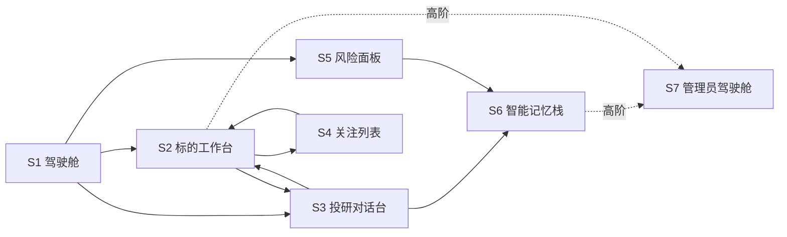

# L3 · 前端工程与服务 · 用户场景与产品形态设计

> [!NOTE] **[TRACEBACK]**
> - **顶层概念**：[项目定义与核心价值](../../01_顶层概念/01_项目定义与核心价值.md)
> - **战略主轴**：[L2 §对偶产品形态](../../02_战略维度/00_双目标与战略维度关系.md)
> - **同模块**：[前端工程与服务/README](./README.md)
> - **总纲**：[四大模块抽象总纲 §3.5 + §4](../00_四大模块抽象总纲.md)

> [!IMPORTANT] **验证后资源释放（全模块强制）**
> 凡本文档涉及或引用的 **本地/联调验证**（单测、集成测、`docker compose`、前后端 dev server、`uvicorn`、临时 worker 等），在 **测试结论已确认并完成准出/实践记录** 后，须 **停止相关进程并释放资源**。检查项与示例命令见 [_共享规约/17_L3设计文档_验证后资源释放规约.md](../_共享规约/17_L3设计文档_验证后资源释放规约.md)。

## 一、目标

把"系统能做的"翻译成"用户能做的"——前端不是后端的展示层，而是**人机协作的工作面**：

1. **看见复杂、操作简单**：用户在简单界面里能驱动后端的复杂能力
2. **解释先于结论**：任何结论都自带证据链与可回放路径
3. **节奏可控**：通知、推送、议题节奏由用户的"心力预算"决定
4. **闭环可见**：用户的每一次反馈、每一次选择都能在系统下一次迭代中被看见

## 二、核心场景与对应产品形态

### 2.1 七大核心场景

| 场景 | 用户问题 | 产品形态 | 主要消费的后端模块 |
|------|---------|---------|-------------------|
| **S1 我现在该看什么？** | 这个市场 / 我的关注里，今天值得看的是什么？ | **个性化驾驶舱**（首页） | 状态机监控 + 纵深进攻 + 超级个体进化 |
| **S2 这个标的怎么样？** | 给我一个标的，告诉我它在哪个状态 / 有何故事 / 该不该动 | **标的工作台** | 状态机监控 + 纵深进攻 |
| **S3 我有问题，想找答案** | 自然语言提问；要研究结论 + 证据 | **投研对话台** | 纵深进攻 + 超级个体进化 |
| **S4 我想盯着一群东西** | 关注一组标的 / 行业 / 主营，按节奏被通知 | **关注列表中心** | 状态机监控 + 超级个体进化 |
| **S5 系统在防什么 / 拦了什么** | 让我看到风险 / 熔断 / 拒绝 | **风险熔断面板** | 极寒防御 |
| **S6 我能记住什么 / 能参与改进什么** | 知识沉淀 / 反馈 / 复盘报告 | **智能记忆栈** | 超级个体进化 |
| **S7 我是管理员 / 高阶用户** | 模板 / 版本 / 评测 / 配置管理 | **管理员驾驶舱** | 全模块（按权限） |

### 2.2 各场景核心动作

#### S1 个性化驾驶舱（首页）
- 看：今日重点 Advisory / 近期突破的状态机 / 议会新出的卡片 / 我的反馈影响（"你昨天的反馈让 3 条推荐被改进"）
- 操作：进入任一卡片详情、关注、忽略、改通知节奏

#### S2 标的工作台
- 看：标的当前状态机 + 历史轨迹 + 当下证据 + 议会卡片 + 主营 segment
- 操作：调整探针 / 模板版本、提问、加入关注列表

#### S3 投研对话台
- 看：对话流 + 证据卡 + Agent 思考过程（可展开）
- 操作：提问、追问、要求换专家、收藏 / 分享研究卡片

#### S4 关注列表中心
- 看：列表 / 分组 / 实例当前状态 / 节奏化通知日历
- 操作：增删 / 分组 / 标签 / 通知预算调整

#### S5 风险熔断面板
- 看：风险事件流 / 熔断器状态 / 门禁拒绝率 / 审计链健康
- 操作：人审拒绝 / 手动重置熔断（高权限）/ 拉审计回放

#### S6 智能记忆栈
- 看：知识条目 / 周复盘报告 / 我的反馈历史 / 我的成长档案
- 操作：编辑 / 删除条目、给反馈、导出档案、改偏好

#### S7 管理员驾驶舱
- 看：模板列表 / 版本灰度状态 / 评测报告 / 配置中心 / 系统健康
- 操作：发版 / 回滚 / 灰度推进 / 配置变更（带审计）

## 三、产品形态间的导航关系

## 四、用户角色与权限

| 角色 | 可见场景 | 关键限制 |
|------|---------|---------|
| **普通用户** | S1～S6 | 不可见他人数据；外部动作仅限通知类；S7 不可见 |
| **高阶用户** | S1～S6 + 管理员驾驶舱（受限） | 可灰度自己的模板；不可改全局配置 |
| **管理员** | S1～S7 | 全部；操作走审计 |
| **审计 / 合规** | S5、S6（只读）+ 审计专用视图 | 只读；可导出审计 |
| **未登录访客** | 公共介绍页 / 模板市场（公共部分） | 不可看实际数据 |

## 五、关键体验取舍

1. **结论先于过程，但过程必须可展开**：默认看到一句话结论 + 一个置信度；用户点击可展开证据 / Agent 思考 / 工具调用
2. **节奏比信息密度更重要**：默认推荐"少而准"，宁少勿多；用户可主动展开"更多"
3. **任何"系统在做什么"都可见**：议会进行中、状态机迁移中、门禁评估中——全部有可视化进度
4. **拒绝优雅**：被门禁拒绝的内容用户也应能看见"为什么被拒"
5. **灰度对用户透明**：用户能看到自己当前用的是哪个模型 / prompt 版本（可选）
6. **数据是用户的**：导出 / 删除一键可达；档案变更有日志
7. **多端一致**：Web 优先；移动端核心场景对齐（S1 / S4 / S5 通知）

## 六、Anti-pattern（明确不做）

| 不做 | 原因 |
|------|------|
| 把后端 API schema 直接铺到前端 | 必须经 BFF / API Gateway 聚合裁剪 |
| 让用户被无门槛通知淹没 | 通知预算 + digest |
| 默认展示完整 prompt / 模型细节 | 杂讯过多；按需展开 |
| 自动执行无回退的外部动作 | 任何动作必须用户主动确认或带可逆窗口 |
| 隐藏"系统不知道"的事实 | 不确定性必须显式 |

## 七、与共享规约的对齐

| 共享规约 | 对齐点 |
|---------|--------|
| [04_全链路通信协议](../_共享规约/04_全链路通信协议矩阵.md) | 所有 API 必带 `correlation_id` / `schema_version` |
| [05_接口抽象层](../_共享规约/05_接口抽象层规约.md) | 前端 BFF 是 API Port 的一种 |
| [极寒防御](../极寒防御/README.md) | 所有"会改外部"的前端按钮必走外部动作边界 → 门禁 |
| [超级个体进化](../超级个体进化/README.md) | 反馈 / 偏好 / 档案 |
