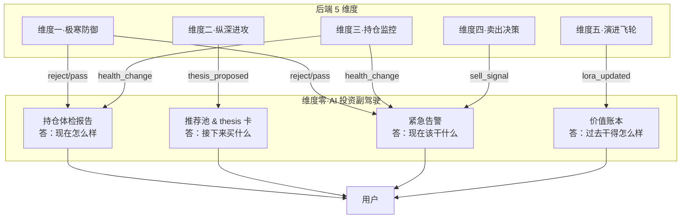
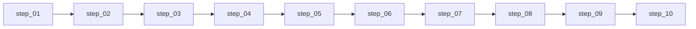

# 维度零·AI 投资副驾驶·启动期·实践目标与策略

> [!NOTE] **[TRACEBACK] 实践锚点**
> - **L2 战略规划**: [维度零·stage_1_启动期](../../../../02_战略维度/00_维度零_AI投资副驾驶/stages/stage_1_启动期/README.md)
> - **L3 模块设计**: [维度零_AI投资副驾驶/README](../../README.md)
> - **同阶段文档**: [02_技术方案](./02_技术方案与代码架构.md) / [03_数据采集](./03_数据采集与预处理.md) / [04_前端开发](./04_前端开发与用户体验.md) / [05_验收标准](./05_验收标准与检查清单.md)
> - **L1 哲学基石**: ①资产保值 + ②复利 + ⑧归因闭环

---

## 一、本阶段目标

### 1.1 一句话目标

> **用 4 个子模块拼出"AI 投资副驾驶"的最小产品闭环——让一个 50 万本金的个人投资者第一天打开就有用、3 个月后能感知到具体的避险与收益价值。**

### 1.2 量化目标

| 目标项 | 指标 | 阈值 |
|---|---|---|
| 产品模块 | 4 子模块上线 | 持仓体检/推荐池/告警/价值账本 |
| 首屏性能 | 加载时间 | < 1s |
| 告警到达率 | 红色 5 分钟到达率 | ≥ 99.5% |
| 月报准时率 | T+1 月报生成 | 100% |
| 用户留存 | 连续 12 个活跃统计期 | 不放弃使用 |
| 避险价值 | 月度避险价值 | ≥ ¥3000 |

### 1.3 本阶段交付物

| 交付物 | 描述 | 验收方式 |
|---|---|---|
| **持仓体检报告** | Web 首屏 4 色卡片 + 单持仓详情 | 4 色与 push_level 一致 |
| **推荐池与 thesis 卡** | 推荐页 + thesis 卡详情 + 3 操作 + PDF | 5 必填元素完整 |
| **紧急告警系统** | 4 红 + 2 橙 + 微信/Telegram/邮件 | 5 分钟到达率 |
| **价值账本** | SCS + EV + 8 象限归因 + 月报 | 月报准时率 |
| **用户持仓维护** | Web 维护页 + Excel 导入 | 手动维护可用 |

---

## 二、产品模式：观察者模式

### 2.1 模式定义

```
┌─────────────────────────────────────────────────────────────┐
│                    观察者模式（启动期）                      │
│  系统建议 → 用户 100% 自主决定 → 系统记录                   │
│                                                             │
│  ✅ 系统主动推送建议（告警/推荐/体检报告）                  │
│  ✅ 用户完全自主执行（买/卖/持有）                          │
│  ✅ 系统记录用户选择（用于归因）                            │
│  ❌ 系统不自动执行（无自动驾驶）                            │
└─────────────────────────────────────────────────────────────┘
```

**为什么是观察者模式？**
- 启动期验证产品价值，不承担交易风险
- 建立用户信任，再逐步放开自动化
- 收集用户行为数据，为第二阶段 DPO 做准备

### 2.2 4 子模块定位



---

## 三、总体策略

### 3.1 技术栈策略：极简主义

| 层面 | 选型 | 理由 |
|---|---|---|
| **后端** | FastAPI | 轻量 + 异步 + Python 生态 |
| **前端** | HTMX + Alpine.js | 无需复杂前端构建 |
| **数据库** | SQLite | 启动期足够，零运维 |
| **缓存** | Redis | 事件流 + 简单缓存 |
| **推送** | 微信 webhook + Telegram Bot + SMTP | 免费/低成本 |

### 3.2 开发策略：垂直切片

每个子模块独立开发、独立部署、独立验收：

| 子模块 | 依赖事件流 | 顺次步骤（与 L3 step_NN 对齐） |
|---|---|---|
| 持仓体检 | health_change | step_03 |
| 推荐池 | thesis_proposed | step_04 |
| 紧急告警 | reject/sell_signal/health_change | step_05 |
| 价值账本 | 综合 + 归因调度 | step_06 |

### 3.3 成本策略：零云服务

| 项目 | 成本 | 方案 |
|---|---|---|
| Web 服务 | ¥0 | 本地部署 / 自有服务器 |
| 数据库 | ¥0 | SQLite 本地文件 |
| 微信通知 | ¥0 | 企业微信 webhook |
| Telegram | ¥0 | Bot API |
| 邮件 | ¥50/月 | Resend / Mailgun 免费额度 |
| **月度总计** | **≤ ¥50** | |

---

## 四、4 子模块详细策略

### 4.1 子模块 1：持仓体检报告

**目标**：一眼看清全部持仓的健康状态

**核心功能**：
- Web 首屏 4 色卡片（红/橙/黄/绿）
- 单持仓详情（节点 4 态 + 健康度曲线 30 天）

**实现策略**：
```python
# 4 色映射规则
def get_color(push_level: int) -> str:
    # push_level 来自维度三 health_change
    if push_level >= 3:
        return "red"      # 紧急
    elif push_level == 2:
        return "orange"   # 警告
    elif push_level == 1:
        return "yellow"   # 关注
    else:
        return "green"    # 健康
```

### 4.2 子模块 2：推荐池与 thesis 卡

**目标**：呈现 AI 推荐的投资机会

**核心功能**：
- Web 推荐池页（列表同时在池上限 **≤ 5** 个推荐）
- 单 thesis 卡详情（5 必填元素）
- 3 操作按钮（加入/待考虑/不感兴趣）
- PDF 导出

**5 必填元素**：
1. **观点摘要**（thesis_summary）：100 字核心观点
2. **证据链**（evidence_chain）：支撑观点的 3+ 证据
3. **风险清单**（risks）：主要风险点
4. **估值锚点**（valuation_anchor）：目标价/PE/PB
5. **操作建议**（action）：买入/加仓/观望

### 4.3 子模块 3：紧急告警系统

**目标**：第一时间推送关键风险

**告警级别**：
| 级别 | 类型 | 触发条件 | 推送时限 |
|---|---|---|---|
| 🔴 红色 | 维度一 reject | 任意持仓被标记 reject | 5 分钟 |
| 🔴 红色 | 维度四 止损触发 | 持仓触发止损线 | 5 分钟 |
| 🔴 红色 | 维度四 止盈触发 | 持仓触发止盈线 | 5 分钟 |
| 🔴 红色 | 维度三 健康度骤降 | 健康度 24h 内降幅 > 20% | 5 分钟 |
| 🟠 橙色 | 维度一 degrade | 任意持仓被标记 degrade | 30 分钟 |
| 🟠 橙色 | 维度二 thesis 失效 | 持仓 thesis 被判定失效 | 30 分钟 |

**推送通道**：
1. 微信群机器人（企业微信 webhook）
2. Telegram Bot
3. 邮件

### 4.4 子模块 4：价值账本

**目标**：量化证明系统价值

**核心指标**：
- **SCS（System Contribution Score）**：系统贡献分
- **EV（Economic Value）**：经济价值（避险 + 增益）

**8 象限归因**：
| 象限 | 系统建议 | 用户执行 | 结果 | 归因 |
|---|---|---|---|---|
| A | ✅ 买 | ✅ 买 | ✅ 盈 | 系统 + 用户 |
| B | ✅ 买 | ✅ 买 | ❌ 亏 | 系统需优化 |
| C | ✅ 卖 | ✅ 卖 | ✅ 避亏 | 系统 + 用户 |
| D | ✅ 卖 | ❌ 未卖 | ❌ 亏 | 用户未执行 |
| ... | ... | ... | ... | ... |

---

## 五、实施路径（顺次步骤）

执行层步骤见 [steps/README](./steps/README.md)；依赖顺序如下（**不以日历周为权威**）。



---

## 六、风险与应对

| 风险 | 概率 | 影响 | 应对策略 |
|---|---|---|---|
| 后端 5 维度延期 | 高 | 高 | 优先跑通最小数据流；降级为模拟数据 |
| 推送通道封禁 | 低 | 中 | 多通道冗余；降级为邮件 |
| 用户放弃使用 | 中 | 高 | 定期 check 活跃度；快速响应反馈 |
| 告警过多骚扰 | 中 | 中 | 严格控制每日红色 ≤ 3；橙色汇总 |

---

## 七、本阶段不做什么（明确边界）

| 不做的事 | 留待阶段 | 原因 |
|---|---|---|
| ❌ 反馈闭环 verified | 扩展期 | 先跑通产品闭环 |
| ❌ 券商 API 自动同步 | 扩展期 | 启动期手动维护持仓 |
| ❌ 电话告警 | 完善期 | 成本高 + 用户体验需打磨 |
| ❌ 自动驾驶限额 | 完善期 | 先建立用户信任 |
| ❌ 议会模式 UI | 完善期 | 先验证单模型效果 |

---

## 八、成功标准

### 8.1 硬性准出条件

- [ ] 4 子模块全部上线
- [ ] 首屏加载 < 1s
- [ ] 红色告警 5 分钟到达率 ≥ 99.5%
- [ ] 单日红色 ≤ 3
- [ ] 5 必填元素完整性 100%
- [ ] 月报准时率 100%

### 8.2 业务目标

- [ ] 用户连续 12 个活跃统计期
- [ ] 月度避险价值 ≥ ¥3000
- [ ] 连续 2 月 SCS ≥ 60

---

## 修订记录

| 日期 | 内容 |
|---|---|
| 2026-05-16 | 初版，覆盖目标、策略、4 子模块、路径、风险 |
