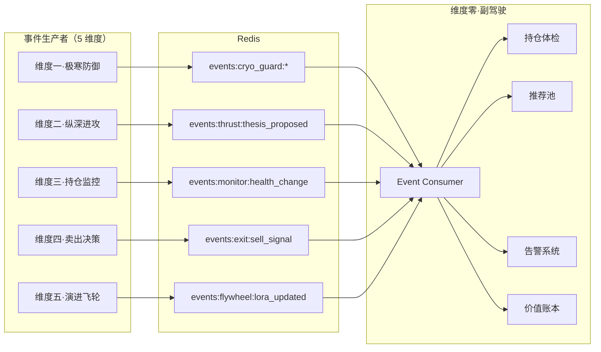

# 维度零·AI 投资副驾驶·启动期·数据接入与事件流

> [!NOTE] **[TRACEBACK] 实践锚点**
> - **本阶段策略**: [01_实践目标与策略](./01_实践目标与策略.md)
> - **L2 数据契约**: [维度零·02_本阶段数据接入与契约清单](../../../../02_战略维度/00_维度零_AI投资副驾驶/stages/stage_1_启动期/02_本阶段数据接入与契约清单.md)

---

## 一、数据接入总览

### 1.1 数据来源分类

| 来源类型 | 数据 | 生产者 | 消费方式 |
|---|---|---|---|
| **事件流** | reject/degrade/pass | 维度一 | Redis Stream |
| **事件流** | thesis_proposed | 维度二 | Redis Stream |
| **事件流** | health_change | 维度三 | Redis Stream |
| **事件流** | sell_signal | 维度四 | Redis Stream |
| **事件流** | lora_updated | 维度五 | Redis Stream |
| **行情数据** | T+0 收盘价 | Tushare/AKShare | 每日定时拉取 |
| **用户数据** | 持仓 | 用户手动维护 | Web 页面 + Excel |

### 1.2 数据流图



---

## 二、事件流契约

### 2.1 维度一事件：reject/degrade/pass

**Stream**: `events:cryo_guard:{decision}`

```json
{
  "event_id": "uuid",
  "event_type": "cryo_guard_decision",
  "timestamp": "2026-05-16T10:00:00Z",
  "trace_id": "uuid",
  
  "symbol": "002450",
  "name": "康得新",
  "decision": "reject",
  
  "engine_results": [
    {
      "engine_name": "financial_fraud",
      "score": 0.92,
      "decision": "reject",
      "evidence": ["存贷双高", "现金流背离"]
    }
  ],
  
  "aggregation_reason": "任意引擎判定 reject"
}
```

**触发动作**：
- `reject` → 子模块 3 红色告警
- `degrade` → 子模块 3 橙色告警
- `pass` → 子模块 2 可推荐

### 2.2 维度二事件：thesis_proposed

**Stream**: `events:thrust:thesis_proposed`

```json
{
  "event_id": "uuid",
  "event_type": "thesis_proposed",
  "timestamp": "2026-05-16T10:00:00Z",
  "trace_id": "uuid",
  
  "thesis_id": "uuid",
  "symbol": "600519",
  "name": "贵州茅台",
  
  "thesis_summary": "...",
  "evidence_chain": ["...", "...", "..."],
  "risks": ["...", "..."],
  "valuation_anchor": {
    "method": "PE",
    "target_pe": 35,
    "target_price": 2100.0
  },
  "action": "buy",
  
  "pass_event_id": "uuid"  # 关联的维度一 pass 事件
}
```

**触发动作**：
- 写入 thesis_cards 表
- 推送到子模块 2 推荐池

### 2.3 维度三事件：health_change

**Stream**: `events:monitor:health_change`

```json
{
  "event_id": "uuid",
  "event_type": "health_change",
  "timestamp": "2026-05-16T10:00:00Z",
  "trace_id": "uuid",
  
  "symbol": "000001",
  "name": "平安银行",
  
  "old_health": 75.0,
  "new_health": 52.0,
  "health_delta": -23.0,
  
  "push_level": 3,  # 0-3
  "change_reason": "叙事一致性断裂：Q2 业绩不及预期",
  
  "node_state": {
    "state": "warning",
    "since": "2026-05-16T10:00:00Z"
  }
}
```

**触发动作**：
- 更新 health_history 表
- push_level >= 3 → 子模块 3 红色告警
- push_level == 2 → 子模块 3 橙色告警
- 更新子模块 1 首屏卡片颜色

### 2.4 维度四事件：sell_signal

**Stream**: `events:exit:sell_signal`

```json
{
  "event_id": "uuid",
  "event_type": "sell_signal",
  "timestamp": "2026-05-16T10:00:00Z",
  "trace_id": "uuid",
  
  "symbol": "000001",
  "name": "平安银行",
  
  "signal_type": "stop_loss",  # stop_loss/take_profit/thesis_invalid/rebalance
  "trigger_price": 12.50,
  "current_price": 12.30,
  
  "protocol": {
    "protocol_type": "止损线",
    "threshold": -15.0,
    "triggered_at": "2026-05-16T10:00:00Z"
  },
  
  "advice": "建议卖出全部持仓"
}
```

**触发动作**：
- 子模块 3 红色告警（止损/止盈）
- 记录归因（用于子模块 4）

### 2.5 维度五事件：lora_updated

**Stream**: `events:flywheel:lora_updated`

```json
{
  "event_id": "uuid",
  "event_type": "lora_updated",
  "timestamp": "2026-05-16T10:00:00Z",
  
  "lora_name": "financial_fraud_lora",
  "version": "v2",
  "old_version": "v1",
  
  "metrics": {
    "holdout_recall": 0.96,
    "holdout_precision": 0.75,
    "improvement": "+2%"
  },
  
  "trigger": "dpo_iteration_1"
}
```

**触发动作**：
- 记录模型更新历史
- 用于子模块 4 月报展示

---

## 三、行情数据

### 3.1 数据源

| 数据源 | 数据 | 频率 | 成本 |
|---|---|---|---|
| Tushare | A 股收盘价 + 涨跌幅 | 每日 17:00 | ¥0（免费额度）|
| AKShare | 备用数据源 | 每日 17:00 | ¥0 |

### 3.2 采集脚本

```python
# copilot/data/price_crawler.py

import akshare as ak
from datetime import date

async def crawl_daily_prices():
    """采集当日收盘价"""
    df = ak.stock_zh_a_spot_em()
    
    prices = []
    for _, row in df.iterrows():
        prices.append({
            "symbol": row["代码"],
            "name": row["名称"],
            "date": date.today(),
            "close": row["最新价"],
            "change_pct": row["涨跌幅"],
        })
    
    await save_prices(prices)
```

### 3.3 定时任务

```python
# copilot/scheduler/jobs.py

from apscheduler.schedulers.asyncio import AsyncIOScheduler

scheduler = AsyncIOScheduler()

# 每日 17:05 采集收盘价
@scheduler.scheduled_job('cron', hour=17, minute=5)
async def job_crawl_prices():
    await crawl_daily_prices()

# 每日 18:00 生成日报
@scheduler.scheduled_job('cron', hour=18, minute=0)
async def job_daily_report():
    await generate_daily_report()

# 周报任务（示例：cron 的 day_of_week + hour；以环境与配置为准）
@scheduler.scheduled_job('cron', day_of_week='sun', hour=10)
async def job_weekly_report():
    await generate_weekly_report()

# 每月 1 日 09:00 生成月报
@scheduler.scheduled_job('cron', day=1, hour=9)
async def job_monthly_report():
    await generate_monthly_report()
```

---

## 四、用户持仓数据

### 4.1 手动维护方式

启动期不接入券商 API，用户通过以下方式维护持仓：

1. **Web 页面维护**：单只股票增/删/改
2. **Excel 导入**：批量导入

### 4.2 持仓数据结构

```python
@dataclass
class Holding:
    symbol: str           # 股票代码
    name: str             # 股票名称
    shares: float         # 持仓数量
    cost_price: float     # 成本价
    buy_date: date        # 买入日期
    notes: str            # 备注
```

### 4.3 Excel 导入模板

```
| 股票代码 | 股票名称 | 持仓数量 | 成本价 | 买入日期 | 备注 |
|----------|----------|----------|--------|----------|------|
| 600519   | 贵州茅台 | 100      | 1800.0 | 2025-01-15 | |
| 000001   | 平安银行 | 5000     | 12.5   | 2025-03-20 | |
```

### 4.4 导入脚本

```python
# copilot/portfolio/excel_importer.py

import pandas as pd
from io import BytesIO

async def import_from_excel(user_id: str, file: BytesIO) -> dict:
    """从 Excel 导入持仓"""
    df = pd.read_excel(file)
    
    required_columns = ["股票代码", "股票名称", "持仓数量", "成本价"]
    for col in required_columns:
        if col not in df.columns:
            raise ValueError(f"缺少必填列: {col}")
    
    holdings = []
    for _, row in df.iterrows():
        holdings.append({
            "symbol": str(row["股票代码"]).zfill(6),
            "name": row["股票名称"],
            "shares": float(row["持仓数量"]),
            "cost_price": float(row["成本价"]),
            "buy_date": row.get("买入日期"),
            "notes": row.get("备注", ""),
        })
    
    # 批量写入
    await batch_upsert_holdings(user_id, holdings)
    
    return {
        "imported": len(holdings),
        "holdings": holdings,
    }
```

---

## 五、数据治理

### 5.1 铁律

1. **所有决策日志立刻入库**：不丢失任何决策记录
2. **trace_id 全链路保留**：可追溯任意决策来源
3. **事件时序保证**：基于 Redis Stream 有序消费
4. **审计不可篡改**：SQLite WAL 模式 + 定期备份

### 5.2 数据保留策略

| 数据类型 | 保留周期 | 存储位置 |
|---|---|---|
| 决策日志 | 永久 | SQLite |
| 健康度历史 | 永久 | SQLite |
| 告警日志 | 永久 | SQLite |
| 归因记录 | 永久 | SQLite |
| 行情数据 | 5 年 | SQLite |
| Redis 事件 | 7 天 | Redis（自动过期）|

### 5.3 备份策略

```bash
# 每日备份 SQLite
sqlite3 copilot.db ".backup '/backup/copilot_$(date +%Y%m%d).db'"

# 保留最近 30 天备份
find /backup -name "copilot_*.db" -mtime +30 -delete
```

---

## 六、数据质量检查

### 6.1 事件完整性检查

```python
# copilot/data/quality_check.py

async def check_event_integrity():
    """检查事件流完整性"""
    issues = []
    
    # 检查必填字段
    required_fields = {
        "cryo_guard": ["symbol", "decision", "engine_results"],
        "thesis_proposed": ["thesis_id", "thesis_summary", "evidence_chain"],
        "health_change": ["symbol", "new_health", "push_level"],
        "sell_signal": ["symbol", "signal_type", "protocol"],
    }
    
    # 检查过去 24 小时事件
    for event_type, fields in required_fields.items():
        events = await get_recent_events(event_type, hours=24)
        for event in events:
            for field in fields:
                if field not in event:
                    issues.append(f"{event_type} 事件缺少字段: {field}")
    
    return issues
```

### 6.2 每日巡检

```python
@scheduler.scheduled_job('cron', hour=6, minute=0)
async def job_daily_quality_check():
    """每日数据质量巡检"""
    issues = []
    
    # 1. 事件完整性
    issues.extend(await check_event_integrity())
    
    # 2. 持仓数据一致性
    issues.extend(await check_portfolio_consistency())
    
    # 3. 行情数据时效性
    issues.extend(await check_price_freshness())
    
    if issues:
        await send_alert_to_admin(issues)
```

---

## 七、事件消费任务清单

| # | 任务 | 步骤（示意） | 产出 |
|---|---|---|---|
| 1 | Redis Stream 消费者框架 | step_02 | consumer.py 可运行 |
| 2 | health_change 处理器 | step_03 | 子模块 1 数据就绪 |
| 3 | thesis_proposed 处理器 | step_04 | 子模块 2 数据就绪 |
| 4 | reject/degrade/sell_signal 处理器 | step_05 | 子模块 3 告警触发 |
| 5 | 归因数据采集 | step_06 | 子模块 4 归因就绪 |
| 6 | 行情数据采集定时任务 | step_02 | 每日收盘价入库 |
| 7 | 持仓 Excel 导入 | step_02 | 导入功能可用 |

---

## 修订记录

| 日期 | 内容 |
|---|---|
| 2026-05-16 | 初版，覆盖事件流契约、行情数据、用户持仓、数据治理 |
