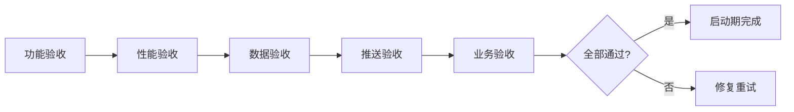

# 维度零·AI 投资副驾驶·启动期·验收标准与检查清单

> [!NOTE] **[TRACEBACK] 实践锚点**
> - **本阶段策略**: [01_实践目标与策略](./01_实践目标与策略.md)
> - **L2 验证规范**: [维度零·03_本阶段用户场景与价值验证](../../../../02_战略维度/00_维度零_AI投资副驾驶/stages/stage_1_启动期/03_本阶段用户场景与价值验证.md)

---

## 一、验收总览

### 1.1 验收分类

| 类型 | 内容 | 验收方式 | 优先级 |
|---|---|---|---|
| **功能验收** | 4 子模块全部可用 | 功能测试 | P0 |
| **性能验收** | 首屏 < 1s，告警 SLA | 性能测试 | P0 |
| **数据验收** | 事件流对接正常 | 集成测试 | P0 |
| **推送验收** | 3 通道全部可达 | 通道测试 | P0 |
| **业务验收** | 用户留存 + 避险价值 | 运营指标 | P1 |

### 1.2 验收流程



---

## 二、子模块功能验收

### 2.1 子模块 1：持仓体检报告

| 检查项 | 标准 | 验收方式 |
|---|---|---|
| 首屏 4 色卡片 | 正确显示红/橙/黄/绿数量 | 手动测试 |
| 4 色映射规则 | 与 push_level 严格一致 | 单元测试 |
| 持仓列表 | 按风险排序（红 > 橙 > 黄 > 绿）| 手动测试 |
| 单持仓详情 | 节点 4 态 + 健康度曲线 30 天 | 手动测试 |
| 健康度曲线 | 数据连续无断点 | 数据校验 |

**测试用例**：

```python
def test_color_mapping():
    """测试 4 色映射规则"""
    assert get_color(push_level=3) == "red"
    assert get_color(push_level=2) == "orange"
    assert get_color(push_level=1) == "yellow"
    assert get_color(push_level=0) == "green"

def test_dashboard_consistency():
    """测试首屏卡片与 push_level 一致"""
    dashboard = get_dashboard(user_id="test")
    for color, cards in dashboard["cards"].items():
        for card in cards:
            assert get_color(card.push_level) == color
```

### 2.2 子模块 2：推荐池与 thesis 卡

| 检查项 | 标准 | 验收方式 |
|---|---|---|
| 池内推荐数（上限） | ≤ 5 | 数据校验 |
| 5 必填元素 | 完整性 100% | Schema 校验 |
| 3 操作按钮 | 可点击 + 状态更新 | 手动测试 |
| PDF 导出 | 成功率 ≥ 99% | 批量测试 |
| 用户决策记录 | 写入数据库 | 数据校验 |

**测试用例**：

```python
def test_thesis_five_elements():
    """测试 5 必填元素完整性"""
    thesis = get_thesis("test_thesis_id")
    
    assert thesis.thesis_summary and len(thesis.thesis_summary) >= 20
    assert thesis.evidence_chain and len(thesis.evidence_chain) >= 3
    assert thesis.risks and len(thesis.risks) >= 1
    assert thesis.valuation_anchor
    assert thesis.action in ["buy", "add", "watch"]

def test_weekly_recommendation_limit():
    """测试池内推荐数上限"""
    pool = get_weekly_pool(user_id="test")
    assert len(pool) <= 5
```

### 2.3 子模块 3：紧急告警系统

| 检查项 | 标准 | 验收方式 |
|---|---|---|
| 4 红告警类型 | reject/止损/止盈/健康度骤降 | 功能测试 |
| 2 橙告警类型 | degrade/thesis 失效 | 功能测试 |
| 红色 SLA | 5 分钟到达率 ≥ 99.5% | SLA 监控 |
| 每日红色上限 | ≤ 3 | 数据校验 |
| 微信通道 | 可达 | 通道测试 |
| Telegram 通道 | 可达 | 通道测试 |
| 邮件通道 | 可达 | 通道测试 |

**测试用例**：

```python
def test_alert_sla():
    """测试告警 SLA"""
    alert = create_test_alert(level="red")
    
    start = time.time()
    send_alert(alert, user_id="test")
    end = time.time()
    
    # 发送耗时 < 10s（允许网络延迟）
    assert (end - start) < 10
    
    # 至少一个通道成功
    result = get_alert_send_result(alert.alert_id)
    assert any(r["success"] for r in result["channels"])

def test_daily_red_limit():
    """测试每日红色上限"""
    # 发送 4 个红色告警
    for i in range(4):
        send_alert(create_test_alert(level="red"), user_id="test")
    
    # 第 4 个应该被降级或汇总
    today_alerts = get_today_alerts(user_id="test", level="red")
    assert len([a for a in today_alerts if a.sent_immediately]) <= 3
```

### 2.4 子模块 4：价值账本

| 检查项 | 标准 | 验收方式 |
|---|---|---|
| SCS 计算 | 算法正确 | 单元测试 |
| EV 计算 | 算法正确 | 单元测试 |
| 8 象限归因 | 分类正确 | 单元测试 |
| 月报生成 | T+1 准时率 100% | 定时任务监控 |
| 月报 PDF | 可下载 | 手动测试 |

**测试用例**：

```python
def test_octant_attribution():
    """测试 8 象限归因"""
    # A 象限：系统建议买 + 用户买 + 盈利
    attr = attribute(
        system_advice="buy",
        user_action="buy",
        result_pnl=1000.0
    )
    assert attr.octant == Octant.A
    
    # D 象限：系统建议卖 + 用户未卖 + 亏损
    attr = attribute(
        system_advice="sell",
        user_action="hold",
        result_pnl=-500.0
    )
    assert attr.octant == Octant.D
```

---

## 二-1、波次二·三大工作台功能验收（M5/M6/M7）

> 对应 L3 [step_11](./steps/step_11_持仓监管工作台.md) / [step_12](./steps/step_12_行情解析与规划工作台.md) / [step_13](./steps/step_13_产业图谱关系链研究.md) 与 DNA `modules` M5/M6/M7。验收口径：**只读聚合已实现后端，缺上游维度允许 `pending` 灰态（不计失败），但禁止伪造**。

### 2.5 子模块 5：持仓监管工作台（M5）

| 检查项 | 标准 | 验收方式 |
|---|---|---|
| 导航 IA 4+1 | 7 平铺项收敛为 4+1；`持仓管理`→`持仓监管` | 手动 + grep |
| 监管卡四维聚合 | scans 含 cryo/offense/breakage/physical | API JSON 校验 |
| 缺上游降级 | 未就绪维 `status=pending` 灰态，无伪造值 | 数据校验 |
| 行情阶段 | D2 Timer 有则显示潜伏/主升/撤退，无则 pending | 数据校验 |
| 操作建议 advisory | `execute_mode` 全 `advisory`，无 `buy/qmt/order_id` | Schema + grep |
| **no-auto-order** | 模板/服务无下单按钮、券商 SDK、监管平台真接入 | grep = 0 |

### 2.6 子模块 6：行情解析与规划工作台（M6）

| 检查项 | 标准 | 验收方式 |
|---|---|---|
| Campaign 状态流转 | planning → executing → archived 按节点状态驱动 | 单元测试 |
| 概念→实体 | `campaign_symbols.symbol` 可空（概念）；选定后填实体 | 数据校验 |
| 三支柱齐 | 每档案 moat/catalyst/risk 各 ≥1 订阅（可 pending） | 数据校验 |
| moat 接物理探针 | 至少 1 条接 P5/P6/P7 真实 hit | API JSON |
| 雷达 Scorer 权重 | 政策0.35/产业空间0.35/A股映射0.30，透传不重算 | 数据校验 |
| **no-auto-execute** | 动作链全 `advisory`+`human_confirmation_required`，无禁字段 | Schema + grep = 0 |

### 2.7 子模块 7：产业图谱关系链研究（M7）

| 检查项 | 标准 | 验收方式 |
|---|---|---|
| 节点两层 | concept 默认；entity 仅选定标的后挂接 | 单元测试 |
| 确认/推演两态 | 每节点/边有 `confirm_state` | 数据校验 |
| confirmed 必有证据 | `confirmed` 且 `evidence_ref` 空 → 降级 inferred | SQL 校验 = 0 |
| 复用 Critic 等级 | PHYSICAL/官方源→confirmed，SOFT→inferred | 单元测试 |
| 下钻 + 双向联动 | `?center=` 生效；点节点高亮 M6 三支柱 | 手动 + 集成测 |
| **no-trade** | 图谱无下单/执行动作 | grep = 0 |

---

## 三、性能验收

### 3.1 首屏性能

| 指标 | 目标 | 测试方法 |
|---|---|---|
| 首屏加载时间 | < 1s | Lighthouse / curl |
| FCP | < 500ms | Lighthouse |
| LCP | < 1s | Lighthouse |
| TTI | < 2s | Lighthouse |

**测试命令**：

```bash
# 使用 curl 测试首屏
time curl -s http://localhost:8080/ > /dev/null
# 期望: real < 1s

# 使用 Lighthouse
npx lighthouse http://localhost:8080 --only-categories=performance
```

### 3.2 API 性能

| API | P95 响应时间 | 测试方法 |
|---|---|---|
| /api/health/dashboard | < 500ms | 压测 |
| /api/recommendations/pool | < 500ms | 压测 |
| /api/alerts | < 300ms | 压测 |
| /api/ledger/dashboard | < 500ms | 压测 |

**压测命令**：

```bash
hey -n 100 -c 10 http://localhost:8080/api/health/dashboard
# 期望: 95% in < 500ms
```

---

## 四、数据验收

### 4.1 事件流对接

| 事件流 | 检查项 | 验收方式 |
|---|---|---|
| cryo_guard:reject | 触发红色告警 | 端到端测试 |
| cryo_guard:degrade | 触发橙色告警 | 端到端测试 |
| thrust:thesis_proposed | 写入推荐池 | 数据校验 |
| monitor:health_change | 更新首屏卡片 | 端到端测试 |
| exit:sell_signal | 触发红色告警 | 端到端测试 |

**端到端测试**：

```python
async def test_e2e_reject_to_alert():
    """端到端：reject 事件 → 红色告警"""
    # 1. 发送 reject 事件
    await publish_event("events:cryo_guard:reject", {
        "symbol": "002450",
        "decision": "reject",
        ...
    })
    
    # 2. 等待消费
    await asyncio.sleep(5)
    
    # 3. 检查告警生成
    alerts = await get_alerts(symbol="002450", level="red")
    assert len(alerts) >= 1
    assert alerts[0].alert_type == "cryo_guard_reject"
```

### 4.2 数据一致性

| 检查项 | 标准 | 验收方式 |
|---|---|---|
| 首屏卡片颜色 | 与 health_change 事件一致 | 数据校验 |
| 归因记录 | 与用户实际操作一致 | 数据校验 |
| 月报数据 | 与每日数据汇总一致 | 数据校验 |

---

## 五、推送通道验收

### 5.1 通道连通性

| 通道 | 检查方法 | 期望结果 |
|---|---|---|
| 微信群机器人 | 发送测试消息 | 群内收到消息 |
| Telegram Bot | 发送测试消息 | Chat 收到消息 |
| 邮件 | 发送测试邮件 | 收件箱收到邮件 |

### 5.2 通道测试脚本

```python
async def test_all_channels():
    """测试所有推送通道"""
    test_alert = Alert(
        alert_id="test",
        level=AlertLevel.RED,
        alert_type="test",
        symbol="TEST",
        message="这是一条测试告警",
        created_at=datetime.now(),
    )
    
    results = {}
    
    # 微信
    results["wechat"] = await wechat_channel.send(test_alert, "test_user")
    
    # Telegram
    results["telegram"] = await telegram_channel.send(test_alert, "test_user")
    
    # 邮件
    results["email"] = await email_channel.send(test_alert, "test_user")
    
    # 至少 2 个通道成功
    success_count = sum(1 for r in results.values() if r)
    assert success_count >= 2, f"通道测试失败: {results}"
```

---

## 六、业务验收

### 6.1 运营指标

| 指标 | 目标 | 验收时机 |
|---|---|---|
| 活跃用户留存 | 连续 12 期 | 启动期结束 |
| 月度避险价值 | ≥ ¥3000 | 每月评估 |
| SCS | ≥ 60（连续 2 月） | 启动期结束 |

### 6.2 用户满意度

| 检查项 | 方法 |
|---|---|
| 持续活跃不放弃 | 活跃度监控 |
| 无重大投诉 | 用户反馈 |
| 告警响应及时 | 行为日志 |

---

## 七、综合验收检查清单

### 7.1 P0 必须项（阻断发布）

- [ ] **子模块 1**：首屏加载 < 1s；4 色与 push_level 一致
- [ ] **子模块 2**：5 必填元素完整性 100%；池内 ≤ 5 推荐
- [ ] **子模块 3**：红色 5 分钟到达率 ≥ 99.5%；每日红色 ≤ 3
- [ ] **子模块 4**：月报 T+1 准时率 100%
- [ ] **事件流**：5 个事件流全部对接正常
- [ ] **推送**：至少 2 个通道可达

### 7.2 P1 应完成项

- [ ] PDF 导出成功率 ≥ 99%
- [ ] API P95 < 500ms
- [ ] 持仓维护 Excel 导入可用
- [ ] SSE 实时推送可用
- [ ] 文档 5 份完整

### 7.2.1 波次二（M5/M6/M7）应完成项

> 波次二在波次一（M1~M4）收口后启动，**不阻断**波次一发布；下列为波次二自身准出。

- [ ] **M5 持仓监管**：导航 4+1；监管卡四维聚合（缺维 pending 不计失败）；advice 全 advisory；no-auto-order grep = 0
- [ ] **M6 行情规划**：≥1 Campaign（含标的档案 + 三支柱各 1 + ≥1 advisory 动作链节点）；moat ≥1 接真实物理探针；no-auto-execute grep = 0
- [ ] **M7 产业图谱**：concept/entity 两层 + confirmed/inferred 两态；confirmed 必有 evidence_ref；下钻 + 双向联动可演示；no-trade grep = 0

### 7.3 验收签署

| 角色 | 签字 | 日期 |
|---|---|---|
| 架构师 | __________ | __________ |
| 产品负责人 | __________ | __________ |
| 测试负责人 | __________ | __________ |

---

## 八、进阶条件

### 8.1 启动期 → 扩展期

满足以下全部条件可进入扩展期：

| 条件 | 指标 |
|---|---|
| 4 子模块全部上线 | P0 检查清单全部 ✅ |
| 用户连续 12 个活跃统计期 | 活跃埋点数据 |
| 月度 SCS ≥ 60 | 连续 2 月 |
| 月度避险价值 ≥ ¥3000 | 基于真实持仓 |
| 架构师验收 | ✅ |

### 8.2 扩展期预告

| 新增内容 | 说明 |
|---|---|
| 反馈闭环 | 用户 verified 反哺训练 |
| 券商 API 同步 | 自动同步持仓 |
| 批量决策会 | 周期性决策建议 |
| 自我熔断 UI | 展示熔断状态 |

---

## 修订记录

| 日期 | 内容 |
|---|---|
| 2026-05-16 | 初版，覆盖功能/性能/数据/推送/业务验收 |
| 2026-05-29 | **新增波次二（M5/M6/M7）验收**：§二-1 子模块 5/6/7 功能验收（持仓监管/行情规划/产业图谱）+ §7.2.1 P1 应完成项；与 L3 step_11/12/13、DNA v1.1、steps/README §一-1 同步（1:1:1） |
