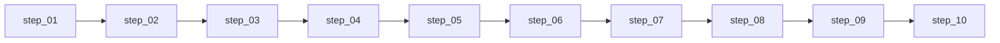

# 维度零·AI 投资副驾驶·启动期

> [!NOTE] **[TRACEBACK] 追溯锚点**
> - **L2 战略规划**: [维度零·stage_1_启动期](../../../../02_战略维度/00_维度零_AI投资副驾驶/stages/stage_1_启动期/README.md)
> - **本维度 L3 设计**: [维度零_AI投资副驾驶/README](../../README.md)
> - **L1 哲学基石**: ①资产保值 + ②复利 + ⑧归因闭环
> - **本阶段总览**: [stages/README](../README.md)

> **[上架与环境（共通）]** **阿里云 ECS + K3s · Helm · 阿里云 ACR · `diting-infra`→`deploy-engine`**。权威说明与门禁：[16](../../../_共享规约/16_阿里云ECS_K3s_ACR_Helm部署与deploy-engine链路.md)；本阶段 **执行步骤**：[steps/README](./steps/README.md)。

---

## 一、阶段定位

| 项 | 值 |
|---|---|
| **阶段** | 启动期（Stage 1）|
| **时段** | 0-3 月（90 天）|
| **产品模式** | 观察者模式（系统建议 → 用户自主决定 → 系统记录）|
| **核心目标** | 4 子模块拼出最小产品闭环，让用户第一天打开就有用 |
| **成功标准** | 用户 12 个活跃统计期 + 月度避险价值 ≥ ¥3000 + SCS ≥ 60 |

---

## 二、实践设计文档（设计层 · 5 份）

| # | 文档 | 内容 | 状态 |
|---|---|---|---|
| 01 | [01_实践目标与策略.md](./01_实践目标与策略.md) | 目标、策略、4 子模块、路径、风险 | ✅ |
| 02 | [02_技术方案与代码架构.md](./02_技术方案与代码架构.md) | 技术选型、代码结构、核心模块、API、数据库 | ✅ |
| 03 | [03_数据采集与预处理.md](./03_数据采集与预处理.md) | 事件流契约、行情数据、用户持仓、数据治理 | ✅ |
| 04 | [04_前端开发与用户体验.md](./04_前端开发与用户体验.md) | 用户场景、页面设计、HTMX、推送通道、PDF | ✅ |
| 05 | [05_验收标准与检查清单.md](./05_验收标准与检查清单.md) | 功能/性能/数据/推送/业务验收 | ✅ |

## 二·补 可执行步骤文档（执行层 · 10 份）⭐

> **2026-05-16 新增**：把上面 5 份「设计层」文档**拆解为 10 份顺次可执行步骤**（`step_01`～`step_10`），供 Cursor / 开发者按序号在 `diting-src` 中落地，并按 [steps/README](./steps/README.md) 回写 L4 `实践记录_step_NN_*.md`。

| # | L3 step | 关键产出 |
|---|---|---|
| 1 | [step_01_后端依赖与服务骨架](./steps/step_01_后端依赖与服务骨架.md) | FastAPI 骨架 + 健康检查 |
| 2 | [step_02_Web骨架与SQLite](./steps/step_02_Web骨架与SQLite.md) | SQLAlchemy + Jinja2/HTMX + 持仓 CRUD |
| 3 | [step_03_持仓体检模块](./steps/step_03_持仓体检模块.md) | M1：4 色卡片 + 详情 + EventConsumer |
| 4 | [step_04_推荐池模块](./steps/step_04_推荐池模块.md) | M2：thesis 5 必填 + 3 操作 + PDF |
| 5 | [step_05_告警系统](./steps/step_05_告警系统.md) | M3：4 红 2 橙 + 3 通道 + SLA |
| 6 | [step_06_价值账本](./steps/step_06_价值账本.md) | M4：SCS + EV + 8 象限 + 月报 |
| 7 | [step_07_日报周报推送](./steps/step_07_日报周报推送.md) | DailyReport + WeeklyReport |
| 8 | [step_08_月报与熔断](./steps/step_08_月报与熔断.md) | 月报 PDF + 熔断 3 触发 |
| 9 | [step_09_全链路联调](./steps/step_09_全链路联调.md) | 4 场景 e2e + Lighthouse |
| 10 | [step_10_阶段验收](./steps/step_10_阶段验收.md) | 验收脚本 + PDF + 总结 |

**索引**：[steps/README.md](./steps/README.md)（含使用方式、决策契约、L4 回写预期清单）  
**总量**：10,662 行可执行文档

---

## 三、4 子模块交付物

| 子模块 | 描述 | 验收指标 |
|---|---|---|
| **持仓体检报告** | Web 首屏 4 色卡片 + 单持仓详情 | 首屏 < 1s；4 色一致 |
| **推荐池与 thesis 卡** | 推荐页 + 5 必填元素 + 3 操作 + PDF | 5 必填 100%；池内 ≤ 5 |
| **紧急告警系统** | 4 红 + 2 橙 + 3 通道 | 5 分钟到达率 ≥ 99.5%；每日红色 ≤ 3 |
| **价值账本** | SCS + EV + 8 象限归因 + 月报 | 月报准时率 100%；SCS ≥ 60 |

---

## 四、实施路径（顺次步骤依赖）

日历型甘特图（若需）由产品另维护；**维度零 L3 执行与 L4 回写仅以 step 序号为准**。

---

## 五、外部依赖

| 依赖维度 | 必须就绪的能力 | 用途 |
|---|---|---|
| 维度一 P0 | 3 引擎 + reject/degrade/pass 事件流 | 告警 + 体检 |
| 维度二 P0 | thesis_proposed 事件流 | 推荐池 |
| 维度三 P0 | health_change 事件流 | 首屏 4 色 |
| 维度四 P0 | sell_signal 事件流 | 卖出告警 |
| 维度五 P0 | 4 组件就绪 | 模型训练 |

---

## 六、进阶条件

满足以下条件可进入扩展期：

- [ ] 4 子模块全部上线
- [ ] 用户连续 12 个活跃统计期
- [ ] 月度 SCS ≥ 60（连续 2 月）
- [ ] 月度避险价值 ≥ ¥3000
- [ ] 架构师验收签字

---

## 修订记录

| 日期 | 内容 |
|---|---|
| 2026-05-17 | 启动期 README：**二·补** 去掉日历周次列；**四** 改为 step 依赖流程图；与 L4 `实践记录_step_NN_*` 命名一致 |
