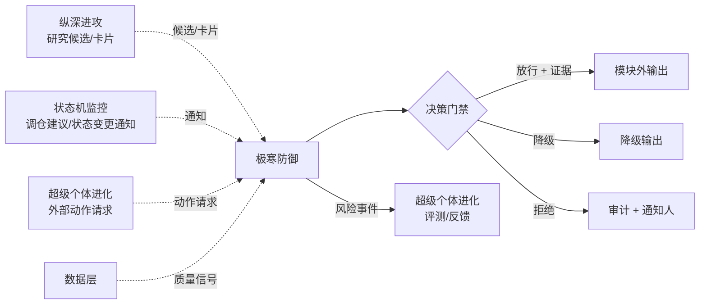

# L3 · 极寒防御 · 目标与边界设计

> [!NOTE] **[TRACEBACK]**
> - **顶层概念**：[项目定义与核心价值](../../01_顶层概念/01_项目定义与核心价值.md)
> - **战略主轴**：[L2 §极寒防御](../../02_战略维度/00_双目标与战略维度关系.md)
> - **同模块**：[极寒防御/README](./README.md)、[02_后端服务子模块_设计](./02_后端服务子模块_设计.md)、[03_接口契约_设计](./03_接口契约_设计.md)
> - **总纲**：[四大模块抽象总纲 §3.1](../00_四大模块抽象总纲.md#31-极寒防御cryo-guard)
> - **DNA**：`_System_DNA/cryo_guard/`、`global_const.cryo_guard`

> [!IMPORTANT] **验证后资源释放（全模块强制）**
> 凡本文档涉及或引用的 **本地/联调验证**（单测、集成测、`docker compose`、前后端 dev server、`uvicorn`、临时 worker 等），在 **测试结论已确认并完成准出/实践记录** 后，须 **停止相关进程并释放资源**。检查项与示例命令见 [_共享规约/17_L3设计文档_验证后资源释放规约.md](../_共享规约/17_L3设计文档_验证后资源释放规约.md)。

## 一、目标

让"系统不犯错的成本"远低于"犯错的代价"。本模块通过**风险解构 + 多层门禁 + 熔断 + 失败保护 + 不可篡改审计**五大手段，确保：

1. **不可信不放过**：任何不可追溯、无证据的输出都不能离开模块边界
2. **坏环境进入冻结**：依赖故障 / 数据漂移 / 推理服务降级时，自动转入"冻结 / 只读 / 拒绝出站"状态
3. **坏决策不出门**：研究结论 → 决策建议 → 外部动作之前必经多层门禁
4. **每一次拒绝都可回放**：审计日志不可篡改，每次门禁判定可被检索、回放、复盘

## 二、本模块的"做"与"不做"

### 做什么（Scope In）

| 能力 | 说明 |
|------|------|
| 风险事件采集与分发 | 跨模块统一收集风险事件（数据/推理/外部依赖/上下文/决策） |
| 多层门禁判定 | 指标门禁、合规门禁、可追溯门禁、人审门禁 |
| 熔断与冻结 | 异常时降级模块到 冻结/只读/拒绝出站；管理恢复路径 |
| 输入污染检测 | LLM 上下文注入、数据漂移、prompt 投毒、外部输入异常检测 |
| 审计日志 | 不可篡改记录每次"判定 / 拒绝 / 降级 / 放行"，含证据引用 |
| 失败保护策略 | 上游失败 / 超时 / 降质 时的回退（fallback、缓存、降级模型、人审兜底） |

### 不做什么（Scope Out）

| 能力 | 归属模块 | 原因 |
|------|---------|------|
| 产生研究结论、研究候选 | [纵深进攻](../纵深进攻/README.md) | 极寒防御只判断"该不该放行"，不参与"产生什么" |
| 维护状态机生命周期 | [状态机监控](../状态机监控/README.md) | 状态机由该模块独立维护；极寒防御只对状态迁移触发的"对外通知"做门禁 |
| 直接执行外部动作 | [超级个体进化 § external_action_boundary](../超级个体进化/README.md) | 外部动作由进化模块的边界子模块执行；但执行前必经极寒防御门禁 |
| 模型再训练 / 知识库写入 | [超级个体进化](../超级个体进化/README.md) | 极寒防御对"是否允许写知识库"做门禁，但不写 |
| 用户身份认证 | 平台基础（部署仓 / 网关层） | 不在 L3 模块范围内；极寒防御仅消费认证结果 |

## 三、与其它模块的接口边界

### 输入契约

| 输入源 | 数据类型 | 频率 | 协议归属 |
|--------|---------|------|---------|
| 纵深进攻：研究候选 / 研究卡片 | `ResearchCard / Candidate` | 触发式 | [Research Protocol](../_共享规约/04_全链路通信协议矩阵.md) |
| 状态机监控：调仓建议 / 状态变更通知 | `Advisory / TransitionEvent` | 流式 | [Decision Protocol](../_共享规约/04_全链路通信协议矩阵.md) |
| 超级个体进化：外部动作请求 | `ExternalActionRequest` | 触发式 | [External Action Protocol](../_共享规约/04_全链路通信协议矩阵.md) |
| 数据层：输入质量信号 | `DataQualitySignal`（漂移、缺失率、新鲜度） | 流式 | [11_数据采集与输入层规约](../_共享规约/11_数据采集与输入层规约.md) |
| 推理网关：服务降级信号 | `InferenceHealthSignal` | 流式 | [05_接口抽象层规约 §推理网关边界](../_共享规约/05_接口抽象层规约.md) |

### 输出契约

| 输出 | 数据类型 | 消费方 |
|------|---------|--------|
| 门禁判定结果 | `GateDecision { result, reason, evidence_ref, severity }` | 调用方（同步返回）+ 超级个体进化（异步评测） |
| 风险事件流 | `RiskEvent { id, severity, category, affected, evidence_ref, ts }` | 监控驾驶舱、风险熔断面板、超级个体进化反馈采集 |
| 熔断状态变更 | `BreakerStateChange { service, from, to, reason }` | 全部模块（须暂停对应能力） |
| 审计日志条目 | `AuditLog { decision_id, actor, action, payload_hash, signature, ts }` | 审计前端、合规导出、第三方审计 |

## 四、模块准出标准（用于 L4/L5）

| 验收项 | 验收方式 |
|--------|---------|
| 门禁判定可在 < 50ms 内完成（典型路径） | 压测 + 中位数延迟 < 50ms，P99 < 200ms |
| 任意一次"拒绝"可回放原始判定上下文 | 审计日志可按 `decision_id` 拉到完整上下文 + 证据 hash 校验 |
| 熔断触发到通知前端 < 1s | 端到端延迟监测 |
| 审计日志不可篡改 | 链式 hash + 定期签名快照 + 第三方对账（参考 [10_运营治理与灾备规约](../_共享规约/10_运营治理与灾备规约.md)） |
| 输入污染检测覆盖：prompt injection / 数据漂移 / NaN-Inf / 超长 / 编码异常 | 单元测试覆盖率 + 红队对抗用例集（≥ 50 用例） |
| 失败保护策略全覆盖 | 每个外部依赖必须有声明式 fallback（无 fallback 视为违规） |

## 五、关键设计取舍

1. **门禁不与业务模块耦合**：门禁规则以**配置 + 策略表**形式注册到 [06_动态配置中心](../_共享规约/06_动态配置中心规约.md)，业务模块不知道有哪些门禁，只负责把"待判定对象 + 上下文"提交给门禁器
2. **审计日志独立持久化**：审计写入与业务写入解耦，审计写失败必须阻塞业务写入（防止"做了事但没记录"）
3. **熔断按"服务粒度 × 调用方粒度"双维度**：单服务熔断不影响其它服务；同服务对不同调用方可有不同熔断策略
4. **拒绝优先于降级、降级优先于放行**：当多个门禁判定冲突时，按安全等级最严的执行
5. **人审入口必须可回退**：人审通过后可被自动门禁再次拒绝（如"人审通过但触发新的合规规则"）

## 六、与共享规约的对齐

| 共享规约 | 对齐点 |
|----------|--------|
| [04_全链路通信协议矩阵](../_共享规约/04_全链路通信协议矩阵.md) | Decision Protocol、External Action Protocol 强制字段 |
| [05_接口抽象层规约](../_共享规约/05_接口抽象层规约.md) | 推理网关边界的健康信号、外部动作 Port 的 idempotency |
| [06_动态配置中心规约](../_共享规约/06_动态配置中心规约.md) | 门禁规则、阈值、熔断参数热更新 |
| [08_心跳协议与健康检查规约](../_共享规约/08_心跳协议与健康检查规约.md) | 服务健康信号即熔断输入 |
| [10_运营治理与灾备规约](../_共享规约/10_运营治理与灾备规约.md) | 审计、合规、DR 衔接 |
