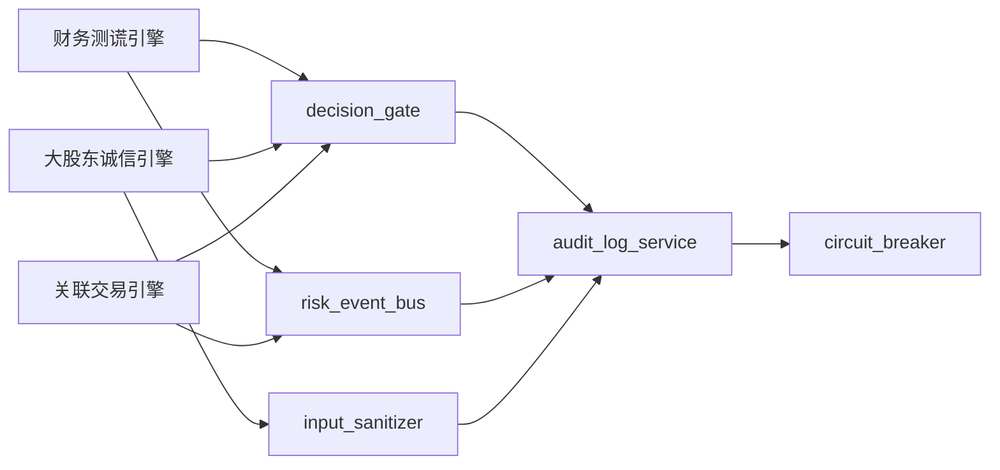
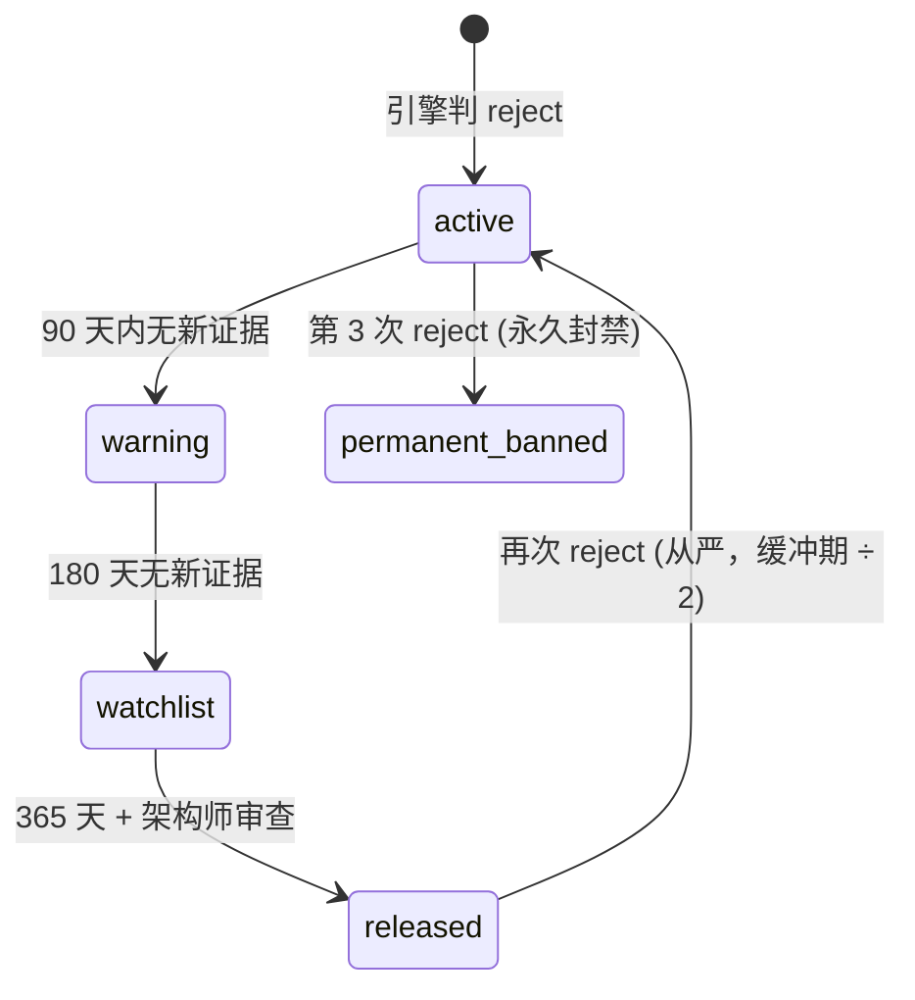

# L3·极寒防御·06·L2 落地清单（与维度一全量对齐）

> [!NOTE] **[TRACEBACK] 原子规约锚点**
> - **本模块抽象**: [00_四大模块抽象总纲 §3.1](../00_四大模块抽象总纲.md#31-极寒防御cryo-guard)
> - **本模块设计 1-5**: [01_目标与边界](./01_目标与边界_设计.md) / [02_后端服务子模块](./02_后端服务子模块_设计.md) / [03_接口契约](./03_接口契约_设计.md) / [04_数据契约](./04_数据契约_设计.md) / [05_实施推演](./05_实施推演_设计.md)
> - **L2 维度对齐**: [维度一·极寒防御](../../02_战略维度/01_维度一_极寒防御/README.md)
> - **L2 实践策略**: [04_防御实践策略规划](../../02_战略维度/01_维度一_极寒防御/04_防御实践策略规划.md)
> - **L1 哲学基石**: ⑤防御 + ④八象限（F vs B 归因）

> [!IMPORTANT] **验证后资源释放（全模块强制）**
> 凡本文档涉及或引用的 **本地/联调验证**（单测、集成测、`docker compose`、前后端 dev server、`uvicorn`、临时 worker 等），在 **测试结论已确认并完成准出/实践记录** 后，须 **停止相关进程并释放资源**。检查项与示例命令见 [_共享规约/17_L3设计文档_验证后资源释放规约.md](../_共享规约/17_L3设计文档_验证后资源释放规约.md)。


## 一、本文档的位置

本模块的现有 5 设计文档（01-05）定义了**通用抽象规约**（5 个后端服务子模块、通用接口、通用数据契约）。本文档（06）是**L2 反向落地清单**——把维度一最新设计的 10 引擎、5 维认知边界、reject 配额、多源汇聚、黑名单生命周期、F vs B 归因等具体能力**全部映射到 L3 后端服务子模块的具体实现规约**。

> 06 与 01-05 的关系：01-05 是 "what / 抽象"，06 是 "how / L2 具体能力落地哪个服务"。

## 二、10 引擎 → cryo_guard 服务映射

| L2 引擎（维度一）| 优先级 | 主责服务 | 协责服务 | 关键 SLO |
|---|---|---|---|---|
| **财务造假测谎引擎** | P0 | `decision_gate` + `risk_event_bus` | `audit_log_service` | Recall ≥ 0.95, Precision ≥ 0.70 |
| **大股东诚信验尸引擎** | P0 | `decision_gate` + `input_sanitizer` | `audit_log_service` | Recall ≥ 0.90, Kappa ≥ 0.80 |
| **关联交易/明股实债识别** | P0 | `decision_gate` + `risk_event_bus` | `audit_log_service` | Recall ≥ 0.85, Precision ≥ 0.70 |
| **商誉减值预警引擎** | P1 | `decision_gate` + `risk_event_bus` | — | Recall ≥ 0.85 |
| **质押爆仓与控制权稳定性** | P1 | `decision_gate` + `risk_event_bus` | `circuit_breaker` | Recall ≥ 0.90 |
| **审计师与监管问询风险** | P1 | `decision_gate` + `risk_event_bus` | `input_sanitizer` | Recall ≥ 0.88 |
| **关键人离职/治理崩塌** | P1 | `decision_gate` + `input_sanitizer` | — | Recall ≥ 0.80 |
| **海外监管风险**（中概股）| P2 | `decision_gate` + `risk_event_bus` | — | Recall ≥ 0.85 |
| **舆情与品牌信任崩盘** | P2 | `decision_gate` + `input_sanitizer` | — | Recall ≥ 0.78 |
| **行业系统性风险** | P2 | `decision_gate` + `risk_event_bus` | `circuit_breaker` | Recall ≥ 0.80 |
| **议会模式**（Judge LLM）| Stage 3 | 跨服务（与 super_evo 协作）| — | FN 率 ↓ 30% |

### 2.1 引擎与服务的 1:N 关系



## 三、5 维认知边界检查 schema（实现规约）

### 3.1 5 维定义

| 维度 | 检查内容 | 数据源 |
|---|---|---|
| **行业边界** | 标的所属行业是否在白名单 | `industry_whitelist` 配置表 |
| **数据完整度** | 标的财务/公告/股权数据完整度 ≥ 阈值 | 数据湖元数据 |
| **SLI 可监控性** | 是否可绑定 ≥ 3 个独立 SLI 探针 | `state_watch.probe_registry` |
| **历史可比性** | 历史是否有 ≥ N 个同类案例 | 维度五 case_library |
| **复杂度** | 业务模型复杂度 ≤ 阈值（避免黑盒）| `complexity_estimator` |

### 3.2 实现接口（补充 03_接口契约 未覆盖）

```python
@dataclass
class CognitiveBoundaryCheck:
    symbol: str
    checked_at: datetime
    industry_pass: bool
    industry_score: float            # 0-1
    data_completeness_pass: bool
    data_completeness_score: float
    sli_probability_pass: bool
    sli_probe_count: int
    historical_comparability_pass: bool
    historical_case_count: int
    complexity_pass: bool
    complexity_estimate: float
    overall_pass: bool               # 5 维全部 pass 才通过
    failure_reasons: list[str]       # 不通过的维度

# decision_gate 接口
POST /api/decision-gate/cognitive-boundary
  Request: { symbol, context }
  Response: CognitiveBoundaryCheck
```

### 3.3 白名单管理

```yaml
# config/industry_whitelist.yaml (动态配置中心维护)
industry_whitelist:
  - "消费电子" 
  - "新能源汽车"
  - "半导体"
  - "光伏"
  - "医药"
  # ... ≥ 50 个行业，覆盖 A 股 80% 市值
exclude_industries:
  - "比特币矿业"             # 认知边界外
  - "中概股"                  # 监管复杂
  - "ST*"                     # 退市风险
```

## 四、reject 配额管理（防御不过度）

### 4.1 配额规则（继承 L2 04_ §5.3）

| 维度 | 上限 | 触发动作 |
|---|---|---|
| 日 reject 占总候选 | ≤ 50% | 超出 → 引擎过敏审查 |
| 周 reject 占总候选 | ≤ 50% | 超出 → 月度复盘 |
| 月 reject 占总候选 | ≤ 50% | 超出 → LoRA 回退一版 |
| 认知边界 reject 占总 reject | ≤ 30% | 超出 → 白名单 review |

### 4.2 实现（补充 02_后端服务子模块 未覆盖）

新增 `reject_quota_manager` 子服务（在 decision_gate 内）：

```python
class RejectQuotaManager:
    """reject 配额管理（Redis 滑动窗口实现）"""
    
    def check_and_reserve(self, engine_name: str, symbol: str, 
                          reject_type: str) -> bool:
        """配额检查 + 预留；返回是否允许此次 reject"""
        # 1. 检查日/周/月配额
        # 2. 检查认知边界占比
        # 3. 配额充足 → 增量 + 返回 True
        # 4. 配额超出 → 触发 quota_exceeded 告警
        
    def get_quota_status(self) -> QuotaStatus:
        """实时配额状态"""
        return {
            "daily_reject_ratio": 0.42,    # 当前日 reject 比
            "weekly_reject_ratio": 0.38,
            "monthly_reject_ratio": 0.41,
            "boundary_reject_ratio": 0.25,
            "all_within_limits": True
        }
```

### 4.3 Redis Key Schema

```
cryo_guard:reject_count:daily:{YYYY-MM-DD}        TTL 7d
cryo_guard:reject_count:weekly:{YYYY-WW}          TTL 30d
cryo_guard:reject_count:monthly:{YYYY-MM}         TTL 90d
cryo_guard:total_candidates:daily:{YYYY-MM-DD}    TTL 7d
```

## 五、多源弱信号汇聚规则

### 5.1 汇聚算法

```python
def aggregate_weak_signals(signals: list[WeakSignal]) -> AggregatedDecision:
    """多源弱信号汇聚（多引擎共同 vote）"""
    
    # 时间窗口：30 天内的同标的信号
    recent = [s for s in signals if (now - s.time).days <= 30]
    
    # 按引擎分组（去重同引擎多次推送）
    by_engine = group_by_engine(recent)
    
    # 至少 N 个不同引擎共同触发才升级为 reject
    distinct_engines = len(by_engine)
    if distinct_engines >= 2:
        severity = "high"
        return Reject(reason=summarize_signals(by_engine), severity=severity)
    
    return Degrade(reason="单源弱信号", severity="medium")
```

### 5.2 升级矩阵

| 单源信号严重度 | 共同触发引擎数 | 最终决策 |
|---|---|---|
| 弱 | 1 | pass（仅记录）|
| 弱 | 2-3 | degrade |
| 弱 | ≥ 4 | reject（多源汇聚升级） |
| 中 | 1 | degrade |
| 中 | ≥ 2 | reject |
| 强 | ≥ 1 | reject（直接）|

## 六、黑名单生命周期 + 解封/再违约规则

### 6.1 状态机



### 6.2 SQL Schema（补充 04_数据契约）

```sql
CREATE TABLE blacklist_lifecycle (
    symbol TEXT NOT NULL,
    status TEXT NOT NULL,                   -- active/warning/watchlist/released/permanent_banned
    first_reject_at DATETIME NOT NULL,
    last_reject_at DATETIME,
    reject_count INTEGER DEFAULT 1,
    transition_history TEXT,                -- JSON array of {time, from_status, to_status, reason}
    next_review_at DATETIME,
    architect_approved BOOLEAN,
    architect_review_note TEXT,
    PRIMARY KEY (symbol, first_reject_at)
);

CREATE TABLE blacklist_evidence_chain (
    evidence_id TEXT PRIMARY KEY,
    symbol TEXT NOT NULL,
    engine_name TEXT NOT NULL,
    detected_at DATETIME NOT NULL,
    severity TEXT NOT NULL,
    evidence_summary TEXT,
    evidence_url TEXT,                      -- 原始证据链接
    is_active BOOLEAN DEFAULT TRUE
);
```

## 七、reject 归因（F vs B 象限对接超级个体进化）

### 7.1 归因规则

| 归因结果 | 触发条件 | 路由到（super_evo） |
|---|---|---|
| **F 象限·避雷成功** | reject 后 90 天内标的暴跌 ≥ 20% | `gold_library`（SFT 强化）|
| **B 象限·防御过敏** | reject 后 180 天内标的上涨 ≥ 50% 且无暴雷信号 | `failure_library_for_dpo`（DPO 训练）|
| **待定** | reject 后 90 天内无显著走势 | `pending_library`（等 180 天再归因）|

### 7.2 归因调度

```python
# 每日 17:00 调度（与价格行情同步）
@cron("0 17 * * *")
def reject_attribution_job():
    for reject in pending_rejects():
        if (now - reject.time).days >= 90:
            outcome = check_price_outcome(reject.symbol, days=90)
            quadrant = classify_quadrant(reject, outcome)
            route_to_super_evo(reject, quadrant)
            save_attribution(reject, quadrant, "T+90")
        
        if (now - reject.time).days >= 180:
            # T+180 二次确认
            outcome_180 = check_price_outcome(reject.symbol, days=180)
            if final_quadrant_differs(reject, outcome_180):
                update_attribution(reject, outcome_180, "T+180_revised")
```

### 7.3 输出事件（消费方：super_evo + 维度零价值账本）

```yaml
RejectAttributionEvent:
  reject_id: str
  symbol: str
  attribution_time: datetime
  evaluation_point: enum    # T+90 | T+180
  quadrant: enum            # F | B | pending
  price_outcome:
    initial_price: float
    current_price: float
    pct_change: float
    has_explosion: bool      # 是否暴跌
    has_rally: bool          # 是否上涨
  routed_to: str            # gold_library | failure_library_for_dpo
```

## 八、与其他 L3 模块的协作扩展

| 协作模块 | 接口 | 说明 |
|---|---|---|
| **deep_strike**（纵深进攻）| `events:thrust:thesis_proposed` → `decision_gate` 前置闸门 | 任何 thesis 出推荐池前必须过 cryo_guard 检查 |
| **state_watch**（状态机监控）| `events:cryo_guard:reject` → 强制 `broken_any` 状态迁移 | 持仓被 reject 触发强约束 broken |
| **super_evo**（超级个体进化）| `RejectAttributionEvent` → 8 象限库路由 | F/B 归因分别进训练库 |
| **frontend**（前端）| `events:cryo_guard:*` → 持仓体检 4 色卡片 + 紧急告警 | push_level 严格映射 4 色 |

## 九、L4 实施推演的 L2 锚定（补充 05_实施推演）

| L4 阶段 | L2 维度一对应 | 主要交付 |
|---|---|---|
| **Stage 1 · 启动期**（0-3 月）| 维度一·stage_1 | 3 引擎（财务测谎 + 大股东诚信 + 关联交易）+ decision_gate + audit_log + Holdout 50 案例 |
| **Stage 2 · 扩展期**（3-9 月）| 维度一·stage_2 | + 4 引擎（商誉/质押/审计/关键人）+ DPO + 多 LoRA + reject_quota_manager 上线 |
| **Stage 3 · 完善期**（9-12 月）| 维度一·stage_3 | + 3 引擎（海外/舆情/行业）+ 议会模式（与 super_evo + Judge LLM 联动）|

## 十、一致性检查表

- [x] 10 引擎全部映射到具体 cryo_guard 服务 + 优先级
- [x] 5 维认知边界 schema + 实现接口
- [x] reject 配额管理（日/周/月 + 认知边界占比）+ Redis Key
- [x] 多源弱信号汇聚算法 + 升级矩阵
- [x] 黑名单生命周期状态机 + SQL Schema
- [x] F vs B 归因规则 + 输出事件
- [x] 与 deep_strike / state_watch / super_evo / frontend 协作接口
- [x] L4 三阶段实施对应 L2 stages
- [x] 承接 L1 基石⑤防御 + ④八象限

---

## 修订记录

| 日期 | 触发 | 内容 |
|---|---|---|
| 2026-05-16 | L2 反向落地批 1 | 新建 06_，覆盖 10 引擎 + 5 维认知边界 + reject 配额 + 多源汇聚 + 黑名单 + F/B 归因 |
