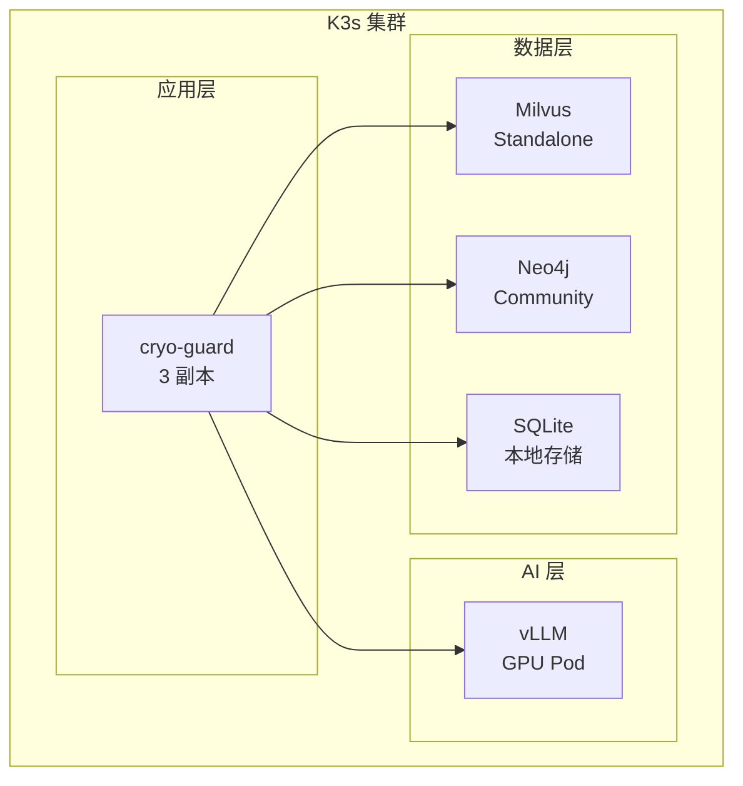

# 维度一·极寒防御·启动期·技术方案与代码架构

> [!NOTE] **[TRACEBACK] 实践锚点**
> - **本阶段策略**: [01_实践目标与策略](./01_实践目标与策略.md)
> - **L2 引擎设计**: [维度一·engines/](../../../../02_战略维度/01_维度一_极寒防御/engines/)
> - **L3 接口契约**: [维度一_极寒防御/03_接口契约_设计](../../03_接口契约_设计.md)

---

## 一、技术选型总览

### 1.1 技术栈矩阵

| 层面 | 技术选型 | 版本 | 说明 |
|---|---|---|---|
| **基座模型** | Qwen2.5-7B-Instruct | latest | 中文能力强，32K 上下文 |
| **微调框架** | LLaMA-Factory | 0.8+ | LoRA/QLoRA 支持 |
| **推理引擎** | vLLM | 0.4+ | 多 LoRA 热加载 |
| **Agent 编排** | LangGraph | 0.1+ | 状态机 + 工作流 |
| **向量数据库** | Milvus Standalone | 2.3+ | 本地部署 |
| **图数据库** | Neo4j Community | 5.x | 股权穿透 |
| **服务框架** | FastAPI + Uvicorn | 0.100+ | 异步 API |
| **数据库** | SQLite（启动期） | 3.40+ | 轻量存储 |
| **容器编排** | K3s | 1.28+ | 轻量 Kubernetes |
| **监控** | Prometheus + Grafana | latest | 指标采集 |

### 1.2 硬件要求

| 组件 | 最低配置 | 推荐配置 |
|---|---|---|
| GPU | RTX 4090 24GB × 1 | RTX 4090 24GB × 2 |
| CPU | 8 核 | 16 核 |
| 内存 | 64GB | 128GB |
| 存储 | 500GB SSD | 1TB NVMe |

---

## 二、代码仓库结构

```
diting-src/
├── cryo_guard/                      # 极寒防御模块
│   ├── __init__.py
│   ├── config.py                    # 配置管理
│   ├── decision_gate/               # 决策门禁
│   │   ├── __init__.py
│   │   ├── gate.py                  # 一票否决聚合器
│   │   ├── boundary_check.py        # 认知边界检查
│   │   └── audit_log.py             # 审计日志
│   ├── engines/                     # 3 P0 引擎
│   │   ├── __init__.py
│   │   ├── base_engine.py           # 引擎基类
│   │   ├── financial_fraud/         # 引擎 1·财务测谎
│   │   │   ├── __init__.py
│   │   │   ├── engine.py            # 引擎主逻辑
│   │   │   ├── agents/              # 5 节点 Agent
│   │   │   │   ├── field_extractor.py
│   │   │   │   ├── feature_calculator.py
│   │   │   │   ├── time_series_comparator.py
│   │   │   │   ├── peer_comparator.py
│   │   │   │   └── llm_interrogator.py
│   │   │   ├── prompts/             # Prompt 模板
│   │   │   └── schemas.py           # Pydantic 模型
│   │   ├── shareholder_integrity/   # 引擎 2·大股东诚信
│   │   │   ├── __init__.py
│   │   │   ├── engine.py
│   │   │   ├── agents/
│   │   │   │   ├── commitment_extractor.py
│   │   │   │   ├── behavior_extractor.py
│   │   │   │   ├── nli_comparator.py
│   │   │   │   └── llm_scorer.py
│   │   │   ├── prompts/
│   │   │   └── schemas.py
│   │   └── related_party/           # 引擎 3·关联交易
│   │       ├── __init__.py
│   │       ├── engine.py
│   │       ├── agents/
│   │       │   ├── equity_penetrator.py
│   │       │   ├── note_parser.py
│   │       │   ├── graph_builder.py
│   │       │   ├── cycle_detector.py
│   │       │   ├── debt_equity_detector.py
│   │       │   └── llm_aggregator.py
│   │       ├── prompts/
│   │       └── schemas.py
│   ├── llm/                         # LLM 调用封装
│   │   ├── __init__.py
│   │   ├── vllm_client.py           # vLLM 客户端
│   │   └── lora_manager.py          # LoRA 管理
│   ├── rag/                         # RAG 组件
│   │   ├── __init__.py
│   │   ├── embedder.py              # 嵌入生成
│   │   ├── milvus_store.py          # Milvus 向量存储
│   │   └── retriever.py             # 检索器
│   ├── graph/                       # 图数据库
│   │   ├── __init__.py
│   │   └── neo4j_client.py          # Neo4j 客户端
│   ├── api/                         # API 层
│   │   ├── __init__.py
│   │   ├── main.py                  # FastAPI 入口
│   │   ├── routes/
│   │   │   ├── decision_gate.py     # /api/decision-gate/*
│   │   │   ├── engines.py           # /api/engines/*
│   │   │   └── audit.py             # /api/audit/*
│   │   └── middlewares/
│   │       └── logging.py           # 请求日志
│   └── db/                          # 数据库
│       ├── __init__.py
│       ├── models.py                # SQLAlchemy 模型
│       └── migrations/              # Alembic 迁移
├── tests/                           # 测试
│   ├── cryo_guard/
│   │   ├── test_decision_gate.py
│   │   ├── test_financial_fraud.py
│   │   ├── test_shareholder.py
│   │   └── test_related_party.py
│   └── holdout/                     # 50 案例 Holdout 评测
│       ├── cases/
│       └── evaluate.py
├── training/                        # 训练相关
│   ├── data/
│   │   ├── teacher_distill/         # Teacher 蒸馏数据
│   │   ├── verified/                # 架构师 verified
│   │   └── holdout/                 # Holdout（只读）
│   ├── configs/                     # LLaMA-Factory 配置
│   │   ├── financial_fraud_lora.yaml
│   │   ├── shareholder_lora.yaml
│   │   └── related_party_lora.yaml
│   └── scripts/
│       ├── train.sh                 # 训练脚本
│       └── evaluate.sh              # 评测脚本
├── deploy/                          # 部署配置
│   ├── k3s/
│   │   ├── cryo-guard-deployment.yaml
│   │   ├── vllm-deployment.yaml
│   │   ├── milvus-deployment.yaml
│   │   └── neo4j-deployment.yaml
│   └── docker/
│       ├── Dockerfile.cryo-guard
│       └── Dockerfile.vllm
├── pyproject.toml                   # 依赖管理
└── Makefile                         # 常用命令
```

---

## 三、核心模块设计

### 3.1 决策门禁（decision_gate）

```python
# cryo_guard/decision_gate/gate.py

from enum import Enum
from dataclasses import dataclass
from typing import List, Optional
from datetime import datetime

class Decision(Enum):
    PASS = "pass"
    DEGRADE = "degrade"
    REJECT = "reject"

@dataclass
class EngineResult:
    engine_name: str
    decision: Decision
    score: float           # 0-1，越高风险越大
    evidence: List[str]    # 触发线索
    
@dataclass
class GateDecision:
    final_decision: Decision
    engine_results: List[EngineResult]
    aggregation_reason: str
    timestamp: datetime
    audit_id: str

class DecisionGate:
    """一票否决聚合器"""
    
    REJECT_THRESHOLD = {
        "financial_fraud": 0.85,
        "shareholder_integrity": 0.80,
        "related_party": 0.80,
    }
    DEGRADE_THRESHOLD = {
        "financial_fraud": 0.60,
        "shareholder_integrity": 0.55,
        "related_party": 0.55,
    }
    
    def aggregate(self, results: List[EngineResult]) -> GateDecision:
        """
        聚合逻辑：
        - 任意 1 个 reject → 整体 reject
        - 任意 2 个 degrade → 升级为 reject
        - 全部 pass → 放行
        """
        decisions = []
        for r in results:
            if r.score >= self.REJECT_THRESHOLD.get(r.engine_name, 0.85):
                decisions.append(Decision.REJECT)
            elif r.score >= self.DEGRADE_THRESHOLD.get(r.engine_name, 0.60):
                decisions.append(Decision.DEGRADE)
            else:
                decisions.append(Decision.PASS)
        
        # 聚合判定
        if Decision.REJECT in decisions:
            final = Decision.REJECT
            reason = "任意引擎判定 reject"
        elif decisions.count(Decision.DEGRADE) >= 2:
            final = Decision.REJECT
            reason = "多引擎 degrade 升级为 reject"
        elif Decision.DEGRADE in decisions:
            final = Decision.DEGRADE
            reason = "单引擎 degrade"
        else:
            final = Decision.PASS
            reason = "全部引擎 pass"
        
        # 生成审计记录
        audit_id = self._write_audit_log(results, final, reason)
        
        return GateDecision(
            final_decision=final,
            engine_results=results,
            aggregation_reason=reason,
            timestamp=datetime.now(),
            audit_id=audit_id,
        )
    
    def _write_audit_log(self, results, final, reason) -> str:
        # 写入不可篡改的审计日志
        ...
```

### 3.2 引擎基类

```python
# cryo_guard/engines/base_engine.py

from abc import ABC, abstractmethod
from typing import Dict, Any
from pydantic import BaseModel

class EngineInput(BaseModel):
    symbol: str              # 股票代码
    name: str                # 公司名称
    context: Dict[str, Any]  # 上下文数据（财报/公告等）

class EngineOutput(BaseModel):
    engine_name: str
    score: float             # 0-1 风险分
    decision: str            # pass/degrade/reject
    evidence: list[str]      # 触发线索
    details: Dict[str, Any]  # 详细分析结果

class BaseEngine(ABC):
    """引擎基类"""
    
    def __init__(self, llm_client, config):
        self.llm = llm_client
        self.config = config
        self.lora_name = self._get_lora_name()
    
    @abstractmethod
    def _get_lora_name(self) -> str:
        """返回本引擎使用的 LoRA 名称"""
        pass
    
    @abstractmethod
    async def analyze(self, input: EngineInput) -> EngineOutput:
        """执行分析"""
        pass
    
    async def run(self, input: EngineInput) -> EngineOutput:
        """运行引擎（含 LoRA 切换）"""
        self.llm.load_lora(self.lora_name)
        return await self.analyze(input)
```

### 3.3 财务测谎引擎示例

```python
# cryo_guard/engines/financial_fraud/engine.py

from langgraph.graph import StateGraph, END
from ..base_engine import BaseEngine, EngineInput, EngineOutput
from .agents import (
    FieldExtractor,
    FeatureCalculator,
    TimeSeriesComparator,
    PeerComparator,
    LLMInterrogator,
)

class FinancialFraudEngine(BaseEngine):
    """财务造假测谎引擎"""
    
    def _get_lora_name(self) -> str:
        return "financial_fraud_lora_v1"
    
    def __init__(self, llm_client, config):
        super().__init__(llm_client, config)
        
        # 初始化 5 节点 Agent
        self.field_extractor = FieldExtractor(llm_client)
        self.feature_calculator = FeatureCalculator()
        self.time_series = TimeSeriesComparator()
        self.peer_comparator = PeerComparator()
        self.llm_interrogator = LLMInterrogator(llm_client)
        
        # 构建工作流图
        self.workflow = self._build_workflow()
    
    def _build_workflow(self) -> StateGraph:
        """构建 5 节点工作流"""
        workflow = StateGraph(AnalysisState)
        
        workflow.add_node("extract_fields", self.field_extractor.run)
        workflow.add_node("calculate_features", self.feature_calculator.run)
        workflow.add_node("compare_time_series", self.time_series.run)
        workflow.add_node("compare_peers", self.peer_comparator.run)
        workflow.add_node("llm_interrogate", self.llm_interrogator.run)
        
        workflow.set_entry_point("extract_fields")
        workflow.add_edge("extract_fields", "calculate_features")
        workflow.add_edge("calculate_features", "compare_time_series")
        workflow.add_edge("compare_time_series", "compare_peers")
        workflow.add_edge("compare_peers", "llm_interrogate")
        workflow.add_edge("llm_interrogate", END)
        
        return workflow.compile()
    
    async def analyze(self, input: EngineInput) -> EngineOutput:
        """执行分析"""
        state = AnalysisState(
            symbol=input.symbol,
            name=input.name,
            financial_data=input.context.get("financial_report"),
        )
        
        result = await self.workflow.ainvoke(state)
        
        return EngineOutput(
            engine_name="financial_fraud",
            score=result["risk_score"],
            decision=self._score_to_decision(result["risk_score"]),
            evidence=result["evidence"],
            details=result,
        )
    
    def _score_to_decision(self, score: float) -> str:
        if score >= 0.85:
            return "reject"
        elif score >= 0.60:
            return "degrade"
        return "pass"
```

### 3.4 6 类粉饰特征计算

```python
# cryo_guard/engines/financial_fraud/agents/feature_calculator.py

from dataclasses import dataclass
from typing import Dict, Any

@dataclass
class FraudFeatures:
    """6 类典型粉饰特征"""
    
    # 1. 存贷双高
    cash_debt_ratio: float      # 货币资金 / 有息负债
    cash_debt_anomaly: bool     # 是否异常
    
    # 2. 现金流背离
    operating_cf_ratio: float   # 经营现金流 / 净利润
    cf_profit_deviation: bool   # 是否背离
    
    # 3. 应收异常
    receivable_turnover: float  # 应收账款周转率
    receivable_growth_vs_revenue: float  # 应收增速 - 收入增速
    receivable_anomaly: bool
    
    # 4. 存货积压
    inventory_turnover: float   # 存货周转率
    inventory_growth_vs_cost: float  # 存货增速 - 成本增速
    inventory_anomaly: bool
    
    # 5. 研发资本化突变
    rd_capitalization_ratio: float  # 研发资本化率
    rd_capitalization_yoy_change: float  # 同比变化
    rd_capitalization_anomaly: bool
    
    # 6. 毛利率异常
    gross_margin: float         # 毛利率
    gross_margin_vs_peers: float  # 与同行差异
    gross_margin_anomaly: bool
    
    def get_anomaly_count(self) -> int:
        """返回异常特征数量"""
        return sum([
            self.cash_debt_anomaly,
            self.cf_profit_deviation,
            self.receivable_anomaly,
            self.inventory_anomaly,
            self.rd_capitalization_anomaly,
            self.gross_margin_anomaly,
        ])

class FeatureCalculator:
    """特征计算 Agent"""
    
    THRESHOLDS = {
        "cash_debt_high": 1.5,      # 存贷双高阈值
        "cf_deviation": 0.3,         # 现金流背离阈值
        "receivable_growth_diff": 0.2,  # 应收增速差异阈值
        "inventory_growth_diff": 0.15,
        "rd_cap_change": 0.1,        # 研发资本化变化阈值
        "gross_margin_diff": 0.1,    # 毛利率差异阈值
    }
    
    def run(self, state: Dict[str, Any]) -> Dict[str, Any]:
        """计算 6 类粉饰特征"""
        fin_data = state["financial_data"]
        
        features = FraudFeatures(
            # 1. 存贷双高
            cash_debt_ratio=self._calc_cash_debt_ratio(fin_data),
            cash_debt_anomaly=self._check_cash_debt_anomaly(fin_data),
            
            # 2. 现金流背离
            operating_cf_ratio=self._calc_cf_ratio(fin_data),
            cf_profit_deviation=self._check_cf_deviation(fin_data),
            
            # ... 其他特征计算
        )
        
        state["fraud_features"] = features
        state["anomaly_count"] = features.get_anomaly_count()
        
        return state
```

---

## 四、API 设计

### 4.1 核心 API

```yaml
# 决策门禁 API
POST /api/decision-gate/check
  Request:
    symbol: str
    name: str
    context: object  # 财报/公告等上下文
  Response:
    decision: "pass" | "degrade" | "reject"
    audit_id: str
    engine_results: list[EngineResult]

# 单引擎检测 API
POST /api/engines/{engine_name}/analyze
  Request:
    symbol: str
    name: str
    context: object
  Response:
    score: float
    decision: str
    evidence: list[str]
    details: object

# 审计查询 API
GET /api/audit/logs?symbol={symbol}&start={date}&end={date}
  Response:
    logs: list[AuditLog]
```

### 4.2 健康检查

```yaml
GET /health
  Response:
    status: "healthy" | "degraded"
    engines:
      financial_fraud: "up" | "down"
      shareholder_integrity: "up" | "down"
      related_party: "up" | "down"
    dependencies:
      vllm: "up" | "down"
      milvus: "up" | "down"
      neo4j: "up" | "down"
```

---

## 五、部署架构

### 5.1 K3s 部署图



### 5.2 资源配置

```yaml
# deploy/k3s/cryo-guard-deployment.yaml
apiVersion: apps/v1
kind: Deployment
metadata:
  name: cryo-guard
spec:
  replicas: 1  # 启动期单副本
  template:
    spec:
      containers:
      - name: cryo-guard
        image: diting/cryo-guard:v0.1
        resources:
          requests:
            cpu: "2"
            memory: "4Gi"
          limits:
            cpu: "4"
            memory: "8Gi"
        env:
        - name: VLLM_URL
          value: "http://vllm:8000"
        - name: MILVUS_URL
          value: "milvus:19530"
        - name: NEO4J_URL
          value: "bolt://neo4j:7687"
```

---

## 六、开发规范

### 6.1 代码规范

- Python 3.11+
- 类型注解（mypy strict）
- 格式化（ruff format）
- 测试覆盖率 ≥ 80%

### 6.2 Git 分支策略

```
main          # 生产分支
  └── dev     # 开发分支
      ├── feature/financial-fraud-engine
      ├── feature/shareholder-engine
      └── feature/related-party-engine
```

### 6.3 Makefile 常用命令

```makefile
# Makefile
.PHONY: dev test lint train deploy

dev:
	uvicorn cryo_guard.api.main:app --reload

test:
	pytest tests/ -v --cov=cryo_guard

lint:
	ruff check cryo_guard/
	mypy cryo_guard/

train:
	bash training/scripts/train.sh

deploy:
	kubectl apply -f deploy/k3s/
```

---

## 修订记录

| 日期 | 内容 |
|---|---|
| 2026-05-16 | 初版，覆盖技术选型、代码结构、核心模块、API、部署 |
