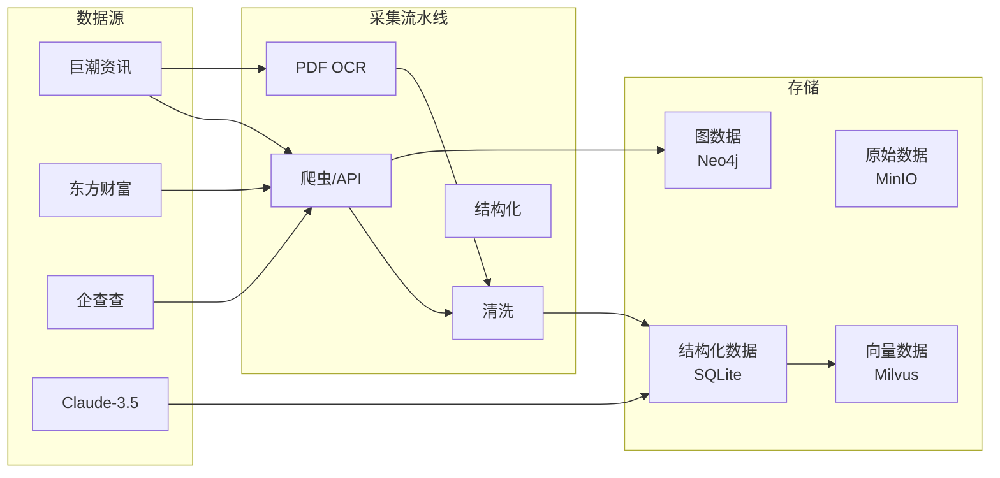
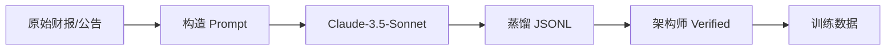
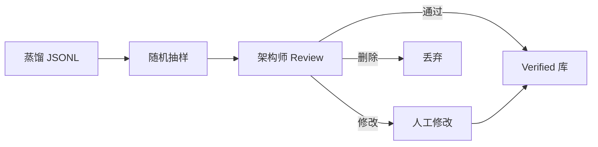

# 维度一·极寒防御·启动期·数据采集与预处理

> [!NOTE] **[TRACEBACK] 实践锚点**
> - **本阶段策略**: [01_实践目标与策略](./01_实践目标与策略.md)
> - **L2 数据清单**: [维度一·stage_1·数据采集任务](../../../../02_战略维度/01_维度一_极寒防御/stages/stage_1_启动期/02_本阶段数据采集任务.md)
> - **L3 数据契约**: [维度一_极寒防御/04_数据契约_设计](../../04_数据契约_设计.md)

---

## 一、数据总览

### 1.1 本阶段数据需求汇总

| 数据类型 | 用途 | 来源 | 规模 | 优先级 |
|---|---|---|---|---|
| **财务报表** | 引擎 1 财务测谎 | 巨潮/东方财富 | 全 A 股近 5 年 | P0 |
| **财报附注** | 引擎 1/3 关联交易 | 巨潮 PDF OCR | 重点关注 500 家 | P0 |
| **大股东公告** | 引擎 2 言行比对 | 巨潮公告 | 重点关注 500 家 | P0 |
| **股权穿透** | 引擎 3 关联方图谱 | 企查查 API | 重点关注 500 家 | P0 |
| **历史暴雷案例** | 50 案例 Holdout | 公开信息整理 | 50 案例 | P0 |
| **Teacher 蒸馏** | 训练数据 | Claude-3.5 API | 3000 条 | P0 |

### 1.2 代码仓现行实现与数据源（与 step_02 §1.5 同步）

以下为 **`diting-src` 已接入** 的采集路径，与战略表「巨潮/东财」表述对齐，避免「只写战略、落地不一致」。

| 数据类 | 存储形态 | 实际数据源 | 脚本入口 |
|---|---|---|---|
| 财务报表三表 | SQLite `financial_reports` | **akshare → 东方财富** 定期报告接口（`source` 常为 `akshare`）；`raw_*` 为东财英文字段 JSON | `training/data/scripts/crawl_financial_reports.py` |
| 五类公告 + 正文 | SQLite `announcements` | **默认巨潮**：列表 `cninfo` + **PDF** `static.cninfo.com.cn`；**可选**东财列表（**无 `content` 正文**） | `training/data/scripts/crawl_announcements.py`、 `apps/cryo_guard/cninfo_client.py` |
| 附注关联方 | SQLite `related_party_raw` | **巨潮年报 PDF**（`CRYO_NOTES_FETCH_PDF=1` 时脚本自动拉取）+ `pdfplumber` / 可选 `paddleocr` | `training/data/scripts/ocr_financial_notes.py` |
| Holdout 50 例 | `training/data/holdout/*.json` | 占位生成 + 校验脚本 | `training/scripts/validate_holdout.py` 等 |

**未在 step_02 三脚本内实现**：企查查股权穿透入 Neo4j（见 L2 数据采集任务，单列能力）；全量规模依赖 **批跑与 DVC**，见 [step_02 §1.5](./steps/step_02_数据采集与50案例Holdout.md#15-采集对象目标与数据源落地口径)。

### 1.3 数据流图



---

## 二、引擎 1·财务测谎数据

### 2.1 财务报表采集

**数据源**：东方财富 API / 巨潮资讯

**采集范围**：
- 全 A 股（约 5000 家）
- 近 5 年财报（2019-2024）
- 年报 + 半年报 + 季报

**采集字段**：

```python
@dataclass
class FinancialReport:
    # 标识
    symbol: str              # 股票代码
    report_date: date        # 报告期
    report_type: str         # annual/semi/q1/q3
    
    # 资产负债表
    cash_and_equivalents: float       # 货币资金
    accounts_receivable: float        # 应收账款
    inventory: float                  # 存货
    total_assets: float               # 总资产
    short_term_debt: float            # 短期借款
    long_term_debt: float             # 长期借款
    total_liabilities: float          # 总负债
    
    # 利润表
    revenue: float                    # 营业收入
    cost_of_revenue: float            # 营业成本
    gross_profit: float               # 毛利
    operating_profit: float           # 营业利润
    net_profit: float                 # 净利润
    rd_expense: float                 # 研发费用
    rd_capitalized: float             # 资本化研发支出
    
    # 现金流量表
    operating_cash_flow: float        # 经营活动现金流
    investing_cash_flow: float        # 投资活动现金流
    financing_cash_flow: float        # 筹资活动现金流
    
    # 关键比率
    gross_margin: float               # 毛利率
    net_margin: float                 # 净利率
    roe: float                        # ROE
    receivable_turnover: float        # 应收周转率
    inventory_turnover: float         # 存货周转率
```

**采集脚本**：

```python
# training/data/scripts/crawl_financial_reports.py

import akshare as ak
from datetime import date
from tqdm import tqdm

def crawl_financial_reports(symbols: list[str], years: range):
    """采集财务报表"""
    for symbol in tqdm(symbols, desc="采集财报"):
        for year in years:
            try:
                # 年报
                annual = ak.stock_financial_report_sina(
                    stock=symbol, symbol="资产负债表"
                )
                # 保存到 SQLite
                save_to_db(symbol, year, annual)
            except Exception as e:
                log_error(symbol, year, e)

if __name__ == "__main__":
    symbols = get_all_a_stock_symbols()
    crawl_financial_reports(symbols, range(2019, 2025))
```

### 2.2 财报附注 OCR

**数据源**：巨潮资讯 PDF

**重点关注**：
- 关联方交易明细
- 其他应收款明细
- 预付账款明细
- 存货明细

**OCR 方案**：

```python
# training/data/scripts/ocr_financial_notes.py

import pdfplumber
from paddleocr import PaddleOCR

def extract_notes_from_pdf(pdf_path: str) -> dict:
    """从 PDF 提取附注"""
    ocr = PaddleOCR(use_angle_cls=True, lang='ch')
    
    with pdfplumber.open(pdf_path) as pdf:
        # 定位"关联方交易"章节
        related_party_pages = find_section_pages(pdf, "关联方")
        
        text = ""
        for page_num in related_party_pages:
            page = pdf.pages[page_num]
            # 先尝试文本提取
            page_text = page.extract_text()
            if not page_text:
                # 降级到 OCR
                image = page.to_image().original
                ocr_result = ocr.ocr(image)
                page_text = extract_text_from_ocr(ocr_result)
            text += page_text
    
    return parse_related_party_transactions(text)
```

---

## 三、引擎 2·大股东诚信数据

### 3.1 大股东公告采集

**数据源**：巨潮资讯公告

**公告类型**：
| 类型 | 关键词 | 用途 |
|---|---|---|
| 增持承诺 | "增持计划"、"增持承诺" | 比对实际增持 |
| 减持公告 | "减持计划"、"股份变动" | 比对承诺 |
| 业绩对赌 | "业绩承诺"、"业绩补偿" | 比对实际业绩 |
| 质押公告 | "股权质押"、"解除质押" | 识别资金压力 |
| 战略承诺 | "战略规划"、"发展目标" | 比对实际执行 |

**采集脚本**：

```python
# training/data/scripts/crawl_shareholder_announcements.py

import requests
from bs4 import BeautifulSoup

ANNOUNCEMENT_TYPES = [
    ("增持", ["增持计划", "增持承诺"]),
    ("减持", ["减持计划", "股份变动"]),
    ("业绩", ["业绩承诺", "业绩补偿"]),
    ("质押", ["股权质押", "解除质押"]),
    ("战略", ["战略规划", "发展目标"]),
]

def crawl_announcements(symbol: str, years: range) -> list[dict]:
    """采集大股东相关公告"""
    announcements = []
    
    for year in years:
        for ann_type, keywords in ANNOUNCEMENT_TYPES:
            for keyword in keywords:
                results = search_cninfo(symbol, keyword, year)
                for r in results:
                    announcements.append({
                        "symbol": symbol,
                        "type": ann_type,
                        "title": r["title"],
                        "date": r["date"],
                        "url": r["url"],
                        "content": download_and_parse(r["url"]),
                    })
    
    return announcements
```

### 3.2 实际行为数据

**数据源**：东方财富/同花顺

| 行为类型 | 数据 | 来源 |
|---|---|---|
| 实际增减持 | 股东增减持明细 | 东方财富 |
| 实际业绩 | 财务报表 | 财报 |
| 实际质押 | 质押比例变化 | 中登公司 |

```python
# training/data/scripts/crawl_shareholder_behavior.py

def crawl_shareholder_behavior(symbol: str) -> dict:
    """采集大股东实际行为"""
    return {
        "holdings_changes": crawl_holdings_changes(symbol),
        "actual_performance": crawl_financial_performance(symbol),
        "pledge_ratio": crawl_pledge_ratio(symbol),
    }
```

---

## 四、引擎 3·关联交易数据

### 4.1 股权穿透

**数据源**：企查查 API

**采集深度**：向上穿透 5 层，向下穿透 3 层

```python
# training/data/scripts/crawl_equity_structure.py

import qichacha_api

def crawl_equity_penetration(company_name: str, depth: int = 5) -> dict:
    """股权穿透采集"""
    api = qichacha_api.Client(api_key=os.environ["QICHACHA_API_KEY"])
    
    # 向上穿透（股东）
    shareholders = api.get_shareholders(company_name, depth=depth)
    
    # 向下穿透（子公司）
    subsidiaries = api.get_subsidiaries(company_name, depth=3)
    
    # 构建图结构
    graph = build_equity_graph(shareholders, subsidiaries)
    
    return {
        "company": company_name,
        "shareholders": shareholders,
        "subsidiaries": subsidiaries,
        "graph": graph,
    }
```

### 4.2 关联方交易明细

**数据源**：财报附注 OCR

**提取字段**：

```python
@dataclass
class RelatedPartyTransaction:
    party_name: str           # 关联方名称
    relationship: str         # 关系类型
    transaction_type: str     # 交易类型（采购/销售/借款/担保）
    amount: float             # 交易金额
    percentage_of_total: float  # 占比
    pricing_method: str       # 定价方式
    is_fair: bool             # 是否公允
```

---

## 五、50 案例 Holdout

### 5.1 案例分布

| 引擎 | 案例数 | 案例类型 |
|---|---|---|
| 财务测谎 | 30 | 10 现金造假 + 10 营收造假 + 10 综合粉饰 |
| 大股东诚信 | 10 | 5 增持失信 + 3 业绩对赌失败 + 2 战略承诺落空 |
| 关联交易 | 10 | 5 循环交易 + 3 明股实债 + 2 资金占用 |

### 5.2 案例清单（部分）

| # | 公司 | 代码 | 暴雷类型 | 用于引擎 |
|---|---|---|---|---|
| 1 | 康得新 | 002450 | 货币资金造假 | 引擎 1 |
| 2 | 康美药业 | 600518 | 货币资金造假 | 引擎 1 |
| 3 | 瑞幸咖啡 | LK | 营收造假 | 引擎 1 |
| 4 | 獐子岛 | 002069 | 存货造假 | 引擎 1 |
| 5 | 银广夏 | 000557 | 营收造假 | 引擎 1 |
| ... | ... | ... | ... | ... |
| 31 | 乐视网 | 300104 | 承诺失信 | 引擎 2 |
| 32 | 暴风集团 | 300431 | 战略落空 | 引擎 2 |
| ... | ... | ... | ... | ... |
| 41 | 中天金融 | 000540 | 关联方资金占用 | 引擎 3 |
| ... | ... | ... | ... | ... |

### 5.3 案例数据结构

```python
@dataclass
class HoldoutCase:
    case_id: str                    # H001, H002, ...
    symbol: str                     # 股票代码
    company_name: str               # 公司名称
    fraud_type: str                 # 暴雷类型
    target_engine: str              # 目标引擎
    
    # 时间线
    fraud_start_year: int           # 造假起始年
    exposure_date: date             # 暴雷日期
    
    # 标注
    ground_truth_decision: str      # pass/degrade/reject
    ground_truth_score: float       # 0-1 风险分
    evidence: list[str]             # 关键证据
    
    # 原始数据
    financial_reports: list[dict]   # 财务报表
    announcements: list[dict]       # 相关公告
    news_articles: list[dict]       # 新闻报道
    
    # 元信息
    annotator: str                  # 标注人
    annotation_date: date           # 标注日期
    notes: str                      # 备注
```

### 5.4 Holdout 使用规则

```python
# 严格规则：Holdout 只读，不可用于训练

HOLDOUT_DIR = "training/data/holdout/"

def load_holdout_cases() -> list[HoldoutCase]:
    """加载 Holdout 案例（只读）"""
    cases = []
    for f in Path(HOLDOUT_DIR).glob("*.json"):
        case = HoldoutCase.from_json(f.read_text())
        cases.append(case)
    return cases

def validate_training_data(training_data: list[dict]) -> bool:
    """验证训练数据不含 Holdout"""
    holdout_symbols = {c.symbol for c in load_holdout_cases()}
    for item in training_data:
        if item["symbol"] in holdout_symbols:
            raise ValueError(f"训练数据包含 Holdout 案例: {item['symbol']}")
    return True
```

---

## 六、Teacher 蒸馏数据

### 6.1 蒸馏流程



### 6.2 蒸馏 Prompt 示例（财务测谎）

```python
DISTILL_PROMPT_FINANCIAL_FRAUD = """
你是一位资深的财务造假分析专家。请分析以下公司的财务报表，判断是否存在财务造假或粉饰迹象。

## 公司信息
- 名称：{company_name}
- 代码：{symbol}
- 报告期：{report_date}

## 财务数据
{financial_data}

## 分析要求
请逐一检查以下 6 类粉饰特征：
1. 存贷双高：货币资金与有息负债是否同时处于高位？
2. 现金流背离：经营现金流是否与净利润严重背离？
3. 应收异常：应收账款增速是否显著高于收入增速？
4. 存货积压：存货增速是否显著高于成本增速？
5. 研发资本化突变：研发资本化率是否突然大幅变化？
6. 毛利率异常：毛利率是否显著偏离行业均值？

## 输出格式（JSON）
{
  "risk_score": 0-1 之间的数值,
  "decision": "pass" | "degrade" | "reject",
  "features": {
    "cash_debt_anomaly": {"detected": true/false, "evidence": "..."},
    "cf_deviation": {"detected": true/false, "evidence": "..."},
    ...
  },
  "summary": "100 字以内的总结"
}
"""
```

### 6.3 蒸馏数据格式

```json
{
  "instruction": "分析以下公司的财务报表，判断是否存在财务造假或粉饰迹象。",
  "input": "公司：康得新（002450）\n报告期：2018 年年报\n...",
  "output": "{\"risk_score\": 0.92, \"decision\": \"reject\", ...}",
  "metadata": {
    "symbol": "002450",
    "report_date": "2018-12-31",
    "teacher_model": "claude-3-5-sonnet",
    "verified": true,
    "verifier": "architect"
  }
}
```

### 6.4 蒸馏数据规模

| 引擎 | 蒸馏数量 | Verified 数量 |
|---|---|---|
| 财务测谎 | 1500 条 | ≥ 1000 条 |
| 大股东诚信 | 1000 条 | ≥ 800 条 |
| 关联交易 | 1000 条 | ≥ 800 条 |
| **合计** | **3500 条** | **≥ 2600 条** |

---

## 七、数据质量管控

### 7.1 质量检查规则

```python
# training/data/scripts/quality_check.py

def check_financial_data_quality(data: dict) -> list[str]:
    """财务数据质量检查"""
    issues = []
    
    # 必填字段
    required_fields = ["symbol", "report_date", "revenue", "net_profit", ...]
    for field in required_fields:
        if field not in data or data[field] is None:
            issues.append(f"缺失字段: {field}")
    
    # 数值合理性
    if data.get("gross_margin") and (data["gross_margin"] < 0 or data["gross_margin"] > 1):
        issues.append(f"毛利率异常: {data['gross_margin']}")
    
    # 时序连续性
    # ...
    
    return issues

def check_distill_data_quality(item: dict) -> list[str]:
    """蒸馏数据质量检查"""
    issues = []
    
    # JSON 格式校验
    try:
        output = json.loads(item["output"])
    except json.JSONDecodeError:
        issues.append("output 不是有效 JSON")
        return issues
    
    # 必填字段
    if "risk_score" not in output:
        issues.append("缺失 risk_score")
    elif not (0 <= output["risk_score"] <= 1):
        issues.append(f"risk_score 超出范围: {output['risk_score']}")
    
    # ...
    
    return issues
```

### 7.2 Verified 流程



**Verified 标准**：
- JSON 格式正确
- risk_score 与 decision 一致
- evidence 有据可查
- 无明显错误或幻觉

---

## 八、数据存储

### 8.1 存储架构

| 数据类型 | 存储位置 | 格式 |
|---|---|---|
| 原始财报 PDF | MinIO `raw/financial-reports/` | PDF |
| 结构化财务数据 | SQLite `financial_reports` 表 | JSON |
| 公告文本 | SQLite `announcements` 表 | TEXT |
| 股权图谱 | Neo4j | 图节点/边 |
| 向量嵌入 | Milvus `financial_embeddings` | float32[] |
| 蒸馏数据 | `training/data/teacher_distill/` | JSONL |
| Holdout | `training/data/holdout/` | JSON（只读）|

### 8.2 SQLite 表结构

```sql
-- 财务报表
CREATE TABLE financial_reports (
    id INTEGER PRIMARY KEY,
    symbol TEXT NOT NULL,
    report_date DATE NOT NULL,
    report_type TEXT NOT NULL,
    data JSON NOT NULL,
    created_at DATETIME DEFAULT CURRENT_TIMESTAMP,
    UNIQUE(symbol, report_date, report_type)
);

-- 公告
CREATE TABLE announcements (
    id INTEGER PRIMARY KEY,
    symbol TEXT NOT NULL,
    title TEXT NOT NULL,
    ann_date DATE NOT NULL,
    ann_type TEXT NOT NULL,
    content TEXT,
    url TEXT,
    created_at DATETIME DEFAULT CURRENT_TIMESTAMP
);

-- 蒸馏数据
CREATE TABLE teacher_distill (
    id INTEGER PRIMARY KEY,
    engine_name TEXT NOT NULL,
    symbol TEXT NOT NULL,
    input TEXT NOT NULL,
    output TEXT NOT NULL,
    verified BOOLEAN DEFAULT FALSE,
    verifier TEXT,
    verified_at DATETIME,
    created_at DATETIME DEFAULT CURRENT_TIMESTAMP
);
```

---

## 九、采集任务清单

| # | 任务 | 负责 | step 锚（粗对齐） | 产出 |
|---|---|---|---|---|
| 1 | 全 A 股财务报表采集 | AI 脚本 | step_02 | SQLite 5 年财务数据 |
| 2 | 重点 500 家财报附注 OCR | AI 脚本 | step_02～03 | 关联交易明细 |
| 3 | 重点 500 家大股东公告采集 | AI 脚本 | step_02～03 | 公告文本 |
| 4 | 重点 500 家股权穿透 | 企查查 API | step_02～03 | Neo4j 图谱 |
| 5 | 50 案例 Holdout 整理 | 架构师 | step_02～03 | 50 案例 JSON |
| 6 | 财务测谎 Teacher 蒸馏 | Claude API | step_03 | 1500 条 JSONL |
| 7 | 大股东诚信 Teacher 蒸馏 | Claude API | step_03 | 1000 条 JSONL |
| 8 | 关联交易 Teacher 蒸馏 | Claude API | step_03 | 1000 条 JSONL |
| 9 | 蒸馏数据 Verified | 架构师 | step_03～04 | ≥ 2600 条 Verified |

---

## 修订记录

| 日期 | 内容 |
|---|---|
| 2026-05-16 | 初版，覆盖 3 引擎数据需求、Holdout、Teacher 蒸馏、质量管控 |
| 2026-05-18 | 新增 **§1.2 代码仓现行实现与数据源**；数据流图顺延为 §1.3；与 [step_02 §1.5](./steps/step_02_数据采集与50案例Holdout.md#15-采集对象目标与数据源落地口径) 对齐 |
