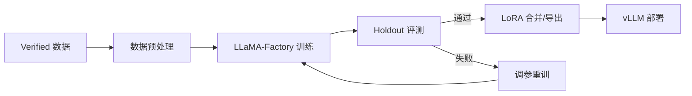

# 维度一·极寒防御·启动期·模型训练与部署

> [!NOTE] **[TRACEBACK] 实践锚点**
> - **本阶段策略**: [01_实践目标与策略](./01_实践目标与策略.md)
> - **数据采集**: [03_数据采集与预处理](./03_数据采集与预处理.md)
> - **L2 训练规划**: [维度一·03_训练与评测资产路径](../../../../02_战略维度/01_维度一_极寒防御/03_训练与评测资产路径.md)

---

## 一、训练总览

### 1.1 本阶段训练目标

| 模型 | 基座 | 微调方式 | 训练数据 | 目标指标 |
|---|---|---|---|---|
| 财务测谎 LoRA v1 | Qwen2.5-7B-Instruct | LoRA rank=16 | 1000+ Verified | Recall ≥ 0.95 |
| 大股东诚信 LoRA v1 | Qwen2.5-7B-Instruct | LoRA rank=16 | 800+ Verified | Recall ≥ 0.90 |
| 关联交易 LoRA v1 | Qwen2.5-7B-Instruct | LoRA rank=16 | 800+ Verified | Recall ≥ 0.85 |

### 1.2 训练流程



---

## 二、训练环境

### 2.1 硬件配置

```yaml
GPU: NVIDIA RTX 4090 24GB × 1
CPU: AMD Ryzen 9 7950X (16 核)
内存: 128GB DDR5
存储: 2TB NVMe SSD
```

### 2.2 软件环境

```bash
# 基础环境
conda create -n diting python=3.11
conda activate diting

# PyTorch + CUDA
pip install torch==2.2.0 --index-url https://download.pytorch.org/whl/cu121

# LLaMA-Factory
pip install llmtuner

# 其他依赖
pip install transformers==4.38.0
pip install peft==0.9.0
pip install datasets==2.16.0
pip install wandb  # 训练监控
```

### 2.3 模型下载

```bash
# 下载 Qwen2.5-7B-Instruct
huggingface-cli download Qwen/Qwen2.5-7B-Instruct \
  --local-dir models/Qwen2.5-7B-Instruct \
  --local-dir-use-symlinks False
```

---

## 三、数据预处理

### 3.1 数据格式转换

将 Verified JSONL 转换为 LLaMA-Factory 格式：

```python
# training/scripts/prepare_data.py

import json
from pathlib import Path

def convert_to_llama_factory_format(input_file: str, output_file: str):
    """转换为 LLaMA-Factory 格式"""
    data = []
    
    with open(input_file, 'r') as f:
        for line in f:
            item = json.loads(line)
            # LLaMA-Factory alpaca 格式
            data.append({
                "instruction": item["instruction"],
                "input": item["input"],
                "output": item["output"],
            })
    
    with open(output_file, 'w') as f:
        json.dump(data, f, ensure_ascii=False, indent=2)

# 三个引擎分别转换
convert_to_llama_factory_format(
    "training/data/verified/financial_fraud_verified.jsonl",
    "training/data/llama_factory/financial_fraud.json"
)
```

### 3.2 数据集划分

```python
# 80% 训练 / 10% 验证 / 10% 测试（不含 Holdout）
from sklearn.model_selection import train_test_split

train_val, test = train_test_split(data, test_size=0.1, random_state=42)
train, val = train_test_split(train_val, test_size=0.11, random_state=42)

# 保存
save_json(train, "training/data/llama_factory/financial_fraud_train.json")
save_json(val, "training/data/llama_factory/financial_fraud_val.json")
save_json(test, "training/data/llama_factory/financial_fraud_test.json")
```

---

## 四、LoRA 训练

### 4.1 训练配置

```yaml
# training/configs/financial_fraud_lora.yaml

### 模型配置
model_name_or_path: models/Qwen2.5-7B-Instruct
template: qwen

### LoRA 配置
finetuning_type: lora
lora_rank: 16
lora_alpha: 32
lora_dropout: 0.05
lora_target: all  # 所有线性层

### 数据配置
dataset: financial_fraud_train
val_dataset: financial_fraud_val
dataset_dir: training/data/llama_factory

### 训练配置
output_dir: output/financial_fraud_lora_v1
num_train_epochs: 3
per_device_train_batch_size: 4
gradient_accumulation_steps: 4
learning_rate: 2e-4
lr_scheduler_type: cosine
warmup_ratio: 0.1
fp16: true

### 评估配置
eval_strategy: steps
eval_steps: 100
save_strategy: steps
save_steps: 100
load_best_model_at_end: true

### 日志
logging_steps: 10
report_to: wandb
run_name: financial_fraud_lora_v1
```

### 4.2 训练命令

```bash
# 训练财务测谎 LoRA
llamafactory-cli train training/configs/financial_fraud_lora.yaml

# 训练大股东诚信 LoRA
llamafactory-cli train training/configs/shareholder_lora.yaml

# 训练关联交易 LoRA
llamafactory-cli train training/configs/related_party_lora.yaml
```

### 4.3 训练监控

```python
# 使用 WandB 监控
# 登录
wandb login

# 查看训练曲线
# - 访问 https://wandb.ai 查看 loss、learning rate、eval loss
# - 关注 eval_loss 是否收敛
```

### 4.4 常见问题与调参

| 问题 | 症状 | 解决方案 |
|---|---|---|
| 显存不足 | CUDA OOM | 降低 batch_size / 使用 gradient_checkpointing |
| 过拟合 | train_loss ↓ 但 eval_loss ↑ | 增加 dropout / 减少 epochs / 增加数据 |
| 欠拟合 | loss 不收敛 | 增加 learning_rate / 增加 epochs |
| 输出格式错误 | 输出非 JSON | 增加格式相关训练数据 / 在 Prompt 中强调格式 |

---

## 五、Holdout 评测

### 5.1 评测流程

```python
# training/scripts/evaluate_holdout.py

import json
from pathlib import Path
from sklearn.metrics import recall_score, precision_score, f1_score

def evaluate_on_holdout(model_path: str, holdout_dir: str, engine_name: str):
    """在 Holdout 上评测"""
    
    # 加载模型
    model = load_lora_model(model_path)
    
    # 加载 Holdout 案例
    cases = load_holdout_cases(holdout_dir, engine_name)
    
    # 推理
    predictions = []
    ground_truths = []
    
    for case in cases:
        pred = model.predict(case["input"])
        predictions.append(pred["decision"])
        ground_truths.append(case["ground_truth_decision"])
    
    # 计算指标
    # 将 decision 转换为二分类（reject/degrade 为正类，pass 为负类）
    y_true = [1 if d in ["reject", "degrade"] else 0 for d in ground_truths]
    y_pred = [1 if d in ["reject", "degrade"] else 0 for d in predictions]
    
    recall = recall_score(y_true, y_pred)
    precision = precision_score(y_true, y_pred)
    f1 = f1_score(y_true, y_pred)
    
    return {
        "engine": engine_name,
        "recall": recall,
        "precision": precision,
        "f1": f1,
        "num_cases": len(cases),
    }
```

### 5.2 评测标准

| 引擎 | Recall 阈值 | Precision 阈值 | F1 阈值 |
|---|---|---|---|
| 财务测谎 | ≥ 0.95 | ≥ 0.70 | ≥ 0.80 |
| 大股东诚信 | ≥ 0.90 | ≥ 0.70 | ≥ 0.78 |
| 关联交易 | ≥ 0.85 | ≥ 0.70 | ≥ 0.78 |

### 5.3 评测报告

```python
# 生成评测报告
def generate_eval_report(results: list[dict]) -> str:
    report = "# Holdout 评测报告\n\n"
    report += f"评测时间: {datetime.now()}\n\n"
    
    report += "## 指标汇总\n\n"
    report += "| 引擎 | Recall | Precision | F1 | 通过 |\n"
    report += "|---|---|---|---|---|\n"
    
    all_pass = True
    for r in results:
        passed = (
            r["recall"] >= THRESHOLDS[r["engine"]]["recall"] and
            r["precision"] >= THRESHOLDS[r["engine"]]["precision"]
        )
        if not passed:
            all_pass = False
        
        report += f"| {r['engine']} | {r['recall']:.2%} | {r['precision']:.2%} | {r['f1']:.2%} | {'✅' if passed else '❌'} |\n"
    
    report += f"\n## 总体结论: {'✅ 全部通过' if all_pass else '❌ 存在不达标'}\n"
    
    return report
```

---

## 六、模型导出与部署

### 6.1 LoRA 合并（可选）

```bash
# 将 LoRA 权重合并到基座模型（可选，vLLM 支持动态加载 LoRA）
llamafactory-cli export \
  --model_name_or_path models/Qwen2.5-7B-Instruct \
  --adapter_name_or_path output/financial_fraud_lora_v1 \
  --export_dir models/financial_fraud_merged \
  --export_size 4
```

### 6.2 vLLM 部署

```python
# vLLM 服务启动脚本
# deploy/scripts/start_vllm.sh

#!/bin/bash

python -m vllm.entrypoints.openai.api_server \
  --model models/Qwen2.5-7B-Instruct \
  --enable-lora \
  --lora-modules \
    financial_fraud_lora=output/financial_fraud_lora_v1 \
    shareholder_lora=output/shareholder_lora_v1 \
    related_party_lora=output/related_party_lora_v1 \
  --max-lora-rank 16 \
  --host 0.0.0.0 \
  --port 8000 \
  --gpu-memory-utilization 0.85
```

### 6.3 vLLM 客户端

```python
# cryo_guard/llm/vllm_client.py

from openai import OpenAI

class VLLMClient:
    def __init__(self, base_url: str = "http://localhost:8000/v1"):
        self.client = OpenAI(base_url=base_url, api_key="dummy")
        self.current_lora = None
    
    def load_lora(self, lora_name: str):
        """切换 LoRA"""
        self.current_lora = lora_name
    
    def chat(self, messages: list[dict], **kwargs) -> str:
        """调用 LLM"""
        response = self.client.chat.completions.create(
            model=self.current_lora or "Qwen2.5-7B-Instruct",
            messages=messages,
            **kwargs
        )
        return response.choices[0].message.content
```

### 6.4 K8s 部署配置

```yaml
# deploy/k3s/vllm-deployment.yaml

apiVersion: apps/v1
kind: Deployment
metadata:
  name: vllm
spec:
  replicas: 1
  selector:
    matchLabels:
      app: vllm
  template:
    metadata:
      labels:
        app: vllm
    spec:
      containers:
      - name: vllm
        image: vllm/vllm-openai:latest
        command:
        - python
        - -m
        - vllm.entrypoints.openai.api_server
        - --model
        - /models/Qwen2.5-7B-Instruct
        - --enable-lora
        - --lora-modules
        - financial_fraud_lora=/loras/financial_fraud_lora_v1
        - shareholder_lora=/loras/shareholder_lora_v1
        - related_party_lora=/loras/related_party_lora_v1
        - --max-lora-rank
        - "16"
        - --gpu-memory-utilization
        - "0.85"
        resources:
          limits:
            nvidia.com/gpu: 1
        volumeMounts:
        - name: models
          mountPath: /models
        - name: loras
          mountPath: /loras
      volumes:
      - name: models
        hostPath:
          path: /data/models
      - name: loras
        hostPath:
          path: /data/loras
---
apiVersion: v1
kind: Service
metadata:
  name: vllm
spec:
  selector:
    app: vllm
  ports:
  - port: 8000
    targetPort: 8000
```

---

## 七、CI/CD 集成

### 7.1 训练 CI

```yaml
# .github/workflows/train.yml

name: Train LoRA

on:
  workflow_dispatch:
    inputs:
      engine:
        description: 'Engine to train'
        required: true
        default: 'financial_fraud'
        type: choice
        options:
        - financial_fraud
        - shareholder
        - related_party

jobs:
  train:
    runs-on: self-hosted  # 需要 GPU
    steps:
    - uses: actions/checkout@v4
    
    - name: Train LoRA
      run: |
        llamafactory-cli train training/configs/${{ inputs.engine }}_lora.yaml
    
    - name: Evaluate on Holdout
      run: |
        python training/scripts/evaluate_holdout.py \
          --model output/${{ inputs.engine }}_lora_v1 \
          --engine ${{ inputs.engine }}
    
    - name: Upload Artifacts
      uses: actions/upload-artifact@v4
      with:
        name: lora-${{ inputs.engine }}
        path: output/${{ inputs.engine }}_lora_v1/
```

### 7.2 Holdout 守门

```yaml
# .github/workflows/holdout_gate.yml

name: Holdout Gate

on:
  pull_request:
    paths:
    - 'output/**'  # LoRA 变更时触发

jobs:
  evaluate:
    runs-on: self-hosted
    steps:
    - name: Evaluate All Engines
      run: |
        for engine in financial_fraud shareholder related_party; do
          python training/scripts/evaluate_holdout.py --engine $engine
        done
    
    - name: Check Pass
      run: |
        python training/scripts/check_holdout_pass.py
        # 任意引擎不达标 → exit 1 → Block PR
```

---

## 八、训练任务清单

| # | 任务 | step 锚（维内 · 粗对齐） | 产出 | 验收 |
|---|---|---|---|---|
| 1 | 数据预处理 | step_04② | 3 个 JSON 数据集 | 格式正确 |
| 2 | 训练环境搭建 | step_04① | conda 环境 + LLaMA-Factory | 可运行 |
| 3 | 财务测谎 LoRA 训练 | step_04～05 | LoRA v1 | loss 收敛 |
| 4 | 财务测谎 Holdout 评测 | step_05 | Recall ≥ 0.95 | 通过 |
| 5 | 大股东诚信 LoRA 训练 | step_05～06 | LoRA v1 | loss 收敛 |
| 6 | 大股东诚信 Holdout 评测 | step_06 | Recall ≥ 0.90 | 通过 |
| 7 | 关联交易 LoRA 训练 | step_06 | LoRA v1 | loss 收敛 |
| 8 | 关联交易 Holdout 评测 | step_06 | Recall ≥ 0.85 | 通过 |
| 9 | vLLM 部署 | step_07～08 | 3 LoRA 热加载 | API 可调用 |

---

## 修订记录

| 日期 | 内容 |
|---|---|
| 2026-05-16 | 初版，覆盖训练环境、LoRA 训练、Holdout 评测、vLLM 部署 |
