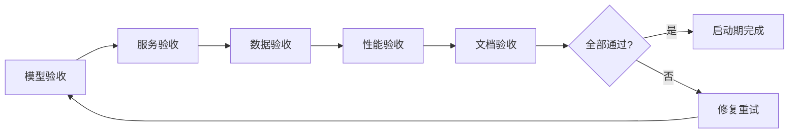

# 维度一·极寒防御·启动期·验收标准与检查清单

> [!NOTE] **[TRACEBACK] 实践锚点**
> - **本阶段策略**: [01_实践目标与策略](./01_实践目标与策略.md)
> - **L2 验证规范**: [维度一·stage_1·验证与守门](../../../../02_战略维度/01_维度一_极寒防御/stages/stage_1_启动期/03_本阶段验证与守门.md)
> - **L5 验收**: [05_成功标识与验证](../../../../05_成功标识与验证/)

---

## 一、验收总览

### 1.1 验收分类

| 类型 | 内容 | 验收方式 | 优先级 |
|---|---|---|---|
| **模型验收** | 3 LoRA 在 Holdout 上达标 | 自动化评测脚本 | P0 |
| **服务验收** | 3 引擎 + decision_gate 可用 | API 测试 + 健康检查 | P0 |
| **数据验收** | 50 Holdout + 2600 Verified | 数量 + 质量检查 | P0 |
| **文档验收** | 5 份实践文档完整 | 人工审查 | P1 |
| **性能验收** | 响应时间 + 可用性 | 压测 + 监控 | P1 |

### 1.2 验收流程



---

## 二、模型验收标准

### 2.1 Holdout 评测指标

| 引擎 | Recall | Precision | F1 | 案例数 |
|---|---|---|---|---|
| 财务测谎 | ≥ 0.95 | ≥ 0.70 | ≥ 0.80 | 30 |
| 大股东诚信 | ≥ 0.90 | ≥ 0.70 | ≥ 0.78 | 10 |
| 关联交易 | ≥ 0.85 | ≥ 0.70 | ≥ 0.78 | 10 |
| **综合** | **≥ 0.90** | **≥ 0.70** | **≥ 0.78** | **50** |

### 2.2 评测命令

```bash
# 运行 Holdout 评测
python training/scripts/evaluate_holdout.py \
  --holdout-dir training/data/holdout/ \
  --output-dir output/eval_reports/

# 检查结果
cat output/eval_reports/holdout_report.json
```

### 2.3 评测报告示例

```json
{
  "timestamp": "2026-05-16T10:00:00Z",
  "engines": [
    {
      "name": "financial_fraud",
      "recall": 0.967,
      "precision": 0.744,
      "f1": 0.841,
      "num_cases": 30,
      "passed": true
    },
    {
      "name": "shareholder_integrity",
      "recall": 0.900,
      "precision": 0.750,
      "f1": 0.818,
      "num_cases": 10,
      "passed": true
    },
    {
      "name": "related_party",
      "recall": 0.900,
      "precision": 0.720,
      "f1": 0.800,
      "num_cases": 10,
      "passed": true
    }
  ],
  "overall": {
    "recall": 0.940,
    "precision": 0.740,
    "f1": 0.828,
    "passed": true
  }
}
```

### 2.4 失败处理

| 情况 | 处理方式 |
|---|---|
| 单引擎 Recall 不达标 | 增加训练数据 / 调整 LoRA rank / 增加训练轮数 |
| 单引擎 Precision 过低 | 检查数据质量 / 增加负样本 / 调整阈值 |
| 多引擎不达标 | 检查数据采集 / 检查 Teacher 蒸馏质量 |

---

## 三、服务验收标准

### 3.1 服务可用性

| 服务 | 健康检查 | 期望状态 |
|---|---|---|
| cryo-guard | GET /health | `status: healthy` |
| vllm | GET /health | `status: healthy` |
| milvus | gRPC 连接检查 | 可连接 |
| neo4j | Bolt 连接检查 | 可连接 |

### 3.2 API 功能测试

```bash
# 测试 decision_gate
curl -X POST http://localhost:8080/api/decision-gate/check \
  -H "Content-Type: application/json" \
  -d '{
    "symbol": "000001",
    "name": "平安银行",
    "context": {"financial_report": {...}}
  }'

# 期望响应
{
  "decision": "pass",
  "audit_id": "xxx",
  "engine_results": [...]
}
```

### 3.3 服务测试脚本

```python
# tests/integration/test_services.py

import pytest
import requests

class TestCryoGuardServices:
    BASE_URL = "http://localhost:8080"
    
    def test_health_check(self):
        resp = requests.get(f"{self.BASE_URL}/health")
        assert resp.status_code == 200
        data = resp.json()
        assert data["status"] == "healthy"
        assert data["engines"]["financial_fraud"] == "up"
        assert data["engines"]["shareholder_integrity"] == "up"
        assert data["engines"]["related_party"] == "up"
    
    def test_decision_gate_pass(self):
        """测试正常公司应该 pass"""
        resp = requests.post(
            f"{self.BASE_URL}/api/decision-gate/check",
            json={
                "symbol": "600519",
                "name": "贵州茅台",
                "context": {"financial_report": load_test_data("maotai_2023")}
            }
        )
        assert resp.status_code == 200
        assert resp.json()["decision"] == "pass"
    
    def test_decision_gate_reject(self):
        """测试暴雷公司应该 reject"""
        resp = requests.post(
            f"{self.BASE_URL}/api/decision-gate/check",
            json={
                "symbol": "002450",
                "name": "康得新",
                "context": {"financial_report": load_test_data("kangdexin_2018")}
            }
        )
        assert resp.status_code == 200
        assert resp.json()["decision"] == "reject"
    
    def test_audit_log_created(self):
        """测试审计日志生成"""
        # 先调用 decision_gate
        resp = requests.post(...)
        audit_id = resp.json()["audit_id"]
        
        # 查询审计日志
        log_resp = requests.get(
            f"{self.BASE_URL}/api/audit/logs/{audit_id}"
        )
        assert log_resp.status_code == 200
        assert log_resp.json()["audit_id"] == audit_id
```

### 3.4 服务验收检查清单

- [ ] cryo-guard Pod 状态 Running
- [ ] vllm Pod 状态 Running
- [ ] milvus Pod 状态 Running
- [ ] neo4j Pod 状态 Running
- [ ] /health 返回 healthy
- [ ] /api/decision-gate/check 可调用
- [ ] /api/engines/financial_fraud/analyze 可调用
- [ ] /api/engines/shareholder_integrity/analyze 可调用
- [ ] /api/engines/related_party/analyze 可调用
- [ ] /api/audit/logs 可查询

---

## 四、数据验收标准

### 4.1 Holdout 数据

| 检查项 | 标准 | 验收方式 |
|---|---|---|
| 案例数量 | 50 案例 | `ls training/data/holdout/*.json | wc -l` |
| 引擎分布 | 30 财务测谎 + 10 大股东 + 10 关联交易 | 统计 target_engine 字段 |
| 标注完整性 | 每案例含 ground_truth_decision + evidence | Schema 校验 |
| 不含训练数据 | Holdout symbol ∉ 训练数据 | 交叉检查 |

### 4.2 Verified 数据

| 检查项 | 标准 | 验收方式 |
|---|---|---|
| 财务测谎 | ≥ 1000 条 Verified | `wc -l` |
| 大股东诚信 | ≥ 800 条 Verified | `wc -l` |
| 关联交易 | ≥ 800 条 Verified | `wc -l` |
| JSON 格式 | 所有 output 可 parse | Schema 校验 |
| verifier 填写 | 每条有 verifier | 字段检查 |

### 4.3 数据质量检查脚本

```python
# training/scripts/validate_data.py

def validate_holdout():
    """验证 Holdout 数据"""
    holdout_dir = Path("training/data/holdout/")
    cases = list(holdout_dir.glob("*.json"))
    
    assert len(cases) >= 50, f"Holdout 案例不足: {len(cases)}"
    
    engine_counts = {"financial_fraud": 0, "shareholder": 0, "related_party": 0}
    for case_file in cases:
        case = json.loads(case_file.read_text())
        # Schema 校验
        HoldoutCase.model_validate(case)
        engine_counts[case["target_engine"]] += 1
    
    assert engine_counts["financial_fraud"] >= 30
    assert engine_counts["shareholder"] >= 10
    assert engine_counts["related_party"] >= 10
    
    print("✅ Holdout 验证通过")

def validate_verified():
    """验证 Verified 数据"""
    for engine, min_count in [
        ("financial_fraud", 1000),
        ("shareholder", 800),
        ("related_party", 800),
    ]:
        verified_file = f"training/data/verified/{engine}_verified.jsonl"
        count = sum(1 for _ in open(verified_file))
        assert count >= min_count, f"{engine} Verified 不足: {count} < {min_count}"
        
        # 校验每条数据
        for line in open(verified_file):
            item = json.loads(line)
            assert item.get("verified") == True
            assert item.get("verifier")
            # 校验 output 可 parse
            output = json.loads(item["output"])
            assert "risk_score" in output
            assert "decision" in output
    
    print("✅ Verified 验证通过")
```

---

## 五、性能验收标准

### 5.1 响应时间

| API | P95 响应时间 | 验收方式 |
|---|---|---|
| /api/decision-gate/check | < 5s | 压测 100 请求 |
| /api/engines/*/analyze | < 3s | 压测 100 请求 |

### 5.2 可用性

| 指标 | 标准 | 验收方式 |
|---|---|---|
| 单日可用性 | ≥ 99.5% | Prometheus 监控 |
| 错误率 | < 0.5% | 日志分析 |

### 5.3 压测命令

```bash
# 使用 hey 进行压测
hey -n 100 -c 10 \
  -m POST \
  -H "Content-Type: application/json" \
  -D test_request.json \
  http://localhost:8080/api/decision-gate/check

# 期望结果
# Summary:
#   ...
#   Slowest: 4.xxx secs
#   Fastest: 1.xxx secs
#   Average: 2.xxx secs
#   Requests/sec: 3.xxx
#   
#   Response time histogram:
#   ...
#
#   Latency distribution:
#     ...
#     95% in 4.xxx secs  # 应 < 5s
```

---

## 六、文档验收标准

### 6.1 文档清单

| 文档 | 必须包含 | 验收方式 |
|---|---|---|
| 01_实践目标与策略.md | 目标/策略/路径/风险/边界 | 人工审查 |
| 02_技术方案与代码架构.md | 技术选型/代码结构/API/部署 | 人工审查 |
| 03_数据采集与预处理.md | 数据清单/采集脚本/Holdout/蒸馏 | 人工审查 |
| 04_模型训练与部署.md | 训练配置/评测/部署 | 人工审查 |
| 05_验收标准与检查清单.md | 验收标准/检查清单 | 人工审查 |

### 6.2 文档检查清单

- [ ] 所有文档含 TRACEBACK 追溯锚点
- [ ] 代码示例可复制执行
- [ ] 命令行示例可直接运行
- [ ] 链接无断链
- [ ] 表格格式正确
- [ ] Mermaid 图可渲染

---

## 七、综合验收检查清单

### 7.1 P0 必须项（阻断发布）

- [ ] **模型**：3 LoRA Holdout 评测全部通过
  - [ ] 财务测谎 Recall ≥ 0.95, Precision ≥ 0.70
  - [ ] 大股东诚信 Recall ≥ 0.90, Precision ≥ 0.70
  - [ ] 关联交易 Recall ≥ 0.85, Precision ≥ 0.70
- [ ] **服务**：4 个服务全部 Running
  - [ ] cryo-guard Running
  - [ ] vllm Running
  - [ ] milvus Running
  - [ ] neo4j Running
- [ ] **API**：decision_gate 可正确聚合
  - [ ] 正常公司 → pass
  - [ ] 暴雷公司 → reject
- [ ] **数据**：Holdout 50 案例 + Verified 2600 条
- [ ] **审计**：审计日志可查

### 7.2 P1 应完成项（不阻断，需跟进）

- [ ] 响应时间 P95 < 5s
- [ ] 可用性 ≥ 99.5%
- [ ] 文档 5 份完整
- [ ] 代码测试覆盖率 ≥ 80%

### 7.3 验收签署

| 角色 | 签字 | 日期 |
|---|---|---|
| 架构师 | __________ | __________ |
| 开发负责人 | __________ | __________ |
| 测试负责人 | __________ | __________ |

---

## 八、进阶条件

### 8.1 启动期 → 扩展期

满足以下条件可进入扩展期：

| 条件 | 指标 |
|---|---|
| 3 P0 引擎上线 | 全部 Running |
| Holdout 达标 | 综合 Recall ≥ 0.90, Precision ≥ 0.70 |
| decision_gate 漏判 | = 0 |
| 架构师验收 | ✅ |

### 8.2 扩展期预告

| 新增内容 | 说明 |
|---|---|
| 4 P1 引擎 | 商誉减值 / 质押爆仓 / 审计师问询 / 关键人离职 |
| DPO | 偏好对齐，降低过敏 |
| 多 LoRA | 行业细分 LoRA |
| reject_quota | reject 配额管理 |
| 5 维认知边界 | 完整边界检查 |

---

## 修订记录

| 日期 | 内容 |
|---|---|
| 2026-05-16 | 初版，覆盖模型/服务/数据/性能/文档验收 |
