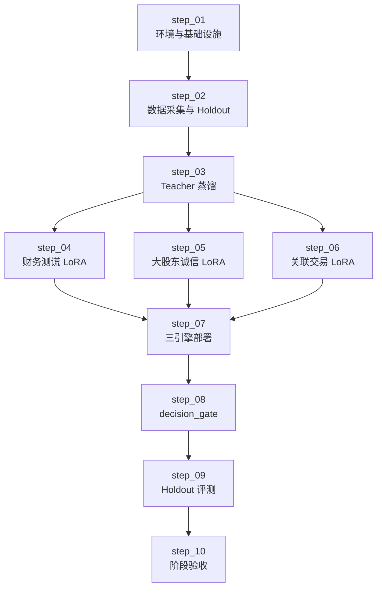

# 维度一·极寒防御·启动期

> [!NOTE] **[TRACEBACK] 追溯锚点**
> - **L2 战略规划**: [维度一·stage_1_启动期](../../../../02_战略维度/01_维度一_极寒防御/stages/stage_1_启动期/README.md)
> - **本维度 L3 设计**: [维度一_极寒防御/README](../../README.md)
> - **L1 哲学基石**: ⑤防御（一票否决）
> - **本阶段总览**: [stages/README](../README.md)

> **[上架与环境（共通）]** **阿里云 ECS + K3s · Helm · ACR · `diting-infra`→`deploy-engine`**。参见 [16](../../../_共享规约/16_阿里云ECS_K3s_ACR_Helm部署与deploy-engine链路.md)；**执行索引**：[steps/README](./steps/README.md)。

---

## 一、阶段定位

| 项 | 值 |
|---|---|
| **阶段** | 启动期（Stage 1）|
| **时段** | 0-3 月 |
| **核心目标** | 3 P0 引擎 + decision_gate 实现"任何对外输出必须先过防御门禁"的最小闭环 |
| **成功标准** | 50 案例 Holdout：Recall ≥ 0.90、Precision ≥ 0.70、漏判 = 0 |

---

## 二、实践设计文档（设计层 · 5 份）

| # | 文档 | 内容 | 状态 |
|---|---|---|---|
| 01 | [01_实践目标与策略.md](./01_实践目标与策略.md) | 目标、策略、路径、风险、边界 | ✅ |
| 02 | [02_技术方案与代码架构.md](./02_技术方案与代码架构.md) | 技术选型、代码结构、API、部署 | ✅ |
| 03 | [03_数据采集与预处理.md](./03_数据采集与预处理.md) | 数据清单、采集脚本、Holdout、蒸馏 | ✅ |
| 04 | [04_模型训练与部署.md](./04_模型训练与部署.md) | 训练配置、评测、vLLM 部署 | ✅ |
| 05 | [05_验收标准与检查清单.md](./05_验收标准与检查清单.md) | 验收指标、检查项、签署 | ✅ |

## 二·补 可执行步骤文档（执行层 · 10 份）⭐

> **2026-05-16 新增**：把上面 5 份「设计层」文档拆解为 **10 份按 `step_01`～`step_10` 序号编排的可执行步骤**（日历与跨维映射见共享规约 [14](../../../_共享规约/14_六维度启动期统一节奏表.md) **§九**），供 Cursor 在 `diting-src` 顺序开发与回写 L4。

**索引**：[steps/README.md](./steps/README.md)（10 个 step + 决策契约 + L4 回写预期）
**总量**：9,835 行可执行文档

---

## 三、交付物清单

| 交付物 | 描述 | 验收方式 |
|---|---|---|
| 财务测谎 LoRA v1 | Qwen2.5-7B + LoRA rank=16 | Holdout Recall ≥ 0.95 |
| 大股东诚信 LoRA v1 | Qwen2.5-7B + LoRA rank=16 | Holdout Recall ≥ 0.90 |
| 关联交易 LoRA v1 | Qwen2.5-7B + LoRA rank=16 | Holdout Recall ≥ 0.85 |
| cryo-guard 服务 | 3 引擎 + decision_gate | K8s Running |
| 50 案例 Holdout | 永久锁库 | 标注完成 |
| 审计日志表 | cryo_guard.audit_log | 每次判决可查 |

---

## 四、实施路径（step 序号权威）

若需甘特图或日历对齐，由产品另行维护；**L3 执行与 L4 回写仅以 `steps/README.md` 序号为准**。

---

## 五、外部依赖

| 依赖维度 | 必须就绪的能力 | 用途 |
|---|---|---|
| 维度五·演进飞轮 | Teacher LLM 蒸馏 + LLaMA-Factory | 引擎微调 |
| 平台与产品 | K3s + vLLM + Milvus + Neo4j | 基础设施 |

---

## 六、进阶条件

满足以下条件可进入扩展期：

- [ ] 3 P0 引擎全部 Running
- [ ] Holdout 综合 Recall ≥ 0.90、Precision ≥ 0.70
- [ ] decision_gate 漏判高风险 = 0
- [ ] 架构师验收签字

---

## 修订记录

| 日期 | 内容 |
|---|---|
| 2026-05-16 | 重构为 5 份实践设计文档体系 |
| 2026-05-17 | §四 改为 step 依赖图；去除「按周」叙事；指向 **14_ §九** |
