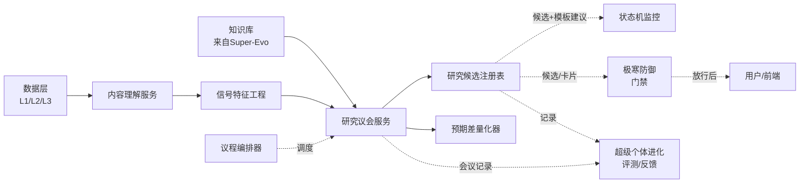

# L3 · 纵深进攻 · 目标与边界设计

> [!NOTE] **[TRACEBACK]**
> - **顶层概念**：[项目定义与核心价值](../../01_顶层概念/01_项目定义与核心价值.md)
> - **战略主轴**：[L2 §纵深进攻](../../02_战略维度/00_双目标与战略维度关系.md)
> - **同模块**：[纵深进攻/README](./README.md)
> - **总纲**：[四大模块抽象总纲 §3.2](../00_四大模块抽象总纲.md#32-纵深进攻deep-strike)
> - **DNA**：`_System_DNA/deep_strike/`、`global_const.deep_strike`

> [!IMPORTANT] **验证后资源释放（全模块强制）**
> 凡本文档涉及或引用的 **本地/联调验证**（单测、集成测、`docker compose`、前后端 dev server、`uvicorn`、临时 worker 等），在 **测试结论已确认并完成准出/实践记录** 后，须 **停止相关进程并释放资源**。检查项与示例命令见 [_共享规约/17_L3设计文档_验证后资源释放规约.md](../_共享规约/17_L3设计文档_验证后资源释放规约.md)。

## 一、目标

承接 L1 §"认识论套利工程化"——把高维碎片信息**压缩为有解释、有证据、有失败兜底的研究结论**，做到：

1. **看得早**：在市场共识形成前发现结构性变化
2. **看得深**：从碎片文本还原产业与公司真实状态
3. **可解释**：每一条结论可追溯到原始证据 + 推理路径 + 模型版本
4. **可降级**：议会失败时有规则路径兜底

## 二、本模块的"做"与"不做"

### 做什么

| 能力 | 说明 |
|------|------|
| 内容理解 | 实体抽取、事件抽取、主营对齐、产业链关联、时间线构建 |
| 信号特征工程 | 数值 / 语义 / 嵌入 / 图特征；批 + 流双管道 |
| 议会推理 | MoE / Agent / Tool Calling 编排；多视角研究；跨源拼图 |
| 议程编排 | 每日 / 每周 / 触发式议程；议会议题排程 |
| 候选生成 | **研究候选**（非交易候选），含状态机模板建议 |
| 预期差度量 | 与市场共识的差异度量 + 动量折现 |
| 解释与证据链 | 每条结论可被回放、可被审计 |

### 不做什么

| 能力 | 归属 | 原因 |
|------|------|------|
| 决策门禁 | [极寒防御](../极寒防御/README.md) | 议会只产出，门禁负责"是否放行"；议会须把候选 / 卡片提交极寒防御才能对外可见 |
| 状态机注册与持续监控 | [状态机监控](../状态机监控/README.md) | 议会附带"建议状态机模板"，但不维护实例 |
| 评测 / 反馈采集 / 模型再训练 | [超级个体进化](../超级个体进化/README.md) | 议会只产生数据；进化模块负责回播、打分、反哺 |
| 直接调外部 API（下单 / 通知 / 工单） | [超级个体进化 § external_action_boundary](../超级个体进化/README.md) | 任何外部动作必经进化模块边界 + 极寒防御门禁 |

## 三、与其它模块的接口边界

### 输入契约

| 输入 | 数据类型 | 来源 |
|------|---------|------|
| L1 行情 / 事件索引 / 状态缓存 | 见 [11_数据采集](../_共享规约/11_数据采集与输入层规约.md) | 数据层 |
| L2 新闻 / 公告 / 行业 / 主营构成 / 知识片段 / 特征 | 同上 | 数据层 |
| L3 原始文件 / 评测集 / 快照 | 同上 | 数据层（仅按需） |
| 知识库条目 + RAG 索引 | `KnowledgeEntry` | [超级个体进化](../超级个体进化/README.md) |
| 历史评测反馈 | `EvalFeedback` | [超级个体进化](../超级个体进化/README.md) |
| 用户主动议题 | `AgendaTopicSubmit` | [前端 § 投研对话台](../前端工程与服务/README.md) |

### 输出契约

| 输出 | 数据类型 | 消费方 |
|------|---------|--------|
| 研究卡片 | `ResearchCard { id, subject, conclusion, evidence_chain, applicable_period, confidence }` | 极寒防御（门禁）→ 前端 + 状态机监控 + 超级个体进化 |
| 研究候选 | `Candidate { id, subject, kind, priority, suggested_state_machine_template, ... }` | 同上 |
| 议会会议记录 | `CouncilSession { id, topic, agents, votes, dissent, consensus, transcript_ref }` | 超级个体进化（回放、评测、知识沉淀） |
| 预期差度量 | `ExpectationGap { subject, market_consensus, our_view, gap_score, momentum_decay }` | 议会内部 + 候选注册表 |

## 四、模块准出标准

| 验收项 | 验收方式 |
|--------|---------|
| 单议题端到端延迟（小议程）< 30s（含工具调用） | 压测；P50 < 30s，P99 < 120s |
| 议会输出 100% 可回放 | 任意 `CouncilSession.id` 可还原原始上下文 + 工具调用轨迹 |
| 证据链覆盖率 100% | 任意 `ResearchCard` 的 `evidence_chain` 字段非空且全部可解析 |
| 失败兜底覆盖率 ≥ 95% | 议会失败时有规则路径输出降级结论 |
| 与基线评测集差异可衡量 | 每周自动跑评测集 → 报告至超级个体进化 |
| 工具调用可追踪 | 所有工具调用（检索 / 计算 / 第三方 API）记录耗时、结果、失败原因 |

## 五、关键设计取舍

1. **议会服务不直接调用第三方业务 API**：所有外部 API 统一通过 [05_接口抽象层](../_共享规约/05_接口抽象层规约.md) 的 Port，且任何"会改变外界状态"的调用必经 [超级个体进化 § external_action_boundary](../超级个体进化/README.md)（议会不做这种调用）
2. **研究候选 ≠ 交易候选**：候选只是"值得关注的对象"；是否成为交易动作由用户决定
3. **特征工程批 + 流分离**：批用于全市场扫描 / 离线评测；流用于实时议程触发
4. **议程优先级**：用户实时议题 > 触发式议程（如重大事件）> 周期性议程
5. **议会输出必须自带 `confidence`**：低置信度议题自动转人审或附"不确定性说明"
6. **预期差度量取舍**：不预测价格走向；只度量"我们与共识的差异"
7. **[L-α] 物理证伪 ≥ 财务证伪**：进攻类逻辑链**必须**可映射到物理量探针（产能利用率 / 海关 HS Code / 招标合同金额 / 能源消耗）；纯财报数字驱动的逻辑链置信度上限 0.55；详见 L1 §6.3 + L2 §8A.2 The Critic 物理证伪门禁
8. **[L-α] 大盘组装厂排雷**：营收 ≥ 1000 亿 且 题材业务增量贡献 < 5% 的标的，**强制拒绝**该题材推荐（基石⑥ ❌ 哲学边界第 5 行）；详见 L2 §8A.3 P03 + DNA Y02 elasticity_gate.yaml
9. **[L-α] 异构 AI 调度强制走 dispatcher**：所有大模型/小模型调用必须通过 `AIDispatcher.call()`（共享规约 19 SDK1）；禁止业务代码直连 openai/qwen API
10. **[L-α] no-auto-execute 永久规则**：PRD §5 描述的"QMT 自动建仓/加仓/清仓"在 diting 中**永久禁止**；SP5 / SP3 / Timer / 物理探针告警**仅产 advice**，最终扳机在人；详见 D4 step_05 §11 PRD §5 永久翻译契约

## 六、与共享规约的对齐

| 共享规约 | 对齐点 |
|---------|--------|
| [01_核心公式与MoE架构](../_共享规约/01_核心公式与MoE架构规约.md) | 三段式主链中的"信号段 + 研究段" |
| [04_全链路通信协议](../_共享规约/04_全链路通信协议矩阵.md) | Research Protocol（必带 `request_id` / `session_id` / `source_ref` / `schema_version`） |
| [05_接口抽象层](../_共享规约/05_接口抽象层规约.md) | Inference Gateway Port、Research Workflow Port、Data Source Port、Runtime Sandbox Port |
| [07_数据版本控制](../_共享规约/07_数据版本控制规约.md) | 评测集 / 知识库 / 模型版本回放 |
| [11_数据采集与输入层](../_共享规约/11_数据采集与输入层规约.md) | L1 / L2 / L3 输入契约 |
| **[L-α]** [18_动态采集流水线](../_共享规约/18_动态采集流水线规约.md) | 主动嗅探 + 监控字典消费 + 物理量探针 Kafka/Redis 共享通道 |
| **[L-α]** [19_异构 AI 调度栈](../_共享规约/19_异构AI调度栈规约.md) | The Scorer/Critic/Mapper/Architect/Timer + ETL LLM Engine 路由 |
| **[L-α]** [20_监控字典](../_共享规约/20_监控字典规约.md) | The Architect 生产端 + D3 P5/P6/P7 消费端共享 schema |
