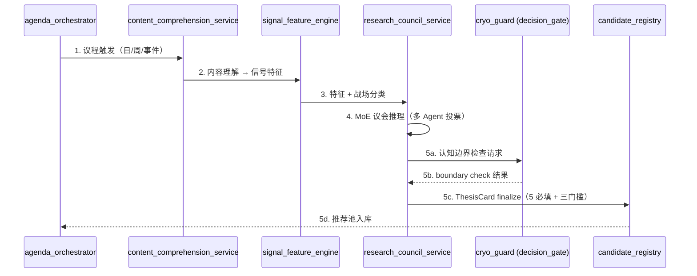

# L3·纵深进攻·06·L2 落地清单（与维度二全量对齐）

> [!NOTE] **[TRACEBACK] 原子规约锚点**
> - **本模块抽象**: [00_四大模块抽象总纲 §3.2](../00_四大模块抽象总纲.md#32-纵深进攻deep-strike)
> - **本模块设计 1-5**: [01_目标与边界](./01_目标与边界_设计.md) / [02_后端服务子模块](./02_后端服务子模块_设计.md) / [03_接口契约](./03_接口契约_设计.md) / [04_数据契约](./04_数据契约_设计.md) / [05_实施推演](./05_实施推演_设计.md)
> - **L2 维度二对齐**: [维度二·纵深进攻](../../02_战略维度/02_维度二_纵深进攻/README.md)
> - **L2 实践策略**: [04_进攻实践策略规划](../../02_战略维度/02_维度二_纵深进攻/04_进攻实践策略规划.md)
> - **L1 哲学基石**: ⑥进攻 + ②工程化（5 必填）+ ③时间边界

> [!IMPORTANT] **验证后资源释放（全模块强制）**
> 凡本文档涉及或引用的 **本地/联调验证**（单测、集成测、`docker compose`、前后端 dev server、`uvicorn`、临时 worker 等），在 **测试结论已确认并完成准出/实践记录** 后，须 **停止相关进程并释放资源**。检查项与示例命令见 [_共享规约/17_L3设计文档_验证后资源释放规约.md](../_共享规约/17_L3设计文档_验证后资源释放规约.md)。


## 一、本文档的位置

本文档把维度二最新设计的 **5 必填元素 thesis 卡 / 三门槛 / 5 步生成工作流 / 战场×thesis 类型矩阵 / 与维度一 PassEvent 集成 / 进攻失败 G/H 归因** 等全部能力落地到 L3 deep_strike 服务实现规约。

## 二、L2 能力 → deep_strike 服务映射

| L2 能力 | 主责服务 | 协责服务 |
|---|---|---|
| **5 必填元素 thesis 卡生成** | `research_council_service` | `candidate_registry` |
| **三门槛检查（conf 0.70/payoff 2.0/win_rate 0.55）** | `decision_gate`（cryo_guard）| `research_council_service` |
| **逻辑链节点 + SLI 探针注册** | `research_council_service` | state_watch `state_machine_registry` |
| **5 步 thesis 生成工作流** | `agenda_orchestrator` | `research_council_service` |
| **战场 × thesis 类型映射** | `signal_feature_engine` | `research_council_service` |
| **认知边界检查集成** | `decision_gate`（cryo_guard 调用）| `research_council_service` |
| **利润截留首引擎**（P0）| `signal_feature_engine` + `research_council_service` | — |
| **进攻失败 G/H 归因** | super_evo `eval_replay_service` | invalidation_auditor |
| **[L-α] P01·The Sniffer 主动嗅探层**（PRD §2.1+§2.2）| `theme_sniffer_service`（新）| `crawl_orchestrator`（共享规约 18）|
| **[L-α] P04·The Scorer 三维评分**（PRD §2.3 政策/产业空间/A股映射度）| `confidence_scorer_service`（扩 SnifferScoreProvider）| `ai_dispatcher`（共享规约 19）|
| **[L-α] P02·The Critic 物理证伪门禁**（PRD §3 阶段一）| `the_critic_service`（新）| `evidence_chain_builder`（step_03）|
| **[L-α] P03·The Mapper 业绩弹性闸门**（PRD §3 阶段二）| `the_mapper_service`（扩 utility_intercept_playbook）| `financial_data_service` |
| **[L-α] The Architect 监控字典生成**（PRD §3 阶段三）| `the_architect_service`（新）| `ai_dispatcher` + `monitor_dict_writer`（共享规约 20）|
| **[L-α] The Timer 三段时间窗口**（PRD §3 阶段四）| `thesis_card_generator_service`（扩 the_timer engine）| `ai_dispatcher` + `a_share_calendar_service` |

## 三、5 必填元素 thesis 卡 schema（核心实现规约）

### 3.1 完整 schema（补充 04_数据契约）

```python
@dataclass
class ThesisCard:
    # 标识
    thesis_card_id: str           # T-YYYY-MM-DD-001
    generated_at: datetime
    generated_by: str             # research_council_session_id
    
    # 标的
    symbol: str
    name: str
    industry: str
    
    # ===== 5 必填元素（缺一退回事件源 + 告警）=====
    
    # 元素 1: 逻辑链节点
    logic_chain:
        nodes: list[LogicNode]    # ≥ 3 个
        strong_constraint_count: int  # ≥ 1
        node_weights_sum: float   # 必须 = 1.0
    
    # 元素 2: SLI 探针映射
    sli_probes:
        - node_id: str
          probe_type: enum        # financial | news | price | event
          probe_config: dict
          check_freq: enum
    
    # 元素 3: 战场窗口期
    battlefield: enum             # short | main | mid | long
    window_days: int
    
    # 元素 4: 收益门槛 + 价格
    min_return_threshold: float   # 与战场最低门槛一致
    target_price: float
    stop_loss_price: float        # 仅参考，非硬约束
    
    # 元素 5: 认知边界检查
    cognitive_boundary_check:
        passed: bool
        check_event_ref: str      # 引用 cryo_guard 的 check ID
        dimensions: dict          # 5 维结果
    
    # ===== 三门槛量化（必须满足 ALL）=====
    quantitative_metrics:
        confidence: float         # ≥ 0.70
        expected_payoff_ratio: float  # ≥ 2.0
        historical_win_rate: float    # ≥ 0.55
        all_passed: bool          # 严格检查
    
    # ===== 与维度一的关联 =====
    defense_check_event_ref: str  # cryo_guard PassEvent ID
    defense_check_passed_at: datetime
    
    # 元数据
    status: enum                  # generated | passed_to_pool | accepted | rejected | expired
    expires_at: datetime          # 自动过期（如战场窗口期 50%）
```

### 3.2 SQL Schema

```sql
CREATE TABLE thesis_cards (
    thesis_card_id TEXT PRIMARY KEY,
    generated_at DATETIME NOT NULL,
    symbol TEXT NOT NULL,
    name TEXT,
    industry TEXT,
    
    -- 5 必填元素（JSON 存储）
    logic_chain JSON NOT NULL,
    sli_probes JSON NOT NULL,
    battlefield TEXT NOT NULL,
    window_days INTEGER NOT NULL,
    min_return_threshold REAL NOT NULL,
    target_price REAL NOT NULL,
    stop_loss_price REAL,
    cognitive_boundary_check JSON NOT NULL,
    
    -- 三门槛
    confidence REAL NOT NULL CHECK(confidence >= 0.70),
    expected_payoff_ratio REAL NOT NULL CHECK(expected_payoff_ratio >= 2.0),
    historical_win_rate REAL NOT NULL CHECK(historical_win_rate >= 0.55),
    
    -- 与维度一关联
    defense_check_event_ref TEXT NOT NULL,
    defense_check_passed_at DATETIME NOT NULL,
    
    status TEXT NOT NULL,
    expires_at DATETIME,
    
    -- 完整性约束
    CONSTRAINT chk_strong_constraint
        CHECK(json_extract(logic_chain, '$.strong_constraint_count') >= 1),
    CONSTRAINT chk_node_count
        CHECK(json_array_length(json_extract(logic_chain, '$.nodes')) >= 3)
);

CREATE INDEX idx_thesis_status ON thesis_cards(status);
CREATE INDEX idx_thesis_symbol ON thesis_cards(symbol);
CREATE INDEX idx_thesis_battlefield ON thesis_cards(battlefield);
```

## 四、三门槛强制检查实现

### 4.1 接口（补充 03_接口契约）

```python
# 在 research_council_service 内
@router.post("/research-council/thesis/finalize")
async def finalize_thesis(draft: ThesisDraft) -> ThesisCard | ValidationError:
    # 三门槛检查
    if draft.confidence < 0.70:
        return ValidationError("confidence < 0.70")
    if draft.expected_payoff_ratio < 2.0:
        return ValidationError("payoff_ratio < 2.0")
    if draft.historical_win_rate < 0.55:
        return ValidationError("win_rate < 0.55")
    
    # 5 必填检查
    for element in ["logic_chain", "sli_probes", "battlefield", 
                     "min_return_threshold", "cognitive_boundary_check"]:
        if not draft.has(element):
            return ValidationError(f"missing required element: {element}")
    
    # 与维度一认知边界检查集成
    boundary_check = await cryo_guard.cognitive_boundary_check(draft.symbol)
    if not boundary_check.overall_pass:
        return ValidationError(f"cognitive boundary failed: {boundary_check.failure_reasons}")
    
    # 入推荐池（candidate_registry）
    thesis = await candidate_registry.register(draft, boundary_check)
    return thesis
```

### 4.2 单周推荐数上限强约束

```python
# 在 candidate_registry 内
class CandidateRegistry:
    MAX_PER_WEEK = 5  # 基石⑥ 进攻不滥
    
    def register(self, thesis: ThesisCard) -> ThesisCard:
        week_count = self.count_this_week()
        if week_count >= self.MAX_PER_WEEK:
            raise OverQuotaError(
                f"本周已达推荐上限 {self.MAX_PER_WEEK}（基石⑥）"
            )
        return self._insert(thesis)
```

## 五、战场 × thesis 类型映射矩阵（5 步工作流第 3 步）

| 战场 | 适合的 thesis 类型 | 不适合 |
|---|---|---|
| **超短**（0-45 天）| 事件驱动型（业绩预告/政策窗口/利好兑现）| 长期价值低估 |
| **主战场**（45-180 天）| 利润截留型低估 / 产业链景气拐点 / 季报兑现 | 极长期产业链 |
| **中战场**（180-365 天）| 行业大周期 / 商业模式转型 / 行业整合 | 短期事件 |
| **长战场**（365 天+）| 产业链长期趋势 / 国家战略红利 | 不做（除非有强约束节点）|

### 5.1 实现 `signal_feature_engine.classify_battlefield()`

```python
def classify_battlefield(features: dict) -> str:
    """基于信号特征自动推荐战场"""
    if features["has_event_trigger"] and features["time_to_event_days"] < 45:
        return "short"
    if features["earnings_window_days"] >= 45 and features["earnings_window_days"] <= 180:
        return "main"
    if features["industry_cycle_signal"] and features["cycle_phase"] == "early":
        return "mid"
    if features["national_strategy_alignment"] and features["has_strong_constraint"]:
        return "long"
    return "main"  # 默认主战场
```

## 六、5 步 thesis 生成工作流（补充 02_后端服务子模块）



### 6.1 各步骤的服务责任

| 步骤 | 服务 | 输入 | 输出 |
|---|---|---|---|
| 1 议程触发 | `agenda_orchestrator` | 触发条件（cron/事件/手动）| 议程草稿 |
| 2 内容理解 | `content_comprehension_service` | 原始公告/新闻/财报 | 结构化信号 |
| 3 特征工程 | `signal_feature_engine` | 结构化信号 | 数值/语义/嵌入特征 + 战场分类 |
| 4 议会推理 | `research_council_service` | 特征 + 知识库 RAG | thesis 草稿（含 5 必填）|
| 5 finalize | `research_council_service` + `decision_gate` + `candidate_registry` | thesis 草稿 | ThesisCard / ValidationError |

## 七、与维度一 PassEvent 集成（关键闸门）

### 7.1 集成事件

```yaml
# cryo_guard 输出
PassEvent:
  pass_event_id: str
  symbol: str
  passed_at: datetime
  passed_engines: list[str]   # ['财务测谎', '大股东诚信', ...]
  defense_score: float        # 0-1
  cognitive_boundary_check_ref: str
  ttl_days: int               # PassEvent 有效期（如 30 天）
```

### 7.2 deep_strike 消费规则

```python
# research_council_service 在 finalize 时
def finalize_with_defense_link(draft: ThesisDraft) -> ThesisCard:
    # 查询最近的 PassEvent
    pass_event = cryo_guard_api.get_latest_pass_event(
        symbol=draft.symbol,
        max_age_days=30  # 30 天内的 PassEvent 才有效
    )
    if not pass_event:
        raise NoValidDefenseCheckError(
            f"{draft.symbol} 无 30 天内的有效 PassEvent"
        )
    
    draft.defense_check_event_ref = pass_event.pass_event_id
    draft.defense_check_passed_at = pass_event.passed_at
    return finalize_thesis(draft)
```

## 八、利润截留首引擎（P0）完整规约

### 8.1 引擎定位

> **维度二 P0 唯一引擎**：识别"主营子公司利润未回流上市公司"的低估机会。

### 8.2 检测信号

```python
def detect_profit_retention(symbol: str) -> ProfitRetentionSignal:
    """利润截留检测"""
    signals = {
        "subsidiary_profit_yoy": ...,           # 子公司利润同比
        "related_receivables_growth": ...,      # 关联应收增速
        "subsidiary_revenue_share": ...,        # 子公司收入占比
        "minority_interest_ratio": ...,         # 少数股东权益比
        "dividend_ratio_from_subsidiary": ..., # 子公司分红比
    }
    score = weighted_score(signals)
    return ProfitRetentionSignal(
        symbol=symbol,
        retention_score=score,
        is_retention_thesis=score >= 0.70,
        evidence=signals
    )
```

### 8.3 数据需求

| 数据 | 来源 | 频率 |
|---|---|---|
| 财报附注（子公司明细）| 巨潮 + OCR Pipeline | 季度 |
| 关联交易明细 | 财报附注 | 季度 |
| 股权穿透 | 企查查 API | 月度 |
| 子公司分红记录 | 公告 | 事件 |

## 九、进攻失败 G/H 归因（与超级个体进化对接）

| 象限 | 含义 | 触发归因 | 路由 |
|---|---|---|---|
| **G·窗口失败** | thesis 通过 + 持仓后过窗口期收益 < 门槛 | 战场窗口期结束 + 价格未达目标 | super_evo `window_calibration_library` |
| **H·真失败** | thesis 通过 + 持仓后逻辑链断 + 损失 ≥ 10% | logic_break_exit 触发 + 价格大跌 | super_evo `failure_library_for_dpo` |

### 9.1 归因输出事件

```yaml
ThesisAttributionEvent:
  thesis_card_id: str
  attribution_time: datetime
  evaluation_point: enum    # T+window | T+window*2
  quadrant: enum            # A / G / H / pending
  
  expected_return: float
  actual_return: float
  
  failure_mode: enum | null  # window_miss | logic_break | unknown
  logic_chain_status_at_failure: dict   # 各节点状态
  
  routed_to: str            # super_evo 库名
```

## 十、与其他 L3 模块的协作扩展

| 协作 | 接口 | 说明 |
|---|---|---|
| **cryo_guard** | PassEvent 输入 + cognitive_boundary_check 调用 | 闸门集成 |
| **state_watch** | ThesisProposedEvent → 自动注册节点 4 态状态机 | thesis 通过即注册 |
| **super_evo** | ThesisAttributionEvent → 8 象限路由 | G/H 入库 |
| **frontend** | `events:thrust:thesis_proposed` → 推荐池 + 周报 PDF | 5 必填强制展示 |

## 十一、L4 实施推演的 L2 锚定

| L4 阶段 | L2 维度二对应 | 主要交付 |
|---|---|---|
| **Stage 1**（0-3 月）| 维度二 P0 | 利润截留首引擎 + ThesisCard schema + research_council_service MVP + 三门槛检查 |
| **Stage 2**（3-9 月）| 维度二 P1 | + 产业链景气 + 季报兑现 + 行业景气拐点引擎 + DPO 偏好对集成 |
| **Stage 3**（9-12 月）| 维度二 P2 | + 行业大周期 + 商业模式转型 + 议会模式（与 super_evo） |

## 十二、一致性检查表

- [x] 5 必填元素 thesis 卡完整 schema + SQL
- [x] 三门槛强制检查 + 单周推荐 ≤ 5
- [x] 战场 × thesis 类型映射矩阵 + 实现
- [x] 5 步生成工作流 + 服务职责
- [x] 与维度一 PassEvent 集成（30 天有效期 + 错误处理）
- [x] 利润截留首引擎完整规约
- [x] 进攻失败 G/H 归因 + 路由
- [x] 与 cryo_guard / state_watch / super_evo / frontend 协作接口
- [x] 承接 L1 基石⑥②③

---

## 修订记录

| 日期 | 触发 | 内容 |
|---|---|---|
| 2026-05-16 | L2 反向落地批 3 | 新建 06_，覆盖 5 必填 thesis 卡 + 三门槛 + 5 步工作流 + 战场映射 + 利润截留 + G/H 归因 |
