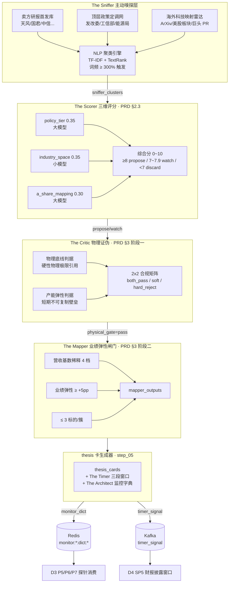

# L3 · 纵深进攻 · 07 · 主动嗅探层设计（Lighthouse-Alpha · The Sniffer + The Scorer + The Critic + The Architect）

> [!NOTE] **[TRACEBACK] 原子规约锚点**
> - **上溯 L1**：[基石 ⑥·进攻 §6.3 物理证伪 ≥ 财务证伪](../../01_顶层概念/06_投资哲学体系总纲.md#基石-进攻哲学边界维度二纵深进攻)
> - **上溯 L2**：[D2 §8A.1~8A.4 进攻能力补强](../../02_战略维度/02_维度二_纵深进攻/04_进攻实践策略规划.md#八a-lighthouse-alpha-进攻能力补强承接-l1-63-物理证伪--财务证伪)
> - **同模块**：[01_目标与边界](./01_目标与边界_设计.md) §五取舍 7~10 / [02_后端服务子模块](./02_后端服务子模块_设计.md) / [06_L2 落地清单](./06_L2落地清单_设计.md) §二服务映射 / [08_业绩弹性闸门](./08_业绩弹性闸门_设计.md)
> - **下沉 L3 step**：[step_02 数据采集 §3.5.4 + §3.5.5](./stages/stage_1_启动期/steps/step_02_数据采集.md) / [step_03 The Critic](./stages/stage_1_启动期/steps/step_03_证据链构建器.md) / [step_05 thesis 卡 + The Timer](./stages/stage_1_启动期/steps/step_05_thesis卡片生成器.md) / [step_07 The Scorer](./stages/stage_1_启动期/steps/step_07_置信度评分器.md)
> - **共享规约**：[18_动态采集流水线](../_共享规约/18_动态采集流水线规约.md) / [19_异构 AI 调度栈](../_共享规约/19_异构AI调度栈规约.md) / [20_监控字典](../_共享规约/20_监控字典规约.md)
> - **DNA**：[`_System_DNA/02_deep_strike/dna_deep_strike_theme_sniffer.yaml`](../_System_DNA/02_deep_strike/dna_deep_strike_theme_sniffer.yaml)
> - **PRD 引用**：`_drafts/lighthouse_alpha_PRD.md` §2（嗅探网络）+ §3 阶段一/三/四 + §4.1（动态热加载）

> [!IMPORTANT] **验证后资源释放（全模块强制）**
> 凡本文档涉及的本地/联调验证（Playwright 集群、`docker compose` Kafka/Redis、临时 worker），完成准出后须停止进程并释放资源。详见 [_共享规约/17_L3设计文档_验证后资源释放规约](../_共享规约/17_L3设计文档_验证后资源释放规约.md)。

---

## 一、本模块定位

本模块把 Lighthouse-Alpha PRD §2+§3 描述的 5 大 AI 能力（The Sniffer 嗅探 / The Scorer 评分 / The Critic 物理证伪 / The Architect 监控字典 / The Timer 三段窗口）作为 **D2 纵深进攻的"主动发现 + 物理证伪"前置链路**——区别于 D2 现有"基于持仓的剧本扫描"被动模式，主动嗅探层每日 7×24 监控三大高价值发源地，输出"被市场错误定价 + 物理可证伪"的进攻机会。

**模块边界**：
| ✅ 本模块 | ❌ 其他模块 |
|---|---|
| 主动嗅探层物理采集 + NLP 聚类 + 三维评分 + 物理证伪 + 标的映射 + 监控字典生成 + 三段窗口预测 | thesis 卡完整 schema（归 [02_后端服务子模块](./02_后端服务子模块_设计.md) §3 research_council_service）|
| The Architect 输出"监控字典 JSON" | D3 持仓监控的 P5/P6/P7 探针消费端（归 [03_/维度三/07_物理量探针_设计](../03_维度三_持仓监控/07_物理量探针_设计.md)）|
| The Timer 三段时间窗口预测 | D4 SP5 财报披露窗口协议消费端（归 [03_/维度四/08_SP5_财报披露窗口协议_设计](../04_维度四_卖出决策/08_SP5_财报披露窗口协议_设计.md)）|
| 路由远程大模型 vs 本地小模型策略 | 异构 AI 调度栈实现（归 [03_/维度五/08_异构AI调度栈_设计](../05_维度五_演进飞轮/08_异构AI调度栈_设计.md) + 共享规约 19）|

---

## 二、模块架构总览



---

## 三、子模块详细设计

### 3.1 The Sniffer 物理采集层（`theme_sniffer_service`）

**主责**：7×24 监控三大发源地，将原文落 Kafka topic `sniffer_raw_text`（共享规约 18 §四）。

**输入**：
- Redis 配置 `crawl_task_config:*`（热加载，5 分钟内生效）
- 三大源 URL 列表 + 敏感词库（DNA Y01 `theme_sniffer.sniffer.sources`）

**内部组件**：
```
┌─────────────────────────────────────────────┐
│ ResearchCrawler (Playwright)                │
│   ├─ 5 头部券商研报库                       │
│   ├─ 敏感词正则匹配（拐点/破局/元年/...）   │
│   └─ QPS ≤ 1.0                              │
│                                              │
│ PolicyCrawler (Playwright)                  │
│   ├─ 发改委/工信部/能源局                   │
│   ├─ 三年行动计划/指导意见关键词            │
│   └─ QPS ≤ 0.5                              │
│                                              │
│ OverseasCrawler (API + Playwright)          │
│   ├─ ArXiv API                              │
│   ├─ 美股涨幅榜（前 10 板块）               │
│   └─ MSFT/NVDA/OpenAI Press Release         │
│         ↓                                    │
│ DedupFilter (md5(url+content[:500]))        │
│         ↓                                    │
│ KafkaProducer → sniffer_raw_text            │
└─────────────────────────────────────────────┘
```

**输出**：`sniffer_raw_text` Kafka topic（schema 见共享规约 18 §4.1 envelope）。

**失败模式与保护**：

| 失败 | 保护 |
|---|---|
| 单源连续 5 次失败 | 标 `source_degraded`，告警；另两源 ≥ 1 条不阻塞 |
| ccgp QPS 超限 | 退避 5 倍 + UA 池轮换（共享规约 18 §六）|
| Kafka 不可用 | 直写 SQLite 本地缓冲；缓冲满 → 停 producer + 告警 |

---

### 3.2 NLP 聚类与初筛引擎（`nlp_clustering_engine`）

**主责**：消费 `sniffer_raw_text`，识别"24 小时词频 / 30 天历史基准 ≥ 300%" 的暴增专业词汇，封装为候选题材簇。

**算法**：TF-IDF + TextRank（轻量本地算法；不调大模型）。

**输出**：`sniffer_clusters` Kafka topic + DB `sniffer_clusters` 表。

**关键约束**：
- 每日最多 20 簇（DNA Y01 `sniffer.clustering.max_clusters_per_day`）
- 同题材 14 天去重窗口（防止重复消耗用户带宽）
- 启动期触发阈值放宽到 200%（DNA `surge_threshold_pct: 3.0` 是 300%；启动期单独配置）

---

### 3.3 The Scorer 三维评分（`confidence_scorer_service` 的 `SnifferScoreProvider`）

**主责**：对每个 cluster 走 PRD §2.3 三维评分 → 综合分 0~10 → 三档判定（propose / watch / discard）。

**严格对齐 PRD §2.3**：

| 维度 | 权重 | 模型 | rubric |
|---|---|---|---|
| `policy_tier` | 0.35 | **Claude Opus 4.7** | 10=国家级三年行动计划 / 7=部委级 / 4=地方级 / 1=无 |
| `industry_space` | 0.35 | **小模型**（Qwen-14B）| 10=千亿+CAGR≥30% / 7=百亿 / 4=十亿 / 1=未确认 |
| `a_share_mapping` | 0.30 | **Claude Opus 4.7** | 10=3+ 实锤标的且营收占比 ≥ 30% / 7=1~2 实锤 / 4=仅大盘组装厂 / 1=无映射 |

**综合分公式**：`composite = 0.35·policy_tier + 0.35·industry_space + 0.30·a_share_mapping`

**三档判定**：

| 综合分 | 动作 | 置信度上限 |
|---|---|---|
| ≥ 8.0 | propose（入推荐池）| 0.85 |
| 7.0~7.9 | watch（入候选库）| 0.70 |
| < 7.0 | 当日不入推荐池（次日复评）| — |

**异构调度**：参 [§3.7 异构 AI 调度路由](#37-异构-ai-调度路由) + 共享规约 19 §3.2。

**审计**：每条评分留 prompt_template_id + model_name + tokens_used + 每维 `source_urls[]`（缺 source 自动降一档）。

---

### 3.4 The Critic 物理证伪门禁（`the_critic_service`）

**主责**：消费 The Scorer 评分 ≥ propose 的 cluster，执行"物理底线 + 产能弹性"双判据。

**两条硬性判据**：

| # | 判据 | 通过条件 | 不通过 |
|---|---|---|---|
| 1 | **物理底线** | 必须明确"突破了哪个硬性物理极限"（physical_quantity_name + unit + boundary_value + source_url 四元组）| 硬拒绝 + `physical_floor_missing` |
| 2 | **产能弹性** | 必须显式说明"短期不可复制壁垒"（barrier_type + barrier_duration_months + source_url 三元组）| 软拒绝（置信度上限 0.55）+ `supply_elasticity_unclear` |

**2×2 合规矩阵**（DNA Y01 `critic.combined_matrix`）：

| 物理底线 | 产能弹性 | 结果 | 后续动作 |
|---|---|---|---|
| ✅ | ✅ | 通过 | `promote_to_mapper` |
| ✅ | ❌ | 软门禁 | `softgate_no_supply`，置信度上限 0.55 |
| ❌ | ✅ | 硬门禁 | `hard_reject`（无物理底线即财务证伪门禁失败）|
| ❌ | ❌ | 硬门禁 | `hard_reject` + 30 天后重评 |

**审计**：response 必须是结构化 JSON；大模型空降"通过"无引用 source 自动降级为硬门禁拒绝。

---

### 3.5 The Mapper 业绩弹性闸门（`the_mapper_service`）

详见 [08_业绩弹性闸门_设计.md](./08_业绩弹性闸门_设计.md)（D2 同模块独立设计）+ DNA Y02 `elasticity_gate.yaml`。

**本节仅声明接口契约**：

```
输入：DB cluster_critic_results where physical_gate=true
输出：DB mapper_outputs（thesis_card_id + symbol + tier + tags + confidence_cap）
路由：本地小模型（规则计算为主，Qwen-14B 辅助财报字段解析）
```

---

### 3.6 The Architect 监控字典生成（`the_architect_service`）

**主责**：对 thesis 卡走 PRD §3.3 阶段三大模型，输出"包含具体网址 / 数据途径 / HS 编码"的 JSON 监控字典。

**schema 完整定义**：[共享规约 20 §二 MonitorMatrix 完整 jsonschema](../_共享规约/20_监控字典规约.md#二monitormatrix-完整-jsonschema)。

**6 条硬约束**（MA1~MA6）：

| # | 约束 | 不通过 |
|---|---|---|
| MA1 | jsonschema 必须 validate 通过 | 写 Redis 前拒绝 + 落 DLQ `monitor_dict_dlq` |
| MA2 | alert_threshold + alert_threshold_struct 双形式 | 缺一拒绝 |
| MA3 | probe_id ∈ {P5, P6, P7} | 非枚举值拒绝 |
| MA4 | HS Code / source_url / keywords 至少一项非空 | 全空拒绝 |
| MA5 | mapped_logic_chain_nodes 非空 | 缺失拒绝 |
| MA6 | 初值 status=active | — |

**模型选择**：**Claude Opus 4.7**（Lighthouse 远程大模型全替；长上下文 + HS Code/跨领域推理）。

**典型示例**：见 [step_02 §3.5.5 示例 1（中际旭创 1.6T HS Code 85176239 触发 P6）](./stages/stage_1_启动期/steps/step_02_数据采集.md#355-lighthouse-alpha-the-architect-监控字典-json-schema严格对齐-prd-33) + 示例 2（英维克液冷 ccgp keyword 触发 P5）。

**成本约束**：单字典 ≤ ¥ 1.25；月度 ≤ ¥ 375（DNA Y01 `architect.cost_*`；Opus 4.7 全替后上调）。

---

### 3.7 The Timer 三段窗口生产端（`thesis_card_generator_service` 的 `the_timer` 引擎）

**主责**：thesis 卡生成时即调大模型按 PRD §3.4 阶段四规则生成"潜伏 / 主升浪 / 撤退"三段时间窗口，输出 `timer_signal` 嵌入 thesis 卡。

**A 股财报日历锚点**（DNA Y01 `timer.a_share_calendar`）：

| cycle_type | 时间窗口 |
|---|---|
| `pre_announce_h1` | 7-01 ~ 7-15 中报预告期 |
| `h1_release` | 8-01 ~ 8-31 中报披露期 |
| `pre_announce_q3` | 10-01 ~ 10-15 三季报预告期 |
| `q3_release` | 10-15 ~ 10-31 三季报披露期 |
| `annual_pre_announce` | 1-15 ~ 1-31 年报预告期 |
| `annual_release` | 4-01 ~ 4-30 年报披露期 |

**三段窗口 schema**：

```yaml
timer_signal:
  three_phases:
    incubation:   # 潜伏期（监控字典预警 → 财报披露前 N 天）
      action_hint: watch | gradual_build
    main_surge:   # 主升浪期（财报披露当天 +0~3 交易日 / 重大合同公告）
      action_hint: hold | add
    retreat:      # 撤退期（披露后放量滞涨 / 跌破 10 日均线 / 媒体高潮）
      action_hint: begin_exit
  cycle_anchors:
    - cycle_type: <enum 上述 6 种>
      expected_window: [start, end]
```

**7 条硬约束（TM1~TM7）**：详见 [step_05 §3.5.4 TM1~TM7](./stages/stage_1_启动期/steps/step_05_thesis卡片生成器.md#354-lighthouse-alpha-the-timer-三段时间窗口预测生产端--严格对齐-prd-34)。

**永久 no-auto-execute 规则**：`timer_signal` 字段**永久禁止**嵌入 `buy / qmt / auto_trade / order_id / webhook_target`（详见 D4 SP5 §11 PRD §5 翻译契约）。

---

### 3.8 异构 AI 调度路由

| 场景 | sub_scene | 模型 | 理由 |
|---|---|---|---|
| The Scorer | `policy_tier` | **Opus 4.7** | 政治体制知识 |
| The Scorer | `industry_space` | 小模型 | 规则映射 |
| The Scorer | `a_share_mapping` | **Opus 4.7** | A 股标的知识 |
| The Critic | — | **Opus 4.7** | 跨领域综合判断 |
| The Mapper | — | 小模型 + 规则 | 数值计算为主 |
| The Architect | — | **Opus 4.7** | HS Code/URL/字典推理 |
| The Timer | — | **Opus 4.7** | A 股交易日历 + 财报节奏综合 |

**调用方式**：业务代码**必须**通过 `AIDispatcher.call(scene, sub_scene, prompt_template_id, prompt_vars)` 调用；禁止直连 anthropic/openai/qwen API（共享规约 19 §7.2 SDK1）。

**成本预算**：启动期 ¥ 141/日；扩展期 ¥ 1060/日（共享规约 19 §4.1；Opus 4.7 全替后上调）。

---

## 四、对外接口（API）

| API | 方法 | 用途 | 引用 step |
|---|---|---|---|
| `POST /api/sniffer/run` | POST | 手动触发一轮全源嗅探 | step_02 |
| `GET /api/sniffer/{cluster_id}/score` | GET | 返 The Scorer 三维评分（含 source_urls）| step_07 |
| `POST /api/critic/check` | POST | 对单 cluster 手动触发物理证伪 | step_03 |
| `POST /api/mapper/map` | POST | 对单 critic-passed cluster 手动触发标的映射 | step_04 |
| `POST /api/architect/generate` | POST | 对 thesis_id 手动触发监控字典生成 | step_02 + step_05 |
| `POST /api/timer/predict` | POST | 对 thesis_id 手动触发三段窗口预测 | step_05 |
| `GET /api/sniffer/clusters?date=` | GET | 查指定日期的题材簇列表 | step_02 |

---

## 五、关键设计取舍

1. **物理证伪门禁前置**：The Critic 在 The Scorer 之后立即执行——避免高分但物理基础薄弱的 cluster 进入 The Mapper 浪费成本
2. **三大源解耦**：单源失败不阻塞另两源（共享规约 18 §七降级矩阵）
3. **NLP 用本地算法**：聚类不调大模型——成本可控 + 启动期 200% 阈值放宽
4. **The Scorer 三维严格对齐 PRD**：v2.2 修订把内部命名（叙事/数据/产业链）改为 PRD（政策级别/产业空间/A股映射度），便于与 PRD 受众沟通
5. **The Timer 归属 thesis 卡生成**：作为 thesis 卡的不可分割组成部分，而非独立 step——确保 thesis 一经生成就含完整时间窗口
6. **永久 no-auto-execute 五处一致**：L1 + L2 + DNA Y01.timer + DNA Y03 + D4 step_05 §11

---

## 六、违反检测（CI）

| # | 违反 | 检测命令 |
|---|---|---|
| V1 | The Scorer 三维命名漂移 | `grep "narrative_score\|data_score\|chain_score" engines/` 应 0 命中（已被替换）|
| V2 | The Critic 大模型直连 openai | CI grep `import openai` 仅允许在 `ai_dispatch/` |
| V3 | The Architect 输出 jsonschema 不通过仍写 Redis | runtime guard + 单测 |
| V4 | The Timer 三段任一缺失仍写 thesis_cards | runtime guard |
| V5 | timer_signal 嵌入 buy/qmt/auto_trade | runtime guard + `make audit-no-auto-execute-fields` |
| V6 | 业务代码绕过 AIDispatcher | CI grep |

---

## 七、修订记录

| 日期 | 触发 | 内容 |
|---|---|---|
| 2026-05-22 | **Opus 4.7 全替** | Scorer/Architect/Timer 模型列 + 成本约束同步共享规约 19 v1.1 + DNA Y01 v1.1 |
| 2026-05-21 | Lighthouse-Alpha 主动嗅探层 L3 设计文档缺失 | 首版：①模块定位与边界；②mermaid 架构图（4 层：嗅探/评分/证伪/映射 → thesis）；③7 个子模块设计（The Sniffer 3 源 + NLP 聚类 + The Scorer 3 维 + The Critic 2×2 矩阵 + The Mapper 接口 + The Architect 6 约束 + The Timer 6 cycle）；④异构调度路由；⑤7 个对外 API；⑥6 条关键取舍；⑦违反检测 V1~V6；TRACEBACK 上溯 L1/L2/PRD 全闭环；下沉 4 个 L3 step + 3 个共享规约 + 1 个 DNA Y01 |
