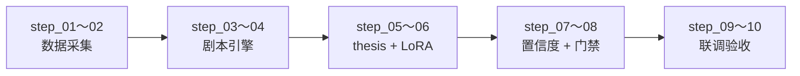

# 维度二·纵深进攻·启动期·实践目标与策略

> [!NOTE] **[TRACEBACK] 实践锚点**
> - **L2 战略规划**: [维度二·00_维度目标与能力边界](../../../../02_战略维度/02_维度二_纵深进攻/00_维度目标与能力边界.md)
> - **L3 模块设计**: [维度二_纵深进攻/README](../../README.md)
> - **同阶段文档**: [02_技术方案](./02_技术方案与代码架构.md) / [03_数据采集](./03_数据采集与预处理.md) / [04_模型训练](./04_模型训练与部署.md) / [05_验收标准](./05_验收标准与检查清单.md)
> - **L1 哲学基石**: ③能力圈 + ⑥纵深

---

## 一、本阶段目标

### 1.1 一句话目标

> **用 1 个 P0 剧本（利润截留扫描仪）+ thesis 卡片生成器实现"在能力圈内发现机会并输出结构化投资逻辑"的最小闭环。**

### 1.2 量化目标

| 目标项 | 指标 | 阈值 |
|---|---|---|
| 剧本数量 | P0 剧本上线 | 1 个（利润截留扫描仪）|
| thesis 卡片 | 5 必填元素完整 | 100% |
| 置信度准确性 | 与人工判断一致率 | ≥ 80% |
| 周输出量 | thesis_proposed 事件 | ≤ 5 个/周 |
| 人工确认率 | 架构师确认进入持仓 | 跟踪统计 |

### 1.3 本阶段交付物

| 交付物 | 描述 | 验收方式 |
|---|---|---|
| 利润截留扫描仪剧本 | 识别毛利率拐点/经营杠杆释放 | 剧本可运行 + 输出 thesis 卡片 |
| thesis 卡片生成器 | 5 必填元素 + 结构化输出 | 元素完整性校验 |
| 证据链构建器 | 财报/公告数据抓取 + 结构化 | 数据可追溯 |
| 置信度评分器 | 0-1 分值输出 | 与人工判断一致率 |
| 人工确认门禁 | 建仓确认 API | 维度零可调用 |

---

## 二、核心理念：剧本驱动

### 2.1 什么是剧本

```
┌─────────────────────────────────────────────────────────────┐
│                       剧本 = 方法论                          │
│                                                             │
│  不是"个股推荐"，而是"识别这类机会的方法论"                  │
│  ✅ 输入：财报/公告/产业数据                                 │
│  ✅ 输出：thesis 卡片（5 必填元素）                          │
│  ✅ 可被维度三/四消费（投资逻辑也是被监控的对象）            │
└─────────────────────────────────────────────────────────────┘
```

### 2.2 P0 剧本：利润截留扫描仪

**识别目标**：成本下降快于收入下降 / 毛利率拐点 / 经营杠杆释放

**典型场景**：
- 原材料价格下跌，但产品定价未降（如电池材料降价后的电池厂）
- 固定成本摊薄后的经营杠杆释放（如新能源车销量爬坡期）
- 产能利用率提升带来的毛利率改善

**信号特征**：
```python
PROFIT_CAPTURE_SIGNALS = {
    # 毛利率环比提升
    "gross_margin_qoq_up": {
        "condition": "gross_margin_qoq > 0.02",  # 环比 > 2%
        "weight": 0.3
    },
    # 成本增速低于收入增速
    "cost_growth_below_revenue": {
        "condition": "cost_growth_yoy < revenue_growth_yoy - 0.05",
        "weight": 0.25
    },
    # 经营杠杆释放（净利润增速 > 收入增速）
    "operating_leverage": {
        "condition": "net_profit_growth > revenue_growth * 1.3",
        "weight": 0.25
    },
    # 应收账款周转改善
    "receivable_turnover_up": {
        "condition": "receivable_turnover_qoq > 0",
        "weight": 0.1
    },
    # 存货周转改善
    "inventory_turnover_up": {
        "condition": "inventory_turnover_qoq > 0",
        "weight": 0.1
    }
}
```

---

## 三、总体策略

### 3.1 决策机制

| 决策类型 | 判定 | 动作 |
|---|---|---|
| `propose` | 剧本命中 + 置信度 ≥ 0.7 | 输出 thesis 卡片 → 维度零推荐池 |
| `watch` | 剧本部分命中 + 置信度 0.4–0.7 | 进入观察池，触发新一轮数据采集 |
| `discard` | 剧本未命中 / 置信度 < 0.4 | 写入"已研究未持仓"日志（负样本）|

**永久禁止**：AI 不可自动建仓，必须经架构师"建仓确认"

### 3.2 thesis 卡片 5 必填元素

| # | 元素 | 说明 | 来源 |
|---|---|---|---|
| 1 | **观点摘要** | 100 字核心投资逻辑 | LLM 生成 |
| 2 | **证据链** | 3+ 条可验证证据 | 财报/公告抓取 |
| 3 | **风险清单** | 主要风险点 | LLM 生成 |
| 4 | **估值锚点** | 目标价/PE/PB | 规则 + LLM |
| 5 | **操作建议** | 买入/加仓/观望 | 置信度 + 规则 |

### 3.3 技术选型策略

| 层面 | 选型 | 理由 |
|---|---|---|
| 剧本引擎 | LangGraph | Agent 工作流编排 |
| 数据抓取 | AKShare + 巨潮 | 财报/公告 |
| 证据结构化 | Pydantic | 强类型校验 |
| 置信度评分 | LLM + 规则加权 | 可解释性 |
| 人工确认 | FastAPI | 与维度零集成 |

---

## 四、实施路径（step 序号权威）



| 步骤块 | 涵盖 step | 主要产出 |
|---|---|---|
| 数据采集 | step_01～02 | 财报/公告结构化数据 |
| 剧本引擎 | step_03～04 | 利润截留扫描仪可运行 |
| thesis 生成 | step_05～06 | 5 必填元素输出 + Thesis LoRA |
| 置信度评分 | step_07～08 | 0-1 分值 + 与人工一致率 |
| 联调验收 | step_09～10 | 端到端 + 维度零对接 |

---

## 五、风险与应对

| 风险 | 概率 | 影响 | 应对策略 |
|---|---|---|---|
| 财报数据抓取失败 | 中 | 高 | 多数据源备份 |
| 置信度与人工判断偏差大 | 中 | 中 | 增加负样本训练 |
| thesis 卡片元素不完整 | 低 | 中 | Schema 强校验 |
| LLM 幻觉导致证据链错误 | 中 | 高 | 证据必须来自原始数据 |

---

## 六、本阶段不做什么（明确边界）

| 不做的事 | 留待阶段 | 原因 |
|---|---|---|
| ❌ 2-10 号剧本 | 扩展期 | 先验证 P0 剧本效果 |
| ❌ 量价信号 | 永不做 | 不在能力圈 |
| ❌ 自动建仓 | 永不做 | L1 禁止 |
| ❌ 短线交易信号 | 永不做 | 与超长期复利冲突 |
| ❌ 沙箱执行 | 扩展期 | 启动期不需要动态代码 |

---

## 七、成功标准

### 7.1 硬性准出条件

- [ ] 利润截留扫描仪剧本可运行
- [ ] thesis 卡片 5 必填元素完整率 100%
- [ ] 置信度与人工判断一致率 ≥ 80%
- [ ] thesis_proposed 事件可被维度零消费

### 7.2 软性目标

- [ ] 周输出 ≤ 5 个 thesis 卡片
- [ ] 架构师确认率统计建立

---

## 修订记录

| 日期 | 内容 |
|---|---|
| 2026-05-16 | 初版，覆盖目标、剧本设计、策略、路径 |
