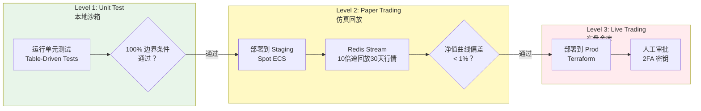
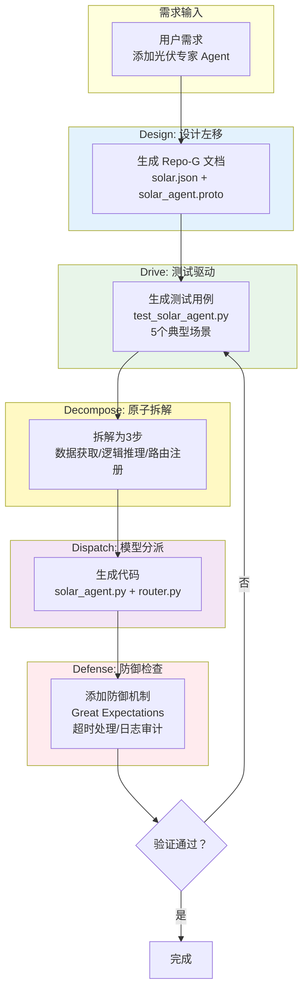

# L3 · 架构设计共识与协作元规则

> [!NOTE] **[TRACEBACK] 原子规约锚点**
> - **顶层概念**: [一句话定义与核心价值](../01_顶层概念/01_一句话定义与核心价值.md)
> - **战略维度**: [研产同构维度](../02_战略维度/产品设计/06_研产同构维度.md)
> - **战略维度**: [安全与机密治理维度](../02_战略维度/产品设计/05_安全与机密治理维度.md)
> - **对应 DNA**: `_System_DNA/dna_03_arch_design_consensus.yaml`
> - **本文档**: L3 层级，定义架构设计共识与协作元规则

## 核心理念

**Code is Liability (代码是负债), Design is Asset (设计是资产)**。

任何一行代码的产生，必须是对某个"架构决策"或"业务契约"的履行，而不能是即兴发挥。

**维度归属说明**：本规约中 **B. 金融级 GitFlow / 三级流水线** 属于 **开发与交付** 维度，与 [01_开发生命周期与实践流程规约](开发与交付/01_开发生命周期与实践流程规约.md) 衔接；**A. ADR 强制令** 与 **5D、SemVer** 等为产品与交付 **共用** 的协作与设计约束。

## A. ADR 强制令 (The ADR Mandate)

### 规则：无文档，不编码 (No Ticket, No Code)

**位置**：`diting-doc/06_追溯与审计/ADR/`（方案 A：无独立 diting-design，ADR 归属文档仓）

**规则**：在修改 `diting-core` 的任何核心逻辑（如：更换量化指标、调整止损算法、接入新券商）之前，必须在 diting-doc 的 `06_追溯与审计/ADR/` 提交一个 ADR（架构决策记录，Architecture Decision Record）。

### ADR 标准模板

```markdown
# ADR-00X: [标题，例如：切换至 ATR 动态止损]

## 状态
[Proposed / Accepted / Deprecated]

## Context (背景)
当前的固定 2% 止损在"妖股"行情中容易被洗盘（Whipsaw），导致胜率下降。

## Decision (决策)
引入 ATR (14周期) 指标。
止损线 = Entry_Price - (2.5 * ATR)。

## Consequences (后果)
[+] 降低了噪音止损的概率。
[-] 在极端单边下跌中，单笔亏损可能会扩大到 4%（需配合仓位管理）。

## Compliance Check (合规检查)
是否违反"单笔 < 2% 总资金"的铁律？
-> 需调整 Position Sizing 算法以适配宽止损。
```

### ADR 触发场景

| 变更类型 | 是否需要 ADR | 示例 |
|---------|------------|------|
| **架构级变更** | ✅ 必须 | 引入 MoE（混合专家）架构、更换数据库 |
| **策略逻辑变更** | ✅ 必须 | 调整止损算法、新增策略池 |
| **接口变更** | ✅ 必须 | 修改 Protocol 定义、新增字段 |
| **Bug 修复** | ⚠️ 可选 | 修复日志格式错误（小改动可不写） |
| **配置调整** | ❌ 不需要 | 修改 YAML 配置值 |

---

## B. 金融级 GitFlow（分支与发布流程，The Financial Pipeline）

### 痛点

普通的 CI/CD 只有 Test/Prod。金融系统必须有一个 "The Matrix" (仿真层)。

### 三级流水线

> **与开发生命周期的关系**：开发生命周期（见 [01_开发生命周期与实践流程规约](开发与交付/01_开发生命周期与实践流程规约.md)）定义从零到可提交的实践顺序（骨架期 → 逻辑填充期 → Docker 期 → K3s 测试开发期）；本小节定义**提交后**的流水线（commit → Level1 单测；merge develop → Level2 Staging；tag → Level3 Live）。



#### Level 1: Unit Test (本地沙箱)

**触发**：`git commit`

**动作**：
- 运行 `Repo-I/tests/unit/` 下的所有测试
- 执行 Table-Driven Tests

**硬指标**：
- 必须通过所有 Table-Driven Tests
- 覆盖 100% 的边界条件（如价格=0，价格=负数，空输入等）

**失败处理**：测试失败，commit 被拒绝。

#### Level 2: Paper Trading (仿真回放)

**触发**：Merge to `develop` 分支

**动作**：
- 部署到 Staging 环境（Spot ECS）
- 系统接入 Redis Stream 回放器
- 以 **10倍速**回放过去 30 天的极端行情（熔断、跌停、地天板）

**硬指标**：
- 净值曲线与 Backtrader 回测结果的偏差度 < 1%
- 这一步是防止"回测过拟合"的关键

**验收标准**：
- 信号生成逻辑：模拟盘与回测结果一致
- 事件驱动逻辑：Redis Streams 事件处理无遗漏、无重复
- 风控逻辑：模拟盘的风控拦截与回测一致
- 性能表现：模拟盘的延迟与吞吐满足实盘要求

**失败处理**：偏差度 ≥ 1%，自动回滚，通知开发团队。

#### Level 3: Live Trading (实盘金库)

**触发**：
- Tag Release (`v1.x.x`)
- **人工审批**（必须）

**动作**：
- Terraform 修改 prod 环境配置
- ArgoCD/Flux 自动同步到 K3s 集群

**硬指标**：
- **零信任部署**：只有 `master` 分支的 Tag 能部署
- 部署时需输入 **2FA 密钥**（解密 External Secrets）

**安全机制**：
- 部署前必须通过人工审批
- 部署密钥通过 2FA 保护
- 所有配置变更可追溯、可回滚

#### 当前实施状态

以下为**当前阶段**的实际执行方式；规约目标（Level 1/2/3 的触发、动作、硬指标）不变，未来接入 CI 时再切换为自动触发。

| 级别 | 规约目标触发 | 当前实施方式 |
|------|--------------|--------------|
| **Level 1** | git commit 触发单元测试 | 由开发者**本地执行 `make test`**（diting-core）代替；无自动触发。 |
| **Level 2** | Merge to develop → 部署 Staging | 由开发者在 **diting-infra 目录本地调用 deploy-engine** 完成部署与验证；无 merge 自动触发。 |
| **Level 3** | Tag Release + 人工审批 → Prod | 由开发者在 diting-infra 目录本地调用 deploy-engine 完成 Prod 部署；无 tag 自动触发。 |

未来接入 CI（如 GitHub Actions）时，将切换为 commit/merge/tag 触发上述动作；本规约的验收标准与硬指标不变。

---

## C. 版本控制铁律（SemVer 语义化版本，SemVer for Money）

### 痛点

弄不清线上跑的是哪个版本的策略。

### 严格遵循语义化版本 (Semantic Versioning)

#### Major (X.0.0): 架构级变更

**例**：
- 引入 MoE 架构
- 更换数据库内核（如从 PostgreSQL 切换到 TimescaleDB）

**动作**：
- **必须清仓**，停止旧系统
- 全量部署新系统
- 新系统上线后，重新开始交易

**流程**：
1. 发布 `v2.0.0` Tag
2. 人工审批（必须）
3. 执行清仓脚本（`tools/emergency_stop.py`）
4. 部署新系统
5. 验证新系统运行正常后，重新开始交易

#### Minor (0.X.0): 策略/逻辑变更

**例**：
- 调整 ATR 参数（从 2.0 改为 2.5）
- 新增 "Tech-Agent" 专家
- 修改止损算法

**动作**：
- **平滑升级**：不影响现有持仓
- 新开仓位使用新逻辑
- 旧持仓继续使用旧逻辑（或逐步迁移）

**流程**：
1. 发布 `v1.1.0` Tag
2. 部署到 Staging，Paper Trading 验证
3. 验证通过后，部署到 Prod
4. 新信号使用新逻辑，旧持仓保持不变

#### Patch (0.0.X): 修复/补丁

**例**：
- 修复日志格式错误
- 适配券商 API 的微小变动（如字段名变更）
- 修复性能问题

**动作**：
- **热更新**：无需清仓，无需停止交易
- 滚动更新 Pod，保证服务不中断

**流程**：
1. 发布 `v1.0.1` Tag
2. 自动部署（无需人工审批，但需通过 Level 1 测试）
3. K3s 滚动更新，零停机

---

## D. 5D 协作闭环 (The Human-AI Protocol)

### 痛点

如何指挥 AI 生成符合上述标准的代码？

### Prompting Contract (提示词契约)

当要求 AI 写代码时，遵循 **Design → Drive → Decompose → Dispatch → Defense** 的循环。

### 示例：添加"光伏"板块的专家 Agent

#### 您的指令

> "谛听，我想加一个'光伏'板块的专家 Agent。"

#### AI 的标准响应流程

##### a. Design (Repo-G)

**生成文档**：
- `Repo-G/schemas/knowledge_graph/solar.json`（定义光伏产业链图谱）
- `Repo-G/protocols/solar_agent.proto`（定义专家协议）

**内容**：
- 光伏产业链实体关系（硅料 → 硅片 → 电池片 → 组件）
- 专家输入/输出 Schema
- 领域逻辑规则（如：硅料价格上涨 → 组件股下跌）

##### b. Drive (Repo-I/Test)

**生成测试**：
- `Repo-I/tests/moe/test_solar_agent.py`

**测试用例**（至少 5 个）：
1. **正常场景**：硅料价格上涨 → 组件股下跌（预期：Bearish）
2. **边界场景**：硅料价格不变 → 组件股中性（预期：Neutral）
3. **异常场景**：硅料价格为负数 → 数据异常（预期：抛出异常）
4. **知识库缺失**：查询不存在的实体 → 返回 `is_supported=false`
5. **推理超时**：LLM 响应超时 → 降级处理

##### c. Decompose (任务拆解)

**拆解为三步**：
1. **数据获取**：从 L2 知识库（Tech-KG）获取光伏产业链数据
2. **逻辑推理**：DeepSeek-R1 分析硅料价格与组件股的关系
3. **路由注册**：将 Solar Agent 注册到 MoE Router

##### d. Dispatch (代码生成)

**生成代码**：
- `Repo-I/diting/moe/specialists/solar_agent.py`（专家实现）
- `Repo-I/diting/moe/router.py`（更新路由逻辑）

**代码要求**：
- 遵循 `abstraction/llm.py` 接口，不直接调用 DeepSeek API
- 使用 Protocol 生成的数据结构
- 包含完整的错误处理

##### e. Defense (防御检查)

**添加防御机制**：
- **Great Expectations 规则**：确保硅料价格数据不为负数
- **超时处理**：LLM 推理超时自动降级
- **日志审计**：所有推理过程记录到 LangFuse

---

## 5D 协作流程图



---

## 与战略维度的映射

| 战略维度 | 对应规则 | 说明 |
|---------|---------|------|
| **研产同构** | Level 2 Paper Trading | 仿真回放验证逻辑一致性 |
| **安全治理** | Level 3 人工审批 + 2FA | 零信任部署 |
| **成本治理** | Level 2 使用 Spot ECS | 降低测试环境成本 |
| **生产保障** | Level 1 Table-Driven Tests | 数据质量保障 |

---

## 下一步

→ 参见：
- [04_全链路通信协议矩阵.md](./04_全链路通信协议矩阵.md)
- [05_接口抽象层规约.md](./05_接口抽象层规约.md)
