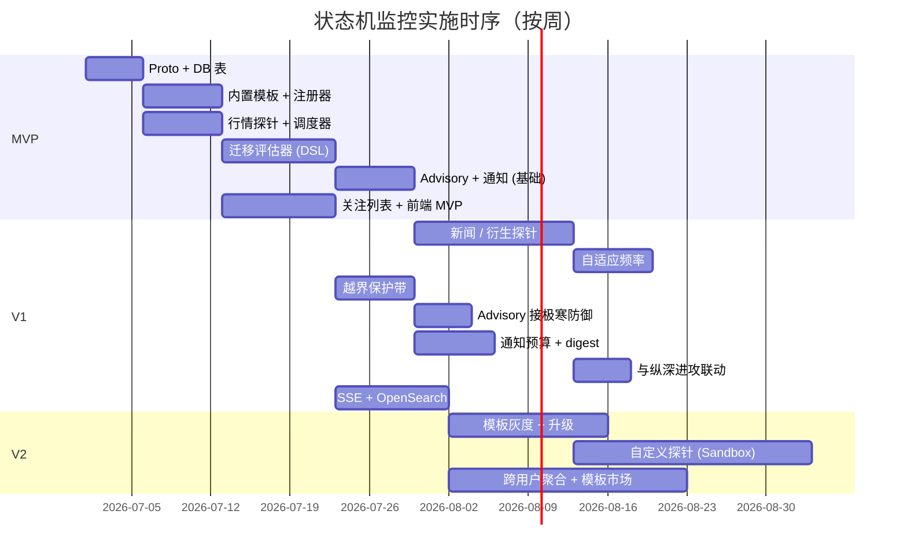

# L3 · 状态机监控 · 实施推演设计

> [!NOTE] **[TRACEBACK]**
> - **同模块**：[01](./01_目标与边界_设计.md)、[02](./02_后端服务子模块_设计.md)、[03](./03_接口契约_设计.md)、[04](./04_数据契约_设计.md)
> - **L4 计划目录**：`04_阶段规划与实践/03_维度三_持仓监控/`（第 3 批）

> [!IMPORTANT] **验证后资源释放（全模块强制）**
> 凡本文档涉及或引用的 **本地/联调验证**（单测、集成测、`docker compose`、前后端 dev server、`uvicorn`、临时 worker 等），在 **测试结论已确认并完成准出/实践记录** 后，须 **停止相关进程并释放资源**。检查项与示例命令见 [_共享规约/17_L3设计文档_验证后资源释放规约.md](../_共享规约/17_L3设计文档_验证后资源释放规约.md)。

## 一、演进路径总览

| 版本 | 关键能力 | 完成判定 |
|------|---------|---------|
| **MVP** | 模板 + 实例 + 行情探针 + 简单迁移 + Advisory（无门禁联动）+ 关注列表 | 用户能创建实例并看到状态迁移 |
| **V1** | 多类探针 + 自适应频率 + 完整 Advisory + 通知预算 + 越界保护带 + 与极寒防御联动 | 全链路通；通知频率不爆；模板可热更新 |
| **V2** | 模板灰度发布 + 实例升级 + 自定义探针 + 跨用户聚合分析 | 模板版本管理稳定；用户自助创建模板 |

## 二、MVP（最小可用产品）

### 范围
- 内置 1~2 个模板（如"突破型"、"困境反转型"）
- 行情探针（5min 间隔）
- 状态迁移评估器（表达式 DSL）
- Advisory 生成器（不经门禁，直接写表）
- 关注列表（基础 CRUD）
- 通知器：仅推送 + 邮件，无预算限制

### 关键步骤

| # | 步骤 | 工作目录 | 准出 |
|---|------|---------|------|
| MVP-1 | Proto v1 | `diting-src/design/protocols/state_watch/` | proto compile 通过 |
| MVP-2 | DB 表（templates / instances / instance_history / probe_results / transition_events / advisories / watchlists / notification_logs） | `diting-src/diting/state_watch/migrations/` | `make migrate` 通过 |
| MVP-3 | 内置模板（YAML → 数据库） | `diting-src/diting/state_watch/templates/seed/` | 2 个模板入库 |
| MVP-4 | 模板与实例注册器 | `diting-src/diting/state_watch/registry/` | 单元测试通过；可创建模板 / 实例 |
| MVP-5 | 行情探针 + 调度器（cron） | `diting-src/diting/state_watch/probe/quote/` | 探针每 5min 跑；写探针结果 |
| MVP-6 | 状态迁移评估器（表达式 DSL） | `diting-src/diting/state_watch/evaluator/` | 单元测试覆盖核心 DSL；端到端：探针 → 迁移 → 日志 |
| MVP-7 | Advisory 生成器（无门禁） | `diting-src/diting/state_watch/advisory/` | 进入 EXIT_PENDING → 写 advisory |
| MVP-8 | 通知器（push + email） | `diting-src/diting/state_watch/notification/` | 实例迁移 → 用户收到通知 |
| MVP-9 | 关注列表 CRUD | `diting-src/diting/state_watch/watchlist/` | API 测试通过 |
| MVP-10 | 前端"关注列表中心" + "状态机详情" MVP | `diting-src/web/watchlist_center/` | 浏览器看到列表 + 实例状态 + 迁移历史 |

### MVP 验收
- 用户创建实例后，行情触发的迁移在 < 10s 内可见
- Advisory 写入数据库；用户能在前端看到
- 通知能投递（push / email）
- 单元测试覆盖率 ≥ 70%

## 三、V1（完整能力）

### 在 MVP 基础上新增

| 子能力 | 说明 |
|--------|------|
| 多类探针 | 行情 + 新闻 + 衍生（事件、特征） |
| 自适应频率 | 根据迁移频率与用户优先级动态调整 interval |
| 越界保护带 | hard_threshold + soft_threshold；触发动作 |
| 完整 Advisory（含门禁） | 经极寒防御 `decision_gate`；带 evidence + fallback |
| 通知预算 | 日 / 时上限；超出转 digest |
| 与纵深进攻联动 | 候选 active 时自动拉起实例 |
| SSE 实时推送 | 实例状态 / Advisory 实时推前端 |
| OpenSearch 索引 | 迁移 / 越界 / Advisory 检索 |

### 关键步骤

| # | 步骤 | 工作目录 | 准出 |
|---|------|---------|------|
| V1-1 | 新闻探针 + 流式触发 | `diting-src/diting/state_watch/probe/news/` | 实时新闻触发迁移 |
| V1-2 | 衍生探针（事件 / 特征） | `diting-src/diting/state_watch/probe/derivative/` | 事件触发可工作 |
| V1-3 | 自适应频率算法 | `diting-src/diting/state_watch/probe/adaptive/` | 高活跃实例 interval 自动缩短 |
| V1-4 | 越界保护带 | `diting-src/diting/state_watch/guards/` | hard / soft 双带；触发动作 |
| V1-5 | Advisory 接入极寒防御门禁 | 联调 | 缺 evidence / fallback 被拒 |
| V1-6 | 通知预算 + digest 策略 | `diting-src/diting/state_watch/notification/budget/` | 超预算合并为 digest |
| V1-7 | 与纵深进攻联动 | 联调 | 候选 active → 自动拉起实例 |
| V1-8 | SSE 实时推送 | `diting-src/diting/state_watch/sse/` | 浏览器实时收到状态变化 |
| V1-9 | OpenSearch 索引 | `diting-src/diting/state_watch/indexer/` | 迁移检索 P99 < 1s |
| V1-10 | 动态配置中心接入 | `diting-src/diting/state_watch/config/` | 通知预算 / 自适应参数热更新 |

## 四、V2（生产稳态）

| 子能力 | 说明 |
|--------|------|
| 模板灰度发布 | 模板版本 staging / canary / prod；按用户灰度 |
| 实例升级 | 用户主动把实例升级到新模板版本（diff 展示） |
| 自定义探针 | 用户在沙箱内编写探针（受 [Runtime Sandbox Port](../_共享规约/05_接口抽象层规约.md) 限制） |
| 跨用户聚合分析 | "全体用户对该标的的状态分布" / "迁移热度图" |
| 模板市场 | 用户分享公共模板；评分 / 收藏 |

## 五、依赖时序

## 六、依赖关系

| 依赖模块 | 形态 | 时序 |
|---------|------|------|
| 共享平台基础（数据层 / 配置中心） | 必须先就绪 | MVP 前 |
| [纵深进攻 § candidate_registry](../纵深进攻/02_后端服务子模块_设计.md) | 候选 active 触发实例创建 | V1-7 |
| [极寒防御 § decision_gate](../极寒防御/02_后端服务子模块_设计.md) | Advisory 必经门禁 | V1-5 |
| [超级个体进化](../超级个体进化/README.md) | 迁移 / 越界 → 评测吸收 | V1-1 起持续 |
| [前端工程与服务](../前端工程与服务/README.md) | 关注列表中心 / 状态机详情 / 全市场矩阵 | MVP-10 起，全程 |

## 七、风险与回退

| 风险 | 影响 | 缓解 |
|------|------|------|
| 探针成本爆炸 | 数据 / 推理成本失控 | 自适应频率 + Worker 池预算守护 |
| 通知扰民 | 用户流失 | 通知预算 + digest + 严重度 bypass |
| 模板错误（坏迁移条件） | 实例进入死循环 / 错误状态 | 模板发布前自动校验 + 实例隔离机制 |
| DSL 表达式注入 | 安全风险 | DSL 沙箱化（白名单函数 + 资源限制） |
| 实例数据损坏 | 迁移混乱 | 标记 CORRUPTED + 人工修复入口 + 不可静默修改 |

## 八、L4 实践目录预告（第 3 批）

`04_阶段规划与实践/03_维度三_持仓监控/` 下：
- `01_MVP_单模板与行情探针_实践.md`
- `02_V1_多探针与自适应_实践.md`
- `03_V1_越界保护与门禁联动_实践.md`
- `04_V1_通知预算与digest_实践.md`
- `05_V2_模板灰度与自定义探针_实践.md`

## 九、L5 验收锚点预告

| 锚点 | 对应里程碑 |
|------|-----------|
| `l5-pillar-watch-mvp` | MVP 准出 |
| `l5-pillar-watch-v1-probe` | V1 多探针准出 |
| `l5-pillar-watch-v1-gate` | V1 与极寒防御联动 |
| `l5-pillar-watch-v1-budget` | V1 通知预算 |
| `l5-pillar-watch-v2-template` | V2 模板灰度 |
