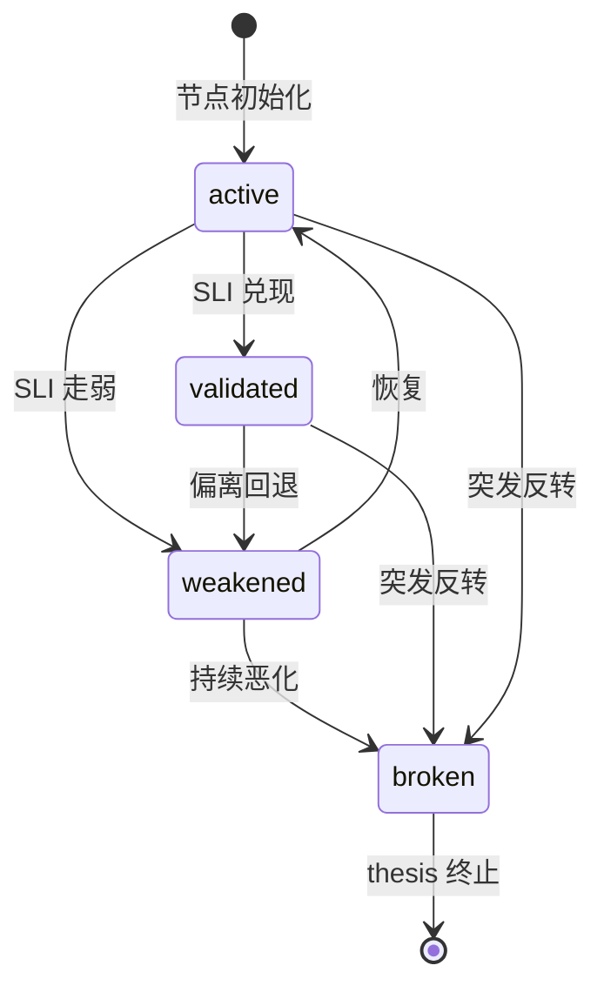
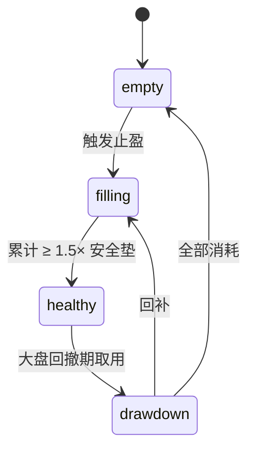

# L3·状态机监控·06·L2 落地清单（与维度三+四全量对齐）

> [!NOTE] **[TRACEBACK] 原子规约锚点**
> - **本模块抽象**: [00_四大模块抽象总纲 §3.3](../00_四大模块抽象总纲.md#33-状态机监控state-machine-watch)
> - **本模块设计 1-5**: [01_目标与边界](./01_目标与边界_设计.md) / [02_后端服务子模块](./02_后端服务子模块_设计.md) / [03_接口契约](./03_接口契约_设计.md) / [04_数据契约](./04_数据契约_设计.md) / [05_实施推演](./05_实施推演_设计.md)
> - **L2 维度三对齐**: [维度三·持仓监控](../../02_战略维度/03_维度三_持仓监控/README.md) + [04_持仓策略与战场分配实践规划](../../02_战略维度/03_维度三_持仓监控/04_持仓策略与战场分配实践规划.md)
> - **L2 维度四对齐**: [维度四·卖出决策](../../02_战略维度/04_维度四_卖出决策/README.md) + [04_卖出实践策略规划](../../02_战略维度/04_维度四_卖出决策/04_卖出实践策略规划.md)
> - **L1 哲学基石**: ⑦持仓监控 + ⑧卖出决策 + ③时间边界

> [!IMPORTANT] **验证后资源释放（全模块强制）**
> 凡本文档涉及或引用的 **本地/联调验证**（单测、集成测、`docker compose`、前后端 dev server、`uvicorn`、临时 worker 等），在 **测试结论已确认并完成准出/实践记录** 后，须 **停止相关进程并释放资源**。检查项与示例命令见 [_共享规约/17_L3设计文档_验证后资源释放规约.md](../_共享规约/17_L3设计文档_验证后资源释放规约.md)。


## 一、本文档的位置

L3 状态机监控**同时承载维度三（持仓监控）和维度四（卖出决策）两个 L2 产品视角**——这是 L2/L3 抽象层级不对齐的典型场景（L2 是 5 维度产品视角，L3 是 4 大工程模块视角）。

本文档把维度三 + 维度四的所有具体能力（节点 4 态状态机 / 4×4 调仓矩阵 / 4 类卖出协议 / 卖飞豁免 / 4 战场健康度阈值 / 收益仓库 / 战场分配审计）落地到 L3 服务实现规约。

## 二、维度三 + 维度四 → state_watch 服务映射

| L2 能力 | 维度归属 | 主责服务 | 协责服务 |
|---|---|---|---|
| **逻辑链节点 4 态状态机** | 维度三 | `state_machine_registry` + `transition_engine` | `probe_scheduler` |
| **SLI 探针调度** | 维度三 | `probe_scheduler` | `transition_engine` |
| **4×4 调仓矩阵建议** | 维度三 | `rebalance_advisor` | `transition_engine` |
| **战场分配饼图 + 月度审计** | 维度三 | `battlefield_auditor`（新增）| `state_machine_registry` |
| **收益仓库控制边界** | 维度三 | `gain_vault_controller`（新增）| `rebalance_advisor` |
| **4 类卖出协议** | 维度四 | `exit_protocol_engine`（新增）| `rebalance_advisor` |
| **卖飞豁免 180 天** | 维度四 | `sell_fly_immunity_manager`（新增）| `invalidation_auditor` |
| **失效复盘** | 维度三+四 | `invalidation_auditor` | super_evo `feedback_collector` |

> 本表对比 `00_四大模块抽象总纲 §3.3` 已列服务（state_machine_registry / probe_scheduler / transition_engine / rebalance_advisor / invalidation_auditor / notification_dispatcher）新增 4 个服务，原因：L2 维度三 + 维度四的具体能力大于 §3.3 抽象范围。

## 三、节点 4 态状态机（维度三核心）

### 3.1 4 态定义

| 状态 | 含义 | 触发条件 | 颜色映射 |
|---|---|---|---|
| `active` | 节点验证中（默认）| 初始/SLI 探针指标在合理区间 | 绿 |
| `validated` | 节点已被验证强化 | SLI 探针确认逻辑成立（如季报兑现）| 深绿 |
| `weakened` | 节点偏离 | SLI 探针指标走弱（≥ 1 个超阈值）| 黄 |
| `broken` | 节点已断 | SLI 探针指标严重偏离（≥ 阈值上限）| 红（强约束触发红色告警）|

### 3.2 状态迁移规则



### 3.3 实现接口（补充 03_接口契约）

```python
@dataclass
class LogicNode:
    node_id: str
    thesis_card_id: str
    sequence: int                  # L1/L2/L3/...
    is_strong_constraint: bool     # 强约束节点
    weight: float                  # 0-1
    description: str
    status: enum                   # active/validated/weakened/broken
    sli_probes: list[SLIProbe]
    last_check_at: datetime
    check_freq: enum               # daily/weekly/monthly/quarterly/event
    
    # 状态变化历史
    transition_history: list[dict]
    
    # 缓冲期（broken 后）
    buffer_days_remaining: int     # 5 个交易日

# 接口
GET    /api/state-watch/nodes/{thesis_card_id}    # 查 thesis 的所有节点
POST   /api/state-watch/nodes/{node_id}/transition # 强制迁移（管理员）
GET    /api/state-watch/nodes/{node_id}/history    # 节点迁移历史
```

## 四、4×4 调仓矩阵（维度三核心）

### 4.1 矩阵定义

> **横轴**：thesis 健康度（4 档）· **纵轴**：当前价格走势（4 档）· **单元**：调仓动作建议

| 健康度 ↓ \ 价格 → | 大跌（< -10%）| 小跌（-10% ~ -3%）| 横盘（-3% ~ +10%）| 大涨（> +10%）|
|---|---|---|---|---|
| **strong**（所有节点 validated）| **加仓** add_50 | **加仓** add_30 | **持有** hold | **持有/部分止盈** hold_or_take_partial |
| **healthy**（≥ 1 active + 0 weakened）| **持有/小加** hold_or_add_20 | hold | hold | **部分止盈** take_partial_30 |
| **weakening**（≥ 1 weakened）| **减仓** reduce_30 | reduce_50 | **止损** stop_loss | **止盈** take_profit_50 |
| **broken_any**（≥ 1 强约束 broken）| **立刻清仓** liquidate | liquidate | liquidate | liquidate |

### 4.2 矩阵单元详细 action 表

| 矩阵单元 | action 代码 | 建议比例 | 触发卖出协议 |
|---|---|---|---|
| `strong_big_drop` | `add_50` | 加仓 50% | 不触发 |
| `strong_small_drop` | `add_30` | 加仓 30% | 不触发 |
| `strong_sideway` | `hold` | 维持 | 不触发 |
| `strong_big_up` | `hold_or_take_partial` | 持有或部分止盈 20% | 部分触发 take_profit |
| `healthy_big_drop` | `hold_or_add_20` | 持有或加仓 20% | 不触发 |
| `healthy_small_drop` | `hold` | 维持 | 不触发 |
| `healthy_sideway` | `hold` | 维持 | 不触发 |
| `healthy_big_up` | `take_partial_30` | 部分止盈 30% | 触发 take_profit |
| `weakening_big_drop` | `reduce_30` | 减仓 30% | 触发 logic_break_exit（部分） |
| `weakening_small_drop` | `reduce_50` | 减仓 50% | 同上 |
| `weakening_sideway` | `stop_loss` | 全部止损 | 触发 battlefield_failure_exit |
| `weakening_big_up` | `take_profit_50` | 止盈 50% | 触发 take_profit |
| `broken_*` | `liquidate` | 立刻清仓 100% | 触发 logic_break_exit |

### 4.3 实现 `rebalance_advisor`

```python
class RebalanceAdvisor:
    def generate_advice(self, holding: Holding) -> RebalanceAdvice:
        # 1. 查 thesis 健康度（state_machine_registry）
        health_level = compute_health_level(holding.thesis_card_id)
        # 2. 查当前价格象限（与建仓价对比）
        price_quadrant = classify_price_quadrant(holding)
        # 3. 查矩阵单元
        cell = matrix_lookup(health_level, price_quadrant)
        # 4. 决定是否触发 sell_protocol
        sell_type = map_to_sell_protocol(cell)
        # 5. 生成调仓建议
        return RebalanceAdvice(
            matrix_cell=cell,
            action=cell.action,
            suggested_ratio=cell.ratio,
            sell_protocol=sell_type,
            reason=cell.description
        )
```

## 五、4 战场健康度阈值（维度三）

### 5.1 战场定义

| 战场 | 时长 | 最低收益门槛 | health 健康阈值 |
|---|---|---|---|
| **超短战场** | 0-45 天 | +12% | ≥ 0.65 |
| **主战场** | 45-180 天 | +20% | ≥ 0.70 |
| **中战场** | 180-365 天 | +30% | ≥ 0.75 |
| **长战场** | 365 天+ | +50% | ≥ 0.80 |

### 5.2 不同战场的状态迁移加速规则

| 战场 | weakened → broken 缓冲期 |
|---|---|
| 超短 | 1 个交易日（快进快出）|
| 主战场 | 5 个交易日 |
| 中战场 | 10 个交易日 |
| 长战场 | 20 个交易日 |

## 六、收益仓库控制边界（维度三）

### 6.1 收益仓库定义

> 利润提取后转入收益仓库，作为下次回撤的安全垫。

### 6.2 状态机



### 6.3 实现 `gain_vault_controller`

```python
class GainVaultController:
    def on_take_profit(self, amount: float, thesis_id: str):
        """止盈时按比例转入收益仓库"""
        vault_share = amount * 0.30  # 30% 入仓库（基石⑦）
        reinvest_share = amount * 0.70
        self.vault.deposit(vault_share, source=thesis_id)
        return {
            "vault_balance": self.vault.balance,
            "vault_status": self.vault.status,
            "safety_pad_multiple": self.vault.balance / self.safety_pad
        }
    
    def can_drawdown(self, requested: float, reason: str) -> bool:
        """大盘回撤期申请取用收益仓库"""
        if self.vault.status == "healthy" and requested <= self.vault.balance * 0.5:
            return True
        return False
```

## 七、4 类卖出协议（维度四核心）

### 7.1 协议清单

| 协议名 | 触发 | 推荐动作 | 执行节奏 |
|---|---|---|---|
| **take_profit** | 健康度 strong/healthy + 大涨 | 部分止盈 30-50% + 30% 入收益仓库 | T+1 |
| **logic_break_exit** | ≥ 1 强约束 broken（缓冲期到）| 全部清仓 100% | 缓冲期内可撤销，期满立即 |
| **opportunity_cost_reset** | 持有 ≥ 战场最低周期 50% 时间 + 收益 < 战场最低门槛 | 全部卖出 + 进 watchlist 90 天 | T+1 |
| **battlefield_failure_exit** | 持有满战场周期 + 收益 < 最低门槛 + 健康度 weakening | 全部卖出 + 复盘 | T+1 |

### 7.2 实现 `exit_protocol_engine`

```python
class ExitProtocolEngine:
    def evaluate(self, holding: Holding) -> ExitSignal | None:
        # 优先级（从严到松）
        if self._check_logic_break(holding):
            return ExitSignal(type="logic_break_exit", urgency="emergency")
        if self._check_battlefield_failure(holding):
            return ExitSignal(type="battlefield_failure_exit", urgency="normal")
        if self._check_opportunity_cost(holding):
            return ExitSignal(type="opportunity_cost_reset", urgency="normal")
        if self._check_take_profit(holding):
            return ExitSignal(type="take_profit", urgency="orange")
        return None
```

### 7.3 卖出信号事件流（与维度零/维度五对接）

```yaml
SellSignalEvent:
  signal_id: str
  generated_at: datetime
  holding_id: str
  symbol: str
  thesis_card_id: str
  
  sell_type: enum   # take_profit | logic_break_exit | opportunity_cost_reset | battlefield_failure_exit
  urgency: enum     # emergency | normal | orange
  
  recommendation:
    sell_ratio: float                # 0.30 / 0.50 / 1.00
    target_action: str
    rationale: str
    
  buffer_period:
    has_buffer: bool
    buffer_days: int                 # 仅 logic_break_exit
    expires_at: datetime
    user_can_cancel: bool
  
  sell_fly_immunity:
    applies: bool                    # 是否豁免（180 天内同标的再涨不算系统失败）
    immunity_expires_at: datetime
  
  push_level: enum                   # emergency_red | orange
```

## 八、卖飞豁免 180 天规则（维度四）

### 8.1 规则

> 系统建议卖出后 180 天内，同标的再涨**不算系统失败**（防止"卖飞焦虑"扭曲未来卖出决策）。

### 8.2 实现 `sell_fly_immunity_manager`

```python
class SellFlyImmunityManager:
    def on_sell_execute(self, signal: SellSignalEvent, executed_at: datetime):
        """卖出执行后，启动 180 天豁免窗口"""
        self.db.insert({
            "signal_id": signal.signal_id,
            "symbol": signal.symbol,
            "sell_at": executed_at,
            "immunity_expires_at": executed_at + timedelta(days=180),
            "sell_price": ...,
            "is_active": True
        })
    
    def check_immunity(self, symbol: str, evaluation_time: datetime) -> bool:
        """归因引擎查询：此次走势是否在豁免期内"""
        active = self.db.query(symbol=symbol, is_active=True)
        for record in active:
            if evaluation_time <= record.immunity_expires_at:
                return True
        return False
```

### 8.3 与超级个体进化 8 象限归因的对接

```python
# super_evo 归因时调用
if sell_fly_immunity_manager.check_immunity(symbol, eval_time):
    quadrant = "immune"   # 不入 A/B/G/H 任一象限，不计入 SCS
else:
    quadrant = classify_quadrant(...)
```

## 九、战场分配审计（维度三）

### 9.1 月度审计触发

```python
@cron("0 0 1 * *")  # 每月 1 日 00:00
def monthly_battlefield_audit():
    holdings = get_all_holdings()
    distribution = compute_distribution(holdings)  # 各战场仓位比
    
    healthy = check_health_range(distribution)
    alerts = identify_alerts(distribution)
    vault_status = gain_vault_controller.get_status()
    
    emit_event(BattlefieldAuditEvent(
        audit_date=today(),
        distribution=distribution,
        healthy=healthy,
        alerts=alerts,
        gain_vault=vault_status
    ))
```

### 9.2 健康范围（继承 L2 04_ §五）

| 战场 | 健康范围 |
|---|---|
| 超短 | 20% - 40% |
| 主战场 | 30% - 50% |
| 中战场 | 15% - 30% |
| 长战场 | 0% - 10% |
| 收益仓库 | ≥ 1.5× 安全垫 |

## 十、与其他 L3 模块的协作扩展

| 协作 | 接口 | 说明 |
|---|---|---|
| **deep_strike** | `events:thrust:thesis_proposed` → 自动注册节点 4 态状态机 | thesis 通过即注册 |
| **cryo_guard** | `events:cryo_guard:reject` → 强制 broken_any 状态 | reject 触发强约束断 |
| **super_evo** | `SellSignalEvent` + 卖飞豁免标记 → 归因输入 | 8 象限归因 |
| **frontend** | `events:monitor:health_change` + `rebalance_advice` + `battlefield_audit` + `sell_signal` → Web/告警 | 持仓体检 + 紧急告警 + 价值账本 |

## 十一、L4 实施推演的 L2 锚定

| L4 阶段 | L2 维度三/四对应 | 主要交付 |
|---|---|---|
| **Stage 1**（0-3 月）| 维度三 P0 + 维度四 P0 | 节点 4 态 + 健康度算法 + 4 类卖出协议 schema + state_machine_registry + probe_scheduler |
| **Stage 2**（3-9 月）| 维度三 P1 + 维度四 P1 | + 4×4 调仓矩阵 + battlefield_auditor + gain_vault_controller + sell_fly_immunity_manager |
| **Stage 3**（9-12 月）| 维度三/四 完善 | + 4 战场加速规则 + 议会模式协作（与 super_evo） |

## 十二、一致性检查表

- [x] 节点 4 态状态机 + 接口
- [x] 4×4 调仓矩阵 16 单元 action 表
- [x] 4 战场健康度阈值 + 加速规则
- [x] 收益仓库控制边界 + 状态机 + 实现
- [x] 4 类卖出协议触发 + 实现
- [x] 卖飞豁免 180 天规则 + 8 象限对接
- [x] 战场分配月度审计
- [x] 与 cryo_guard / deep_strike / super_evo / frontend 协作接口
- [x] 4 新增服务（battlefield_auditor / gain_vault_controller / exit_protocol_engine / sell_fly_immunity_manager）
- [x] 承接 L1 基石⑦⑧③

---

## 修订记录

| 日期 | 触发 | 内容 |
|---|---|---|
| 2026-05-16 | L2 反向落地批 2 | 新建 06_，覆盖节点 4 态 + 4×4 矩阵 + 4 战场 + 收益仓库 + 4 类卖出协议 + 卖飞豁免 + 战场审计 |
