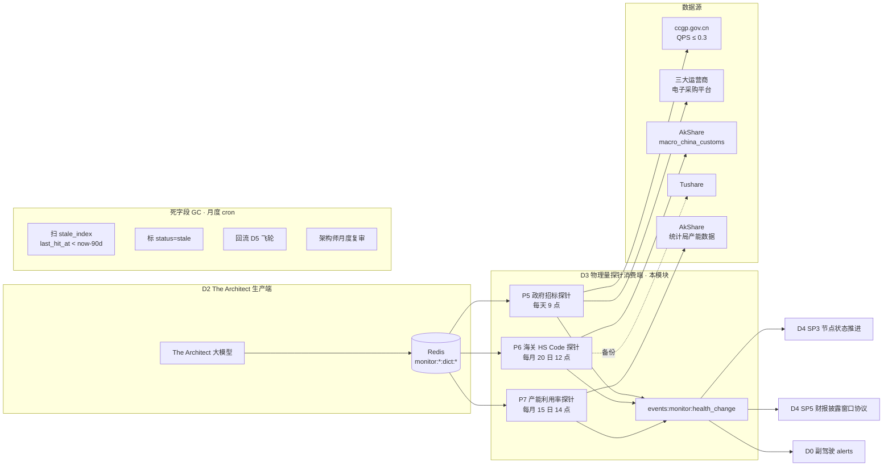

# L3 · 持仓监控 · 07 · 物理量探针设计（Lighthouse-Alpha · P5/P6/P7）

> [!NOTE] **[TRACEBACK] 原子规约锚点**
> - **上溯 L1**：[基石 ⑦·持仓监控 §7.2 "✅ 监控物理量探针读数"](../../01_顶层概念/06_投资哲学体系总纲.md#基石-持仓监控哲学边界维度三持仓监控)
> - **上溯 L2**：[D3 §6A.1~6A.3 Lighthouse-Alpha 物理量探针接入](../../02_战略维度/03_维度三_持仓监控/04_持仓策略与战场分配实践规划.md#六a-lighthouse-alpha-物理量探针接入承接-l1-72a-物理量探针读数哲学边界)
> - **同模块**：[01_目标与边界](./01_目标与边界_设计.md) / [02_后端服务子模块](./02_后端服务子模块_设计.md) / [03_接口契约](./03_接口契约_设计.md)
> - **生产端关联（D2）**：[D2 The Architect 监控字典生成 §3.6](../02_维度二_纵深进攻/07_主动嗅探层_设计.md#36-the-architect-监控字典生成-the_architect_service)
> - **下沉 L3 step**：[step_03 价格与事件探针 §3.5.4 物理量探针 P5/P6/P7](./stages/stage_1_启动期/steps/step_03_价格与事件探针.md)
> - **共享规约**：[18_动态采集流水线](../_共享规约/18_动态采集流水线规约.md) §3.2 + §五 Redis namespace / [20_监控字典](../_共享规约/20_监控字典规约.md) §五消费端契约
> - **DNA**：[`_System_DNA/03_holding_watch/dna_state_watch_physical_probes.yaml`](../_System_DNA/03_holding_watch/dna_state_watch_physical_probes.yaml) (Y03)
> - **PRD 引用**：`_drafts/lighthouse_alpha_PRD.md` §3.3 + §4.2

> [!IMPORTANT] **验证后资源释放** 见 [_共享规约/17](../_共享规约/17_L3设计文档_验证后资源释放规约.md)。

---

## 一、本模块定位

物理量探针 P5/P6/P7 是 D3 持仓监控**消费 D2 The Architect 监控字典**的工程通道——把"印在财报之前的物理与商业真实数据"（PRD §1 愿景）转化为 thesis 卡逻辑链节点的状态机推进信号，触发 D4 SP3/SP5 的 advice。

**核心理念**（承接 L1 §6.3）：
> 物理优先于财务：当物理量与财务数字冲突时，**优先信物理量**——财报有 30~90 天披露滞后，物理量是"印在财报之前"的真实数据。

**模块边界**：
| ✅ 本模块 | ❌ 其他模块 |
|---|---|
| P5/P6/P7 三探针的数据采集 + 阈值判定 + alert 事件产出 | The Architect 监控字典生成（归 D2 §3.6 + 共享规约 20）|
| 监控字典消费端 5 约束（MC1~MC5）| 监控字典 jsonschema（归共享规约 20 §二）|
| 死字段 GC 月度 cron | D4 SP3/SP5 协议执行（归 D4 step_05）|

---

## 二、模块架构总览



---

## 三、三探针详细设计

### 3.1 P5 政府招标物理量探针（`probe_p5_government_bidding`）

**主责**：每天 9:00 轮询监控字典中 `probe_id=P5` 的字段，调用 Playwright 抓取 ccgp + 三大运营商电子采购平台。

**数据源**（DNA Y03 `physical_probes.P5.preferred_sources`）：

| source | URL | QPS | UA 策略 |
|---|---|---|---|
| 中国政府采购网 | https://www.ccgp.gov.cn | **≤ 0.3** | 5 UA 池轮换 |
| 三大运营商电子采购 | https://b2b.{10086,10010,10000}.com.cn | ≤ 0.3 | 同上 |

**典型阈值**（PRD §3.3 液冷案例）：

| 阈值 ID | 触发条件 | 等级 | D4 动作 |
|---|---|---|---|
| `bid_amount_surge` | 近 30 天累计中标 ≥ 上一年总营收 **20%** | 🟢 GREEN | D4 SP3 增持权重 +1.5σ |
| `bid_amount_collapse` | 近 30 天中标环比骤降 **≥ 60%** | 🔴 RED | D4 SP3 节点 broken |

**示例（PRD §3.3 英维克）**：监控字典 `field_liquid_cooling_bid` → P5 每天扫 ccgp + 三大运营商 → "智算中心" + "液冷" + "冷板式" + "中标候选人" 关键词 → 累计金额 ≥ 上一年营收 20% → 触发 GREEN。

---

### 3.2 P6 海关 HS Code 出口量探针（`probe_p6_customs_export`）

**主责**：每月 20 日海关数据发布后 1 小时内（12:00）轮询监控字典中 `probe_id=P6` 的字段，调 AkShare 海关 API。

**强制规则**（共享规约 18 §六 V1）：**禁止** Playwright 直连 `stats.customs.gov.cn` —— 一律走 AkShare 或备份 Tushare。

**典型阈值**（PRD §3.3 中际旭创案例）：

| 阈值 ID | 触发条件 | 等级 | D4 动作 |
|---|---|---|---|
| `export_surge` | 月度环比增长 > **30%** **且** 单价同比 ≥ **+10%** | 🟢 GREEN | D4 SP3 增持权重 +1.5σ |
| `export_shrink` | 月度环比 < **-20%** **且** 连续 2 月 | 🔴 RED | D4 SP3 节点 broken |

**示例（PRD §3.3 中际旭创）**：监控字典 `field_optical_export_us` → P6 每月 20 日 12 点扫 `akshare.macro_china_customs()` filter `HS Code: 85176239 (光通信设备), 目的地: 美国` → 环比 > 30% + 单价同比 ≥ 10% → 触发 GREEN。

---

### 3.3 P7 产业产能利用率探针（`probe_p7_capacity_utilization`）

**主责**：每月 15 日 14:00 轮询 `probe_id=P7` 字段，调 AkShare 统计局 API。

**典型阈值**：

| 阈值 ID | 触发条件 | 等级 | D4 动作 |
|---|---|---|---|
| `utilization_high` | 行业产能利用率 ≥ **85%** 且 在线扩产周期 ≥ 6 个月 | 🟢 GREEN | D4 SP3 节点 confirmed |
| `utilization_low` | 行业产能利用率连续 3 月 < **65%** | 🟡 YELLOW | D4 SP1/SP3 节点 weakened |

---

## 四、监控字典消费端契约（共享规约 20 §五 MC1~MC5）

| # | 约束 | 实现要点 |
|---|---|---|
| **MC1** | 消费前必须读 `monitor:{symbol}:dict:_meta` | 不存在 → 跳过该 symbol（不阻塞）|
| **MC2** | 轮询频率严格遵守 `polling_frequency` | P5 daily / P6 monthly_after_release / P7 monthly |
| **MC3** | 触发 alert 必须写 `last_hit_at` | `SET monitor:{symbol}:dict:{field_id}.last_hit_at = now`；防 GC 误删 |
| **MC4** | alert 事件必须含 `evidence_ref` | events:monitor:health_change 含 `monitor_field_id` + 调用 source 的 request_id |
| **MC5** | 不修改 monitor:* 业务字段语义 | 消费端仅可写 `last_hit_at` + `status`；其余字段只读（Redis 写权限分离）|

---

## 五、Alert 事件 schema

```yaml
events:monitor:health_change:
  event_id: str (uuid v4)
  event_type: "physical_probe_alert"
  produced_at: datetime
  symbol: str
  probe_id: P5 | P6 | P7
  monitor_field_id: str          # 引用 MonitorMatrix.monitor_matrix[].field_id
  thesis_card_id: str            # 反向追溯
  mapped_logic_chain_nodes: list[str]
  alert_level: GREEN | YELLOW | RED
  alert_threshold_struct:
    operator: gt | lt | mom_pct | yoy_pct | sum_pct
    value: float
    window_days: int
  observed_value: float          # 实际观测值
  evidence_ref:
    source: str                  # "akshare.macro_china_customs" / "ccgp.gov.cn"
    request_id: str
    raw_response_excerpt: str    # 前 500 字符
  trace_id: str
```

**强制约束**：alert_level=RED 时必须含 `evidence_ref.raw_response_excerpt`（便于 D4 SP3 reviewing 时人工复核）。

---

## 六、死字段 GC（共享规约 20 §七）

**月度 cron**（每月 1 日 02:00）：

```
1. 扫 monitor:dict:stale_index, score < (now - 90d)
2. 标记 monitor:{symbol}:dict:{field_id}.status = stale
3. 产 stale 列表 → D5 飞轮（→ The Architect 字典生成质量训练）
4. 架构师月度复审：reactivate / archive / 重生成
5. archive → DELETE Redis + 写历史表 monitor_dict_archive
```

**SLA**：

| 指标 | 启动期 | 扩展期 |
|---|---|---|
| 死字段比例 | ≤ 20% | ≤ 10% |
| GC 复审延迟 | ≤ 30 d | ≤ 7 d |

---

## 七、对外接口

| API | 方法 | 用途 |
|---|---|---|
| `POST /api/probes/{probe_id}/run` | POST | 手动触发单探针轮询 |
| `GET /api/probes/health` | GET | 三探针健康度（last_run / success / failure / latency）|
| `GET /api/monitor/dict/{symbol}` | GET | 查指定标的的监控字典（消费端只读）|
| `GET /api/monitor/dict/stale?days=90` | GET | 查死字段列表（架构师复审用）|
| `POST /api/monitor/dict/{field_id}/archive` | POST | 架构师手动 archive 死字段 |

---

## 八、失败模式与保护

| 失败 | 保护 |
|---|---|
| ccgp 触发反爬 | 退避 5 倍 + UA 轮换；连续 5 次失败标 `source_degraded` |
| AkShare API 不可用 | P6/P7 自动切 Tushare/聚宽降级；双源失败 → DLQ + 告警 |
| 监控字典 _meta 不存在 | 跳过该 symbol（不报错；意味着 D2 The Architect 还没生成）|
| alert 事件 Kafka 失败 | 直写本地 SQLite 缓冲；缓冲满 → 停 producer + 告警 |
| Redis 不可用 | 用本地 monitor:* yaml 缓存兜底 24h；超时 → 告警 |

---

## 九、关键设计取舍

1. **海关强制走 AkShare**：PRD §4.2 明确要求；ccgp 反爬严但海关验证码更变态——AkShare 是稳定通道
2. **P5 每天 P6/P7 每月**：与数据源更新节奏对齐（招标天级 / 海关月级 / 产能月级）
3. **alert 事件含完整 evidence_ref**：D4 SP3 reviewing 时必须能反向追溯到 source raw response
4. **死字段 GC 月度而非每日**：避免误删"临时低频但仍有价值"的字段；架构师复审是兜底
5. **永久 no-auto-execute**：P5/P6/P7 alert **仅产事件**；不嵌入 buy/qmt/auto_trade（与 D4 SP5 §11 PRD §5 翻译契约一致）

---

## 十、违反检测（CI）

| # | 违反 | 检测 |
|---|---|---|
| V1 | Playwright 直连 `stats.customs.gov.cn` | `make audit-no-customs-direct-scrape` |
| V2 | ccgp QPS > 0.3 | Prometheus 告警 + 集群日志 |
| V3 | 探针修改 monitor:* 业务字段（非 last_hit_at/status）| Redis 写权限分离 + 单测 |
| V4 | alert 事件不含 evidence_ref | runtime guard + 单测 |
| V5 | alert RED 事件不含 raw_response_excerpt | runtime guard |
| V6 | 死字段比例 > 20% 持续 7 天 | Prometheus 告警 |
| V7 | 探针 alert 嵌入 buy/qmt/auto_trade | runtime guard + `make audit-no-auto-execute-fields` |

---

## 十一、修订记录

| 日期 | 触发 | 内容 |
|---|---|---|
| 2026-05-21 | Lighthouse-Alpha 物理量探针 P5/P6/P7 L3 设计文档缺失 | 首版：①模块定位（物理优先于财务 + 印在财报之前）；②mermaid 架构图（生产端 ← 消费端 ← 数据源 + GC）；③P5/P6/P7 三探针详细设计（含 PRD §3.3 中际旭创 + 英维克实战示例）；④监控字典消费端 5 约束 MC1~MC5；⑤Alert 事件 schema（含 evidence_ref RED 强制 raw 摘录）；⑥死字段 GC 月度流程 + SLA；⑦5 个对外 API；⑧失败模式 5 行；⑨5 条关键取舍；⑩违反检测 V1~V7；TRACEBACK 上溯 L1 §7.2 + L2 D3 §6A + PRD §3.3 + §4.2；下沉 step_03 + DNA Y03 + 共享规约 18/20 |
