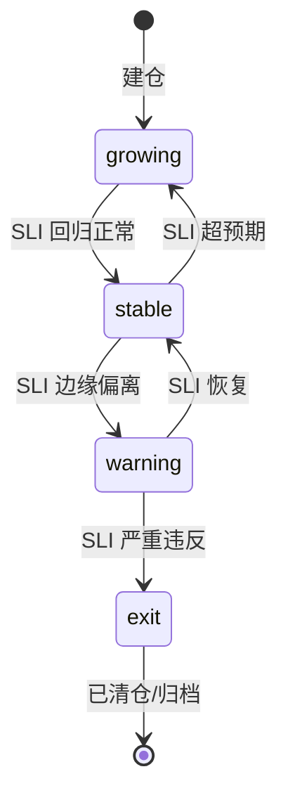

# 维度三·持仓监控·启动期·实践目标与策略

> [!NOTE] **[TRACEBACK] 实践锚点**
> - **L2 战略规划**: [维度三·目标与能力边界](../../../../02_战略维度/03_维度三_持仓监控/00_维度目标与能力边界.md)
> - **L3 模块设计**: [维度三_持仓监控/README](../../README.md) + [06_L2 落地清单](../../06_L2落地清单_设计.md)
> - **同阶段文档**: [02_技术方案](./02_技术方案与代码架构.md) / [03_数据采集](./03_数据采集与预处理.md) / [04_模型训练](./04_模型训练与部署.md) / [05_验收标准](./05_验收标准与检查清单.md)
> - **L1 哲学基石**: ③复杂自适应系统视角

---

## 一、本阶段目标

### 1.1 一句话目标

> **用节点 4 态状态机 + SLI 探针 + 健康度算法实现"持仓逻辑实时监控"的最小闭环，并输出 health_change 事件给维度零。**

### 1.2 核心概念：节点 4 态

| 状态 | 英文 | 语义 | 触发条件示例 |
|---|---|---|---|
| **生长态** | `growing` | 逻辑强化中，SLI 超预期 | 所有 SLI 高于阈值 + 健康度 ≥ 80 |
| **稳定态** | `stable` | 逻辑正常，SLI 达标 | 所有 SLI 在阈值内 + 健康度 60-80 |
| **警告态** | `warning` | 部分 SLI 偏离，需关注 | 1-2 个 SLI 边缘偏离 + 健康度 40-60 |
| **退出态** | `exit` | 逻辑失效，建议退出 | 关键 SLI 严重违反 + 健康度 < 40 |



### 1.3 量化目标

| 目标项 | 指标 | 阈值 |
|---|---|---|
| 状态机覆盖 | 持仓自动注册 | 100%（0 漏） |
| SLI 探针执行 | 按调度执行率 | 100% |
| 状态迁移准确率 | 4 态迁移误判 | 0（启动期） |
| 健康度计算 | 单次计算延迟 | < 500ms |
| 事件推送 | health_change → 维度零 | 成功率 ≥ 99.9% |
| 叙事一致性 | NLI 判断准确率 | ≥ 0.85 |

### 1.4 本阶段交付物

| 交付物 | 描述 | 验收方式 |
|---|---|---|
| 节点 4 态状态机 | LogicNode + 4 态枚举 + 状态迁移引擎 | 模拟 10 持仓，状态迁移正确 |
| SLI 探针调度器 | 4 类探针（财务/新闻/价格/事件）| 探针按调度执行 + 心跳正常 |
| 健康度算法 | SLI 加权 + 叙事一致性 | 输出 0-100 分数 |
| health_change 事件 | Redis Stream → 维度零 | 状态变更 5s 内送达 |
| 叙事一致性 LoRA v1 | Qwen2.5-7B + LoRA | NLI 准确率 ≥ 0.85 |
| 实践文档 | 本阶段 5 份实践设计文档 | 完整可执行 |

---

## 二、总体策略

### 2.1 核心策略：SLI 探针思想

借鉴 SRE/DevOps 的 SLI/SLO 方法论：

```
┌─────────────────────────────────────────────────────────────┐
│                    SLI 探针思想                              │
│  - 每笔持仓 = 一个被监控的 Service                          │
│  - 建仓时声明 3-5 个 SLI（可验证假设）                      │
│  - SLI 违反 → 触发状态迁移 → 产出 health_change 事件       │
└─────────────────────────────────────────────────────────────┘
```

**SLI 示例（持有某新能源车标的）**：
- SLI-1: 季度交付量同比增速 > 30%
- SLI-2: 毛利率 > 18%
- SLI-3: 经营性现金流为正
- SLI-4: 行业渗透率未到 50% 拐点
- SLI-5: 大股东未减持 > 1%

### 2.2 健康度计算策略

```
健康度 = α × SLI_score + β × 叙事一致性_score + γ × 时效性_score

其中：
- SLI_score: 各 SLI 加权评分（0-100）
- 叙事一致性_score: 建仓 thesis vs 当前事实的一致性（NLI 判断）
- 时效性_score: SLI 数据新鲜度惩罚

启动期权重：α=0.5, β=0.3, γ=0.2
```

### 2.3 健康度等级映射

| 健康度 | 等级 | 状态 | 动作 |
|---|---|---|---|
| 80-100 | A | `growing` | 继续持有，更新驾驶舱 |
| 60-79 | B | `stable` | 正常监控 |
| 40-59 | C | `warning` | 推送 review 提示 |
| 0-39 | D | `exit` | 升级到维度四 Exit Engine |

### 2.4 技术选型策略

| 层面 | 选型 | 理由 |
|---|---|---|
| Agent 编排 | LangGraph | 状态机工作流编排 |
| 事件流 | Redis Stream | 轻量、低延迟、持久化 |
| 存储 | SQLite（启动期）| 轻量，后续迁移 PostgreSQL |
| NLI 基座 | Qwen2.5-7B + LoRA | 中文能力强 + 私有部署 |
| 缓存 | Redis | 状态机实例缓存 |

### 2.5 数据策略

| 策略 | 说明 |
|---|---|
| **SLI 数据分类** | 财务型（季度）/ 新闻型（实时）/ 价格型（5min）/ 事件型（触发式）|
| **叙事一致性训练** | 100+ 对（thesis, 当前事实）标注对 |
| **健康度校准** | 历史持仓回测，校准 4 态阈值 |

### 2.6 部署策略：单节点起步

| 策略 | 说明 |
|---|---|
| **单节点部署** | 启动期在单台服务器部署 |
| **K3s 编排** | 轻量级 Kubernetes |
| **SQLite → PostgreSQL** | 启动期用 SQLite，扩展期迁移 |

---

## 三、实施路径（5 步）


| 步骤 | 名称 | step 锚（维内） | 主要产出 | 详细文档 |
|---|---|---|---|---|
| 1 | 状态机骨架 | step_01～02 | LogicNode + 4 态枚举 + Redis 缓存 | [02_技术方案](./02_技术方案与代码架构.md) |
| 2 | SLI 探针调度 | step_02～04 | 4 类探针 + 调度器 + 心跳 | [03_数据采集](./03_数据采集与预处理.md) |
| 3 | 健康度算法 | step_04～06 | 健康度计算 + 叙事一致性 LoRA | [04_模型训练](./04_模型训练与部署.md) |
| 4 | 事件推送 | step_06～07 | health_change → Redis Stream → 维度零 | [02_技术方案](./02_技术方案与代码架构.md) |
| 5 | 联调验收 | step_07～08 | 端到端测试 + 10 持仓模拟 | [05_验收标准](./05_验收标准与检查清单.md) |

---

## 四、风险与应对

| 风险 | 概率 | 影响 | 应对策略 |
|---|---|---|---|
| SLI 探针数据源中断 | 中 | 高 | 降级到上次有效值；超 N 天降级到 warning |
| 健康度算法误判（A → warning） | 中 | 中 | 架构师手工 override + 入归因库 |
| 叙事一致性 NLI 准确率不足 | 中 | 中 | 增加训练数据 + 调整 LoRA rank |
| Redis Stream 消息丢失 | 低 | 高 | 开启 AOF 持久化 + 消费确认 |
| 状态不一致（SQLite vs Redis） | 低 | 中 | Redis 重建 + 入审计日志 |

---

## 五、本阶段不做什么（明确边界）

| 不做的事 | 留待阶段 | 原因 |
|---|---|---|
| ❌ 卖出决策 | 维度四 | 本维度只产出信号，不下单 |
| ❌ 风险熔断（造假/暴雷） | 维度一 | 造假识别归极寒防御 |
| ❌ 多模板支持 | 扩展期 | 启动期先验证单模板 |
| ❌ 自适应探针频率 | 扩展期 | 先固定频率，后续再自适应 |
| ❌ 通知预算管理 | 扩展期 | 启动期直接推送 |
| ❌ 跨持仓相关性分析 | 完善期 | 先单持仓监控 |

---

## 六、成功标准

### 6.1 硬性准出条件

- [ ] 节点 4 态状态机可运行，状态迁移逻辑正确
- [ ] 10 持仓模拟，自动注册 0 漏
- [ ] SLI 探针 100% 按调度执行
- [ ] 4 态迁移 0 误判
- [ ] health_change 事件发送成功，5s 内送达维度零
- [ ] 叙事一致性 NLI 准确率 ≥ 0.85

### 6.2 软性目标

- [ ] 健康度计算单次 < 500ms
- [ ] 架构师日常使用无明显卡顿
- [ ] 文档完整可执行

---

## 七、负责人与时间

| 角色 | 负责人 | 职责 |
|---|---|---|
| 架构师 | @架构师 | 整体设计 + 数据标注 + 验收 |
| AI | Claude/GPT | 代码生成 + 文档补全 |

**预计周期**：8 周（0-2 月内完成）

---

## 修订记录

| 日期 | 内容 |
|---|---|
| 2026-05-16 | 初版，覆盖启动期目标、策略、路径、风险、边界 |
