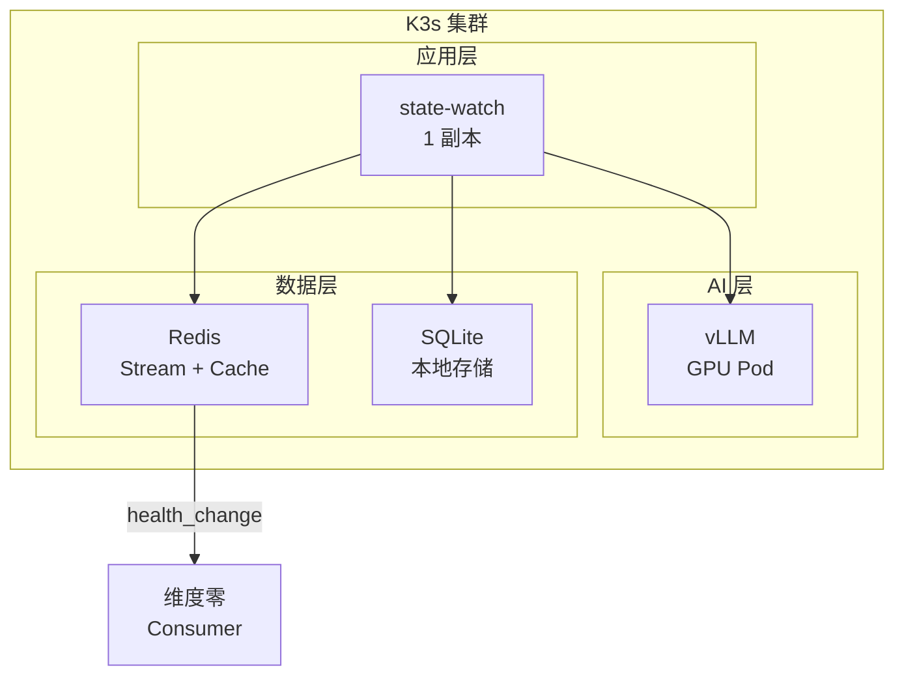

# 维度三·持仓监控·启动期·技术方案与代码架构

> [!NOTE] **[TRACEBACK] 实践锚点**
> - **本阶段策略**: [01_实践目标与策略](./01_实践目标与策略.md)
> - **L3 后端设计**: [维度三_持仓监控/02_后端服务子模块_设计](../../02_后端服务子模块_设计.md)
> - **L3 接口契约**: [维度三_持仓监控/03_接口契约_设计](../../03_接口契约_设计.md)

---

## 一、技术选型总览

### 1.1 技术栈矩阵

| 层面 | 技术选型 | 版本 | 说明 |
|---|---|---|---|
| **Agent 编排** | LangGraph | 0.1+ | 状态机工作流编排 |
| **事件流** | Redis Stream | 7.0+ | 低延迟事件分发 |
| **缓存** | Redis | 7.0+ | 状态机实例缓存 |
| **数据库** | SQLite（启动期） | 3.40+ | 轻量存储 |
| **基座模型** | Qwen2.5-7B-Instruct | latest | 叙事一致性 NLI |
| **微调框架** | LLaMA-Factory | 0.8+ | LoRA 支持 |
| **推理引擎** | vLLM | 0.4+ | 高吞吐推理 |
| **服务框架** | FastAPI + Uvicorn | 0.100+ | 异步 API |
| **容器编排** | K3s | 1.28+ | 轻量 Kubernetes |

### 1.2 硬件要求

| 组件 | 最低配置 | 推荐配置 |
|---|---|---|
| GPU | RTX 4090 24GB × 1 | RTX 4090 24GB × 1 |
| CPU | 8 核 | 16 核 |
| 内存 | 32GB | 64GB |
| 存储 | 256GB SSD | 512GB NVMe |

---

## 二、代码仓库结构

```
diting-src/
├── state_watch/                     # 状态机监控模块
│   ├── __init__.py
│   ├── config.py                    # 配置管理
│   ├── state_machine/               # 节点 4 态状态机
│   │   ├── __init__.py
│   │   ├── states.py                # 4 态枚举定义
│   │   ├── node.py                  # LogicNode 实体
│   │   ├── transition_engine.py     # 状态迁移引擎
│   │   ├── registry.py              # 状态机注册表
│   │   └── cache.py                 # Redis 缓存层
│   ├── probes/                      # SLI 探针
│   │   ├── __init__.py
│   │   ├── base_probe.py            # 探针基类
│   │   ├── scheduler.py             # 探针调度器
│   │   ├── financial_probe.py       # 财务型探针（季度）
│   │   ├── news_probe.py            # 新闻型探针（实时）
│   │   ├── price_probe.py           # 价格型探针（5min）
│   │   └── event_probe.py           # 事件型探针（触发式）
│   ├── health/                      # 健康度算法
│   │   ├── __init__.py
│   │   ├── calculator.py            # 健康度计算器
│   │   ├── sli_aggregator.py        # SLI 聚合器
│   │   └── narrative_nli.py         # 叙事一致性 NLI
│   ├── events/                      # 事件处理
│   │   ├── __init__.py
│   │   ├── health_change.py         # health_change 事件
│   │   ├── stream_publisher.py      # Redis Stream 发布
│   │   └── stream_consumer.py       # Redis Stream 消费
│   ├── llm/                         # LLM 调用封装
│   │   ├── __init__.py
│   │   ├── vllm_client.py           # vLLM 客户端
│   │   └── lora_manager.py          # LoRA 管理
│   ├── api/                         # API 层
│   │   ├── __init__.py
│   │   ├── main.py                  # FastAPI 入口
│   │   ├── routes/
│   │   │   ├── state_machine.py     # /api/state-machine/*
│   │   │   ├── health.py            # /api/health/*
│   │   │   └── probes.py            # /api/probes/*
│   │   └── middlewares/
│   │       └── logging.py           # 请求日志
│   └── db/                          # 数据库
│       ├── __init__.py
│       ├── models.py                # SQLAlchemy 模型
│       └── migrations/              # Alembic 迁移
├── tests/                           # 测试
│   ├── state_watch/
│   │   ├── test_state_machine.py
│   │   ├── test_probes.py
│   │   ├── test_health.py
│   │   └── test_events.py
│   └── integration/
│       └── test_e2e_monitoring.py
├── training/                        # 训练相关
│   ├── data/
│   │   ├── narrative_nli/           # 叙事一致性训练数据
│   │   └── verified/                # 架构师 verified
│   ├── configs/
│   │   └── narrative_nli_lora.yaml  # LLaMA-Factory 配置
│   └── scripts/
│       ├── train_nli.sh             # 训练脚本
│       └── evaluate_nli.sh          # 评测脚本
├── deploy/                          # 部署配置
│   ├── k3s/
│   │   ├── state-watch-deployment.yaml
│   │   ├── redis-deployment.yaml
│   │   └── vllm-deployment.yaml
│   └── docker/
│       ├── Dockerfile.state-watch
│       └── Dockerfile.vllm
├── pyproject.toml                   # 依赖管理
└── Makefile                         # 常用命令
```

---

## 三、核心模块设计

### 3.1 节点 4 态状态机

```python
# state_watch/state_machine/states.py

from enum import Enum

class NodeState(Enum):
    """节点 4 态枚举"""
    GROWING = "growing"    # 生长态：逻辑强化中
    STABLE = "stable"      # 稳定态：逻辑正常
    WARNING = "warning"    # 警告态：部分 SLI 偏离
    EXIT = "exit"          # 退出态：逻辑失效

# 合法迁移路径
VALID_TRANSITIONS = {
    NodeState.GROWING: [NodeState.STABLE],
    NodeState.STABLE: [NodeState.GROWING, NodeState.WARNING],
    NodeState.WARNING: [NodeState.STABLE, NodeState.EXIT],
    NodeState.EXIT: [],  # 终态
}
```

```python
# state_watch/state_machine/node.py

from dataclasses import dataclass, field
from datetime import datetime
from typing import List, Dict, Any, Optional
from .states import NodeState

@dataclass
class SLI:
    """SLI 定义"""
    id: str
    name: str                    # e.g. "季度交付量同比增速"
    metric: str                  # e.g. "quarterly_delivery_yoy"
    threshold: float             # e.g. 0.30
    operator: str                # e.g. ">"
    weight: float                # 权重（0-1）
    probe_type: str              # financial/news/price/event
    current_value: Optional[float] = None
    last_updated: Optional[datetime] = None

@dataclass
class LogicNode:
    """逻辑节点（持仓状态机实例）"""
    id: str
    symbol: str                  # 股票代码
    name: str                    # 公司名称
    thesis_id: str               # 关联的建仓 thesis
    thesis_summary: str          # 建仓逻辑摘要
    
    state: NodeState = NodeState.GROWING
    health_score: float = 100.0  # 健康度（0-100）
    slis: List[SLI] = field(default_factory=list)
    
    state_entered_at: datetime = field(default_factory=datetime.now)
    history: List[Dict[str, Any]] = field(default_factory=list)
    context: Dict[str, Any] = field(default_factory=dict)
    
    created_at: datetime = field(default_factory=datetime.now)
    updated_at: datetime = field(default_factory=datetime.now)
```

```python
# state_watch/state_machine/transition_engine.py

from typing import Optional, Tuple
from datetime import datetime
from .states import NodeState, VALID_TRANSITIONS
from .node import LogicNode
from ..events.health_change import HealthChangeEvent, publish_health_change

class TransitionEngine:
    """状态迁移引擎"""
    
    # 健康度 → 状态映射阈值
    HEALTH_THRESHOLDS = {
        NodeState.GROWING: 80,   # >= 80 → growing
        NodeState.STABLE: 60,    # >= 60 → stable
        NodeState.WARNING: 40,   # >= 40 → warning
        NodeState.EXIT: 0,       # < 40 → exit
    }
    
    def evaluate_transition(
        self, 
        node: LogicNode, 
        new_health_score: float
    ) -> Tuple[Optional[NodeState], str]:
        """
        根据新健康度评估是否需要状态迁移
        返回: (新状态, 迁移原因) 或 (None, "无需迁移")
        """
        # 计算目标状态
        target_state = self._health_to_state(new_health_score)
        
        # 检查是否需要迁移
        if target_state == node.state:
            return None, "无需迁移"
        
        # 检查迁移合法性
        if target_state not in VALID_TRANSITIONS.get(node.state, []):
            # 非法迁移，走缓冲逻辑（警告但不迁移）
            return None, f"非法迁移: {node.state.value} → {target_state.value}"
        
        reason = f"健康度 {node.health_score:.1f} → {new_health_score:.1f}"
        return target_state, reason
    
    def apply_transition(
        self,
        node: LogicNode,
        new_state: NodeState,
        new_health_score: float,
        reason: str,
        sli_snapshot: dict
    ) -> HealthChangeEvent:
        """
        应用状态迁移，返回 health_change 事件
        """
        old_state = node.state
        old_health = node.health_score
        
        # 记录历史
        node.history.append({
            "from_state": old_state.value,
            "to_state": new_state.value,
            "from_health": old_health,
            "to_health": new_health_score,
            "reason": reason,
            "timestamp": datetime.now().isoformat(),
            "sli_snapshot": sli_snapshot,
        })
        
        # 更新节点
        node.state = new_state
        node.health_score = new_health_score
        node.state_entered_at = datetime.now()
        node.updated_at = datetime.now()
        
        # 构造事件
        event = HealthChangeEvent(
            node_id=node.id,
            symbol=node.symbol,
            name=node.name,
            old_state=old_state.value,
            new_state=new_state.value,
            old_health=old_health,
            new_health=new_health_score,
            reason=reason,
            sli_snapshot=sli_snapshot,
            timestamp=datetime.now(),
        )
        
        # 发布事件到 Redis Stream
        publish_health_change(event)
        
        return event
    
    def _health_to_state(self, health: float) -> NodeState:
        """健康度映射到状态"""
        if health >= self.HEALTH_THRESHOLDS[NodeState.GROWING]:
            return NodeState.GROWING
        elif health >= self.HEALTH_THRESHOLDS[NodeState.STABLE]:
            return NodeState.STABLE
        elif health >= self.HEALTH_THRESHOLDS[NodeState.WARNING]:
            return NodeState.WARNING
        else:
            return NodeState.EXIT
```

### 3.2 健康度计算器

```python
# state_watch/health/calculator.py

from typing import List, Dict
from dataclasses import dataclass
from ..state_machine.node import LogicNode, SLI
from .narrative_nli import NarrativeNLI

@dataclass
class HealthResult:
    """健康度计算结果"""
    total_score: float           # 总健康度（0-100）
    sli_score: float             # SLI 得分（0-100）
    narrative_score: float       # 叙事一致性得分（0-100）
    freshness_score: float       # 时效性得分（0-100）
    sli_details: Dict[str, float]  # 各 SLI 得分
    
class HealthCalculator:
    """健康度计算器"""
    
    # 启动期权重
    ALPHA = 0.5  # SLI 权重
    BETA = 0.3   # 叙事一致性权重
    GAMMA = 0.2  # 时效性权重
    
    def __init__(self, nli_client: NarrativeNLI):
        self.nli = nli_client
    
    async def calculate(self, node: LogicNode) -> HealthResult:
        """
        计算健康度
        健康度 = α × SLI_score + β × 叙事一致性_score + γ × 时效性_score
        """
        # 1. 计算 SLI 得分
        sli_score, sli_details = self._calc_sli_score(node.slis)
        
        # 2. 计算叙事一致性得分
        narrative_score = await self._calc_narrative_score(node)
        
        # 3. 计算时效性得分
        freshness_score = self._calc_freshness_score(node.slis)
        
        # 4. 加权求和
        total_score = (
            self.ALPHA * sli_score +
            self.BETA * narrative_score +
            self.GAMMA * freshness_score
        )
        
        return HealthResult(
            total_score=total_score,
            sli_score=sli_score,
            narrative_score=narrative_score,
            freshness_score=freshness_score,
            sli_details=sli_details,
        )
    
    def _calc_sli_score(self, slis: List[SLI]) -> tuple[float, Dict[str, float]]:
        """
        计算 SLI 加权得分
        每个 SLI 根据是否达标给分：达标 100，边缘 50，违反 0
        """
        if not slis:
            return 100.0, {}
        
        total_weight = sum(s.weight for s in slis)
        if total_weight == 0:
            return 100.0, {}
        
        weighted_sum = 0.0
        details = {}
        
        for sli in slis:
            if sli.current_value is None:
                score = 50.0  # 无数据时给中间分
            else:
                score = self._evaluate_sli(sli)
            
            details[sli.id] = score
            weighted_sum += score * sli.weight
        
        return weighted_sum / total_weight, details
    
    def _evaluate_sli(self, sli: SLI) -> float:
        """评估单个 SLI 得分"""
        if sli.current_value is None:
            return 50.0
        
        # 根据 operator 评估
        ops = {
            ">": lambda v, t: v > t,
            ">=": lambda v, t: v >= t,
            "<": lambda v, t: v < t,
            "<=": lambda v, t: v <= t,
            "==": lambda v, t: abs(v - t) < 0.001,
        }
        
        op_func = ops.get(sli.operator, ops[">"])
        
        if op_func(sli.current_value, sli.threshold):
            return 100.0  # 达标
        elif op_func(sli.current_value, sli.threshold * 0.9):
            return 50.0   # 边缘（90% 阈值）
        else:
            return 0.0    # 违反
    
    async def _calc_narrative_score(self, node: LogicNode) -> float:
        """
        计算叙事一致性得分（NLI 判断）
        """
        # 构造输入：建仓 thesis vs 当前事实
        thesis = node.thesis_summary
        current_facts = self._gather_current_facts(node)
        
        # 调用 NLI 模型
        nli_result = await self.nli.evaluate(thesis, current_facts)
        
        # entailment → 100, neutral → 50, contradiction → 0
        score_map = {
            "entailment": 100.0,
            "neutral": 50.0,
            "contradiction": 0.0,
        }
        return score_map.get(nli_result.label, 50.0)
    
    def _calc_freshness_score(self, slis: List[SLI]) -> float:
        """计算时效性得分（数据新鲜度）"""
        from datetime import datetime, timedelta
        
        if not slis:
            return 100.0
        
        now = datetime.now()
        total = 0.0
        count = 0
        
        for sli in slis:
            if sli.last_updated:
                age = (now - sli.last_updated).total_seconds()
                # 超过 7 天开始扣分
                if age > 7 * 24 * 3600:
                    total += max(0, 100 - (age / (24 * 3600) - 7) * 5)
                else:
                    total += 100.0
                count += 1
        
        return total / count if count > 0 else 100.0
    
    def _gather_current_facts(self, node: LogicNode) -> str:
        """收集当前事实（用于 NLI）"""
        facts = []
        for sli in node.slis:
            if sli.current_value is not None:
                facts.append(f"{sli.name}: {sli.current_value}")
        return "; ".join(facts)
```

### 3.3 health_change 事件

```python
# state_watch/events/health_change.py

from dataclasses import dataclass, asdict
from datetime import datetime
from typing import Dict, Any
import json
import redis

@dataclass
class HealthChangeEvent:
    """健康度变化事件"""
    node_id: str
    symbol: str
    name: str
    old_state: str
    new_state: str
    old_health: float
    new_health: float
    reason: str
    sli_snapshot: Dict[str, Any]
    timestamp: datetime
    
    def to_dict(self) -> dict:
        d = asdict(self)
        d["timestamp"] = self.timestamp.isoformat()
        return d
    
    def to_json(self) -> str:
        return json.dumps(self.to_dict(), ensure_ascii=False)

# Redis Stream 配置
STREAM_NAME = "state_watch:health_change"
CONSUMER_GROUP = "dim_zero"

def get_redis_client() -> redis.Redis:
    """获取 Redis 客户端"""
    from ..config import settings
    return redis.Redis(
        host=settings.REDIS_HOST,
        port=settings.REDIS_PORT,
        db=settings.REDIS_DB,
        decode_responses=True,
    )

def publish_health_change(event: HealthChangeEvent) -> str:
    """
    发布 health_change 事件到 Redis Stream
    返回消息 ID
    """
    client = get_redis_client()
    
    # 发布到 Stream
    msg_id = client.xadd(
        STREAM_NAME,
        event.to_dict(),
        maxlen=10000,  # 保留最近 10000 条
    )
    
    return msg_id

def init_consumer_group():
    """初始化消费者组（维度零消费）"""
    client = get_redis_client()
    try:
        client.xgroup_create(STREAM_NAME, CONSUMER_GROUP, id="0", mkstream=True)
    except redis.ResponseError as e:
        if "BUSYGROUP" not in str(e):
            raise
```

---

## 四、API 设计

### 4.1 核心 API

```yaml
# 状态机 API
POST /api/state-machine/register
  Request:
    symbol: str
    name: str
    thesis_id: str
    thesis_summary: str
    slis: list[SLI]
  Response:
    node_id: str
    state: str
    health_score: float

GET /api/state-machine/{node_id}
  Response:
    node: LogicNode

GET /api/state-machine/by-symbol/{symbol}
  Response:
    nodes: list[LogicNode]

# 健康度 API
POST /api/health/calculate/{node_id}
  Response:
    total_score: float
    sli_score: float
    narrative_score: float
    freshness_score: float
    sli_details: object

# 探针 API
POST /api/probes/{node_id}/trigger
  Request:
    probe_type: "financial" | "news" | "price" | "event"
  Response:
    probe_result: ProbeResult

GET /api/probes/{node_id}/status
  Response:
    probes: list[ProbeStatus]
```

### 4.2 健康检查

```yaml
GET /health
  Response:
    status: "healthy" | "degraded"
    components:
      state_machine: "up" | "down"
      redis: "up" | "down"
      vllm: "up" | "down"
      sqlite: "up" | "down"
```

---

## 五、部署架构

### 5.1 K3s 部署图



### 5.2 资源配置

```yaml
# deploy/k3s/state-watch-deployment.yaml
apiVersion: apps/v1
kind: Deployment
metadata:
  name: state-watch
spec:
  replicas: 1  # 启动期单副本
  template:
    spec:
      containers:
      - name: state-watch
        image: diting/state-watch:v0.1
        resources:
          requests:
            cpu: "1"
            memory: "2Gi"
          limits:
            cpu: "2"
            memory: "4Gi"
        env:
        - name: REDIS_HOST
          value: "redis"
        - name: VLLM_URL
          value: "http://vllm:8000"
```

---

## 六、开发规范

### 6.1 代码规范

- Python 3.11+
- 类型注解（mypy strict）
- 格式化（ruff format）
- 测试覆盖率 ≥ 80%

### 6.2 Git 分支策略

```
main          # 生产分支
  └── dev     # 开发分支
      ├── feature/state-machine
      ├── feature/probes
      ├── feature/health-calculator
      └── feature/events
```

### 6.3 Makefile 常用命令

```makefile
# Makefile
.PHONY: dev test lint train deploy

dev:
	uvicorn state_watch.api.main:app --reload

test:
	pytest tests/ -v --cov=state_watch

lint:
	ruff check state_watch/
	mypy state_watch/

train-nli:
	bash training/scripts/train_nli.sh

deploy:
	kubectl apply -f deploy/k3s/
```

---

## 修订记录

| 日期 | 内容 |
|---|---|
| 2026-05-16 | 初版，覆盖技术选型、代码结构、核心模块、API、部署 |
