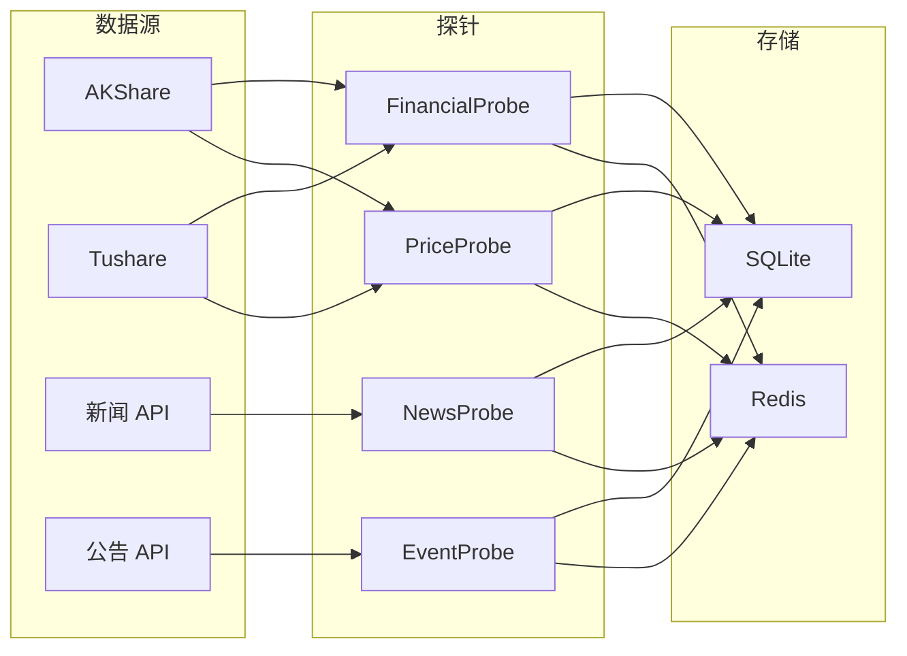

# 维度三·持仓监控·启动期·数据采集与预处理

> [!NOTE] **[TRACEBACK] 实践锚点**
> - **本阶段策略**: [01_实践目标与策略](./01_实践目标与策略.md)
> - **L3 数据契约**: [维度三_持仓监控/04_数据契约_设计](../../04_数据契约_设计.md)
> - **共享规约**: [11_数据采集与输入层规约](../../../_共享规约/11_数据采集与输入层规约.md)

---

## 一、数据需求总览

### 1.1 数据分类

| 类别 | 数据类型 | 频率 | 用途 | 探针类型 |
|---|---|---|---|---|
| **持仓列表** | 用户持仓 + 关联 thesis | 变更触发 | 状态机实例化 | - |
| **行情数据** | K 线、成交量、换手率 | 5min / 日 | 价格型 SLI | `price_probe` |
| **财务数据** | 财报、季度指标 | 季度 | 财务型 SLI | `financial_probe` |
| **公告数据** | 公司公告、定增、减持 | 实时 | 事件型 SLI | `event_probe` |
| **新闻数据** | 新闻、舆情、研报 | 实时 | 新闻型 SLI | `news_probe` |
| **Thesis 文本** | 建仓逻辑 | 建仓时 | 叙事一致性 NLI | - |

### 1.2 数据量估算（启动期）

| 数据类型 | 预估规模 | 存储方式 |
|---|---|---|
| 持仓列表 | ~50 持仓 | SQLite |
| 行情数据 | ~50 × 250 天 × 48 条/天 | SQLite / 外部数据源 |
| 财务数据 | ~50 × 4 季度 × 5 年 | SQLite / 外部数据源 |
| 公告数据 | ~50 × 50 条/年 | SQLite |
| 新闻数据 | ~50 × 100 条/年 | SQLite |
| Thesis 文本 | ~50 条 | SQLite |

---

## 二、SLI 探针数据详情

### 2.1 财务型探针（financial_probe）

**调度频率**：季度（财报发布后触发）

| 指标 | 字段名 | 说明 | SLI 示例 |
|---|---|---|---|
| 营业收入 | `revenue` | 季度营收 | 同比增速 > 20% |
| 净利润 | `net_profit` | 归母净利润 | 连续 3 季度为正 |
| 毛利率 | `gross_margin` | 毛利率 | > 18% |
| 经营现金流 | `operating_cf` | 经营活动现金流 | > 0 |
| 资产负债率 | `debt_ratio` | 资产负债率 | < 60% |
| ROE | `roe` | 净资产收益率 | > 10% |
| 交付量（行业） | `delivery_qty` | 适用于车企等 | 同比增速 > 30% |

**数据源**：
- 优先：AKShare / Tushare
- 备选：公司财报 PDF 解析

```python
# state_watch/probes/financial_probe.py

from dataclasses import dataclass
from typing import Optional
from datetime import datetime
from .base_probe import BaseProbe, ProbeResult

@dataclass
class FinancialData:
    """财务数据"""
    symbol: str
    report_date: str          # e.g. "2026Q1"
    revenue: float            # 营业收入（亿）
    revenue_yoy: float        # 同比增速
    net_profit: float         # 净利润（亿）
    net_profit_yoy: float
    gross_margin: float       # 毛利率（%）
    operating_cf: float       # 经营现金流（亿）
    debt_ratio: float         # 资产负债率（%）
    roe: float                # ROE（%）

class FinancialProbe(BaseProbe):
    """财务型探针"""
    
    probe_type = "financial"
    
    async def fetch(self, symbol: str) -> ProbeResult:
        """获取最新财务数据"""
        # 1. 从数据源获取
        data = await self._fetch_from_source(symbol)
        
        # 2. 标准化
        standardized = self._standardize(data)
        
        return ProbeResult(
            probe_type=self.probe_type,
            symbol=symbol,
            data=standardized,
            fetched_at=datetime.now(),
            success=True,
        )
    
    async def _fetch_from_source(self, symbol: str):
        """从数据源获取"""
        # TODO: 接入 AKShare / Tushare
        pass
```

### 2.2 新闻型探针（news_probe）

**调度频率**：实时流 / 定时轮询（5min）

| 指标 | 字段名 | 说明 | SLI 示例 |
|---|---|---|---|
| 新闻情感 | `sentiment_score` | -1 到 1 | 周均 > -0.3 |
| 负面新闻数 | `negative_count` | 负面新闻数量 | 周内 < 3 条 |
| 利好事件 | `positive_event` | 利好标记 | 有则加分 |
| 利空事件 | `negative_event` | 利空标记 | 有则触发 warning |

**数据源**：
- 新闻 API / RSS
- 公司公告解析

```python
# state_watch/probes/news_probe.py

from dataclasses import dataclass
from typing import List
from .base_probe import BaseProbe, ProbeResult

@dataclass
class NewsItem:
    """新闻条目"""
    title: str
    content: str
    source: str
    publish_time: str
    sentiment: float          # -1 到 1
    event_type: str           # positive/negative/neutral

class NewsProbe(BaseProbe):
    """新闻型探针"""
    
    probe_type = "news"
    
    async def fetch(self, symbol: str) -> ProbeResult:
        """获取最新新闻"""
        # 1. 获取近期新闻
        news_list = await self._fetch_news(symbol)
        
        # 2. 情感分析
        analyzed = await self._analyze_sentiment(news_list)
        
        # 3. 聚合统计
        aggregated = self._aggregate(analyzed)
        
        return ProbeResult(
            probe_type=self.probe_type,
            symbol=symbol,
            data=aggregated,
            fetched_at=datetime.now(),
            success=True,
        )
```

### 2.3 价格型探针（price_probe）

**调度频率**：5 分钟 / 日级

| 指标 | 字段名 | 说明 | SLI 示例 |
|---|---|---|---|
| 收盘价 | `close` | 最新收盘价 | - |
| 涨跌幅 | `pct_change` | 日涨跌幅 | 单日跌幅 < -8% |
| 回撤 | `drawdown` | 从高点回撤 | < -15% |
| 换手率 | `turnover` | 换手率 | < 20%（异常高警告） |
| 成交量比 | `vol_ratio` | vs 20 日均量 | < 3x |
| RSI | `rsi_14` | 14 日 RSI | 30-70 正常 |
| 均线偏离 | `ma_deviation` | vs 20 日均线 | > -10% |

**数据源**：
- AKShare / Tushare
- 实时行情接口

```python
# state_watch/probes/price_probe.py

from dataclasses import dataclass
from .base_probe import BaseProbe, ProbeResult

@dataclass
class PriceData:
    """价格数据"""
    symbol: str
    timestamp: str
    open: float
    high: float
    low: float
    close: float
    volume: float
    turnover: float           # 换手率
    pct_change: float         # 涨跌幅
    drawdown: float           # 回撤
    vol_ratio: float          # 量比
    rsi_14: float             # RSI
    ma20: float               # 20 日均线
    ma_deviation: float       # 均线偏离

class PriceProbe(BaseProbe):
    """价格型探针"""
    
    probe_type = "price"
    
    async def fetch(self, symbol: str) -> ProbeResult:
        """获取最新行情"""
        # 1. 获取原始行情
        raw = await self._fetch_quote(symbol)
        
        # 2. 计算衍生指标
        derived = self._calculate_derived(raw)
        
        return ProbeResult(
            probe_type=self.probe_type,
            symbol=symbol,
            data=derived,
            fetched_at=datetime.now(),
            success=True,
        )
```

### 2.4 事件型探针（event_probe）

**调度频率**：事件触发（公告发布）

| 指标 | 字段名 | 说明 | SLI 示例 |
|---|---|---|---|
| 大股东减持 | `major_reduce` | 减持比例 | < 1% |
| 定增 | `private_placement` | 定增事件 | - |
| 股权质押 | `pledge_ratio` | 质押比例 | < 50% |
| 高管变更 | `exec_change` | 关键高管变更 | 无 CEO/CFO 变更 |
| 诉讼仲裁 | `litigation` | 重大诉讼 | 无重大诉讼 |
| 监管处罚 | `penalty` | 监管处罚 | 无处罚 |

**数据源**：
- 公司公告 API
- 交易所公告

```python
# state_watch/probes/event_probe.py

from dataclasses import dataclass
from typing import List, Optional
from .base_probe import BaseProbe, ProbeResult

@dataclass
class CorporateEvent:
    """公司事件"""
    event_type: str           # reduce/placement/pledge/exec_change/litigation/penalty
    event_date: str
    description: str
    severity: str             # high/medium/low
    amount: Optional[float]   # 涉及金额/比例

class EventProbe(BaseProbe):
    """事件型探针"""
    
    probe_type = "event"
    
    async def fetch(self, symbol: str) -> ProbeResult:
        """获取最新事件"""
        # 1. 获取近期公告
        announcements = await self._fetch_announcements(symbol)
        
        # 2. 事件抽取
        events = await self._extract_events(announcements)
        
        # 3. 严重度评估
        assessed = self._assess_severity(events)
        
        return ProbeResult(
            probe_type=self.probe_type,
            symbol=symbol,
            data={"events": assessed},
            fetched_at=datetime.now(),
            success=True,
        )
```

---

## 三、探针调度器

### 3.1 调度策略

| 探针类型 | 调度方式 | 频率 | 说明 |
|---|---|---|---|
| `financial_probe` | cron | 季度 | 财报发布日 +1 天触发 |
| `news_probe` | 轮询 | 5 分钟 | 可降级到 15 分钟 |
| `price_probe` | 轮询 | 5 分钟 | 交易时段 |
| `event_probe` | 事件触发 | 实时 | 公告发布时触发 |

### 3.2 调度器实现

```python
# state_watch/probes/scheduler.py

from typing import Dict, List
from datetime import datetime, time
import asyncio
from apscheduler.schedulers.asyncio import AsyncIOScheduler
from apscheduler.triggers.cron import CronTrigger
from apscheduler.triggers.interval import IntervalTrigger

from .base_probe import BaseProbe, ProbeResult
from .financial_probe import FinancialProbe
from .news_probe import NewsProbe
from .price_probe import PriceProbe
from .event_probe import EventProbe
from ..state_machine.registry import get_all_active_nodes
from ..health.calculator import HealthCalculator
from ..state_machine.transition_engine import TransitionEngine

class ProbeScheduler:
    """探针调度器"""
    
    def __init__(
        self,
        health_calc: HealthCalculator,
        transition_engine: TransitionEngine,
    ):
        self.scheduler = AsyncIOScheduler()
        self.health_calc = health_calc
        self.transition_engine = transition_engine
        
        # 初始化探针
        self.probes: Dict[str, BaseProbe] = {
            "financial": FinancialProbe(),
            "news": NewsProbe(),
            "price": PriceProbe(),
            "event": EventProbe(),
        }
    
    def start(self):
        """启动调度器"""
        # 价格探针：5 分钟（交易时段）
        self.scheduler.add_job(
            self._run_price_probes,
            IntervalTrigger(minutes=5),
            id="price_probe",
        )
        
        # 新闻探针：5 分钟
        self.scheduler.add_job(
            self._run_news_probes,
            IntervalTrigger(minutes=5),
            id="news_probe",
        )
        
        # 财务探针：每天检查是否有新财报
        self.scheduler.add_job(
            self._run_financial_probes,
            CronTrigger(hour=9, minute=0),
            id="financial_probe",
        )
        
        # 事件探针：每小时检查新公告
        self.scheduler.add_job(
            self._run_event_probes,
            IntervalTrigger(hours=1),
            id="event_probe",
        )
        
        self.scheduler.start()
    
    async def _run_price_probes(self):
        """执行价格探针"""
        # 检查是否在交易时段
        if not self._is_trading_hours():
            return
        
        nodes = await get_all_active_nodes()
        for node in nodes:
            await self._execute_probe("price", node)
    
    async def _run_news_probes(self):
        """执行新闻探针"""
        nodes = await get_all_active_nodes()
        for node in nodes:
            await self._execute_probe("news", node)
    
    async def _run_financial_probes(self):
        """执行财务探针"""
        nodes = await get_all_active_nodes()
        for node in nodes:
            await self._execute_probe("financial", node)
    
    async def _run_event_probes(self):
        """执行事件探针"""
        nodes = await get_all_active_nodes()
        for node in nodes:
            await self._execute_probe("event", node)
    
    async def _execute_probe(self, probe_type: str, node):
        """执行单个探针并更新健康度"""
        probe = self.probes[probe_type]
        
        try:
            # 1. 执行探针
            result = await probe.fetch(node.symbol)
            
            # 2. 更新 SLI 值
            self._update_sli_values(node, probe_type, result)
            
            # 3. 重新计算健康度
            health = await self.health_calc.calculate(node)
            
            # 4. 评估状态迁移
            new_state, reason = self.transition_engine.evaluate_transition(
                node, health.total_score
            )
            
            # 5. 如需迁移则执行
            if new_state:
                self.transition_engine.apply_transition(
                    node,
                    new_state,
                    health.total_score,
                    reason,
                    health.sli_details,
                )
        except Exception as e:
            # 记录失败，不影响其他节点
            print(f"Probe failed for {node.symbol}: {e}")
    
    def _update_sli_values(self, node, probe_type: str, result: ProbeResult):
        """更新节点的 SLI 值"""
        for sli in node.slis:
            if sli.probe_type == probe_type:
                # 根据 metric 从 result.data 中提取值
                if sli.metric in result.data:
                    sli.current_value = result.data[sli.metric]
                    sli.last_updated = result.fetched_at
    
    def _is_trading_hours(self) -> bool:
        """检查是否在交易时段"""
        now = datetime.now()
        # 周末不交易
        if now.weekday() >= 5:
            return False
        # 9:30-11:30, 13:00-15:00
        t = now.time()
        morning = time(9, 30) <= t <= time(11, 30)
        afternoon = time(13, 0) <= t <= time(15, 0)
        return morning or afternoon
```

---

## 四、叙事一致性训练数据

### 4.1 数据格式

```json
{
  "thesis": "公司处于新能源车渗透率提升的红利期，交付量持续高增长，毛利率逐步改善",
  "current_facts": "Q1 交付量同比增长 45%，毛利率 19.2%，行业渗透率 35%",
  "label": "entailment",
  "annotator": "架构师",
  "created_at": "2026-05-16"
}
```

### 4.2 标签定义

| 标签 | 说明 | 示例 |
|---|---|---|
| `entailment` | 当前事实支持建仓逻辑 | 增速超预期 |
| `neutral` | 当前事实与逻辑无明显矛盾 | 增速略低但在预期内 |
| `contradiction` | 当前事实与逻辑矛盾 | 增速转负、毛利率大降 |

### 4.3 数据量目标

| 类型 | 数量 | 说明 |
|---|---|---|
| 训练集 | 100+ 对 | 架构师 verified |
| 验证集 | 20 对 | 用于调参 |
| 测试集 | 30 对 | 用于评测 |

---

## 五、数据质量保障

### 5.1 数据校验规则

| 规则 | 说明 | 处理 |
|---|---|---|
| 缺失值 | 关键字段缺失 | 标记 + 降级到上次有效值 |
| 异常值 | 超出合理范围 | 标记 + 人工复核 |
| 时效性 | 数据过期 | 触发重新采集 |
| 一致性 | 多源数据不一致 | 以官方源为准 |

### 5.2 数据血缘



---

## 六、启动期数据采集清单

### 6.1 必须完成

- [ ] AKShare / Tushare 接入（行情 + 财务）
- [ ] 探针调度器上线
- [ ] 叙事一致性训练数据 100+ 对
- [ ] 数据质量监控告警

### 6.2 可选（扩展期）

- [ ] 实时行情接口
- [ ] 公告全文解析
- [ ] 舆情监控

---

## 修订记录

| 日期 | 内容 |
|---|---|
| 2026-05-16 | 初版，覆盖数据需求、探针设计、调度器、训练数据 |
