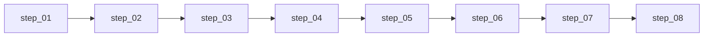

# 维度三·持仓监控·启动期

> [!NOTE] **[TRACEBACK] 追溯锚点**
> - **L2 战略规划**: [维度三·目标与能力边界](../../../../02_战略维度/03_维度三_持仓监控/00_维度目标与能力边界.md)
> - **本维度 L3 设计**: [维度三_持仓监控/README](../../README.md)
> - **L1 哲学基石**: ③复杂自适应系统视角
> - **本阶段总览**: [stages/README](../README.md)

> **[上架与环境（共通）]** **ECS + K3s · Helm · ACR · `diting-infra`→`deploy-engine`**。参见 [16](../../../_共享规约/16_阿里云ECS_K3s_ACR_Helm部署与deploy-engine链路.md)；**执行索引**：[steps/README](./steps/README.md)。

---

## 一、阶段定位

| 项 | 值 |
|---|---|
| **阶段** | 启动期（Stage 1）|
| **时段** | 0-2 月 |
| **核心目标** | 节点 4 态状态机 + SLI 探针 + 健康度监控实现持仓实时监控的最小闭环 |
| **成功标准** | 4 态迁移 0 误判、health_change 事件 5s 内送达维度零、叙事一致性 NLI ≥ 0.85 |

---

## 二、实践设计文档（5 份）

| # | 文档 | 内容 | 状态 |
|---|---|---|---|
| 01 | [01_实践目标与策略.md](./01_实践目标与策略.md) | 目标、节点 4 态、策略、路径、风险、边界 | ✅ |
| 02 | [02_技术方案与代码架构.md](./02_技术方案与代码架构.md) | 技术选型（LangGraph + Redis Stream + SQLite）、代码结构 state_watch/、API、部署 | ✅ |
| 03 | [03_数据采集与预处理.md](./03_数据采集与预处理.md) | 数据需求（持仓、行情、财报、公告）、SLI 探针数据、调度器 | ✅ |
| 04 | [04_模型训练与部署.md](./04_模型训练与部署.md) | 健康度 LoRA 训练、叙事一致性 NLI、vLLM 部署 | ✅ |
| 05 | [05_验收标准与检查清单.md](./05_验收标准与检查清单.md) | 验收指标、功能检查、集成测试、性能验收 | ✅ |

## 二·补 可执行步骤文档（执行层 · 8 份）⭐

> **2026-05-16 新增**：设计层拆解为 **8 份按 step 序号编排的可执行步骤**（日历与跨维映射见 [14](../../../_共享规约/14_六维度启动期统一节奏表.md) **§九**）。

**索引**：[steps/README.md](./steps/README.md)（8 个 step + 决策契约 + L4 回写预期）
**总量**：7,452 行可执行文档

---

## 三、核心概念

### 3.1 节点 4 态

| 状态 | 英文 | 语义 | 健康度范围 |
|---|---|---|---|
| **生长态** | `growing` | 逻辑强化中，SLI 超预期 | ≥ 80 |
| **稳定态** | `stable` | 逻辑正常，SLI 达标 | 60-79 |
| **警告态** | `warning` | 部分 SLI 偏离，需关注 | 40-59 |
| **退出态** | `exit` | 逻辑失效，建议退出 | < 40 |

### 3.2 健康度计算

```
健康度 = 0.5 × SLI得分 + 0.3 × 叙事一致性 + 0.2 × 时效性
```

### 3.3 health_change 事件

状态迁移时发送到 Redis Stream `state_watch:health_change`，由维度零消费。

---

## 四、交付物清单

| 交付物 | 描述 | 验收方式 |
|---|---|---|
| 节点 4 态状态机 | LogicNode + 状态迁移引擎 | 模拟 10 持仓正确 |
| SLI 探针调度器 | 4 类探针 + 调度器 | 100% 按调度执行 |
| 健康度算法 | SLI 加权 + 叙事一致性 | 输出 0-100 分数 |
| health_change 事件 | Redis Stream → 维度零 | 5s 内送达 |
| 叙事一致性 LoRA v1 | Qwen2.5-7B + LoRA | NLI ≥ 0.85 |

---

## 五、实施路径（step 序号权威）



详见 [steps/README.md](./steps/README.md)。

---

## 六、外部依赖

| 依赖维度 | 必须就绪的能力 | 用途 |
|---|---|---|
| 维度二·纵深进攻 | Thesis 卡片 + logic_chain | 节点自动注册 |
| 维度一·极寒防御 | RejectEvent | 强制 exit |
| 维度零 | health_change 消费者 | 事件消费 |
| 数据层 | 行情 + 财报 + 公告 | 探针数据源 |
| 基础设施 | K3s + Redis + vLLM | 运行环境 |

---

## 七、进阶条件

满足以下条件可进入扩展期：

- [ ] 节点 4 态状态机可运行，状态迁移正确
- [ ] 10 持仓模拟，自动注册 0 漏
- [ ] SLI 探针 100% 按调度执行
- [ ] 4 态迁移 0 误判
- [ ] health_change 事件 5s 内送达
- [ ] 叙事一致性 NLI ≥ 0.85
- [ ] 架构师验收签字

---

## 修订记录

| 日期 | 内容 |
|---|---|
| 2026-05-16 | 重构为 5 份实践设计文档体系 |
| 2026-05-17 | §五 改为 step 流水线图；去除「按周」叙事；指向 **14_ §九** |
