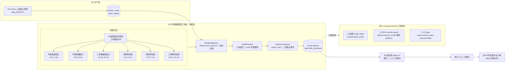

# L3 · 卖出决策 · 08 · SP5 财报披露窗口协议设计（Lighthouse-Alpha · The Timer 消费端）

> [!NOTE] **[TRACEBACK] 原子规约锚点**
> - **上溯 L1**：[基石 ⑥·进攻 §6.3 "财报后撤退"](../../01_顶层概念/06_投资哲学体系总纲.md#基石-进攻哲学边界维度二纵深进攻) + [基石 ⑦·持仓监控 §7.2 "✅ 监控物理量探针读数"](../../01_顶层概念/06_投资哲学体系总纲.md#基石-持仓监控哲学边界维度三持仓监控)
> - **上溯 L2**：[D3 §6A.3 财报披露窗口协议（消费 The Timer）](../../02_战略维度/03_维度三_持仓监控/04_持仓策略与战场分配实践规划.md#六a-lighthouse-alpha-物理量探针接入承接-l1-72a-物理量探针读数哲学边界)
> - **同模块**：[01_目标与边界](./01_目标与边界_设计.md) / [02_后端服务子模块](./02_后端服务子模块_设计.md) / [SP3 Thesis 失效协议](./stages/stage_1_启动期/steps/step_05_SP3_Thesis失效协议.md)
> - **生产端关联（D2）**：[D2 The Timer 三段窗口生产端 §3.7](../02_维度二_纵深进攻/07_主动嗅探层_设计.md#37-the-timer-三段窗口生产端-thesis_card_generator_service-的-the_timer-引擎) / [step_05 thesis 卡 §3.5.4](../02_维度二_纵深进攻/stages/stage_1_启动期/steps/step_05_thesis卡片生成器.md#354-lighthouse-alpha-the-timer-三段时间窗口预测生产端--严格对齐-prd-34)
> - **下沉 L3 step**：[step_05 SP3 Thesis 失效协议 §11 PRD §5 翻译契约](./stages/stage_1_启动期/steps/step_05_SP3_Thesis失效协议.md)
> - **共享规约**：[20_监控字典](../_共享规约/20_监控字典规约.md) §五消费端契约 / [19_异构 AI 调度栈](../_共享规约/19_异构AI调度栈规约.md)
> - **DNA**：[`_System_DNA/02_deep_strike/dna_deep_strike_theme_sniffer.yaml`](../_System_DNA/02_deep_strike/dna_deep_strike_theme_sniffer.yaml) `timer.*` section / [`dna_state_watch_physical_probes.yaml`](../_System_DNA/03_holding_watch/dna_state_watch_physical_probes.yaml) `permanent_no_auto_execute_rule`
> - **PRD 引用**：`_drafts/lighthouse_alpha_PRD.md` §3.4（The Timer）+ §5（QMT 自动执行规则）

> [!IMPORTANT] **验证后资源释放** 见 [_共享规约/17](../_共享规约/17_L3设计文档_验证后资源释放规约.md)。

---

## 一、本模块定位

SP5 财报披露窗口协议是 D4 卖出决策**消费 D2 The Timer 三段窗口预测**的工程化协议——把 thesis 卡 `timer_signal.three_phases` 与 A 股财报披露日历（年报/中报/三季报/预告）匹配，在合适窗口产出 advice，并**永久翻译 PRD §5 的"QMT 自动执行"为 diting 的"人工二次确认"语义**。

**核心理念**（承接 L1 §6.3 + §7.2）：
> **AI 提示 + 人工二次确认 = 卖出动作**——AI 永远不直接触发交易动作，最后一公里必须有人参与（PRD §5 译为 diting 的"永久 no-auto-execute 规则"）。

**模块边界**：

| ✅ 本模块 | ❌ 其他模块 |
|---|---|
| The Timer 三段窗口消费端规则 | The Timer 预测生产端（归 [D2 §3.7](../02_维度二_纵深进攻/07_主动嗅探层_设计.md#37-the-timer-三段窗口生产端-thesis_card_generator_service-的-the_timer-引擎)）|
| PRD §5 翻译契约（QMT 译"人工二次确认"）| SP3 Thesis 失效协议核心（归 step_05 SP3 §1~§10）|
| 6 cycle_type 财报日历窗口管理 | A 股财报日历数据维护（归 [_共享规约/05_交易日历](../_共享规约/05_交易日历规约.md)）|
| advice 事件出口 + 永久 no-auto-execute 三层防护 | advice UI 展示（归 D0 副驾驶）|

---

## 二、模块架构总览



---

## 三、子模块详细设计

### 3.1 WindowMatcher（窗口匹配器）

**主责**：每日 9:30（开盘前）扫描所有 thesis_cards，匹配当前日期与 `cycle_anchors[].expected_window`。

**算法**：

```
for thesis in active_thesis_cards:
    for anchor in thesis.timer_signal.cycle_anchors:
        if anchor.expected_window.start ≤ today ≤ anchor.expected_window.end:
            match[thesis.id] = anchor.cycle_type
        elif today ∈ A股财报日历[anchor.cycle_type]:
            # 容错：thesis 内 expected_window 漏配，但当前确属于该 cycle
            match[thesis.id] = anchor.cycle_type
            log_warning(f"thesis {thesis.id} cycle_anchor 未配但日历匹配")
```

---

### 3.2 RuleResolver（规则解析器）

**主责**：对 matched thesis，按 `timer_signal.three_phases × 当前 cycle` 计算应推 advice。

**规则矩阵**：

| three_phases | 当前 cycle | advice action | 触发条件 |
|---|---|---|---|
| incubation | pre_announce_h1/q3/annual | `add_advice` | thesis 物理探针（P5/P6/P7）GREEN 信号 + 监控字典字段 last_hit_at 在 7 天内 |
| incubation | h1_release/q3_release/annual_release | `wait_for_actual` | 预告期已过、披露期已到、等实际数字 |
| main_surge | h1_release/q3_release/annual_release | `hold_or_add` | 实际数字 ≥ 预告区间中位数 |
| retreat | h1_release/q3_release/annual_release 之后 +0~5 交易日 | `begin_exit_advice` | 放量滞涨 / 跌破 10 日均线 / 媒体高潮（三选一）|
| retreat | 任意 cycle | `force_exit_advice` | thesis SP3 节点 broken（与 SP3 联动）|

---

### 3.3 AdviceComposer（advice 合成器）

**输出**：写 Kafka `events:advice` topic（事件类型 `sp5_disclosure`），同时写 DB `advices` 表。

**Advice 事件 schema**：

```yaml
events:advice:
  event_id: str (uuid v4)
  event_type: "sp5_disclosure"
  produced_at: datetime
  symbol: str
  thesis_card_id: str
  cycle_type: enum [pre_announce_h1, h1_release, ..., annual_release]
  three_phase: incubation | main_surge | retreat
  action: add_advice | wait_for_actual | hold_or_add | begin_exit_advice | force_exit_advice
  reasoning: str            # 中文，引用 thesis.timer_signal 原文 + 当前财报日历
  evidence_ref:
    timer_signal_snapshot: object      # thesis 当时 timer_signal 快照
    physical_probe_alerts: list[str]   # 关联 P5/P6/P7 alert event_ids
  execute_mode: "advisory"  # 强制；永久 no-auto-execute 第 2 层
  human_confirmation_required: true
  trace_id: str
```

**强制约束**：
- `execute_mode` **必须**为 `"advisory"`（runtime guard 拒绝其他值）
- `human_confirmation_required` **必须**为 `true`
- **禁止**字段：`buy / qmt / auto_trade / order_id / webhook_target / api_endpoint / execute_endpoint`

---

## 四、PRD §5 翻译契约（永久 no-auto-execute 规则）

**这是本模块的最高优先级约束**——PRD §5 提到的"QMT 自动执行"在 diting 的语义必须永久翻译为"人工二次确认"。

### 4.1 翻译表

| PRD §5 原文 | diting 语义 |
|---|---|
| "QMT 自动执行" | **人工二次确认后的执行**（QMT 仅作为人工选择的下单工具之一）|
| "AI 信号自动下单" | **AI 信号产 advice → UI 展示 → 用户点击 → QMT/同花顺/手动**|
| "执行链路" | **建议链路 + 人工确认链路**|

### 4.2 三层防护（DNA Y03 `permanent_no_auto_execute_rule` + 共享规约 19 §九）

**第 1 层 · 配置层 forbid_fields**：

```yaml
permanent_no_auto_execute_rule:
  forbidden_fields_in_advice:
    - buy
    - qmt
    - auto_trade
    - order_id
    - webhook_target
    - api_endpoint
    - execute_endpoint
  required_fields_in_advice:
    - execute_mode: "advisory"
    - human_confirmation_required: true
```

**第 2 层 · SDK runtime guard**：

```python
class AdviceComposer:
    def compose(self, ...) -> Advice:
        advice = Advice(...)
        assert advice.execute_mode == "advisory", "FORBIDDEN: advice.execute_mode 必须为 advisory"
        assert advice.human_confirmation_required is True
        for field in FORBIDDEN_FIELDS:
            assert field not in advice.to_dict(), f"FORBIDDEN field: {field}"
        return advice
```

**第 3 层 · CI gate**：

```makefile
audit-no-auto-execute-fields:
    @grep -rE "(buy|qmt|auto_trade|order_id|webhook_target|api_endpoint|execute_endpoint)" \
        --include="*.py" diting-src/sp5/ && \
        (echo "VIOLATION: forbidden fields in SP5 module"; exit 1) || \
        echo "✅ no auto-execute fields detected"
```

### 4.3 违反检测（AU1~AU4）

| # | 违反 | 检测 |
|---|---|---|
| **AU1** | advice 出现 buy/qmt/auto_trade 字段 | runtime guard（pydantic schema 拒绝）|
| **AU2** | execute_mode 非 "advisory" | runtime guard |
| **AU3** | human_confirmation_required 非 true | runtime guard |
| **AU4** | SP5 模块代码 import qmt / 直接调下单 API | `make audit-no-auto-execute-fields` |

---

## 五、与 SP3 Thesis 失效协议的联动

SP5 是 SP3 的**时间维度补充**：

| 触发源 | SP3 触发 | SP5 触发 |
|---|---|---|
| 单节点 broken | ✅ | — |
| 三节点 weakened | ✅ | — |
| 财报披露 + retreat 三连击（放量滞涨 / 跌破 MA10 / 媒体高潮）| — | ✅ |
| 财报披露后实际数字低于预告区间下限 20% | — | ✅ + SP3 反向触发节点 broken |

**协作约定**：SP5 force_exit_advice 触发时，**必须**同时引发 SP3 节点 broken 联动（避免事件不一致）。

---

## 六、对外接口

| API | 方法 | 用途 |
|---|---|---|
| `GET /api/sp5/active-windows` | GET | 查当前生效的财报披露窗口（按 cycle_type）|
| `GET /api/sp5/thesis/{thesis_id}/timer` | GET | 查指定 thesis 的 timer_signal + 当前匹配 phase |
| `POST /api/sp5/match-now` | POST | 手动触发一次 WindowMatcher 全量扫描 |
| `GET /api/sp5/advices?date=` | GET | 查指定日期产出的 SP5 advice 事件列表 |
| `POST /api/advices/{advice_id}/confirm` | POST | **唯一人机交互入口**：用户点击二次确认 |

---

## 七、失败模式与保护

| 失败 | 保护 |
|---|---|
| The Timer 字段缺失（旧 thesis 卡）| 跳过该 thesis 并标 `timer_signal_missing`；不阻塞其他 thesis |
| A 股财报日历不可用 | 用本地 yaml 兜底（_共享规约/05 静态表）+ 告警 |
| advice 事件 Kafka 失败 | 直写本地 SQLite 缓冲；缓冲满 → 停 producer + 告警 |
| 重复匹配同一窗口 | 去重 key = `(thesis_id, cycle_type, phase)`；7 天 TTL |
| force_exit_advice 与 SP3 节点 broken 时序不一致 | 用同一 trace_id 关联；CI 集成测验时序 |

---

## 八、关键设计取舍

1. **永久 no-auto-execute 三层防护**：单层不够——配置 + runtime + CI 三层冗余才能确保不被绕过
2. **execute_mode 字段强制 advisory**：不允许枚举值扩展（如 "auto"）—— pydantic schema 锁死
3. **二次确认 API 是唯一对接交易系统的入口**：所有 advice → confirm → 用户选择下单工具；diting 不持有任何下单凭证
4. **WindowMatcher 每日 9:30 全量扫**：成本可控（thesis 数 < 100）+ 不漏 cycle 切换
5. **SP5 ↔ SP3 联动用同 trace_id**：审计链路完整；不允许 force_exit 没有对应的 SP3 节点 broken
6. **财报日历静态 yaml 兜底**：CalSvc 不可用时仍能匹配窗口（A 股财报日历相对固定）

---

## 九、违反检测（CI 总览）

| # | 违反 | 检测 |
|---|---|---|
| V1 | advice 缺 execute_mode 或 human_confirmation_required | runtime guard + 单测 |
| V2 | advice 出现 forbidden_fields（任一）| runtime guard + 单测 |
| V3 | SP5 模块代码直 import qmt / 调下单 API | `make audit-no-auto-execute-fields` |
| V4 | force_exit_advice 无对应 SP3 节点 broken 事件 | 集成测时序检查 |
| V5 | The Timer 字段缺失 thesis 仍产 advice | runtime guard |
| V6 | 同窗口 thesis 重复产 advice | 去重 key 单测 |
| V7 | 财报日历漂移（启动期 cycle 边界偏移 > 5 d）| 月度审计 |

---

## 十、修订记录

| 日期 | 触发 | 内容 |
|---|---|---|
| 2026-05-21 | Lighthouse-Alpha SP5 财报披露窗口协议 L3 设计文档缺失 | 首版：①模块定位（消费 The Timer + 永久翻译 PRD §5）；②mermaid 架构图（生产端 + 财报日历 + SP5 3 节点 + 永久 no-auto-execute 3 层防护）；③3 个子模块（WindowMatcher / RuleResolver / AdviceComposer）；④规则矩阵 5 行（含 incubation/main_surge/retreat × 6 cycle）；⑤Advice 事件 schema（execute_mode/human_confirmation_required 强制）；⑥**PRD §5 翻译契约**（翻译表 + 三层防护 + AU1~AU4）；⑦SP5↔SP3 联动；⑧5 个对外 API（含二次确认唯一入口）；⑨失败模式 5 行；⑩6 条关键取舍；⑪违反检测 V1~V7；TRACEBACK 上溯 L1 §6.3 + §7.2 + L2 D3 §6A.3 + PRD §3.4 + §5；下沉 step_05 SP3 §11 + DNA Y01.timer + Y03.permanent_no_auto_execute_rule + 共享规约 19/20 |
