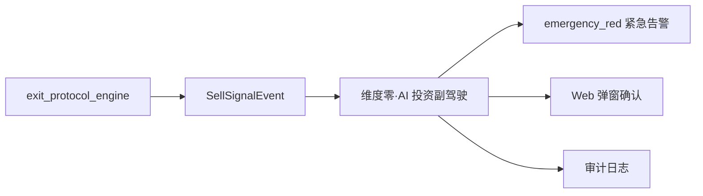

# 维度四·卖出决策·启动期·实践目标与策略

> [!NOTE] **[TRACEBACK] 实践锚点**
> - **L2 战略规划**: [维度四·卖出决策](../../../../02_战略维度/04_维度四_卖出决策/README.md)
> - **L3 模块设计**: [维度四_卖出决策/README](../../README.md) + [06_L2落地清单](../../06_L2落地清单_设计.md)
> - **同阶段文档**: [02_技术方案](./02_技术方案与代码架构.md) / [03_数据采集](./03_数据采集与预处理.md) / [04_模型训练](./04_模型训练与部署.md) / [05_验收标准](./05_验收标准与检查清单.md)
> - **L1 哲学基石**: ⑤防御（纪律性卖出）+ ⑥超级个体进化（自动化执行）

---

## 一、本阶段目标

### 1.1 一句话目标

> **用 4 类卖出协议 + 规则引擎实现"任何卖出决策必须符合纪律性协议"的最小闭环。**

### 1.2 量化目标

| 目标项 | 指标 | 阈值 |
|---|---|---|
| 协议覆盖 | 4 类卖出协议全部上线 | 止损/止盈/thesis 失效/再平衡 |
| 止损触发 | -15% 自动触发 | 0 漏触发 |
| 止盈触发 | +30% 自动触发（可配置）| 0 漏触发 |
| 事件推送 | sell_signal 事件推送成功率 | ≥ 99.9% |
| 系统可用性 | 单日可用性 | ≥ 99.5% |

### 1.3 本阶段交付物

| 交付物 | 描述 | 验收方式 |
|---|---|---|
| exit_protocol_engine | 4 类卖出协议规则引擎 | K8s Pod Running + 健康检查通过 |
| stop_loss_protocol | 止损协议：-15% 触发 | 规则测试通过 |
| take_profit_protocol | 止盈协议：+30% 触发（可配置）| 规则测试通过 |
| thesis_break_protocol | Thesis 失效协议：来自维度三 | 与维度三联调通过 |
| rebalance_protocol | 再平衡协议：仓位占比过高 | 规则测试通过 |
| SellSignalEvent | 卖出信号事件 schema + 推送 | 事件到达维度零 |
| 审计日志表 | exit_decision.audit_log | 每次判决可查 + 不可篡改 |

---

## 二、4 类卖出协议详解

### 2.1 止损协议（Stop Loss）

```yaml
协议名称: stop_loss_protocol
触发条件: 当前价格 ≤ 持仓成本 × (1 - 止损线)
默认阈值: -15%
可配置: 是（支持 -10% ~ -25% 范围）
优先级: P0（最高）
执行动作: 立即触发 sell_signal + 紧急告警
```

**触发逻辑**：
```python
def check_stop_loss(position: Position, config: Config) -> bool:
    """止损检查"""
    stop_loss_pct = config.get("stop_loss_pct", -0.15)  # 默认 -15%
    current_return = (position.current_price - position.cost) / position.cost
    return current_return <= stop_loss_pct
```

### 2.2 止盈协议（Take Profit）

```yaml
协议名称: take_profit_protocol
触发条件: 当前价格 ≥ 持仓成本 × (1 + 止盈线)
默认阈值: +30%
可配置: 是（支持 +20% ~ +100% 范围）
优先级: P1
执行动作:
  - 建议卖出部分仓位（默认 30%）
  - 触发 sell_signal + 常规通知
  - 剩余 70% 继续持有观察
```

**触发逻辑**：
```python
def check_take_profit(position: Position, config: Config) -> Optional[SellAdvice]:
    """止盈检查"""
    take_profit_pct = config.get("take_profit_pct", 0.30)  # 默认 +30%
    sell_ratio = config.get("take_profit_sell_ratio", 0.30)  # 卖出 30%
    
    current_return = (position.current_price - position.cost) / position.cost
    if current_return >= take_profit_pct:
        return SellAdvice(
            protocol="take_profit",
            symbol=position.symbol,
            sell_ratio=sell_ratio,
            reason=f"收益达到 {current_return:.1%}，触发止盈"
        )
    return None
```

### 2.3 Thesis 失效协议（Thesis Break）

```yaml
协议名称: thesis_break_protocol
触发来源: 维度三·持仓监控（HealthChangeEvent）
触发条件:
  - 基石类健康度 → broken_any
  - 反共识逻辑失效
  - 核心假设被证伪
优先级: P0
执行动作:
  - 5 个交易日缓冲期
  - 缓冲期内可撤销
  - 缓冲期结束强制触发 sell_signal
```

**触发逻辑**：
```python
def check_thesis_break(position: Position, health_event: HealthChangeEvent) -> bool:
    """Thesis 失效检查"""
    if health_event.position_id != position.id:
        return False
    
    # 基石类健康度变为 broken_any
    if health_event.new_health_status == HealthStatus.BROKEN_ANY:
        return True
    
    # 反共识逻辑失效
    if health_event.thesis_validity == ThesisValidity.INVALIDATED:
        return True
    
    return False
```

### 2.4 再平衡协议（Rebalance）

```yaml
协议名称: rebalance_protocol
触发条件: 单一持仓占总资产比例 > 再平衡阈值
默认阈值: 25%（单一持仓不超过总资产 25%）
可配置: 是（支持 15% ~ 40% 范围）
优先级: P2
执行动作:
  - 建议减仓至阈值以下
  - 触发 sell_signal + 常规通知
  - 保留核心仓位
```

**触发逻辑**：
```python
def check_rebalance(position: Position, portfolio: Portfolio, config: Config) -> Optional[SellAdvice]:
    """再平衡检查"""
    max_position_ratio = config.get("max_position_ratio", 0.25)  # 默认 25%
    
    position_value = position.quantity * position.current_price
    total_value = portfolio.total_value
    current_ratio = position_value / total_value
    
    if current_ratio > max_position_ratio:
        target_value = total_value * max_position_ratio
        sell_value = position_value - target_value
        sell_ratio = sell_value / position_value
        
        return SellAdvice(
            protocol="rebalance",
            symbol=position.symbol,
            sell_ratio=sell_ratio,
            reason=f"仓位占比 {current_ratio:.1%} 超过阈值 {max_position_ratio:.1%}"
        )
    return None
```

---

## 三、协议优先级与冲突处理

### 3.1 优先级矩阵

| 优先级 | 协议 | 触发后延迟 | 可撤销 |
|---|---|---|---|
| P0 | 止损 | 无延迟，立即执行 | 否 |
| P0 | Thesis 失效 | 5 个交易日缓冲 | 是（缓冲期内）|
| P1 | 止盈 | 1 个交易日延迟 | 是 |
| P2 | 再平衡 | 3 个交易日延迟 | 是 |

### 3.2 冲突处理规则

```
┌─────────────────────────────────────────────────────────────┐
│                    冲突处理规则                              │
│  1. 同时触发多个协议 → 按优先级执行最高优先级               │
│  2. 止损与止盈同时触发（极端行情）→ 止损优先                 │
│  3. Thesis 失效与再平衡同时触发 → Thesis 失效优先            │
│  4. 任意协议触发后记录审计日志                               │
└─────────────────────────────────────────────────────────────┘
```

---

## 四、总体策略

### 4.1 核心策略：纪律优先 + 可配置

```
┌─────────────────────────────────────────────────────────────┐
│                    策略一：纪律优先                          │
│  所有卖出必须基于协议 → 禁止情绪化卖出                      │
│  协议触发即执行 → 不因短期波动犹豫                          │
│  审计日志完整 → 事后可追溯可复盘                            │
└─────────────────────────────────────────────────────────────┘

┌─────────────────────────────────────────────────────────────┐
│                    策略二：可配置                            │
│  阈值可配置 → 适应不同风险偏好                              │
│  缓冲期可配置 → 平衡纪律与灵活                              │
│  卖出比例可配置 → 支持部分卖出                              │
└─────────────────────────────────────────────────────────────┘
```

### 4.2 技术选型策略

| 层面 | 选型 | 理由 |
|---|---|---|
| 规则引擎 | 自研 Python 规则引擎 | 简单规则，无需复杂 DSL |
| 状态管理 | LangGraph | Agent 工作流编排 |
| 事件总线 | Redis Stream | 高吞吐 + 持久化 |
| 服务框架 | FastAPI + Uvicorn | 轻量 + 异步 |
| 数据库 | PostgreSQL | 审计日志 + 配置存储 |

### 4.3 输出策略：统一推送维度零



---

## 五、实施路径（5 步）


| 步骤 | 名称 | step 锚（维内） | 主要产出 | 详细文档 |
|---|---|---|---|---|
| 1 | 基础设施就绪 | step_01～02 | PostgreSQL + Redis + K3s 部署 | [02_技术方案](./02_技术方案与代码架构.md) |
| 2 | 规则引擎骨架 | step_01～02 | exit_protocol_engine 服务骨架 | [02_技术方案](./02_技术方案与代码架构.md) |
| 3 | 4 类协议实现 | step_03～06 | 止损/止盈/thesis 失效/再平衡 | [03_数据采集](./03_数据采集与预处理.md) |
| 4 | 事件推送对接 | step_06～07 | SellSignalEvent + 维度零对接 | [02_技术方案](./02_技术方案与代码架构.md) |
| 5 | 联调与验收 | step_07～08 | 端到端测试 + 4 类协议验收 | [05_验收标准](./05_验收标准与检查清单.md) |

---

## 六、风险与应对

| 风险 | 概率 | 影响 | 应对策略 |
|---|---|---|---|
| 维度三健康度数据延迟 | 中 | 高 | Thesis 失效协议 abstain + 告警 |
| 止损误触发（极端波动）| 低 | 高 | 增加确认窗口 + 人工复核通道 |
| 事件推送失败 | 低 | 高 | 三通道重试 + 本地持久化 |
| 配置被误修改 | 低 | 中 | 配置变更审批 + 版本控制 |

---

## 七、本阶段不做什么（明确边界）

| 不做的事 | 留待阶段 | 原因 |
|---|---|---|
| ❌ LLM 深度推理卖出 | 扩展期 | 先跑通规则引擎 |
| ❌ 多策略组合卖出 | 完善期 | 先验证单协议效果 |
| ❌ 自动化执行交易 | 完善期 | 先做决策推送，执行由人确认 |
| ❌ 历史回测验证 | 扩展期 | 先上线基础协议 |
| ❌ 机会成本卖出 | 扩展期 | 启动期聚焦 4 类核心协议 |

---

## 八、成功标准

### 8.1 硬性准出条件

- [ ] 4 类卖出协议全部上线，K8s Pod Running
- [ ] 止损协议 -15% 触发 0 漏判
- [ ] 止盈协议 +30% 触发 0 漏判
- [ ] Thesis 失效协议与维度三联调通过
- [ ] 再平衡协议 25% 阈值触发正常
- [ ] SellSignalEvent 推送成功率 ≥ 99.9%
- [ ] 审计日志完整可查

### 8.2 软性目标

- [ ] 日均请求响应时间 < 500ms（P95）
- [ ] 架构师日常使用无明显卡顿
- [ ] 文档完整可执行

---

## 九、负责人与时间

| 角色 | 负责人 | 职责 |
|---|---|---|
| 架构师 | @架构师 | 整体设计 + 协议定义 + 验收 |
| AI | Claude/GPT | 代码生成 + 文档补全 |

**预计周期**：10 周（0-3 月内完成）

---

## 修订记录

| 日期 | 内容 |
|---|---|
| 2026-05-16 | 初版，覆盖启动期目标、4 类协议、策略、路径、风险、边界 |
