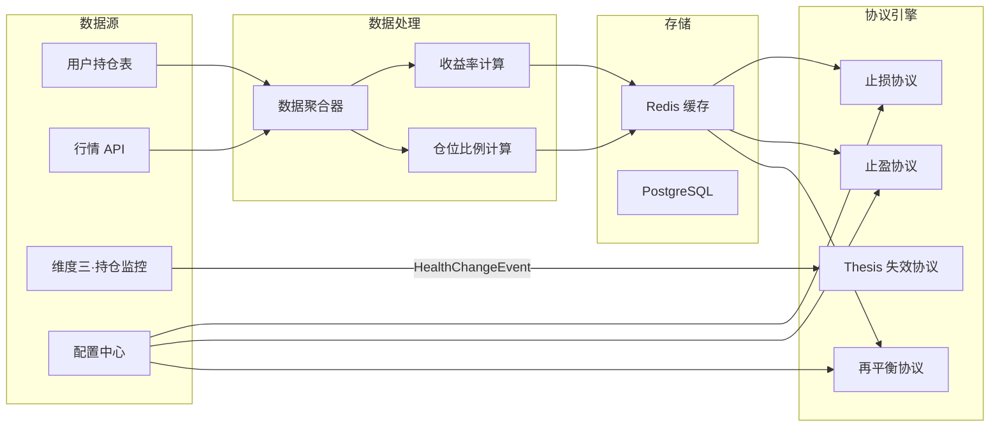

# 维度四·卖出决策·启动期·数据采集与预处理

> [!NOTE] **[TRACEBACK] 实践锚点**
> - **本阶段策略**: [01_实践目标与策略](./01_实践目标与策略.md)
> - **L2 数据清单**: [维度四·卖出决策](../../../../02_战略维度/04_维度四_卖出决策/README.md)
> - **L3 数据契约**: [维度四_卖出决策/04_数据契约_设计](../../04_数据契约_设计.md)

---

## 一、数据总览

### 1.1 本阶段数据需求汇总

| 数据类型 | 用途 | 来源 | 更新频率 | 优先级 |
|---|---|---|---|---|
| **持仓成本** | 止损/止盈协议 | 用户持仓表 | 实时（交易时）| P0 |
| **当前价格** | 止损/止盈/再平衡协议 | 行情 API | 实时 / 分钟级 | P0 |
| **Thesis 状态** | Thesis 失效协议 | 维度三·持仓监控 | 事件驱动 | P0 |
| **健康度变更** | Thesis 失效协议 | 维度三·HealthChangeEvent | 事件驱动 | P0 |
| **投资组合** | 再平衡协议 | 用户持仓汇总 | 实时 | P0 |
| **协议配置** | 所有协议 | 配置中心 | 按需 | P0 |
| **历史卖出记录** | 审计追溯 | 审计日志表 | 每次卖出 | P1 |

### 1.2 数据流图



---

## 二、持仓数据

### 2.1 持仓表结构

```python
# exit_strategy/db/models.py

from sqlalchemy import Column, String, Float, DateTime, Boolean, ForeignKey
from sqlalchemy.ext.declarative import declarative_base
from datetime import datetime

Base = declarative_base()

class Position(Base):
    """用户持仓表"""
    __tablename__ = "positions"
    
    id = Column(String, primary_key=True)
    user_id = Column(String, nullable=False, index=True)
    symbol = Column(String(10), nullable=False, index=True)
    name = Column(String(50), nullable=False)
    
    # 持仓信息
    quantity = Column(Float, nullable=False)        # 持仓数量
    cost = Column(Float, nullable=False)            # 持仓成本（每股）
    total_cost = Column(Float, nullable=False)      # 总成本
    
    # 当前状态
    current_price = Column(Float)                   # 当前价格
    market_value = Column(Float)                    # 当前市值
    unrealized_pnl = Column(Float)                  # 未实现盈亏
    return_pct = Column(Float)                      # 收益率
    
    # 元数据
    opened_at = Column(DateTime, default=datetime.now)  # 建仓时间
    updated_at = Column(DateTime, default=datetime.now, onupdate=datetime.now)
    is_active = Column(Boolean, default=True)       # 是否持有中
```

### 2.2 持仓数据采集

```python
# exit_strategy/data/position_collector.py

from typing import List, Optional
from dataclasses import dataclass
from datetime import datetime
import httpx

@dataclass
class PositionData:
    """持仓数据"""
    id: str
    user_id: str
    symbol: str
    name: str
    quantity: float
    cost: float
    current_price: Optional[float] = None
    
    @property
    def market_value(self) -> Optional[float]:
        if self.current_price is None:
            return None
        return self.quantity * self.current_price
    
    @property
    def return_pct(self) -> Optional[float]:
        if self.current_price is None:
            return None
        return (self.current_price - self.cost) / self.cost

class PositionCollector:
    """持仓数据采集器"""
    
    def __init__(self, db_session):
        self.db = db_session
    
    def get_all_active_positions(self, user_id: str) -> List[PositionData]:
        """获取用户所有活跃持仓"""
        positions = self.db.query(Position).filter(
            Position.user_id == user_id,
            Position.is_active == True
        ).all()
        
        return [
            PositionData(
                id=p.id,
                user_id=p.user_id,
                symbol=p.symbol,
                name=p.name,
                quantity=p.quantity,
                cost=p.cost,
                current_price=p.current_price,
            )
            for p in positions
        ]
    
    def get_position_by_id(self, position_id: str) -> Optional[PositionData]:
        """根据 ID 获取持仓"""
        p = self.db.query(Position).filter(Position.id == position_id).first()
        if p is None:
            return None
        
        return PositionData(
            id=p.id,
            user_id=p.user_id,
            symbol=p.symbol,
            name=p.name,
            quantity=p.quantity,
            cost=p.cost,
            current_price=p.current_price,
        )
```

---

## 三、行情数据

### 3.1 行情数据源

| 数据源 | 类型 | 延迟 | 费用 |
|---|---|---|---|
| 东方财富 API | HTTP | 分钟级 | 免费 |
| 新浪财经 | HTTP | 分钟级 | 免费 |
| Tushare | HTTP | 日级 | 免费/付费 |
| 券商接口 | WebSocket | 实时 | 开户即有 |

### 3.2 行情采集器

```python
# exit_strategy/data/quote_collector.py

import httpx
from typing import Dict, Optional
from dataclasses import dataclass
from datetime import datetime
import redis

@dataclass
class QuoteData:
    """行情数据"""
    symbol: str
    name: str
    current_price: float
    open_price: float
    high_price: float
    low_price: float
    close_price: float
    volume: float
    amount: float
    change_pct: float
    updated_at: datetime

class QuoteCollector:
    """行情数据采集器"""
    
    CACHE_TTL = 60  # 缓存 60 秒
    
    def __init__(self, redis_client: redis.Redis):
        self.redis = redis_client
    
    async def get_quote(self, symbol: str) -> Optional[QuoteData]:
        """获取单个股票行情"""
        # 先查缓存
        cached = self.redis.get(f"quote:{symbol}")
        if cached:
            return QuoteData(**json.loads(cached))
        
        # 调用 API 获取
        quote = await self._fetch_from_api(symbol)
        if quote:
            # 写入缓存
            self.redis.setex(
                f"quote:{symbol}",
                self.CACHE_TTL,
                json.dumps(asdict(quote), default=str)
            )
        return quote
    
    async def get_quotes_batch(self, symbols: list[str]) -> Dict[str, QuoteData]:
        """批量获取行情"""
        result = {}
        missing = []
        
        # 先查缓存
        for symbol in symbols:
            cached = self.redis.get(f"quote:{symbol}")
            if cached:
                result[symbol] = QuoteData(**json.loads(cached))
            else:
                missing.append(symbol)
        
        # 批量获取缺失的
        if missing:
            quotes = await self._fetch_batch_from_api(missing)
            for symbol, quote in quotes.items():
                result[symbol] = quote
                self.redis.setex(
                    f"quote:{symbol}",
                    self.CACHE_TTL,
                    json.dumps(asdict(quote), default=str)
                )
        
        return result
    
    async def _fetch_from_api(self, symbol: str) -> Optional[QuoteData]:
        """从东方财富 API 获取行情"""
        async with httpx.AsyncClient() as client:
            try:
                # 东方财富 API 示例
                resp = await client.get(
                    f"https://push2.eastmoney.com/api/qt/stock/get",
                    params={"secid": f"1.{symbol}" if symbol.startswith("6") else f"0.{symbol}"}
                )
                data = resp.json()["data"]
                
                return QuoteData(
                    symbol=symbol,
                    name=data.get("f58", ""),
                    current_price=data.get("f43", 0) / 100,
                    open_price=data.get("f46", 0) / 100,
                    high_price=data.get("f44", 0) / 100,
                    low_price=data.get("f45", 0) / 100,
                    close_price=data.get("f60", 0) / 100,
                    volume=data.get("f47", 0),
                    amount=data.get("f48", 0),
                    change_pct=data.get("f170", 0) / 100,
                    updated_at=datetime.now(),
                )
            except Exception as e:
                print(f"获取行情失败: {symbol}, {e}")
                return None
    
    async def _fetch_batch_from_api(self, symbols: list[str]) -> Dict[str, QuoteData]:
        """批量获取行情"""
        result = {}
        for symbol in symbols:
            quote = await self._fetch_from_api(symbol)
            if quote:
                result[symbol] = quote
        return result
```

### 3.3 行情更新触发

```python
# exit_strategy/data/quote_updater.py

import asyncio
from typing import List
from .quote_collector import QuoteCollector
from .position_collector import PositionCollector
from ..engine.protocol_engine import ProtocolEngine

class QuoteUpdater:
    """行情更新器 - 定时拉取并触发协议评估"""
    
    def __init__(
        self,
        quote_collector: QuoteCollector,
        position_collector: PositionCollector,
        protocol_engine: ProtocolEngine,
        interval_seconds: int = 60
    ):
        self.quote_collector = quote_collector
        self.position_collector = position_collector
        self.protocol_engine = protocol_engine
        self.interval = interval_seconds
    
    async def start(self, user_id: str):
        """启动定时更新"""
        while True:
            try:
                await self._update_and_evaluate(user_id)
            except Exception as e:
                print(f"行情更新失败: {e}")
            
            await asyncio.sleep(self.interval)
    
    async def _update_and_evaluate(self, user_id: str):
        """更新行情并评估协议"""
        # 获取所有持仓
        positions = self.position_collector.get_all_active_positions(user_id)
        symbols = [p.symbol for p in positions]
        
        # 批量获取行情
        quotes = await self.quote_collector.get_quotes_batch(symbols)
        
        # 更新持仓价格并评估
        for position in positions:
            if position.symbol in quotes:
                position.current_price = quotes[position.symbol].current_price
                
                # 评估协议
                context = {"config": self._get_config()}
                result = self.protocol_engine.evaluate(position, context)
                
                if result.final_signal:
                    print(f"触发卖出信号: {position.symbol} - {result.final_signal.protocol_name}")
    
    def _get_config(self) -> dict:
        # TODO: 从配置中心获取
        return {
            "stop_loss_pct": -0.15,
            "take_profit_pct": 0.30,
            "take_profit_sell_ratio": 0.30,
            "max_position_ratio": 0.25,
        }
```

---

## 四、Thesis 状态数据

### 4.1 数据来源：维度三·持仓监控

```python
# exit_strategy/events/health_change.py

from dataclasses import dataclass
from datetime import datetime
from enum import Enum
from typing import Optional

class HealthStatus(Enum):
    """健康度状态"""
    STRONG = "strong"           # 强健康
    HEALTHY = "healthy"         # 健康
    DEGRADED = "degraded"       # 降级
    BROKEN_ANY = "broken_any"   # 任意基石损坏 → 触发卖出
    BROKEN_ALL = "broken_all"   # 全部基石损坏

class ThesisValidity(Enum):
    """Thesis 有效性"""
    VALID = "valid"             # 有效
    DEGRADED = "degraded"       # 轻微偏离
    INVALIDATED = "invalidated" # 失效 → 触发卖出

@dataclass
class HealthChangeEvent:
    """健康度变更事件 - 来自维度三"""
    
    event_id: str
    event_type: str = "health_change"
    
    # 持仓标识
    position_id: str
    symbol: str
    
    # 健康度变更
    old_health_status: HealthStatus
    new_health_status: HealthStatus
    
    # Thesis 有效性
    thesis_validity: ThesisValidity
    
    # 变更原因
    change_reasons: list[str]
    
    # 元数据
    occurred_at: datetime
    source_module: str = "position_monitor"  # 维度三
```

### 4.2 事件订阅器

```python
# exit_strategy/events/subscriber.py

import redis
import json
from typing import Callable
from .health_change import HealthChangeEvent, HealthStatus, ThesisValidity

class HealthEventSubscriber:
    """健康度事件订阅器 - 监听维度三事件"""
    
    STREAM_NAME = "diting:health_changes"
    GROUP_NAME = "exit_strategy"
    CONSUMER_NAME = "exit_strategy_consumer"
    
    def __init__(self, redis_url: str = "redis://localhost:6379"):
        self.redis = redis.from_url(redis_url)
        self._ensure_consumer_group()
    
    def _ensure_consumer_group(self):
        """确保消费者组存在"""
        try:
            self.redis.xgroup_create(
                self.STREAM_NAME,
                self.GROUP_NAME,
                id="0",
                mkstream=True
            )
        except redis.exceptions.ResponseError:
            # 消费者组已存在
            pass
    
    def subscribe(self, callback: Callable[[HealthChangeEvent], None]):
        """订阅健康度变更事件"""
        while True:
            try:
                messages = self.redis.xreadgroup(
                    self.GROUP_NAME,
                    self.CONSUMER_NAME,
                    {self.STREAM_NAME: ">"},
                    count=10,
                    block=5000
                )
                
                for stream, entries in messages:
                    for message_id, data in entries:
                        event = self._parse_event(data)
                        if event:
                            callback(event)
                        
                        # 确认消息
                        self.redis.xack(self.STREAM_NAME, self.GROUP_NAME, message_id)
            
            except Exception as e:
                print(f"订阅健康度事件失败: {e}")
    
    def _parse_event(self, data: dict) -> Optional[HealthChangeEvent]:
        """解析事件"""
        try:
            payload = json.loads(data[b"payload"].decode())
            return HealthChangeEvent(
                event_id=payload["event_id"],
                position_id=payload["position_id"],
                symbol=payload["symbol"],
                old_health_status=HealthStatus(payload["old_health_status"]),
                new_health_status=HealthStatus(payload["new_health_status"]),
                thesis_validity=ThesisValidity(payload["thesis_validity"]),
                change_reasons=payload["change_reasons"],
                occurred_at=datetime.fromisoformat(payload["occurred_at"]),
            )
        except Exception as e:
            print(f"解析事件失败: {e}")
            return None
```

---

## 五、投资组合数据

### 5.1 组合汇总

```python
# exit_strategy/data/portfolio_collector.py

from typing import List
from dataclasses import dataclass
from .position_collector import PositionCollector, PositionData
from .quote_collector import QuoteCollector

@dataclass
class PortfolioData:
    """投资组合数据"""
    user_id: str
    positions: List[PositionData]
    total_value: float
    total_cost: float
    total_pnl: float
    return_pct: float
    
    def get_position_ratio(self, position_id: str) -> float:
        """获取单个持仓占比"""
        for p in self.positions:
            if p.id == position_id and p.market_value:
                return p.market_value / self.total_value
        return 0.0

class PortfolioCollector:
    """投资组合采集器"""
    
    def __init__(
        self,
        position_collector: PositionCollector,
        quote_collector: QuoteCollector
    ):
        self.position_collector = position_collector
        self.quote_collector = quote_collector
    
    async def get_portfolio(self, user_id: str) -> PortfolioData:
        """获取用户投资组合"""
        # 获取所有持仓
        positions = self.position_collector.get_all_active_positions(user_id)
        
        # 批量获取行情
        symbols = [p.symbol for p in positions]
        quotes = await self.quote_collector.get_quotes_batch(symbols)
        
        # 更新价格
        for p in positions:
            if p.symbol in quotes:
                p.current_price = quotes[p.symbol].current_price
        
        # 计算汇总
        total_value = sum(p.market_value or 0 for p in positions)
        total_cost = sum(p.quantity * p.cost for p in positions)
        total_pnl = total_value - total_cost
        return_pct = total_pnl / total_cost if total_cost > 0 else 0
        
        return PortfolioData(
            user_id=user_id,
            positions=positions,
            total_value=total_value,
            total_cost=total_cost,
            total_pnl=total_pnl,
            return_pct=return_pct,
        )
```

---

## 六、配置数据

### 6.1 协议配置表

```sql
-- 协议配置表
CREATE TABLE protocol_configs (
    id SERIAL PRIMARY KEY,
    user_id VARCHAR(50) NOT NULL,
    
    -- 止损配置
    stop_loss_enabled BOOLEAN DEFAULT TRUE,
    stop_loss_pct DECIMAL(5,4) DEFAULT -0.15,  -- -15%
    
    -- 止盈配置
    take_profit_enabled BOOLEAN DEFAULT TRUE,
    take_profit_pct DECIMAL(5,4) DEFAULT 0.30,  -- +30%
    take_profit_sell_ratio DECIMAL(5,4) DEFAULT 0.30,  -- 卖出 30%
    
    -- Thesis 失效配置
    thesis_break_enabled BOOLEAN DEFAULT TRUE,
    thesis_break_buffer_days INTEGER DEFAULT 5,  -- 5 个交易日
    
    -- 再平衡配置
    rebalance_enabled BOOLEAN DEFAULT TRUE,
    max_position_ratio DECIMAL(5,4) DEFAULT 0.25,  -- 25%
    rebalance_buffer_days INTEGER DEFAULT 3,
    
    -- 元数据
    created_at TIMESTAMP DEFAULT CURRENT_TIMESTAMP,
    updated_at TIMESTAMP DEFAULT CURRENT_TIMESTAMP,
    
    UNIQUE(user_id)
);

-- 默认配置
INSERT INTO protocol_configs (user_id) VALUES ('default');
```

### 6.2 配置管理器

```python
# exit_strategy/config.py

from dataclasses import dataclass
from typing import Optional
import redis

@dataclass
class ProtocolConfig:
    """协议配置"""
    # 止损
    stop_loss_enabled: bool = True
    stop_loss_pct: float = -0.15
    
    # 止盈
    take_profit_enabled: bool = True
    take_profit_pct: float = 0.30
    take_profit_sell_ratio: float = 0.30
    
    # Thesis 失效
    thesis_break_enabled: bool = True
    thesis_break_buffer_days: int = 5
    
    # 再平衡
    rebalance_enabled: bool = True
    max_position_ratio: float = 0.25
    rebalance_buffer_days: int = 3
    
    def to_dict(self) -> dict:
        return {
            "stop_loss_pct": self.stop_loss_pct,
            "take_profit_pct": self.take_profit_pct,
            "take_profit_sell_ratio": self.take_profit_sell_ratio,
            "thesis_break_buffer_days": self.thesis_break_buffer_days,
            "max_position_ratio": self.max_position_ratio,
            "rebalance_buffer_days": self.rebalance_buffer_days,
        }

class ConfigManager:
    """配置管理器"""
    
    CACHE_KEY = "exit_strategy:config:{user_id}"
    CACHE_TTL = 300  # 5 分钟缓存
    
    def __init__(self, db_session, redis_client: redis.Redis):
        self.db = db_session
        self.redis = redis_client
    
    def get_config(self, user_id: str) -> ProtocolConfig:
        """获取用户配置"""
        # 先查缓存
        cached = self.redis.get(self.CACHE_KEY.format(user_id=user_id))
        if cached:
            return ProtocolConfig(**json.loads(cached))
        
        # 查数据库
        config = self.db.query(ProtocolConfigModel).filter(
            ProtocolConfigModel.user_id == user_id
        ).first()
        
        if config is None:
            # 使用默认配置
            config = ProtocolConfig()
        else:
            config = ProtocolConfig(
                stop_loss_enabled=config.stop_loss_enabled,
                stop_loss_pct=float(config.stop_loss_pct),
                # ... 其他字段
            )
        
        # 写入缓存
        self.redis.setex(
            self.CACHE_KEY.format(user_id=user_id),
            self.CACHE_TTL,
            json.dumps(asdict(config))
        )
        
        return config
    
    def update_config(self, user_id: str, updates: dict) -> ProtocolConfig:
        """更新配置"""
        # 更新数据库
        config = self.db.query(ProtocolConfigModel).filter(
            ProtocolConfigModel.user_id == user_id
        ).first()
        
        if config is None:
            config = ProtocolConfigModel(user_id=user_id)
            self.db.add(config)
        
        for key, value in updates.items():
            if hasattr(config, key):
                setattr(config, key, value)
        
        self.db.commit()
        
        # 清除缓存
        self.redis.delete(self.CACHE_KEY.format(user_id=user_id))
        
        return self.get_config(user_id)
```

---

## 七、审计日志

### 7.1 审计日志表

```sql
-- 审计日志表
CREATE TABLE exit_audit_logs (
    id SERIAL PRIMARY KEY,
    audit_id VARCHAR(50) UNIQUE NOT NULL,
    
    -- 持仓信息
    position_id VARCHAR(50) NOT NULL,
    symbol VARCHAR(10) NOT NULL,
    position_name VARCHAR(50),
    
    -- 评估信息
    evaluated_at TIMESTAMP NOT NULL,
    triggered_protocols JSONB,   -- 触发的协议列表
    final_protocol VARCHAR(50),  -- 最终采用的协议
    
    -- 决策信息
    decision VARCHAR(20) NOT NULL,  -- trigger / abstain
    sell_ratio DECIMAL(5,4),
    reason TEXT,
    
    -- 事件信息
    event_id VARCHAR(50),
    event_published BOOLEAN DEFAULT FALSE,
    
    -- 元数据
    user_id VARCHAR(50),
    created_at TIMESTAMP DEFAULT CURRENT_TIMESTAMP,
    
    INDEX idx_position_id (position_id),
    INDEX idx_symbol (symbol),
    INDEX idx_evaluated_at (evaluated_at)
);
```

### 7.2 审计日志记录器

```python
# exit_strategy/db/audit_logger.py

from dataclasses import dataclass, asdict
from datetime import datetime
from typing import List, Optional
import uuid
import json

@dataclass
class AuditLogEntry:
    """审计日志条目"""
    audit_id: str
    position_id: str
    symbol: str
    position_name: str
    evaluated_at: datetime
    triggered_protocols: List[dict]
    final_protocol: Optional[str]
    decision: str  # trigger / abstain
    sell_ratio: Optional[float]
    reason: str
    event_id: Optional[str]
    event_published: bool
    user_id: str

class AuditLogger:
    """审计日志记录器"""
    
    def __init__(self, db_session):
        self.db = db_session
    
    def log(self, entry: AuditLogEntry) -> str:
        """记录审计日志"""
        audit_id = entry.audit_id or str(uuid.uuid4())
        
        log = ExitAuditLog(
            audit_id=audit_id,
            position_id=entry.position_id,
            symbol=entry.symbol,
            position_name=entry.position_name,
            evaluated_at=entry.evaluated_at,
            triggered_protocols=json.dumps(entry.triggered_protocols),
            final_protocol=entry.final_protocol,
            decision=entry.decision,
            sell_ratio=entry.sell_ratio,
            reason=entry.reason,
            event_id=entry.event_id,
            event_published=entry.event_published,
            user_id=entry.user_id,
        )
        
        self.db.add(log)
        self.db.commit()
        
        return audit_id
    
    def get_logs(
        self,
        position_id: Optional[str] = None,
        symbol: Optional[str] = None,
        start_date: Optional[datetime] = None,
        end_date: Optional[datetime] = None,
        limit: int = 100
    ) -> List[AuditLogEntry]:
        """查询审计日志"""
        query = self.db.query(ExitAuditLog)
        
        if position_id:
            query = query.filter(ExitAuditLog.position_id == position_id)
        if symbol:
            query = query.filter(ExitAuditLog.symbol == symbol)
        if start_date:
            query = query.filter(ExitAuditLog.evaluated_at >= start_date)
        if end_date:
            query = query.filter(ExitAuditLog.evaluated_at <= end_date)
        
        logs = query.order_by(ExitAuditLog.evaluated_at.desc()).limit(limit).all()
        
        return [
            AuditLogEntry(
                audit_id=log.audit_id,
                position_id=log.position_id,
                symbol=log.symbol,
                position_name=log.position_name,
                evaluated_at=log.evaluated_at,
                triggered_protocols=json.loads(log.triggered_protocols),
                final_protocol=log.final_protocol,
                decision=log.decision,
                sell_ratio=float(log.sell_ratio) if log.sell_ratio else None,
                reason=log.reason,
                event_id=log.event_id,
                event_published=log.event_published,
                user_id=log.user_id,
            )
            for log in logs
        ]
```

---

## 八、数据采集任务清单

| # | 任务 | 负责 | step 锚（粗对齐） | 产出 |
|---|---|---|---|---|
| 1 | 持仓表设计与迁移 | AI | step_02 | positions 表 + migrations |
| 2 | 行情采集器实现 | AI | step_02～03 | QuoteCollector + 缓存 |
| 3 | 健康度事件订阅器 | AI | step_03～05 | HealthEventSubscriber |
| 4 | 投资组合汇总器 | AI | step_02～03 | PortfolioCollector |
| 5 | 配置管理实现 | AI | step_02～03 | ConfigManager + 配置表 |
| 6 | 审计日志实现 | AI | step_03～04 | AuditLogger + 日志表 |
| 7 | 数据流集成测试 | AI + 架构师 | step_04～07 | 端到端数据流验证 |

---

## 修订记录

| 日期 | 内容 |
|---|---|
| 2026-05-16 | 初版，覆盖持仓/行情/Thesis/组合/配置/审计数据采集 |
