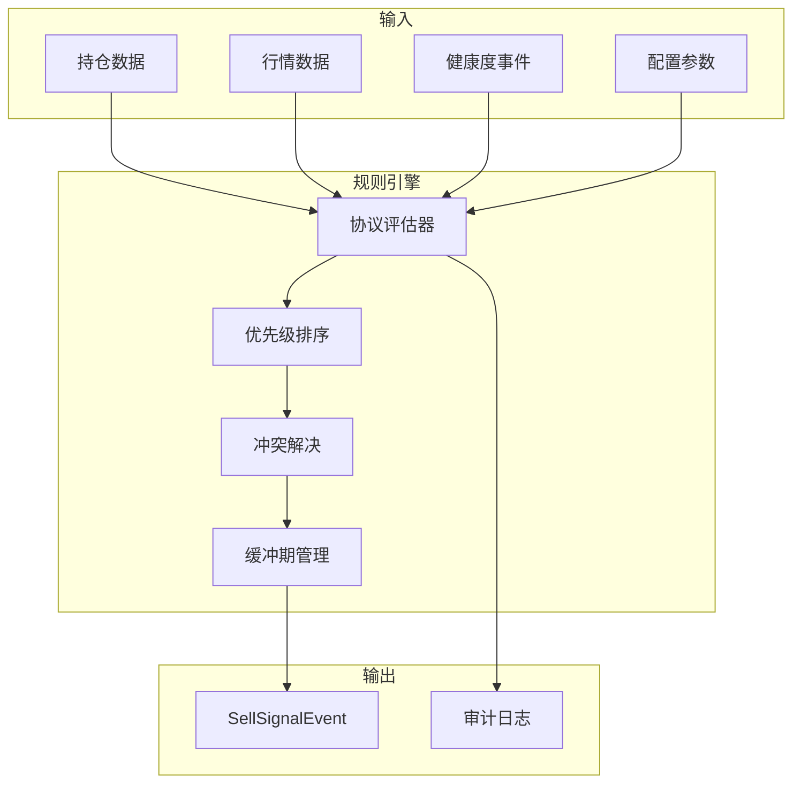

# 维度四·卖出决策·启动期·模型训练与部署

> [!NOTE] **[TRACEBACK] 实践锚点**
> - **本阶段策略**: [01_实践目标与策略](./01_实践目标与策略.md)
> - **数据采集**: [03_数据采集与预处理](./03_数据采集与预处理.md)
> - **L2 技术规划**: [维度四·卖出决策](../../../../02_战略维度/04_维度四_卖出决策/README.md)

---

## 一、启动期模型策略

### 1.1 核心策略：规则引擎优先

> **启动期以规则引擎为主，LLM 辅助判断为辅。**

| 组件 | 角色 | 说明 |
|---|---|---|
| **规则引擎** | 主力 | 4 类卖出协议的核心判断逻辑 |
| **LLM 辅助** | 补充 | 复杂场景解释、用户交互、异常处理 |

### 1.2 为什么不优先 LLM？

| 原因 | 说明 |
|---|---|
| **规则明确** | 止损/止盈/再平衡的判断条件是数值比较，无需 LLM |
| **延迟要求** | 卖出决策需要低延迟，LLM 推理延迟过高 |
| **可解释性** | 规则引擎的决策逻辑透明可追溯 |
| **成本控制** | 规则引擎无推理成本 |

### 1.3 LLM 辅助场景

| 场景 | LLM 用途 | 优先级 |
|---|---|---|
| **Thesis 失效判断** | 分析维度三推送的健康度变更是否构成 Thesis 失效 | P1 |
| **用户解释** | 生成卖出建议的自然语言解释 | P2 |
| **异常场景** | 多协议冲突时的权衡分析 | P2 |
| **回顾复盘** | 历史卖出决策的批量分析 | P3 |

---

## 二、规则引擎实现

### 2.1 规则引擎架构



### 2.2 协议评估器

```python
# exit_strategy/engine/protocol_evaluator.py

from typing import List, Optional
from dataclasses import dataclass
from ..protocols.base_protocol import BaseProtocol, Position, SellSignal
from ..protocols.stop_loss import StopLossProtocol
from ..protocols.take_profit import TakeProfitProtocol
from ..protocols.thesis_break import ThesisBreakProtocol
from ..protocols.rebalance import RebalanceProtocol

@dataclass
class EvaluationContext:
    """评估上下文"""
    config: dict
    portfolio: Optional[object] = None
    health_event: Optional[object] = None

class ProtocolEvaluator:
    """协议评估器"""
    
    def __init__(self, config: dict):
        self.protocols: List[BaseProtocol] = [
            StopLossProtocol(config),
            TakeProfitProtocol(config),
            ThesisBreakProtocol(config),
            RebalanceProtocol(config),
        ]
    
    def evaluate_all(
        self, 
        position: Position, 
        context: EvaluationContext
    ) -> List[SellSignal]:
        """评估所有协议"""
        signals = []
        
        for protocol in self.protocols:
            # 检查协议是否启用
            if not self._is_protocol_enabled(protocol.name, context.config):
                continue
            
            # 评估协议
            signal = protocol.evaluate(position, context.__dict__)
            if signal:
                signals.append(signal)
        
        return signals
    
    def _is_protocol_enabled(self, protocol_name: str, config: dict) -> bool:
        """检查协议是否启用"""
        enable_key = f"{protocol_name}_enabled"
        return config.get(enable_key, True)
```

### 2.3 优先级排序

```python
# exit_strategy/engine/priority_sorter.py

from typing import List
from ..protocols.base_protocol import SellSignal, ProtocolPriority

class PrioritySorter:
    """优先级排序器"""
    
    @staticmethod
    def sort_signals(signals: List[SellSignal]) -> List[SellSignal]:
        """按优先级排序信号"""
        return sorted(signals, key=lambda s: s.priority.value)
    
    @staticmethod
    def get_highest_priority(signals: List[SellSignal]) -> Optional[SellSignal]:
        """获取最高优先级信号"""
        if not signals:
            return None
        
        sorted_signals = PrioritySorter.sort_signals(signals)
        return sorted_signals[0]
```

### 2.4 冲突解决器

```python
# exit_strategy/engine/conflict_resolver.py

from typing import List, Optional
from ..protocols.base_protocol import SellSignal, ProtocolPriority

class ConflictResolver:
    """冲突解决器"""
    
    CONFLICT_RULES = {
        # (协议A, 协议B): 胜出者
        ("stop_loss", "take_profit"): "stop_loss",      # 极端行情：止损优先
        ("stop_loss", "thesis_break"): "stop_loss",     # 止损优先
        ("thesis_break", "rebalance"): "thesis_break",  # Thesis 失效优先
    }
    
    def resolve(self, signals: List[SellSignal]) -> Optional[SellSignal]:
        """解决信号冲突"""
        if not signals:
            return None
        
        if len(signals) == 1:
            return signals[0]
        
        # 按优先级排序
        sorted_signals = sorted(signals, key=lambda s: s.priority.value)
        
        # 检查是否有明确的冲突规则
        for i, signal_a in enumerate(sorted_signals):
            for signal_b in sorted_signals[i+1:]:
                key = (signal_a.protocol_name, signal_b.protocol_name)
                if key in self.CONFLICT_RULES:
                    winner = self.CONFLICT_RULES[key]
                    if winner == signal_a.protocol_name:
                        return signal_a
                    else:
                        return signal_b
        
        # 默认返回最高优先级
        return sorted_signals[0]
```

### 2.5 缓冲期管理器

```python
# exit_strategy/engine/buffer_manager.py

from dataclasses import dataclass
from datetime import datetime, timedelta
from typing import Dict, Optional
import redis

@dataclass
class BufferedSignal:
    """缓冲中的信号"""
    signal_id: str
    position_id: str
    protocol_name: str
    triggered_at: datetime
    buffer_end_at: datetime
    is_revoked: bool = False
    revoke_reason: Optional[str] = None

class BufferManager:
    """缓冲期管理器"""
    
    BUFFER_KEY = "exit_strategy:buffer:{signal_id}"
    
    def __init__(self, redis_client: redis.Redis):
        self.redis = redis_client
    
    def add_to_buffer(self, signal: SellSignal) -> BufferedSignal:
        """添加信号到缓冲区"""
        if signal.buffer_days <= 0:
            # 无缓冲期，立即执行
            return None
        
        import uuid
        signal_id = str(uuid.uuid4())
        
        # 计算缓冲期结束时间（交易日）
        buffer_end = self._calculate_buffer_end(
            signal.triggered_at, 
            signal.buffer_days
        )
        
        buffered = BufferedSignal(
            signal_id=signal_id,
            position_id=signal.position_id,
            protocol_name=signal.protocol_name,
            triggered_at=signal.triggered_at,
            buffer_end_at=buffer_end,
        )
        
        # 存入 Redis
        self.redis.setex(
            self.BUFFER_KEY.format(signal_id=signal_id),
            int((buffer_end - datetime.now()).total_seconds()),
            json.dumps(asdict(buffered), default=str)
        )
        
        return buffered
    
    def revoke(self, signal_id: str, reason: str) -> bool:
        """撤销缓冲中的信号"""
        key = self.BUFFER_KEY.format(signal_id=signal_id)
        data = self.redis.get(key)
        
        if data is None:
            return False
        
        buffered = BufferedSignal(**json.loads(data))
        
        if buffered.buffer_end_at < datetime.now():
            # 缓冲期已结束，不可撤销
            return False
        
        buffered.is_revoked = True
        buffered.revoke_reason = reason
        
        # 更新 Redis
        self.redis.setex(
            key,
            int((buffered.buffer_end_at - datetime.now()).total_seconds()),
            json.dumps(asdict(buffered), default=str)
        )
        
        return True
    
    def get_expired_signals(self) -> List[BufferedSignal]:
        """获取缓冲期已结束的信号"""
        # TODO: 实现过期信号扫描
        pass
    
    def _calculate_buffer_end(
        self, 
        start: datetime, 
        trading_days: int
    ) -> datetime:
        """计算缓冲期结束时间（跳过非交易日）"""
        # 简化实现：假设每周 5 个交易日
        calendar_days = trading_days * 7 // 5 + 2  # 粗略估算
        return start + timedelta(days=calendar_days)
```

---

## 三、LLM 辅助模块

### 3.1 LLM 顾问

```python
# exit_strategy/llm/advisor.py

from typing import Optional
from dataclasses import dataclass

@dataclass
class LLMAdvice:
    """LLM 建议"""
    should_sell: bool
    confidence: float      # 0-1
    reasoning: str
    suggested_action: str

class ExitAdvisor:
    """卖出决策 LLM 顾问"""
    
    def __init__(self, llm_client):
        self.llm = llm_client
    
    async def analyze_thesis_break(
        self, 
        position: dict, 
        health_event: dict
    ) -> LLMAdvice:
        """分析 Thesis 是否真正失效"""
        prompt = self._build_thesis_analysis_prompt(position, health_event)
        response = await self.llm.chat(prompt)
        return self._parse_advice(response)
    
    async def generate_explanation(
        self, 
        signal: dict, 
        position: dict
    ) -> str:
        """生成卖出建议的解释"""
        prompt = self._build_explanation_prompt(signal, position)
        return await self.llm.chat(prompt)
    
    def _build_thesis_analysis_prompt(
        self, 
        position: dict, 
        health_event: dict
    ) -> str:
        """构建 Thesis 分析 Prompt"""
        return f"""
你是一位投资分析专家。请分析以下持仓的 Thesis 是否真正失效。

## 持仓信息
- 股票：{position['symbol']} {position['name']}
- 买入理由（Thesis）：{position.get('thesis', '未知')}
- 持仓成本：{position['cost']}
- 当前价格：{position['current_price']}
- 收益率：{position.get('return_pct', 0):.1%}

## 健康度变更事件
- 旧状态：{health_event['old_health_status']}
- 新状态：{health_event['new_health_status']}
- 变更原因：{', '.join(health_event['change_reasons'])}

## 分析要求
1. 判断这些变化是否构成 Thesis 的实质性失效
2. 区分"短期波动"和"长期逻辑破坏"
3. 给出是否应该卖出的建议

## 输出格式（JSON）
{{
  "should_sell": true/false,
  "confidence": 0-1,
  "reasoning": "分析推理过程",
  "suggested_action": "建议的操作"
}}
"""
    
    def _build_explanation_prompt(
        self, 
        signal: dict, 
        position: dict
    ) -> str:
        """构建解释 Prompt"""
        return f"""
请用简洁易懂的语言解释以下卖出建议：

## 卖出信号
- 触发协议：{signal['protocol_name']}
- 卖出比例：{signal['sell_ratio']:.0%}
- 触发原因：{signal['reason']}

## 持仓信息
- 股票：{position['symbol']} {position['name']}
- 收益率：{position.get('return_pct', 0):.1%}

请用 2-3 句话解释为什么建议卖出，以及这对用户意味着什么。
"""
    
    def _parse_advice(self, response: str) -> LLMAdvice:
        """解析 LLM 响应"""
        import json
        try:
            data = json.loads(response)
            return LLMAdvice(
                should_sell=data.get("should_sell", False),
                confidence=data.get("confidence", 0.5),
                reasoning=data.get("reasoning", ""),
                suggested_action=data.get("suggested_action", "")
            )
        except json.JSONDecodeError:
            return LLMAdvice(
                should_sell=False,
                confidence=0.0,
                reasoning="解析失败",
                suggested_action="请人工复核"
            )
```

### 3.2 LLM 配置

```yaml
# 启动期 LLM 配置
llm:
  # 是否启用 LLM 辅助
  enabled: true
  
  # 使用的模型
  model: "qwen2.5-7b-instruct"  # 或使用 API
  
  # 使用场景
  use_cases:
    thesis_analysis: true      # Thesis 失效分析
    explanation: true          # 卖出解释
    conflict_resolution: false # 冲突解决（启动期禁用）
    batch_review: false        # 批量复盘（启动期禁用）
  
  # 性能配置
  timeout_seconds: 30
  max_retries: 2
```

---

## 四、部署架构

### 4.1 服务部署

```yaml
# deploy/k3s/exit-strategy-deployment.yaml

apiVersion: apps/v1
kind: Deployment
metadata:
  name: exit-strategy
  labels:
    app: exit-strategy
    module: exit-decision
spec:
  replicas: 2
  selector:
    matchLabels:
      app: exit-strategy
  template:
    metadata:
      labels:
        app: exit-strategy
    spec:
      containers:
      - name: exit-strategy
        image: diting/exit-strategy:v0.1
        ports:
        - containerPort: 8000
        env:
        - name: REDIS_URL
          valueFrom:
            secretKeyRef:
              name: exit-strategy-secrets
              key: redis-url
        - name: DATABASE_URL
          valueFrom:
            secretKeyRef:
              name: exit-strategy-secrets
              key: database-url
        - name: LLM_ENABLED
          value: "true"
        - name: LLM_MODEL
          value: "qwen2.5-7b-instruct"
        resources:
          requests:
            cpu: "500m"
            memory: "512Mi"
          limits:
            cpu: "1"
            memory: "1Gi"
        livenessProbe:
          httpGet:
            path: /health
            port: 8000
          initialDelaySeconds: 10
          periodSeconds: 10
        readinessProbe:
          httpGet:
            path: /health
            port: 8000
          initialDelaySeconds: 5
          periodSeconds: 5
---
apiVersion: v1
kind: Service
metadata:
  name: exit-strategy
spec:
  selector:
    app: exit-strategy
  ports:
  - port: 8000
    targetPort: 8000
  type: ClusterIP
```

### 4.2 配置 ConfigMap

```yaml
# deploy/k3s/exit-strategy-configmap.yaml

apiVersion: v1
kind: ConfigMap
metadata:
  name: exit-strategy-config
data:
  config.yaml: |
    # 协议默认配置
    protocols:
      stop_loss:
        enabled: true
        threshold: -0.15
      take_profit:
        enabled: true
        threshold: 0.30
        sell_ratio: 0.30
      thesis_break:
        enabled: true
        buffer_days: 5
      rebalance:
        enabled: true
        max_ratio: 0.25
        buffer_days: 3
    
    # LLM 配置
    llm:
      enabled: true
      model: "qwen2.5-7b-instruct"
      timeout: 30
    
    # 事件配置
    events:
      redis_stream: "diting:sell_signals"
      emergency_stream: "diting:emergency_red"
```

### 4.3 部署流程

```bash
# 部署步骤
# 1. 构建镜像
docker build -t diting/exit-strategy:v0.1 -f deploy/docker/Dockerfile.exit-strategy .

# 2. 推送镜像
docker push diting/exit-strategy:v0.1

# 3. 部署到 K3s
kubectl apply -f deploy/k3s/exit-strategy-configmap.yaml
kubectl apply -f deploy/k3s/exit-strategy-secrets.yaml
kubectl apply -f deploy/k3s/exit-strategy-deployment.yaml

# 4. 验证部署
kubectl get pods -l app=exit-strategy
kubectl logs -l app=exit-strategy -f
```

---

## 五、监控与告警

### 5.1 Prometheus 指标

```python
# exit_strategy/api/metrics.py

from prometheus_client import Counter, Histogram, Gauge

# 协议触发计数
protocol_triggers = Counter(
    "exit_strategy_protocol_triggers_total",
    "协议触发次数",
    ["protocol_name", "decision"]
)

# 信号发布计数
signal_published = Counter(
    "exit_strategy_signals_published_total",
    "信号发布次数",
    ["priority", "success"]
)

# 评估延迟
evaluation_latency = Histogram(
    "exit_strategy_evaluation_latency_seconds",
    "协议评估延迟",
    buckets=[0.01, 0.05, 0.1, 0.25, 0.5, 1.0]
)

# 缓冲区信号数
buffered_signals = Gauge(
    "exit_strategy_buffered_signals",
    "缓冲区信号数量"
)
```

### 5.2 Grafana 仪表板

```json
{
  "dashboard": {
    "title": "Exit Strategy Dashboard",
    "panels": [
      {
        "title": "协议触发趋势",
        "type": "graph",
        "targets": [
          {
            "expr": "sum(rate(exit_strategy_protocol_triggers_total[5m])) by (protocol_name)"
          }
        ]
      },
      {
        "title": "信号发布成功率",
        "type": "stat",
        "targets": [
          {
            "expr": "sum(exit_strategy_signals_published_total{success=\"true\"}) / sum(exit_strategy_signals_published_total)"
          }
        ]
      },
      {
        "title": "评估延迟 P95",
        "type": "graph",
        "targets": [
          {
            "expr": "histogram_quantile(0.95, exit_strategy_evaluation_latency_seconds_bucket)"
          }
        ]
      }
    ]
  }
}
```

---

## 六、训练任务清单

| # | 任务 | step 锚（维内 · 粗对齐） | 产出 | 验收 |
|---|---|---|---|---|
| 1 | 规则引擎骨架 | step_01～02 | 协议评估器 + 优先级 + 冲突解决 | 单元测试通过 |
| 2 | 4 类协议实现 | step_03～06 | 止损/止盈/thesis/再平衡 | 规则测试通过 |
| 3 | 缓冲期管理 | step_04～06 | BufferManager | 缓冲/撤销测试通过 |
| 4 | LLM 辅助模块 | step_05～06 | ExitAdvisor | Thesis 分析可用 |
| 5 | 事件发布集成 | step_06～07 | EventPublisher | 事件到达维度零 |
| 6 | K8s 部署 | step_07～08 | Deployment + Service | Pod Running |
| 7 | 监控集成 | step_07～08 | Prometheus + Grafana | 指标可见 |
| 8 | 联调测试 | step_07～08 | 端到端验证 | 4 类协议全通过 |

---

## 七、扩展期预告

| 内容 | 说明 |
|---|---|
| **LLM 深度推理** | 扩展期引入更强的 LLM 做复杂场景判断 |
| **历史回测** | 回测验证协议有效性 |
| **机会成本卖出** | 新增第 5 类卖出协议 |
| **自动化执行** | 从"建议"升级为"自动执行" |

---

## 修订记录

| 日期 | 内容 |
|---|---|
| 2026-05-16 | 初版，覆盖规则引擎、LLM 辅助、部署、监控 |
