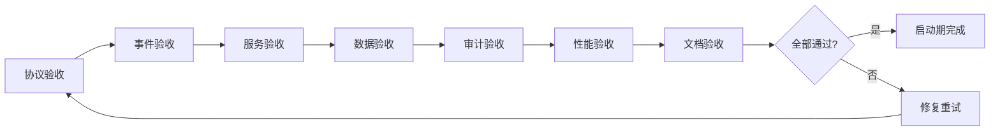

# 维度四·卖出决策·启动期·验收标准与检查清单

> [!NOTE] **[TRACEBACK] 实践锚点**
> - **本阶段策略**: [01_实践目标与策略](./01_实践目标与策略.md)
> - **L2 验证规范**: [维度四·卖出决策](../../../../02_战略维度/04_维度四_卖出决策/README.md)
> - **L5 验收**: [05_成功标识与验证](../../../../05_成功标识与验证/)

---

## 一、验收总览

### 1.1 验收分类

| 类型 | 内容 | 验收方式 | 优先级 |
|---|---|---|---|
| **协议验收** | 4 类卖出协议正常触发 | 规则测试 + 集成测试 | P0 |
| **事件验收** | SellSignalEvent 推送成功 | 事件追踪 + 日志验证 | P0 |
| **服务验收** | exit_strategy 服务可用 | API 测试 + 健康检查 | P0 |
| **数据验收** | 持仓/行情/配置数据正确 | 数据校验 | P0 |
| **审计验收** | 审计日志完整可查 | 查询验证 | P1 |
| **文档验收** | 5 份实践文档完整 | 人工审查 | P1 |
| **性能验收** | 响应时间 + 可用性 | 压测 + 监控 | P1 |

### 1.2 验收流程



---

## 二、协议验收标准

### 2.1 止损协议验收

| 测试场景 | 输入 | 期望输出 | 验收标准 |
|---|---|---|---|
| 触发止损 | 收益率 = -15% | SellSignal(stop_loss) | ✅ 触发 |
| 触发止损边界 | 收益率 = -15.01% | SellSignal(stop_loss) | ✅ 触发 |
| 未触发止损 | 收益率 = -14.99% | None | ✅ 不触发 |
| 配置自定义阈值 | 阈值=-20%, 收益率=-18% | None | ✅ 不触发 |
| 配置自定义阈值 | 阈值=-20%, 收益率=-21% | SellSignal(stop_loss) | ✅ 触发 |

**测试命令**：

```bash
# 运行止损协议测试
pytest tests/exit_strategy/test_stop_loss.py -v

# 期望输出
# test_stop_loss_triggered ... PASSED
# test_stop_loss_boundary ... PASSED
# test_stop_loss_not_triggered ... PASSED
# test_stop_loss_custom_threshold ... PASSED
```

### 2.2 止盈协议验收

| 测试场景 | 输入 | 期望输出 | 验收标准 |
|---|---|---|---|
| 触发止盈 | 收益率 = +30% | SellSignal(take_profit, ratio=0.3) | ✅ 触发 |
| 触发止盈边界 | 收益率 = +30.01% | SellSignal(take_profit) | ✅ 触发 |
| 未触发止盈 | 收益率 = +29.99% | None | ✅ 不触发 |
| 自定义卖出比例 | ratio=0.5, 收益率=+35% | SellSignal(sell_ratio=0.5) | ✅ 卖出 50% |

**测试命令**：

```bash
pytest tests/exit_strategy/test_take_profit.py -v
```

### 2.3 Thesis 失效协议验收

| 测试场景 | 输入 | 期望输出 | 验收标准 |
|---|---|---|---|
| broken_any 触发 | HealthStatus.BROKEN_ANY | SellSignal(thesis_break) | ✅ 触发 |
| invalidated 触发 | ThesisValidity.INVALIDATED | SellSignal(thesis_break) | ✅ 触发 |
| degraded 不触发 | HealthStatus.DEGRADED | None | ✅ 不触发 |
| 缓冲期正确 | buffer_days=5 | SellSignal(buffer_days=5) | ✅ 5 天缓冲 |
| 缓冲期内撤销 | 撤销请求 | is_revoked=True | ✅ 可撤销 |

**测试命令**：

```bash
pytest tests/exit_strategy/test_thesis_break.py -v
```

### 2.4 再平衡协议验收

| 测试场景 | 输入 | 期望输出 | 验收标准 |
|---|---|---|---|
| 触发再平衡 | 仓位占比 = 30% | SellSignal(rebalance) | ✅ 触发 |
| 计算卖出比例 | 占比=30%, 阈值=25% | sell_ratio ≈ 0.167 | ✅ 比例正确 |
| 未触发再平衡 | 仓位占比 = 20% | None | ✅ 不触发 |
| 边界测试 | 仓位占比 = 25% | None | ✅ 不触发 |

**测试命令**：

```bash
pytest tests/exit_strategy/test_rebalance.py -v
```

### 2.5 协议综合测试

```python
# tests/exit_strategy/test_protocol_engine.py

import pytest
from exit_strategy.engine.protocol_engine import ProtocolEngine
from exit_strategy.protocols.base_protocol import Position

class TestProtocolEngine:
    """协议引擎综合测试"""
    
    def test_all_protocols_registered(self):
        """验证 4 类协议全部注册"""
        engine = ProtocolEngine({})
        assert len(engine.protocols) == 4
        protocol_names = [p.name for p in engine.protocols]
        assert "stop_loss" in protocol_names
        assert "take_profit" in protocol_names
        assert "thesis_break" in protocol_names
        assert "rebalance" in protocol_names
    
    def test_priority_order(self):
        """验证优先级排序"""
        engine = ProtocolEngine({})
        
        # 构造触发多个协议的场景
        position = Position(
            id="test",
            symbol="000001",
            name="测试",
            quantity=1000,
            cost=10.0,
            current_price=8.0,  # -20% 触发止损
        )
        
        result = engine.evaluate(position, {
            "config": {"stop_loss_pct": -0.15, "take_profit_pct": 0.30}
        })
        
        # 止损应该是最终信号
        assert result.final_signal.protocol_name == "stop_loss"
    
    def test_audit_log_created(self):
        """验证审计日志生成"""
        engine = ProtocolEngine({})
        position = Position(...)
        
        result = engine.evaluate(position, {"config": {}})
        
        assert result.audit_id is not None
```

**综合测试命令**：

```bash
# 运行所有协议测试
pytest tests/exit_strategy/ -v --cov=exit_strategy

# 期望覆盖率 ≥ 80%
```

---

## 三、事件验收标准

### 3.1 SellSignalEvent 推送测试

| 测试场景 | 期望结果 | 验收标准 |
|---|---|---|
| 普通信号推送 | 事件到达 Redis Stream | ✅ |
| 紧急信号推送 | 事件到达 emergency_red | ✅ |
| 事件格式正确 | JSON 可解析 | ✅ |
| 事件包含必要字段 | position_id, symbol, protocol, reason | ✅ |

**测试命令**：

```bash
# 测试事件推送
pytest tests/exit_strategy/test_event_publisher.py -v

# 验证 Redis Stream
redis-cli XREAD STREAMS diting:sell_signals 0
```

### 3.2 维度零对接验证

```bash
# 1. 触发一个止损信号
curl -X POST http://localhost:8000/api/signals/trigger \
  -H "Content-Type: application/json" \
  -d '{
    "position_id": "test-001",
    "protocol_name": "stop_loss",
    "reason": "测试触发"
  }'

# 2. 检查维度零是否收到
# 查看 emergency_red stream
redis-cli XREAD STREAMS diting:emergency_red 0

# 3. 期望看到事件
# 1) "diting:emergency_red"
# 2) 1) 1) "1234567890-0"
#       2) 1) "event_id" 2) "xxx" 3) "source" 4) "exit_strategy" ...
```

### 3.3 事件推送成功率测试

```python
# tests/integration/test_event_publishing.py

import pytest
import asyncio
from exit_strategy.events.publisher import EventPublisher
from exit_strategy.events.sell_signal import SellSignalEvent, SignalPriority

class TestEventPublishing:
    """事件推送集成测试"""
    
    @pytest.mark.asyncio
    async def test_publish_100_events(self):
        """测试 100 次事件推送"""
        publisher = EventPublisher()
        success_count = 0
        
        for i in range(100):
            event = SellSignalEvent(
                event_id=f"test-{i}",
                position_id=f"pos-{i}",
                symbol="000001",
                position_name="测试",
                protocol_name="stop_loss",
                priority=SignalPriority.EMERGENCY,
                sell_ratio=1.0,
                reason="测试",
            )
            
            try:
                message_id = publisher.publish(event)
                if message_id:
                    success_count += 1
            except Exception:
                pass
        
        # 成功率 ≥ 99%
        assert success_count >= 99
```

---

## 四、服务验收标准

### 4.1 服务可用性

| 服务 | 健康检查 | 期望状态 |
|---|---|---|
| exit-strategy | GET /health | `status: healthy` |
| redis | Redis PING | PONG |
| postgres | 连接检查 | 可连接 |

### 4.2 API 功能测试

```bash
# 1. 健康检查
curl http://localhost:8000/health

# 期望响应
{
  "status": "healthy",
  "protocols": {
    "stop_loss": "enabled",
    "take_profit": "enabled",
    "thesis_break": "enabled",
    "rebalance": "enabled"
  },
  "dependencies": {
    "redis": "up",
    "postgres": "up"
  }
}

# 2. 协议评估
curl -X POST http://localhost:8000/api/protocols/evaluate \
  -H "Content-Type: application/json" \
  -d '{
    "position_id": "test-001",
    "symbol": "000001",
    "name": "平安银行",
    "quantity": 1000,
    "cost": 10.0,
    "current_price": 8.0
  }'

# 期望响应（触发止损）
{
  "signals": [
    {
      "protocol_name": "stop_loss",
      "sell_ratio": 1.0,
      "reason": "收益率 -20.0% 触及止损线 -15.0%"
    }
  ],
  "final_signal": {...},
  "audit_id": "xxx"
}

# 3. 配置查询
curl http://localhost:8000/api/config

# 期望响应
{
  "stop_loss_pct": -0.15,
  "take_profit_pct": 0.30,
  "take_profit_sell_ratio": 0.30,
  "max_position_ratio": 0.25
}
```

### 4.3 服务验收检查清单

- [ ] exit-strategy Pod 状态 Running（2 副本）
- [ ] /health 返回 healthy
- [ ] /api/protocols/evaluate 可调用
- [ ] /api/signals/trigger 可触发
- [ ] /api/config 可查询
- [ ] /api/audit/logs 可查询

---

## 五、数据验收标准

### 5.1 持仓数据验收

| 检查项 | 标准 | 验收方式 |
|---|---|---|
| 持仓表存在 | positions 表创建 | `\dt positions` |
| 字段完整 | cost, current_price 等 | Schema 校验 |
| 数据可读 | 查询返回正确 | SELECT 测试 |

### 5.2 行情数据验收

| 检查项 | 标准 | 验收方式 |
|---|---|---|
| 行情可获取 | API 返回数据 | 接口测试 |
| 缓存生效 | Redis 有数据 | `redis-cli GET quote:*` |
| 延迟可接受 | < 60 秒 | 时间戳检查 |

### 5.3 配置数据验收

| 检查项 | 标准 | 验收方式 |
|---|---|---|
| 配置表存在 | protocol_configs 表 | `\dt protocol_configs` |
| 默认配置 | default 用户配置存在 | SELECT 查询 |
| 配置可更新 | PUT 接口正常 | API 测试 |

---

## 六、审计验收标准

### 6.1 审计日志检查

```sql
-- 检查审计日志表
SELECT COUNT(*) FROM exit_audit_logs;

-- 检查最近日志
SELECT 
    audit_id,
    symbol,
    final_protocol,
    decision,
    evaluated_at
FROM exit_audit_logs
ORDER BY evaluated_at DESC
LIMIT 10;

-- 验证必要字段
SELECT 
    COUNT(*) AS total,
    COUNT(audit_id) AS has_audit_id,
    COUNT(position_id) AS has_position_id,
    COUNT(evaluated_at) AS has_evaluated_at
FROM exit_audit_logs;
```

### 6.2 审计日志验收检查清单

- [ ] exit_audit_logs 表存在
- [ ] 每次评估生成日志
- [ ] audit_id 唯一
- [ ] 日志包含 position_id, symbol, protocol, decision
- [ ] 日志不可篡改（无 UPDATE/DELETE 权限）
- [ ] 日志可查询（API /api/audit/logs）

---

## 七、性能验收标准

### 7.1 响应时间

| API | P95 响应时间 | 验收方式 |
|---|---|---|
| /api/protocols/evaluate | < 200ms | 压测 |
| /api/signals/trigger | < 100ms | 压测 |
| /api/config | < 50ms | 压测 |

### 7.2 可用性

| 指标 | 标准 | 验收方式 |
|---|---|---|
| 单日可用性 | ≥ 99.5% | Prometheus 监控 |
| 错误率 | < 0.5% | 日志分析 |

### 7.3 压测命令

```bash
# 使用 hey 进行压测
hey -n 1000 -c 20 \
  -m POST \
  -H "Content-Type: application/json" \
  -D test_evaluate.json \
  http://localhost:8000/api/protocols/evaluate

# 期望结果
# Summary:
#   ...
#   Slowest: 0.xxx secs
#   Fastest: 0.xxx secs
#   Average: 0.xxx secs
#   
# Latency distribution:
#   ...
#   95% in 0.1xx secs  # 应 < 200ms
```

---

## 八、文档验收标准

### 8.1 文档清单

| 文档 | 必须包含 | 验收方式 |
|---|---|---|
| 01_实践目标与策略.md | 目标/4类协议/策略/路径/风险/边界 | 人工审查 |
| 02_技术方案与代码架构.md | 技术选型/代码结构/API/部署 | 人工审查 |
| 03_数据采集与预处理.md | 数据清单/采集脚本/配置/审计 | 人工审查 |
| 04_模型训练与部署.md | 规则引擎/LLM辅助/部署/监控 | 人工审查 |
| 05_验收标准与检查清单.md | 验收标准/检查清单 | 人工审查 |

### 8.2 文档检查清单

- [ ] 所有文档含 TRACEBACK 追溯锚点
- [ ] 代码示例可复制执行
- [ ] 命令行示例可直接运行
- [ ] 链接无断链
- [ ] 表格格式正确
- [ ] Mermaid 图可渲染

---

## 九、综合验收检查清单

### 9.1 P0 必须项（阻断发布）

- [ ] **协议**：4 类卖出协议全部上线
  - [ ] 止损协议 -15% 触发正常
  - [ ] 止盈协议 +30% 触发正常
  - [ ] Thesis 失效协议与维度三联调通过
  - [ ] 再平衡协议 25% 触发正常
- [ ] **事件**：SellSignalEvent 推送成功
  - [ ] 普通信号推送到 diting:sell_signals
  - [ ] 紧急信号推送到 diting:emergency_red
  - [ ] 推送成功率 ≥ 99.9%
- [ ] **服务**：exit-strategy 服务可用
  - [ ] Pod Running（2 副本）
  - [ ] /health 返回 healthy
- [ ] **审计**：审计日志完整可查

### 9.2 P1 应完成项（不阻断，需跟进）

- [ ] 响应时间 P95 < 200ms
- [ ] 可用性 ≥ 99.5%
- [ ] 文档 5 份完整
- [ ] 代码测试覆盖率 ≥ 80%
- [ ] Grafana 仪表板可用

### 9.3 验收签署

| 角色 | 签字 | 日期 |
|---|---|---|
| 架构师 | __________ | __________ |
| 开发负责人 | __________ | __________ |
| 测试负责人 | __________ | __________ |

---

## 十、进阶条件

### 10.1 启动期 → 扩展期

满足以下条件可进入扩展期：

| 条件 | 指标 |
|---|---|
| 4 类协议上线 | 全部 enabled |
| 协议触发正常 | 0 漏触发 |
| 事件推送成功 | 成功率 ≥ 99.9% |
| 维度零对接 | emergency_red 收到事件 |
| 架构师验收 | ✅ |

### 10.2 扩展期预告

| 新增内容 | 说明 |
|---|---|
| 机会成本卖出 | 第 5 类卖出协议 |
| LLM 深度推理 | 复杂场景判断增强 |
| 历史回测 | 协议有效性验证 |
| 自动化执行 | 从建议升级为自动执行 |
| 多策略组合 | 策略组合卖出 |

---

## 修订记录

| 日期 | 内容 |
|---|---|
| 2026-05-16 | 初版，覆盖协议/事件/服务/数据/审计/性能/文档验收 |
