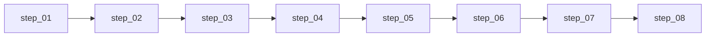

# 维度四·卖出决策·启动期

> [!NOTE] **[TRACEBACK] 追溯锚点**
> - **L2 战略规划**: [维度四·卖出决策](../../../../02_战略维度/04_维度四_卖出决策/README.md)
> - **本维度 L3 设计**: [维度四_卖出决策/README](../../README.md)
> - **L1 哲学基石**: ⑤防御（纪律性卖出）+ ⑥超级个体进化（自动化执行）
> - **本阶段总览**: [stages/README](../README.md)

> **[上架与环境（共通）]** **ECS + K3s · Helm · ACR · `diting-infra`→`deploy-engine`**。参见 [16](../../../_共享规约/16_阿里云ECS_K3s_ACR_Helm部署与deploy-engine链路.md)；**执行索引**：[steps/README](./steps/README.md)。

---

## 一、阶段定位

| 项 | 值 |
|---|---|
| **阶段** | 启动期（Stage 1）|
| **时段** | 0-3 月 |
| **核心目标** | 4 类卖出协议 + 规则引擎实现"任何卖出决策必须符合纪律性协议"的最小闭环 |
| **成功标准** | 4 类协议 0 漏触发、SellSignalEvent 推送成功率 ≥ 99.9%、审计日志完整 |

---

## 二、实践设计文档（5 份）

| # | 文档 | 内容 | 状态 |
|---|---|---|---|
| 01 | [01_实践目标与策略.md](./01_实践目标与策略.md) | 目标、4 类卖出协议、策略、路径、风险、边界 | ✅ |
| 02 | [02_技术方案与代码架构.md](./02_技术方案与代码架构.md) | 技术选型、代码结构、规则引擎、API、部署 | ✅ |
| 03 | [03_数据采集与预处理.md](./03_数据采集与预处理.md) | 持仓成本、当前价格、Thesis 状态、配置、审计 | ✅ |
| 04 | [04_模型训练与部署.md](./04_模型训练与部署.md) | 规则引擎、LLM 辅助、部署、监控 | ✅ |
| 05 | [05_验收标准与检查清单.md](./05_验收标准与检查清单.md) | 验收指标、检查项、签署 | ✅ |

## 二·补 可执行步骤文档（执行层 · 8 份）⭐

> **2026-05-16 新增**：设计层拆解为 **8 份按 step 序号编排的可执行步骤**（日历与跨维映射见 [14](../../../_共享规约/14_六维度启动期统一节奏表.md) **§九**）。

**索引**：[steps/README.md](./steps/README.md)（8 个 step + 决策契约 + L4 回写预期）
**总量**：8,128 行可执行文档

---

## 三、4 类卖出协议

| 协议 | 触发条件 | 默认阈值 | 优先级 | 说明 |
|---|---|---|---|---|
| **止损** | 收益率 ≤ 止损线 | -15% | P0 | 无缓冲，立即执行 |
| **止盈** | 收益率 ≥ 止盈线 | +30% | P1 | 卖出 30%（可配置）|
| **Thesis 失效** | 来自维度三 HealthChangeEvent | - | P0 | 5 天缓冲期，可撤销 |
| **再平衡** | 仓位占比 > 阈值 | 25% | P2 | 3 天缓冲期 |

---

## 四、交付物清单

| 交付物 | 描述 | 验收方式 |
|---|---|---|
| exit_protocol_engine | 4 类卖出协议规则引擎 | K8s Pod Running |
| stop_loss_protocol | 止损协议：-15% 触发 | 规则测试通过 |
| take_profit_protocol | 止盈协议：+30% 触发 | 规则测试通过 |
| thesis_break_protocol | Thesis 失效协议 | 与维度三联调通过 |
| rebalance_protocol | 再平衡协议：25% 阈值 | 规则测试通过 |
| SellSignalEvent | 卖出信号事件推送 | 事件到达维度零 |
| 审计日志表 | exit_audit_logs | 每次判决可查 |

---

## 五、实施路径（step 1～8 · 序号权威）

详见 [steps/README.md](./steps/README.md)。

---

## 六、外部依赖

| 依赖维度 | 必须就绪的能力 | 用途 |
|---|---|---|
| 维度三·持仓监控 | HealthChangeEvent + 健康度状态 | Thesis 失效协议输入 |
| 维度零·AI 投资副驾驶 | emergency_red 紧急告警通道 | SellSignalEvent 推送目标 |
| 平台与产品 | PostgreSQL + Redis + K3s | 基础设施 |

---

## 七、进阶条件

满足以下条件可进入扩展期：

- [ ] 4 类卖出协议全部上线
- [ ] 止损/止盈/再平衡协议 0 漏触发
- [ ] Thesis 失效协议与维度三联调通过
- [ ] SellSignalEvent 推送成功率 ≥ 99.9%
- [ ] 审计日志完整可查
- [ ] 架构师验收签字

---

## 八、扩展期预告

| 新增内容 | 说明 |
|---|---|
| 机会成本卖出 | 第 5 类卖出协议 |
| LLM 深度推理 | 复杂场景判断增强 |
| 历史回测 | 协议有效性验证 |
| 自动化执行 | 从建议升级为自动执行 |

---

## 修订记录

| 日期 | 内容 |
|---|---|
| 2026-05-16 | 重构为 5 份实践设计文档体系（参考维度一格式）|
| 2026-05-17 | §五 改为 step 流水线图；指向 **14_ §九** |
