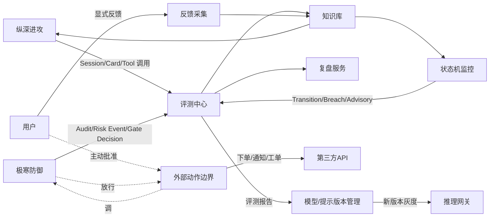

# L3 · 超级个体进化 · 目标与边界设计

> [!NOTE] **[TRACEBACK]**
> - **顶层概念**：[项目定义与核心价值](../../01_顶层概念/01_项目定义与核心价值.md)
> - **战略主轴**：[L2 §超级个体进化](../../02_战略维度/00_双目标与战略维度关系.md)
> - **同模块**：[超级个体进化/README](./README.md)
> - **总纲**：[四大模块抽象总纲 §3.4](../00_四大模块抽象总纲.md#34-超级个体进化super-individual-evolution)
> - **DNA**：`_System_DNA/super_evo/`、`global_const.super_evo`

> [!IMPORTANT] **验证后资源释放（全模块强制）**
> 凡本文档涉及或引用的 **本地/联调验证**（单测、集成测、`docker compose`、前后端 dev server、`uvicorn`、临时 worker 等），在 **测试结论已确认并完成准出/实践记录** 后，须 **停止相关进程并释放资源**。检查项与示例命令见 [_共享规约/17_L3设计文档_验证后资源释放规约.md](../_共享规约/17_L3设计文档_验证后资源释放规约.md)。

## 一、目标

承接 L1 §"超级个体放大"与"AI ×SaaS 共生平台"——把"系统每天发生的事"沉淀为可复用资产，让用户与系统一起进化：

1. **资产化**：知识 / 评测 / 反馈 / 模型版本必须可被命名、可被检索、可被回放
2. **可衡量**：每一次决策都被打分；每一次模型 / 提示 / 规则迭代必须可衡量增益
3. **闭环**：从"对外动作 → 反馈 → 评测 → 复盘 → 再训练 / 再调参 → 重新上线"形成闭环
4. **可降级 / 可回滚**：任何"上线"都可被一键回滚；版本永久可回放

## 二、本模块的"做"与"不做"

### 做什么

| 能力 | 说明 |
|------|------|
| 评测中心 | 评测集管理 / 自动评测任务 / 离线 + 在线评测 |
| 反馈采集 | 用户显式 / 隐式反馈；外部世界回馈（如新闻验证） |
| 知识库 + 长期记忆 | 知识条目（结构化 + 嵌入）；RAG 索引；知识衰减 |
| 复盘服务 | 周期复盘 / 触发式复盘；生成复盘报告；归因 |
| 模型版本管理 | LLM / 嵌入 / 业务模型的版本注册、灰度、回滚 |
| 提示词 / 规则版本管理 | 同上，所有 prompt / 规则带版本 |
| 外部动作边界 | **唯一允许调用对外业务 API 的子模块**（下单 / 通知 / 工单 / IM） |
| 用户成长档案 | 单用户的偏好 / 历史 / 习得能力 |

### 不做什么

| 能力 | 归属 | 原因 |
|------|------|------|
| 决策门禁 | [极寒防御](../极寒防御/README.md) | 任何外部动作必经门禁 |
| 产生研究结论 | [纵深进攻](../纵深进攻/README.md) | 进化模块只评测、不推理 |
| 状态机迁移 | [状态机监控](../状态机监控/README.md) | 进化模块吸收迁移日志，但不改状态 |
| 数据采集 | 数据层（[11_数据采集](../_共享规约/11_数据采集与输入层规约.md)） | 反馈来自系统行为，不直接抓外部源 |
| 用户身份认证 / 计费 | 平台基础（部署仓） | 不在 L3 |

## 三、与其它模块的接口边界

### 输入契约

| 输入 | 来源 |
|------|------|
| `CouncilSession / ResearchCard / Candidate / ToolCall` | [纵深进攻](../纵深进攻/README.md) |
| `TransitionEvent / BoundaryBreach / Advisory` | [状态机监控](../状态机监控/README.md) |
| `AuditEntry / RiskEvent / GateDecision` | [极寒防御](../极寒防御/README.md) |
| `UserFeedback`（显式 / 隐式） | [前端 § 投研对话台 / 智能记忆栈](../前端工程与服务/README.md) |
| 外部世界回馈（新闻验证、价格验证、事件证伪） | 数据层 |
| `ExternalActionRequest`（其它模块发起的对外动作请求） | 任何模块（必经此模块边界） |

### 输出契约

| 输出 | 消费方 |
|------|--------|
| 评测报告 | 内部 + [前端 § 个性化驾驶舱](../前端工程与服务/README.md) |
| `KnowledgeEntry / RAGIndex` | 纵深进攻（议会 RAG）+ 状态机监控（模板辅助） |
| 复盘报告 | 用户 + 内部归档 |
| `ModelVersion / PromptVersion / RuleVersion` 变更通知 | 全部模块 |
| `ExternalActionResult` | 调用方 + 审计 |
| `EvalFeedback` | 纵深进攻（议会自适应） |

## 四、模块准出标准

| 验收项 | 验收方式 |
|--------|---------|
| 评测覆盖率 ≥ 90%（议会 / 状态机 / Advisory） | 评测任务覆盖统计 |
| 任意模型 / prompt / 规则版本可一键回滚 | 演练 |
| 知识条目去重率 ≥ 95% | 重复检测 |
| 复盘报告周覆盖率 = 100% | 每周自动生成 |
| 外部动作 100% 经极寒防御门禁 | 审计校验 |
| 外部动作幂等性 100% | idempotency_key 验证 |
| 反馈延迟（用户反馈 → 入库）< 5s | 端到端 |

## 五、关键设计取舍

1. **评测分层**：离线评测（评测集）+ 在线评测（A/B、灰度）；离线先行，在线为最终判定
2. **知识衰减**：知识条目带"时效性"与"置信度衰减"；过期/低置信度自动降权或归档
3. **外部动作边界唯一**：全系统仅此一个出口；所有出口调用走 [05_接口抽象层 § External API Port](../_共享规约/05_接口抽象层规约.md) + [极寒防御 § decision_gate](../极寒防御/02_后端服务子模块_设计.md)
4. **idempotency_key 强制**：每次外部动作必须带；重复请求返回首次结果
5. **版本一切**：模型 / prompt / 规则 / 评测集 / 知识库 全部带版本，可回放
6. **复盘必带归因**：每条复盘必须给出"哪些事件 / 哪些工具 / 哪个版本"导致结果
7. **用户成长档案隔离**：用户偏好不参与跨用户共享（除非用户显式同意）

## 六、与共享规约的对齐

| 共享规约 | 对齐点 |
|---------|--------|
| [04_全链路通信协议](../_共享规约/04_全链路通信协议矩阵.md) | External Action Protocol（idempotency / signature） |
| [05_接口抽象层](../_共享规约/05_接口抽象层规约.md) | External API Port、Inference Gateway Port |
| [06_动态配置中心](../_共享规约/06_动态配置中心规约.md) | 评测开关 / 灰度比例 / 知识衰减参数热更新 |
| [07_数据版本控制](../_共享规约/07_数据版本控制规约.md) | 全部"版本一切"的对接点 |
| [10_运营治理与灾备](../_共享规约/10_运营治理与灾备规约.md) | 外部动作合规 / DR |
| [极寒防御](../极寒防御/README.md) | 外部动作必经门禁 + 审计 |
