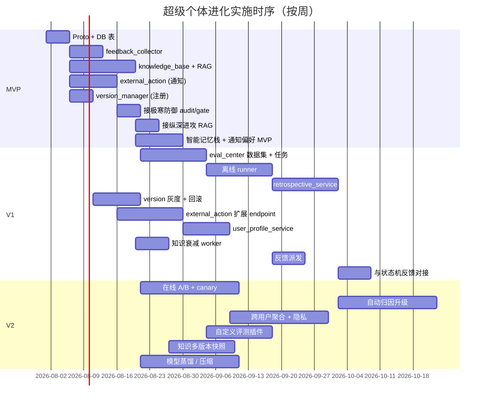

# L3 · 超级个体进化 · 实施推演设计

> [!NOTE] **[TRACEBACK]**
> - **同模块**：[01](./01_目标与边界_设计.md)、[02](./02_后端服务子模块_设计.md)、[03](./03_接口契约_设计.md)、[04](./04_数据契约_设计.md)
> - **L4 计划目录**：`04_阶段规划与实践/05_维度五_演进飞轮/`（第 3 批）

> [!IMPORTANT] **验证后资源释放（全模块强制）**
> 凡本文档涉及或引用的 **本地/联调验证**（单测、集成测、`docker compose`、前后端 dev server、`uvicorn`、临时 worker 等），在 **测试结论已确认并完成准出/实践记录** 后，须 **停止相关进程并释放资源**。检查项与示例命令见 [_共享规约/17_L3设计文档_验证后资源释放规约.md](../_共享规约/17_L3设计文档_验证后资源释放规约.md)。

## 一、演进路径总览

| 版本 | 关键能力 | 完成判定 |
|------|---------|---------|
| **MVP** | 反馈采集 + 知识库基础 + 外部动作边界（仅通知类）+ 版本管理（仅注册） | 用户反馈可写；知识 RAG 可用；通知 100% 经门禁 |
| **V1** | 评测中心完整 + 复盘服务 + 版本灰度 / 回滚 + 外部动作扩到工单 / 数据写 + 用户成长档案 | 全闭环跑通；模型 / prompt / 规则可灰度上线 |
| **V2** | 在线 A/B + canary + 自动归因 + 跨用户聚合（隐私安全）+ 自定义评测插件 | 在线 A/B 稳定；自动归因质量可衡量 |

## 二、MVP（最小可用产品）

### 范围
- `feedback_collector`：显式 + 隐式接口；异步落库
- `knowledge_base`：基础 CRUD + RAG（hybrid 检索）
- `external_action_boundary`：仅通知类（push / email / IM）；强制 idempotency；走极寒防御门禁
- `version_manager`：注册 + 查询；不含灰度 / 回滚
- 不含评测中心（仅占位）
- 不含复盘 / 用户成长档案

### 关键步骤

| # | 步骤 | 工作目录 | 准出 |
|---|------|---------|------|
| MVP-1 | Proto v1 | `diting-src/design/protocols/super_evo/` | proto compile 通过 |
| MVP-2 | DB 表（feedback / knowledge / version / external_action） | `diting-src/diting/super_evo/migrations/` | `make migrate` 通过 |
| MVP-3 | `feedback_collector`（显式 + 隐式） | `diting-src/diting/super_evo/feedback/` | API 测试通过；高并发不掉单 |
| MVP-4 | `knowledge_base` + RAG（pgvector 起步） | `diting-src/diting/super_evo/knowledge/` | RAG 检索 P99 < 800ms；hybrid 可工作 |
| MVP-5 | `external_action_boundary`（仅通知） | `diting-src/diting/super_evo/external_action/` | 端到端：模块发请求 → 门禁 → 调通知 → 审计 |
| MVP-6 | `version_manager`（注册版本） | `diting-src/diting/super_evo/version/` | 模型 / prompt 注册可见 |
| MVP-7 | 与极寒防御 audit / decision_gate 对接 | 联调 | 100% 外部动作进 audit；缺签名被拒 |
| MVP-8 | 与纵深进攻 RAG 对接 | 联调 | 议会能拉知识 |
| MVP-9 | 前端"智能记忆栈" + "通知偏好" MVP | `diting-src/web/memory_stack/` | 浏览器看到知识列表 + 反馈按钮 |

### MVP 验收
- 反馈延迟 < 5s；高并发不掉单
- 议会能从 RAG 拉到相关知识
- 通知动作 100% 经门禁
- 单元测试覆盖率 ≥ 70%

## 三、V1（完整能力）

### 在 MVP 基础上新增

| 子能力 | 说明 |
|--------|------|
| 评测中心完整 | 数据集 + 任务 + 离线 runner + 报告 |
| 复盘服务 | 周复盘 + 触发式复盘 + 自动归因 |
| 版本灰度 / 回滚 | rollout_plan + 一键回滚 + 强制评测前置 |
| 外部动作扩展 | 工单 / 数据写；按 endpoint 注册到 [External API Port](../_共享规约/05_接口抽象层规约.md) |
| 用户成长档案 | 偏好 / 习惯 / 习得指标 |
| 知识衰减 | DecayWorker 跑批；过期归档 |
| 反馈派发 | 反馈 → 评测 trigger / 知识库回写 |

### 关键步骤

| # | 步骤 | 工作目录 | 准出 |
|---|------|---------|------|
| V1-1 | `eval_center` 数据集 + 任务 | `diting-src/diting/super_evo/eval/` | 离线评测可跑通 |
| V1-2 | 离线 runner（议会 / Advisory / 推理） | `diting-src/diting/super_evo/eval/runner/` | 评测结果有报告 |
| V1-3 | `retrospective_service` 周复盘 | `diting-src/diting/super_evo/retro/` | 每周自动生成复盘 |
| V1-4 | `version_manager` 灰度 + 回滚 | `diting-src/diting/super_evo/version/rollout/` | rollout 可推进 / 回滚可执行 |
| V1-5 | 外部动作 endpoint 注册 + 工单 / 数据写 | `diting-src/diting/super_evo/external_action/endpoints/` | 多类动作通 |
| V1-6 | `user_profile_service` | `diting-src/diting/super_evo/profile/` | 偏好 / 习惯 CRUD；GDPR 导出 / 删除 |
| V1-7 | 知识衰减 worker | `diting-src/diting/super_evo/knowledge/decay/` | 衰减跑批；过期 entry 状态变更 |
| V1-8 | 反馈派发到评测 / 知识库 | `diting-src/diting/super_evo/feedback/dispatcher/` | 显式反馈触发评测；知识自动新增 |
| V1-9 | 与状态机监控反馈对接（迁移 / Advisory 表现 → feedback） | 联调 | 状态机长期数据进入评测 |

## 四、V2（生产稳态）

| 子能力 | 说明 |
|--------|------|
| 在线 A/B + canary | 评测中心支持流量分流 + 实时指标观测 |
| 自动归因升级 | 反事实推断 + 因果模型 |
| 跨用户聚合（差分隐私 / k-anonymity） | "全体用户对该研究卡片的反应" 等聚合分析 |
| 自定义评测插件 | 用户在沙箱内编写指标 |
| 知识库多版本快照 | 评测复现 / 模型回放可固定知识版本 |
| 模型蒸馏 / 压缩 | 把高成本模型蒸馏到低成本模型；对比评测 |

## 五、依赖时序

## 六、依赖关系

| 依赖模块 | 形态 | 时序 |
|---------|------|------|
| 共享平台基础（推理网关 / 配置中心 / 数据版本控制） | 必须先就绪 | MVP 前 |
| [极寒防御](../极寒防御/README.md) | 外部动作必经门禁 + audit；评测 / 复盘进 risk_event_bus | MVP-7 |
| [纵深进攻](../纵深进攻/README.md) | 议会 RAG / 评测 议会输出 | MVP-8、V1-2 |
| [状态机监控](../状态机监控/README.md) | 反馈来自迁移 / Advisory 长期表现 | V1-9 |
| [前端工程与服务](../前端工程与服务/README.md) | 智能记忆栈 / 复盘报告 / 个性化驾驶舱 / 通知偏好 | MVP-9 起，全程 |

## 七、风险与回退

| 风险 | 影响 | 缓解 |
|------|------|------|
| 评测集污染 | 评测结果失真 | 评测集签名 + 变更审计 + 多版本对照 |
| 知识库爆炸 | 检索质量下降；成本上升 | 衰减 + 定期归档 + 去重严格 |
| 外部动作误执行 | 真实世界损失 | idempotency + 多层门禁 + 人审钩子 + 回滚机制（如可逆） |
| 版本灰度判定失误 | 错误版本上线 | 评测前置 + canary + 自动回滚（指标恶化即回滚） |
| 隐私泄露（反馈 / 档案 / 跨用户聚合） | 合规风险 | 差分隐私 + 用户控制 + GDPR 流程 |

## 八、L4 实践目录预告（第 3 批）

`04_阶段规划与实践/05_维度五_演进飞轮/` 下：
- `01_MVP_反馈+知识+外部动作边界_实践.md`
- `02_V1_评测中心_实践.md`
- `03_V1_复盘+版本灰度_实践.md`
- `04_V1_用户档案+反馈派发_实践.md`
- `05_V2_在线AB+自动归因_实践.md`

## 九、L5 验收锚点预告

| 锚点 | 对应里程碑 |
|------|-----------|
| `l5-pillar-evo-mvp` | MVP 准出 |
| `l5-pillar-evo-v1-eval` | V1 评测准出 |
| `l5-pillar-evo-v1-retro` | V1 复盘准出 |
| `l5-pillar-evo-v1-version` | V1 灰度回滚 |
| `l5-pillar-evo-v2-online` | V2 在线 A/B |
