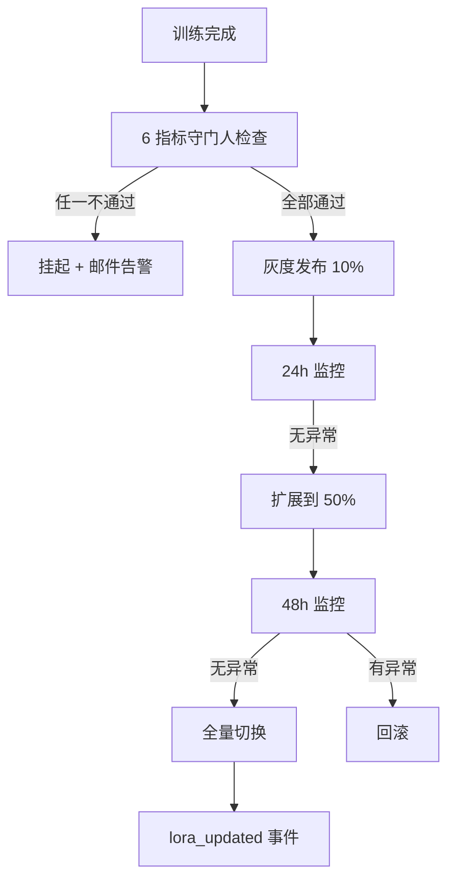
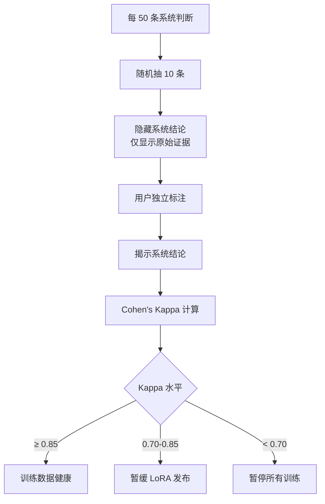
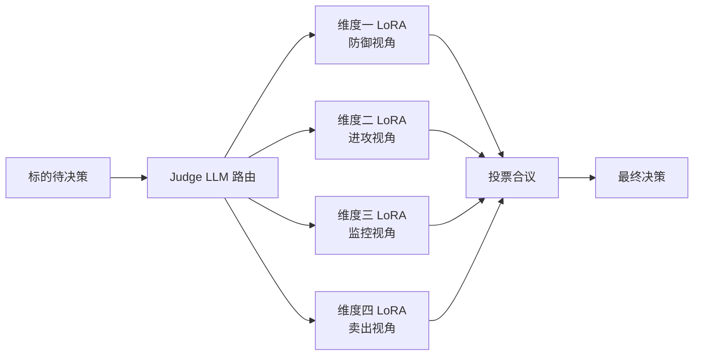

# L3·超级个体进化·06·L2 落地清单（与维度五全量对齐）

> [!NOTE] **[TRACEBACK] 原子规约锚点**
> - **本模块抽象**: [00_四大模块抽象总纲 §3.4](../00_四大模块抽象总纲.md#34-超级个体进化super-individual-evolution)
> - **本模块设计 1-5**: [01_目标与边界](./01_目标与边界_设计.md) / [02_后端服务子模块](./02_后端服务子模块_设计.md) / [03_接口契约](./03_接口契约_设计.md) / [04_数据契约](./04_数据契约_设计.md) / [05_实施推演](./05_实施推演_设计.md)
> - **L2 维度五对齐**: [维度五·演进飞轮](../../02_战略维度/05_维度五_演进飞轮/README.md)
> - **L2 实践策略**: [04_演进实践策略规划](../../02_战略维度/05_维度五_演进飞轮/04_演进实践策略规划.md)
> - **L1 哲学基石**: ⑨演进 + ④八象限

> [!IMPORTANT] **验证后资源释放（全模块强制）**
> 凡本文档涉及或引用的 **本地/联调验证**（单测、集成测、`docker compose`、前后端 dev server、`uvicorn`、临时 worker 等），在 **测试结论已确认并完成准出/实践记录** 后，须 **停止相关进程并释放资源**。检查项与示例命令见 [_共享规约/17_L3设计文档_验证后资源释放规约.md](../_共享规约/17_L3设计文档_验证后资源释放规约.md)。


## 一、本文档的位置

本模块现有 5 设计文档（特别是 02_/03_）对超级个体进化已有不错的覆盖（关键词命中数 87）。本 06 文档在此基础上**精准补强 L2 最新设计的具体能力**：8 象限完整路由表 / LoRA 守门人 6 指标 / 双盲 Kappa 标定 / 议会模式 / 训练频率矩阵 / 月度成本约束。

## 二、L2 能力 → super_evo 服务映射

| L2 能力 | 主责服务 | 协责服务 |
|---|---|---|
| **8 象限决策日志归因 + 路由** | `eval_replay_service` + `feedback_collector` | `knowledge_base_service` |
| **gold_library / failure_library_for_dpo / 等 8 库管理** | `knowledge_base_service` | `model_registry` |
| **LoRA 守门人 6 指标 + 灰度发布** | `model_registry` | `eval_replay_service` |
| **双盲 Kappa 标定** | `feedback_collector` + `eval_replay_service` | `growth_dashboard_service` |
| **议会模式 4 维度 LoRA + Judge LLM** | `model_registry` + `external_action_boundary` | 跨四大模块协作 |
| **训练频率 × 战场矩阵** | `model_registry` | — |
| **月度成本 ≤ ¥10000 约束** | `model_registry`（新增 cost_controller 子组件）| — |
| **Teacher LLM 蒸馏 / LLaMA-Factory / DVC / Label Studio** | （已在 02_ 覆盖，本节不重复）| — |

## 三、8 象限完整路由表（基石⑨核心）

### 3.1 8 象限定义（继承 L2 04_ §二）

> **判定 3 维**：逻辑链状态 × 价格状态 × 时间窗口位置

| 象限 | 逻辑链 | 价格 | 时间 | 名称 |
|---|---|---|---|---|
| **A** | 强 | 涨 | 在窗口期 | **完美决策** |
| **B** | 断 | 涨 | 任意 | **庄家行为（不可学习）** |
| **C** | 强 | 跌 | 在窗口期 | **正常波动等待** |
| **D** | 强 | 跌 | 已过窗口 | **早期下注/可能正确** |
| **E** | 弱 | 涨 | 在窗口期 | **正常波动**（中性）|
| **F** | 断 | 跌 | 任意 | **避雷成功**（reject）|
| **G** | 强 | 跌/横盘 | 已过窗口 | **窗口失败** |
| **H** | 断 | 跌 | 任意 | **真失败**（thesis 通过后逻辑链断）|

### 3.2 路由规则（完整表）

| 象限 | 训练库（knowledge_base）| 训练方式（model_registry）| 是否进 LoRA 训练 |
|---|---|---|---|
| **A·完美** | `gold_library` | SFT 强化（高权重）| ✅ 每月 |
| **B·庄家** | `violation_archive`（隔离）| **不训练** | ❌ 永不（污染数据）|
| **C·等待** | `pending_library` | 等 180 天再归因；归因后路由 | 延迟决定 |
| **D·早期** | `pending_library` | 同 C | 延迟决定 |
| **E·正常波动** | `noise_library`（不入主训练）| 仅作 SLI 阈值校准 | ❌ |
| **F·避雷** | `gold_library`（防御强化分支）| SFT 强化（cryo_guard 引擎）| ✅ 每月 |
| **G·窗口失败** | `window_calibration_library` | 战场窗口参数校准（不入 LoRA）| ❌ |
| **H·真失败** | `failure_library_for_dpo` | **DPO 偏好对训练**（关键）| ✅ 每月 |

### 3.3 实现 `quadrant_router`（新增子组件）

```python
class QuadrantRouter:
    """8 象限路由器（在 feedback_collector 内）"""
    
    ROUTING_RULES = {
        "A": ("gold_library", "sft_reinforce", True),
        "B": ("violation_archive", None, False),
        "C": ("pending_library", "defer", "pending"),
        "D": ("pending_library", "defer", "pending"),
        "E": ("noise_library", "sli_calibration", False),
        "F": ("gold_library", "sft_reinforce_defense", True),
        "G": ("window_calibration_library", "window_param_calibration", False),
        "H": ("failure_library_for_dpo", "dpo_pair", True),
    }
    
    def route(self, attribution: AttributionEvent) -> RoutingDecision:
        library, training_method, will_train = self.ROUTING_RULES[attribution.quadrant]
        # 写入对应库
        kb_service.write(library, attribution)
        # 标记训练计划
        if will_train is True:
            model_registry.queue_training_data(
                attribution, method=training_method
            )
        return RoutingDecision(library, training_method, will_train)
```

### 3.4 隔离规则

```python
# B 象限永久隔离（防止"赌庄家"思维污染训练数据）
def can_use_for_training(sample: TrainingSample) -> bool:
    if sample.quadrant == "B":
        return False
    if sample.source_library == "violation_archive":
        return False
    return True
```

## 四、LoRA 守门人 6 指标 + 灰度发布

### 4.1 6 指标

| # | 指标 | 阈值 | 检查方式 |
|---|---|---|---|
| 1 | **Holdout Recall** | 不能退化 > 5% | 与基线对比 |
| 2 | **Holdout Precision** | 不能退化 > 3% | 与基线对比 |
| 3 | **认知边界覆盖度** | ≥ 0.95 | 5 维边界 pass 率 |
| 4 | **训练数据 B/H 比例** | B ≤ 0% / H ≤ 30% | 数据来源审计 |
| 5 | **Kappa（最近一期）** | ≥ 0.85 | 双盲标定 |
| 6 | **训练成本** | ≤ ¥10000 / 月 | cost_controller |

### 4.2 灰度发布流程



### 4.3 实现 `model_registry.gatekeeper`

```python
class LoRAGatekeeper:
    def check(self, new_lora: LoRAVersion, baseline: LoRAVersion) -> GateResult:
        checks = []
        # 指标 1: Recall
        delta_recall = new_lora.holdout_recall - baseline.holdout_recall
        checks.append({
            "metric": "holdout_recall",
            "passed": delta_recall > -0.05,
            "value": new_lora.holdout_recall,
            "delta": delta_recall
        })
        # 指标 2-6 类似
        # ...
        
        return GateResult(
            passed=all(c["passed"] for c in checks),
            checks=checks
        )
    
    def canary_release(self, new_lora: LoRAVersion):
        # 10% → 50% → 100% 渐进
        for traffic_pct in [10, 50, 100]:
            self.set_traffic_split(new_lora, traffic_pct)
            self.monitor_for(hours=24 if traffic_pct < 100 else 0)
            if self.detect_anomaly():
                self.rollback()
                raise CanaryFailedError()
```

## 五、双盲 Kappa 标定（与维度零反馈闭环对接）

### 5.1 双盲流程

> 严格继承 [维度零·05_反馈闭环 §三](../../02_战略维度/00_维度零_AI投资副驾驶/modules/05_反馈闭环.md)。



### 5.2 实现 `feedback_collector.kappa_calibrator`

```python
from sklearn.metrics import cohen_kappa_score

class KappaCalibrator:
    def run_calibration_session(self, period_id: str) -> KappaResult:
        # 1. 随机抽 10 条系统判断
        samples = self.sample_decisions(n=10)
        # 2. 推送到维度零的双盲面板（隐藏结论）
        await frontend_api.show_blind_labels(samples, period_id)
        # 3. 等待用户完成标注
        user_labels = await wait_for_user_labels(period_id, timeout="7d")
        # 4. 揭示系统结论
        system_labels = [s.system_conclusion for s in samples]
        # 5. 计算 Kappa
        kappa = cohen_kappa_score(user_labels, system_labels)
        # 6. 持久化
        self.db.save(period_id, kappa, samples, user_labels)
        # 7. 路由决策
        if kappa >= 0.85:
            return KappaResult(kappa, action="healthy")
        elif kappa >= 0.70:
            model_registry.pause_lora_release()
            return KappaResult(kappa, action="pause_release")
        else:
            model_registry.halt_all_training()
            emit_alert("Kappa critical < 0.70")
            return KappaResult(kappa, action="halt")
```

## 六、议会模式 4 维度 LoRA + Judge LLM（Stage 3）

### 6.1 架构（继承 L2 维度零·stage_3）



### 6.2 实现（新增 `parliament_orchestrator` 子组件）

```python
class ParliamentOrchestrator:
    """议会模式（在 external_action_boundary 协调下运行）"""
    
    def __init__(self):
        self.judges = {
            "d1_defense": LoRAClient("cryo_guard_lora_v3"),
            "d2_offense": LoRAClient("deep_strike_lora_v2"),
            "d3_monitor": LoRAClient("state_watch_monitor_lora_v1"),
            "d4_exit": LoRAClient("state_watch_exit_lora_v1"),
        }
        self.judge_llm = LLMClient("judge_llm_qwen2.5")
    
    async def deliberate(self, symbol: str, action: str) -> ParliamentDecision:
        # 1. 收集 4 维度独立投票
        votes = await asyncio.gather(*[
            judge.judge(symbol, action) for judge in self.judges.values()
        ])
        # 2. 一票否决（基石⑤）
        if votes[0].vote == "reject":
            return ParliamentDecision(
                final="reject",
                reason="维度一一票否决",
                votes=votes
            )
        # 3. 4 票一致才通过
        if all(v.vote == "approve" for v in votes):
            return ParliamentDecision(final="approve", votes=votes)
        # 4. 否则 abstain
        return ParliamentDecision(final="abstain", votes=votes)
```

## 七、训练频率 × 战场矩阵

| 战场 | LoRA 增量训练频率 | Holdout 评测频率 |
|---|---|---|
| 超短 | 月度 | 月度 |
| 主战场 | 月度 | 月度 |
| 中战场 | 季度 | 月度 |
| 长战场 | 半年 | 季度 |
| 防御类（cryo_guard）| 月度（独立分支）| 月度 |
| 进攻类（deep_strike）| 月度（独立分支）| 月度 |

## 八、月度成本约束 ≤ ¥10000

### 8.1 实现 `cost_controller`（在 model_registry 内）

```python
class CostController:
    MONTHLY_BUDGET = 10000  # ¥
    
    def check_before_training(self, training_job: TrainingJob) -> bool:
        current_month_cost = self.get_current_month_cost()
        estimated_job_cost = self.estimate_cost(training_job)
        if current_month_cost + estimated_job_cost > self.MONTHLY_BUDGET:
            emit_alert(f"月度成本将超出: {current_month_cost + estimated_job_cost}")
            return False
        return True
    
    def get_breakdown(self) -> CostBreakdown:
        return {
            "teacher_llm_distillation": ...,    # Teacher LLM API 调用
            "lora_training_gpu": ...,            # 4090 GPU 折旧
            "data_storage_dvc": ...,             # DVC 存储
            "label_studio_human": ...,           # 人工标注（架构师工时）
            "total": ...,
            "remaining_budget": ...
        }
```

### 8.2 成本目标分布（每月 ¥10000）

| 项 | 预算 | 占比 |
|---|---|---|
| Teacher LLM 蒸馏（API 调用）| ¥3000 | 30% |
| GPU 训练成本（折旧）| ¥3000 | 30% |
| 数据存储 + DVC | ¥1000 | 10% |
| 人工标注（架构师工时折算）| ¥2000 | 20% |
| 缓冲 + 议会模式（Stage 3）| ¥1000 | 10% |

## 九、与其他 L3 模块的协作扩展

| 协作 | 接口 | 说明 |
|---|---|---|
| **cryo_guard** | `RejectAttributionEvent` 输入 | F vs B 归因 |
| **deep_strike** | `ThesisAttributionEvent` 输入 | A/G/H 归因 |
| **state_watch** | `SellSignalEvent` + 卖飞豁免标记 | 卖出归因 |
| **frontend** | `lora_updated` 输出 + 双盲面板 | 月报飞轮训练贡献页 |

## 十、L4 实施推演的 L2 锚定

| L4 阶段 | L2 维度五对应 | 主要交付 |
|---|---|---|
| **Stage 1**（0-3 月）| 维度五 P0 4 组件 | Teacher LLM + LLaMA-Factory + DVC + Label Studio + 8 象限路由 MVP + 首次 LoRA |
| **Stage 2**（3-9 月）| 维度五 P1 | + LoRA 守门人 6 指标 + 灰度 + 双盲 Kappa + DPO 偏好对训练 + cost_controller |
| **Stage 3**（9-12 月）| 维度五 P2 | + 议会模式 4 维度 LoRA + Judge LLM + 议会投票一致性监控 |

## 十一、一致性检查表

- [x] 8 象限完整路由表 + 训练库 + 训练方式
- [x] B 象限永久隔离规则
- [x] LoRA 守门人 6 指标 + 灰度发布流程
- [x] 双盲 Kappa 标定完整实现
- [x] 议会模式架构 + 实现
- [x] 训练频率 × 战场矩阵
- [x] 月度成本约束 ≤ ¥10000 + 实现
- [x] 与 cryo_guard / deep_strike / state_watch / frontend 协作接口
- [x] 承接 L1 基石⑨④

---

## 修订记录

| 日期 | 触发 | 内容 |
|---|---|---|
| 2026-05-16 | L2 反向落地批 4 | 新建 06_，覆盖 8 象限路由 + LoRA 守门人 + 双盲 Kappa + 议会模式 + 训练频率矩阵 + 月度成本 |
