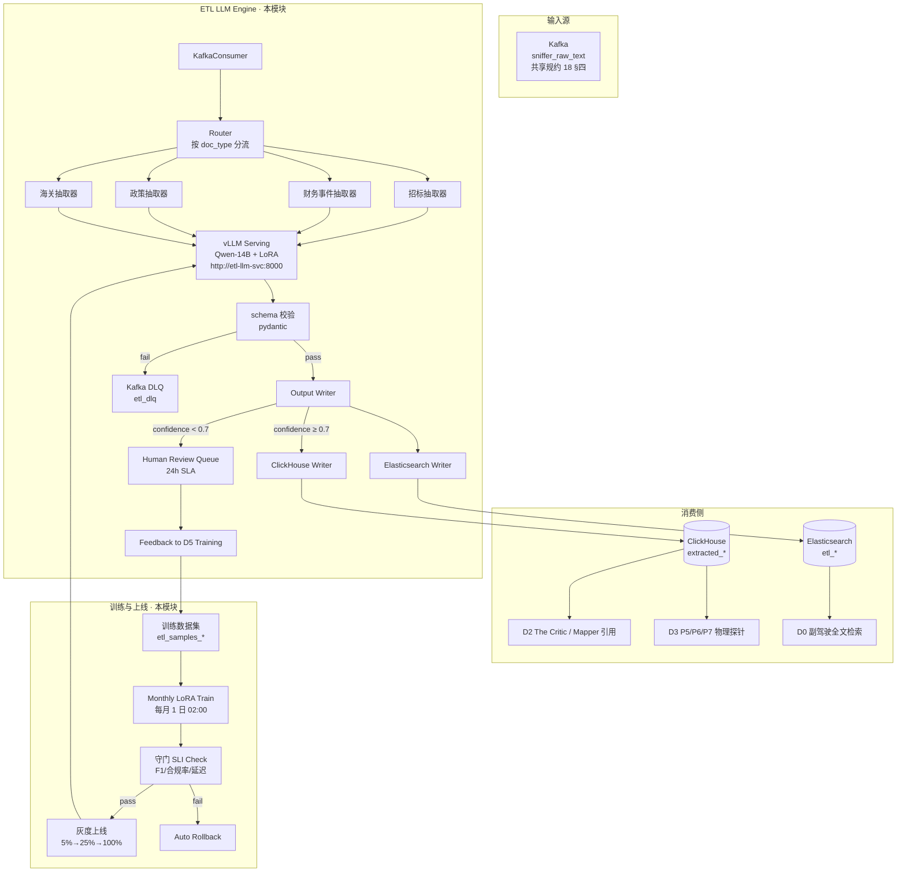

# L3 · 演进飞轮 · 07 · ETL LLM Engine 设计（Lighthouse-Alpha · 本地小模型清洗中心）

> [!NOTE] **[TRACEBACK] 原子规约锚点**
> - **上溯 L1**：[基石 ⑨·演进进化哲学边界](../../01_顶层概念/06_投资哲学体系总纲.md#基石-演进进化哲学边界维度五演进飞轮)
> - **上溯 L2**：[D5 §8A.1 P06 ETL LLM Engine 训练与上线协议](../../02_战略维度/05_维度五_演进飞轮/04_演进实践策略规划.md#八a-lighthouse-alpha-etl-llm-engine-实践规划承接-l1-9-演进哲学--异构-ai-调度栈)
> - **同模块**：[01_目标与边界](./01_目标与边界_设计.md) / [02_后端服务子模块](./02_后端服务子模块_设计.md) §（C1/C2/C3 蒸馏/标定/版本）/ [08_异构 AI 调度栈](./08_异构AI调度栈_设计.md)
> - **下沉 L3 step**：[step_01 环境与基础设施 §3.5.5 ETL LLM Engine 环境就绪](./stages/stage_1_启动期/steps/step_01_环境与基础设施.md) / [step_02 C1_Teacher 蒸馏器 §11.4](./stages/stage_1_启动期/steps/step_02_C1_Teacher蒸馏器.md)
> - **共享规约**：[18_动态采集流水线](../_共享规约/18_动态采集流水线规约.md) §3.2（ETL 消费 sniffer_raw_text）/ [19_异构 AI 调度栈](../_共享规约/19_异构AI调度栈规约.md) §3.1 + §六审计回流
> - **DNA**：[`_System_DNA/05_super_evo/dna_super_evo_etl_llm.yaml`](../_System_DNA/05_super_evo/dna_super_evo_etl_llm.yaml) (Y04)
> - **PRD 引用**：`_drafts/lighthouse_alpha_PRD.md` §1.2（异构 AI 调度栈）+ §4.3（本地小模型清洗中心）

> [!IMPORTANT] **验证后资源释放** 见 [_共享规约/17](../_共享规约/17_L3设计文档_验证后资源释放规约.md)。

---

## 一、本模块定位

ETL LLM Engine 是 Lighthouse-Alpha PRD §4.3 的工程化实现——**用本地微调 Qwen-14B 处理"体力活"**（成千上万篇招标 PDF / 研报 / 长文公告），把非结构化长文本转化为高度标准化的 JSON 字段写入 ClickHouse / Elasticsearch。

**核心理念**（承接 L1 §9 演进哲学）：
> **远程大模型负责脑力，本地小模型负责体力**——异构 AI 调度栈的两条腿。脑力调用稀缺且贵（Claude Opus 4.7 约 ¥0.25~¥1.20/次），体力调用海量但廉价（Qwen-14B 本地 GPU 折旧 ~¥0/次）。

**模块边界**：

| ✅ 本模块 | ❌ 其他模块 |
|---|---|
| Qwen-14B 模型 + LoRA 微调 + 灰度上线 | 路由策略（归 [08_异构 AI 调度栈_设计](./08_异构AI调度栈_设计.md) + 共享规约 19）|
| 4 类 JSON schema（招标/财务事件/政策/海关）抽取 | The Scorer/Critic/Mapper/Architect/Timer（归 D2 维度二）|
| 守门 SLI（F1 ≥ 0.90 / schema 合规 ≥ 0.95 / P95 ≤ 2s）| Kafka topic 共享通道（归共享规约 18）|
| 回流闭环（confidence < 0.7 入人工复核）| 飞轮训练总协议（归 [02_后端服务子模块](./02_后端服务子模块_设计.md) C1）|

---

## 二、模块架构总览



---

## 三、子模块详细设计

### 3.1 vLLM Serving（`etl_llm_serving`）

**主责**：托管 Qwen-14B + LoRA 提供 OpenAI 兼容的 chat completions API。

**部署形态**：

| 项 | 启动期 | 扩展期 |
|---|---|---|
| GPU | A10 或 RTX 4090（24GB 显存）| 4 × A10 |
| 实例数 | 1 | 4（含负载均衡）|
| Endpoint | `http://etl-llm-svc:8000/v1/chat/completions` | 同（multi-replica）|

**Helm Chart**：`deploy-engine/charts/etl-llm-engine`（详见 [16_阿里云ECS_K3s_ACR_Helm](../_共享规约/16_阿里云ECS_K3s_ACR_Helm部署与deploy-engine链路.md)）。

---

### 3.2 4 类抽取器

| 抽取器 | 输入文档类型 | 输出 JSON schema 必填字段 | 输出表 |
|---|---|---|---|
| **招标抽取器** | ccgp 公告 + 三大运营商招标 PDF | project / bidder / amount / tech / region / winning_announcement_date | `extracted_bidding` |
| **财务事件抽取器** | 上市公司公告 PDF | event_type / symbol / related_party / amount / effective_date | `extracted_financial_events` |
| **政策抽取器** | 发改委/工信部/能源局通知 | issuing_authority / title / effective_date / scope_codes / keywords | `extracted_policy` |
| **海关抽取器** | AkShare 海关原始返回（备援补充字段）| hs_code / destination / month / amount / unit_price | `extracted_customs` |

**Prompt 模板存储**：`diting-src/prompts/etl/{bidding,financial,policy,customs}_v{N}.txt`，与 LoRA 版本一一对应。

---

### 3.3 LoRA 微调（`lora_trainer`）

**配置**（DNA Y04 `etl_llm_engine.lora`）：

```yaml
rank: 16
alpha: 32
dropout: 0.1
target_modules: [q_proj, k_proj, v_proj, o_proj]
```

**训练数据集**（每类 ≥ 5000 样本 + Kappa ≥ 0.80）：

| 类别 | 数据来源 | 数量门槛 |
|---|---|---|
| 招标公告 | 维度零价值账本人工标注 + 历史 ccgp 抽取复核 | 5000 |
| 财务事件 | 上市公司公告 + 人工 JSON 标注 | 5000 |
| 政策公告 | 发改委通知历史档案 + 人工标注 | 5000 |
| 海关数据 | AkShare 历史返回 + 人工补充字段 | 5000 |

**质量约束**：
- 人工标注 Kappa ≥ 0.80
- 去重：`md5(content[:500])`
- PII 脱敏强制（共享规约 19 §五）

**训练频率**：
- 每月 1 日 02:00 增量 LoRA
- 每季度（3/6/9/12 月 5 日 00:00）全量重训
- 触发条件：`F1 drop > 5pp` 或 `human_label_kappa < 0.75 持续 7 d` → 立即重训

---

### 3.4 守门 SLI（`serving_sli_gate`）

| 指标 | 门槛 | 违反动作 |
|---|---|---|
| 实体抽取 F1 | ≥ **0.90** | auto rollback to last LoRA |
| JSON schema 合规率 | ≥ **0.95** | 同上 |
| P95 推理延迟 | ≤ **2000 ms/doc** | 同上 |

**评估方式**：固定 holdout 集 200 条/类（每月初由人工标注更新）+ 灰度阶段在线采样 1%。

---

### 3.5 灰度上线（`rollout_orchestrator`）

| 阶段 | 流量比例 | 监测时长 | 通过条件 |
|---|---|---|---|
| 1 | 5% | 24 h | 守门 SLI 三项全通过 + 无 RED 信号 |
| 2 | 25% | 24 h | 同上 |
| 3 | 100% | — | 同上 |

**RED 信号**：任意 SLI 突破 + 上下游消费方告警（如 D3 P5 探针拿到 ETL 输出 schema 漂移）→ **立即全量回滚**。

---

### 3.6 回流闭环（`feedback_loop`）

```
ETL 输出 → 按 confidence 分流
  ├─ confidence ≥ 0.7 → 直接写 ClickHouse / ES
  └─ confidence < 0.7 → Human Review Queue (etl_human_review)
                         ├─ SLA 24h 内人工复核
                         └─ 复核结果回流为下次 LoRA 训练样本
```

**回流到 D5 飞轮**（DNA Y04 `d2_offense_feedback`）：

| 来源 | 入库 | 用途 |
|---|---|---|
| The Scorer prompt + response + 评分明细 | decision_logs | The Scorer 评分一致性 Kappa 训练 |
| The Critic 物理证伪通过/拒绝 + 理由 | decision_logs + 八象限 VIOLATION 类 | The Critic 强化样本 |
| The Mapper 标的映射结果 + 兑现 outcome | value_ledger | The Mapper 业绩弹性校准 |
| The Architect 字典 + 消费/未消费/死字段 | value_ledger | The Architect 字典质量 |
| The Timer 预测 + 实际兑现窗口 | decision_logs | The Timer 节奏推演校准 |

---

## 四、输入与输出契约

### 4.1 输入（Kafka 消费）

```yaml
sniffer_raw_text envelope:
  event_id: str
  event_type: "sniffer_raw_text"
  payload:
    source: research | policy | overseas | bidding | customs
    doc_type: pdf | html | structured_json
    url: str
    content: str                # 原文
    crawled_at: datetime
    content_hash: str           # md5(url+content[:500])
```

### 4.2 输出（写 ClickHouse / Elasticsearch）

```yaml
ExtractedDoc:
  doc_id: str (uuid v4)
  source_event_id: str          # 反向追溯 sniffer_raw_text
  doc_type: bidding | financial | policy | customs
  extracted_at: datetime
  model_version: str            # qwen14b-lora-v3.5
  confidence: float             # 0~1
  extracted_json: object        # 按 §3.2 表 schema
  raw_content_excerpt: str      # 原文前 500 字符（审计用）
```

---

## 五、基础设施依赖

| 组件 | 版本门槛 | 用途 |
|---|---|---|
| Kafka | ≥ 3.5 | 消费 sniffer_raw_text + 失败 DLQ etl_dlq |
| ClickHouse | ≥ 23.8 | 写 extracted_* 4 张表 |
| Elasticsearch | ≥ 8.10 | 写 etl_* 全文索引 |
| MinIO | 任意 | 存放 base model + LoRA versions |
| vLLM | ≥ 0.5 | 模型 serving |
| GPU | A10 / 4090 24GB 显存 ×1（启动）| Qwen-14B 推理 |
| Helm Chart | `deploy-engine/charts/etl-llm-engine` | 部署 |

---

## 六、对外接口

| API | 方法 | 用途 |
|---|---|---|
| `POST /api/etl/extract` | POST | 对单文档手动触发抽取（含 confidence + raw response） |
| `GET /api/etl/health` | GET | vLLM 状态 + 守门 SLI 当前值 + 灰度阶段 |
| `GET /api/etl/lora/versions` | GET | LoRA 历史版本列表 + 各版本守门 SLI |
| `POST /api/etl/lora/rollback` | POST | 架构师手动回滚 LoRA 到指定版本 |
| `GET /api/etl/human-review/pending` | GET | 待复核队列（含 SLA 倒计时）|
| `POST /api/etl/human-review/{doc_id}/submit` | POST | 提交人工复核结果 |

---

## 七、失败模式与保护

| 失败 | 保护 |
|---|---|
| vLLM 服务不可用 | Kafka consumer 暂停 + 告警；DLQ 不堆积，等服务恢复重处理 |
| JSON schema 校验失败 | 写 DLQ `etl_dlq`；架构师人工复核 prompt 模板 |
| GPU OOM | 降低 batch_size（运行时自动）+ 告警；持续 OOM → 切回上一版 LoRA（rank 较小）|
| LoRA 训练失败 | 保留上版 + 告警；触发条件不变（下月初再尝试）|
| 守门 SLI 突破 | 自动回滚 + 告警；连续 2 次 → 暂停自动训练，等人工介入 |

---

## 八、关键设计取舍

1. **Qwen-14B 而非更大模型**：14B 是性价比临界点（13B 召回率不达标，70B 单 GPU 跑不起来）
2. **vLLM 而非 transformers raw**：吞吐高 + OpenAI 兼容 API + 易部署
3. **每月增量 + 每季度全量**：增量保鲜（新词新事件）+ 全量防 catastrophic forgetting
4. **confidence < 0.7 入人工复核**：质量优于速度——飞轮训练样本质量是模型上限
5. **5 LoRA 版本回滚池**：保留最近 5 版（含元数据），出问题立即可回滚
6. **守门 SLI 三项硬门禁**：F1 / 合规率 / 延迟 任一不达标即拒绝上线
7. **PII 脱敏强制**：本模型可访问全数据（含 PII），但输出前必须脱敏（共享规约 19 §五）

---

## 九、违反检测（CI）

| # | 违反 | 检测 |
|---|---|---|
| V1 | 业务代码直连 vLLM endpoint | 必须走 `AIDispatcher.call(scene="etl", ...)`（共享规约 19 SDK1）|
| V2 | 输出未脱敏 PII（手机号等） | 输出 writer runtime guard + 正则单测 |
| V3 | LoRA 上线未跑守门 SLI | rollout orchestrator runtime guard |
| V4 | 守门 SLI 不达标仍上线 | 同上 |
| V5 | 输入 input_text 留存 > 30 d | ClickHouse TTL + cron 检测 |
| V6 | LoRA 训练用了未脱敏的 PII 数据 | 训练前 PII scrubber gate |
| V7 | 抽取 schema 缺必填字段 | pydantic 强校验 + 单测 |

---

## 十、修订记录

| 日期 | 触发 | 内容 |
|---|---|---|
| 2026-05-21 | Lighthouse-Alpha ETL LLM Engine L3 设计文档缺失 | 首版：①模块定位（远程脑力 + 本地体力 异构调度的"本地"半边）；②mermaid 架构图（4 层：源→分流→vLLM→输出 + 训练上线 + 回流）；③6 个子模块（vLLM serving / 4 抽取器 / LoRA 微调 / 守门 SLI / 灰度上线 / 回流闭环）；④输入输出契约 ExtractedDoc schema；⑤基础设施依赖 7 项；⑥6 个对外 API；⑦失败模式 5 行；⑧7 条关键取舍；⑨违反检测 V1~V7；TRACEBACK 上溯 L1 §9 + L2 D5 §8A + PRD §1.2 + §4.3；下沉 step_01 + DNA Y04 + 共享规约 18/19 |
