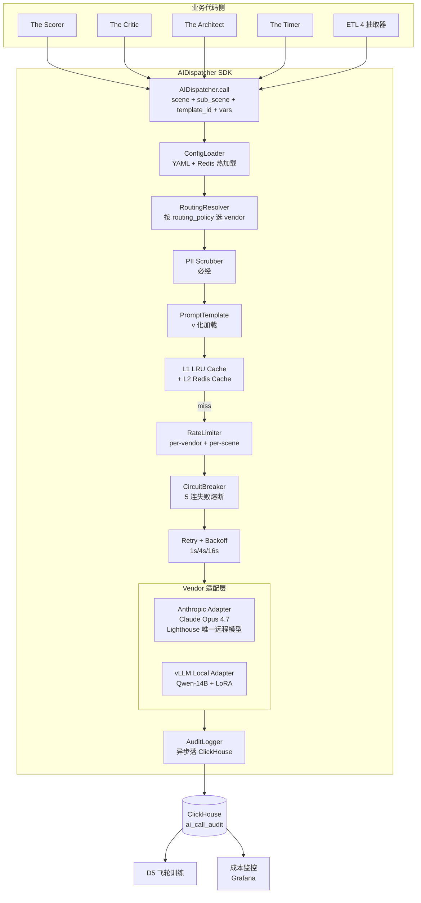

# L3 · 演进飞轮 · 08 · 异构 AI 调度栈设计（Lighthouse-Alpha · AIDispatcher）

> [!NOTE] **[TRACEBACK] 原子规约锚点**
> - **上溯 L1**：[基石 ⑨·演进进化哲学边界](../../01_顶层概念/06_投资哲学体系总纲.md#基石-演进进化哲学边界维度五演进飞轮)
> - **上溯 L2**：[D5 §8A.2 异构 AI 调度框架（脑力 vs 体力 解耦）](../../02_战略维度/05_维度五_演进飞轮/04_演进实践策略规划.md#八a-lighthouse-alpha-etl-llm-engine-实践规划承接-l1-9-演进哲学--异构-ai-调度栈)
> - **同模块**：[01_目标与边界](./01_目标与边界_设计.md) / [02_后端服务子模块](./02_后端服务子模块_设计.md) / [07_ETL_LLM_Engine](./07_ETL_LLM_Engine_设计.md)（本地小模型半边）
> - **下沉 L3 step**：[step_01 环境与基础设施 §3.5.4 AIDispatcher 框架就绪](./stages/stage_1_启动期/steps/step_01_环境与基础设施.md)
> - **共享规约**：[19_异构 AI 调度栈](../_共享规约/19_异构AI调度栈规约.md)（**本设计文档的规约级真相源**）/ [06_AI 治理与提示词版本化](../_共享规约/06_AI治理与提示词版本化规约.md)
> - **DNA**：`_System_DNA/05_super_evo/dna_super_evo_etl_llm.yaml` Y04 `dispatcher` section
> - **PRD 引用**：`_drafts/lighthouse_alpha_PRD.md` §1.2（脑力 + 体力 异构 AI 调度栈）

> [!IMPORTANT] **验证后资源释放** 见 [_共享规约/17](../_共享规约/17_L3设计文档_验证后资源释放规约.md)。

---

## 一、本模块定位

异构 AI 调度栈（AIDispatcher）是 Lighthouse-Alpha PRD §1.2 的工程化实现——**唯一对外 SDK 入口**，把"远程大模型（**Claude Opus 4.7 · 全替**）"与"本地小模型（Qwen-14B / ETL LLM Engine）"两条腿的复杂性收敛到统一调度框架内，对业务代码暴露 `AIDispatcher.call(scene, sub_scene, prompt_template_id, prompt_vars)` 单一 API。

**核心理念**（承接 L1 §9 演进哲学）：
> **解耦"哪个场景调哪个模型"与"业务逻辑"**——业务代码不感知 vendor/model；vendor 切换 / 模型替换 / 灰度发布 由调度栈统一负责。

**模块边界**：

| ✅ 本模块 | ❌ 其他模块 |
|---|---|
| 路由策略 + 限流熔断 + 重试退避 + 审计 + 成本治理 + PII 脱敏 | ETL LLM Engine 内部（vLLM serving / LoRA 训练 归 [07_ETL_LLM_Engine](./07_ETL_LLM_Engine_设计.md)）|
| AIDispatcher Python SDK + Prompt 模板版本化 | The Scorer/Critic/Architect/Timer 业务实现（归 D2 各 step）|
| 配置驱动（YAML/Redis 热加载）| Vendor 凭证管理（归 [13_密钥与配置](../_共享规约/13_密钥与配置规约.md)）|

---

## 二、模块架构总览



---

## 三、子模块详细设计

### 3.1 AIDispatcher SDK（`ai_dispatch.dispatcher`）

**唯一对外 API**（共享规约 19 §7.2 SDK1~SDK4）：

```python
class AIDispatcher:
    @classmethod
    def call(
        cls,
        scene: str,                # "scorer" / "critic" / "architect" / "timer" / "etl" / ...
        sub_scene: str | None,     # "policy_tier" / "industry_space" / "a_share_mapping" / None
        prompt_template_id: str,   # "scorer_policy_tier_v3"
        prompt_vars: dict,         # 模板填充变量
        timeout_s: float = 30.0,
        cache_key: str | None = None,
    ) -> AIResponse:
        """
        统一 AI 调用入口；业务代码禁止直连 openai / anthropic / vllm。
        路由策略由配置文件决定（YAML + Redis 热加载，5 分钟生效）。
        """
```

**AIResponse 数据结构**：

```python
@dataclass
class AIResponse:
    request_id: str                 # uuid v4
    scene: str
    sub_scene: str | None
    vendor: str                     # anthropic / vllm_local（Lighthouse 远程仅 anthropic）
    model: str                      # claude-opus-4-7 / qwen14b-lora-v3.5
    prompt_template_id: str
    response_text: str
    parsed_json: dict | None        # 若 template 声明了 jsonschema
    tokens_input: int
    tokens_output: int
    cost_yuan: float
    latency_ms: int
    confidence: float | None        # 大模型不提供时为 None
    audit_id: str                   # ClickHouse 行 ID
```

---

### 3.2 配置驱动路由

**配置文件**（DNA Y04 + 共享规约 19 §3.1）：

```yaml
ai_dispatch:
  remote_large_model:              # DNA Y01 theme_sniffer.remote_large_model 权威引用
    provider: anthropic
    model: claude-opus-4-7
    api_model_id: claude-opus-4-20250514
    single_vendor_only: true       # Lighthouse 五场景禁止 openai 路由
  scenes:
    scorer:
      sub_scenes:
        policy_tier:
          routing: remote_large
          vendor: anthropic
          model: claude-opus-4-7
          rationale: 政治体制与政策层级判断需顶级通识推理
        industry_space:
          routing: local_small
          vendor: vllm_local
          model: qwen14b-lora-industry-v3.5
          rationale: 行业空间规则映射，本地小模型足够
        a_share_mapping:
          routing: remote_large
          vendor: anthropic
          model: claude-opus-4-7
    critic:
      routing: remote_large
      vendor: anthropic
      model: claude-opus-4-7
    architect:
      routing: remote_large
      vendor: anthropic
      model: claude-opus-4-7
      rationale: 长上下文 + HS Code + 跨数据源字典推理
    timer:
      routing: remote_large
      vendor: anthropic
      model: claude-opus-4-7
    etl:
      routing: local_small
      vendor: vllm_local
      model: qwen14b-lora-v3.5
  cost:
    daily_budget_yuan_startup: 141
    daily_budget_yuan_extension: 1060
    per_cluster_scorer_max_yuan: 0.75
```

**热加载**：通过 Redis pub/sub 通道 `config:reload:ai_dispatch`；5 分钟内全集群生效；ConfigLoader 监听并 reload。

---

### 3.3 PII 脱敏（`pii_scrubber`）

**必经环节**——所有调用 vendor 前必须脱敏：

| 类型 | 检测 | 脱敏 |
|---|---|---|
| 手机号 | `1[3-9]\d{9}` | `1**********` |
| 身份证 | `\d{17}[\dXx]` | `**1234` |
| 银行卡 | `\d{16,19}` | `****1234` |
| 邮箱 | `[\w.-]+@[\w.-]+` | `***@***` |
| 持仓金额（>10万）| 数值规则 | 字段保留 + 数值替换为分级 token |

**审计**：每次脱敏次数 + 类型分布写 ClickHouse `pii_scrub_stats`。

---

### 3.4 限流与熔断（`rate_limiter` + `circuit_breaker`）

| vendor | per-scene RPM | per-tenant TPS | 熔断阈值 |
|---|---|---|---|
| anthropic (claude-opus-4-7) | 200（启动）/ 400（扩展）| 50 | 5 连失败 / 1 min → OPEN 30s |
| vllm_local | 5000 | 1000 | 5 连失败 / 1 min → OPEN 60s |

**熔断器状态机**：

```
CLOSED ──5 连失败──→ OPEN ──30s 后─→ HALF_OPEN ──1 次成功──→ CLOSED
                                       │                       
                                       └─失败─→ OPEN（再 30s）
```

---

### 3.5 重试与退避

- 重试条件：429（限流） / 5xx / 网络超时
- 退避：1s → 4s → 16s（指数 + 0.5 jitter）
- 重试上限：3 次（DNA 可调整）
- 重试不变更 prompt（保持幂等）

---

### 3.6 Cache（可选 · 双层）

| 层 | 介质 | TTL | 命中策略 |
|---|---|---|---|
| L1 | LRU in-process（每实例 1000 entries）| 5 min | 命中 + 跳过 vendor 调用 |
| L2 | Redis | 1 h | 命中 + 跳过 vendor 调用 |

**cache_key 设计**：`hash(scene + sub_scene + prompt_template_id + prompt_vars)`；业务可显式传 `cache_key=None` 禁用 cache（如 The Scorer 不缓存，每次评分要独立）。

---

### 3.7 Vendor 适配层

| Adapter | 文件 | 协议 |
|---|---|---|
| Anthropic Adapter | `ai_dispatch/adapters/anthropic_adapter.py` | Anthropic Messages API（**Claude Opus 4.7**）|
| vLLM Local Adapter | `ai_dispatch/adapters/vllm_adapter.py` | OpenAI 兼容 API（vLLM 服务）|

> Lighthouse-Alpha 远程脑力场景**仅**走 Anthropic Adapter；OpenAI Adapter 保留供 C1 Teacher / MoE 议会等非 Lighthouse 场景，但 **禁止** Lighthouse scene 路由至 OpenAI（runtime guard + CI V7）。

**新增 vendor 流程**：① 实现 BaseAdapter 接口；② 加配置；③ 跑契约单测；④ 不需要改业务代码。

---

### 3.8 审计日志（`audit_logger`）

**异步落 ClickHouse `ai_call_audit`**（共享规约 19 §六）：

```sql
CREATE TABLE ai_call_audit (
  request_id String,
  ts DateTime,
  scene String,
  sub_scene String,
  vendor String,
  model String,
  prompt_template_id String,
  prompt_template_version String,
  prompt_vars_hash String,           -- 脱敏后的 hash
  response_text String,
  parsed_json String,                -- JSON 字段
  tokens_input UInt32,
  tokens_output UInt32,
  cost_yuan Float64,
  latency_ms UInt32,
  status String,                     -- success / timeout / 429 / 5xx / circuit_open
  retry_count UInt8,
  cache_hit Bool,
  pii_scrub_count UInt8,
  audit_id UUID
) ENGINE = MergeTree() ORDER BY (ts, scene, vendor);
```

**TTL**：保留 6 个月（DNA 可调整）。

---

## 四、Prompt 模板版本化（共享规约 06）

**存储**：`diting-src/prompts/{scene}/{sub_scene}_v{N}.txt`

**模板 schema**：

```yaml
prompt_template_id: scorer_policy_tier_v3
version: 3
description: ...
input_variables: [cluster_text, sniffer_cluster_id]
output_jsonschema: {...}            # 若需要结构化输出
constraints:
  max_tokens: 300
  temperature: 0.1
  response_format: json_object
template: |
  你是 A 股资深政策分析师...
  Cluster: {{cluster_text}}
  请按以下 rubric 评分（0~10）：
  ...
  返回 JSON: {"policy_tier": <int>, "source_urls": [...], "reasoning": "..."}
```

**版本升级**：PR 合并即新版本；旧版本保留可回滚；A/B test 通过配置文件 `routing.prompt_template_id` 切换。

---

## 五、成本治理

**预算**（DNA Y04 + 共享规约 19 §四）：

| 阶段 | 日预算 | 月预算 | 报警 |
|---|---|---|---|
| 启动期 | ¥ **141** | ¥ **4230** | 日预算 80% / 95% / 100% |
| 扩展期 | ¥ **1060** | ¥ **31800** | 同上 |

**控制手段**：
- 配置 hard cap：单日超 100% → 调度栈拒绝新 remote_large 请求 + 降级到 local_small（DNA `cost.hard_cap_strategy: degrade_or_block`）
- 每场景成本上限（DNA `cost.per_scene_cap_yuan_per_day`）
- Grafana 告警 + 飞书/钉钉通知

---

## 六、对外接口（管理面）

| API | 方法 | 用途 |
|---|---|---|
| `GET /api/dispatch/routing` | GET | 当前路由配置（含 vendor / model / template_id）|
| `POST /api/dispatch/routing/reload` | POST | 触发 Redis pub/sub 热加载 |
| `GET /api/dispatch/cost?date=` | GET | 日成本明细（按 scene / vendor）|
| `GET /api/dispatch/health` | GET | 各 vendor 限流 / 熔断 / 错误率 |
| `POST /api/dispatch/cb/{vendor}/close` | POST | 架构师手动关闭熔断（紧急时）|
| `GET /api/dispatch/audit?request_id=` | GET | 单次调用审计明细 |

---

## 七、失败模式与保护

| 失败 | 保护 |
|---|---|
| openai 单 vendor 不可用 | 路由配置 fallback（如 openai → anthropic）；熔断 + 降级；告警 |
| 单 sub_scene 成本超日预算 | 该 sub_scene 临时切 local_small + 告警；架构师审查 |
| 配置文件错误（YAML 解析失败）| 保留上一份有效配置 + 告警；不阻塞 |
| PII 脱敏正则误伤业务字段 | 单元测试覆盖所有业务字段 white-list；脱敏前后 diff 对比单测 |
| ClickHouse 不可用导致审计阻塞 | 异步写 + 本地 SQLite 缓冲；缓冲满 → 停 producer + 告警（不影响业务调用）|
| 业务代码绕过 SDK 直连 vendor | CI grep `import openai / import anthropic` 仅允许在 `ai_dispatch/`（共享规约 19 §九 V1）|

---

## 八、关键设计取舍

1. **统一 SDK 入口**：业务代码不感知 vendor —— 解决"切 vendor / 灰度 / 模型升级"全部痛点的根本方法
2. **PII 脱敏前置**：在 vendor 调用前必经，确保上游业务字段污染不会泄漏
3. **熔断 + 退避标配**：vendor 不稳定是常态（OpenAI 429 频发），调度栈必须做韧性
4. **审计异步落 ClickHouse**：同步会拖慢业务调用；用本地 SQLite 缓冲做兜底
5. **配置驱动热加载**：变更 routing 不重启服务（Redis pub/sub 通道）；架构师可 30 秒内切 vendor
6. **Cache 默认开但可禁用**：The Scorer 等不能 cache（独立性要求），业务可显式传 `cache_key=None`
7. **Opus 4.7 单 vendor**：Lighthouse 远程脑力不混用 GPT-4o/Claude 3.5——降低 prompt 行为漂移与审计复杂度

---

## 九、违反检测（CI）

| # | 违反 | 检测 |
|---|---|---|
| V1 | 业务代码 `import openai / anthropic / vllm` 不在 `ai_dispatch/` 下 | CI grep |
| V2 | 业务代码直拼 prompt（不通过 prompt_template_id）| AST 静态检查 + 单测 |
| V3 | PII 脱敏被绕过（vendor 调用前未经 PIIScrubber）| 集成测 + runtime guard |
| V4 | 审计日志缺字段 | 异步 writer schema 强校验 |
| V5 | 配置文件路由场景未在 SCENES 白名单 | ConfigLoader runtime guard |
| V6 | 日成本超预算仍持续调 remote_large | runtime guard + 告警 |
| V7 | Lighthouse scene 路由到非 Opus 4.7 | ConfigLoader runtime guard + CI grep |

---

## 十、修订记录

| 日期 | 触发 | 内容 |
|---|---|---|
| 2026-05-22 | **Opus 4.7 全替** | 远程模型统一 Claude Opus 4.7；Vendor 层简化为 Anthropic + vLLM；配置 YAML + 预算 ¥141/¥1060 同步共享规约 19 + DNA Y01 v1.1 |
| 2026-05-21 | Lighthouse-Alpha 异构 AI 调度栈 L3 设计文档缺失 | 首版：①模块定位（业务不感知 vendor + 切换/灰度/升级统一）；②mermaid 架构图（业务 → SDK 9 节点 → vendor 适配 → 审计/成本）；③8 个子模块详细设计（SDK API / 配置驱动路由 / PII 脱敏 / 限流熔断 / 重试退避 / Cache 双层 / Vendor 适配 / 审计日志）；④Prompt 模板版本化；⑤成本治理（日/月预算 + hard cap 降级）；⑥6 个管理面 API；⑦失败模式 6 行；⑧7 条关键取舍；⑨违反检测 V1~V7；TRACEBACK 上溯 L1 §9 + L2 D5 §8A.2 + PRD §1.2；下沉 step_01 + DNA Y04 + 共享规约 19（规约级真相源）|
