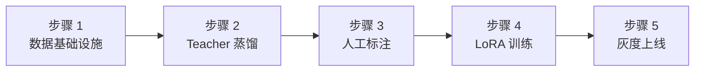

# 维度五·演进飞轮·启动期·实践目标与策略

> [!NOTE] **[TRACEBACK] 实践锚点**
> - **L2 战略规划**: [维度五·演进飞轮](../../../../02_战略维度/05_维度五_演进飞轮/README.md)
> - **L3 模块设计**: [维度五_演进飞轮/README](../../README.md) + [06_L2 落地清单](../../06_L2落地清单_设计.md)
> - **同阶段文档**: [02_技术方案](./02_技术方案与代码架构.md) / [03_数据采集](./03_数据采集与预处理.md) / [04_模型训练](./04_模型训练与部署.md) / [05_验收标准](./05_验收标准与检查清单.md)
> - **L1 哲学基石**: ⑥演进（永续学习）

---

## 一、本阶段目标

### 1.1 一句话目标

> **用 4 个 P0 组件实现"AI 模型自我进化"的最小闭环基础设施。**

### 1.2 量化目标

| 目标项 | 指标 | 阈值 |
|---|---|---|
| P0 组件数量 | 4 个核心组件上线 | Teacher 蒸馏 + Label Studio + LLaMA-Factory + 双盲 Kappa |
| 数据版本化 | DVC 版本管理 | 100% 训练数据可追溯 |
| 标注一致性 | 双盲 Kappa 系数 | κ ≥ 0.70 |
| 首次 LoRA | 完成首次 LoRA 训练 | 模型可部署 |
| 事件输出 | lora_updated 事件 | 每次训练完成后发出 |

### 1.3 本阶段交付物

| 交付物 | 描述 | 验收方式 |
|---|---|---|
| Teacher LLM 蒸馏服务 | Claude-3.5-Sonnet API 调用 + 蒸馏 Prompt | API 可调用 + 输出 JSONL |
| Label Studio 部署 | 人工标注平台 + 任务模板 | Web UI 可访问 + 标注可导出 |
| LLaMA-Factory 训练环境 | LoRA 训练配置 + GPU Job | 训练可启动 + 模型可导出 |
| 双盲 Kappa 校准 | 质量控制流程 + Kappa 计算脚本 | κ ≥ 0.70 |
| DVC 数据版本化 | 训练数据版本管理 | 任意版本可复现 |
| lora_updated 事件 | 训练完成事件发布 | 事件可被下游消费 |
| 实践文档 | 本阶段 5 份实践设计文档 | 完整可执行 |

---

## 二、总体策略

### 2.1 核心策略：闭环优先 + 质量可控

```
┌─────────────────────────────────────────────────────────────┐
│                    策略一：飞轮闭环                          │
│  决策日志 → Teacher 蒸馏 → 人工 Verified → LoRA 训练 → 上线  │
│  ↑                                                    ↓     │
│  └────────────── 反馈收集 ← 评测验证 ←──────────────────┘     │
└─────────────────────────────────────────────────────────────┘
```

**为什么闭环优先？**
- L1 基石⑥：演进优于静止
- 模型只有在真实场景中使用并收集反馈，才能持续改进
- 启动期验证最小闭环，后续阶段再增加自动化程度

### 2.2 组件分工策略

| 组件 | 职责 | 输入 | 输出 |
|---|---|---|---|
| **Teacher LLM** | 高质量蒸馏 | 原始数据 + Prompt | JSONL 格式训练数据 |
| **Label Studio** | 人工验证与标注 | Teacher 输出 | Verified 数据集 |
| **LLaMA-Factory** | LoRA 微调训练 | Verified 数据集 | LoRA 权重 |
| **双盲 Kappa** | 标注质量控制 | 多标注员结果 | Kappa 系数 + 争议样本 |

### 2.3 技术选型策略

| 层面 | 选型 | 理由 |
|---|---|---|
| Teacher LLM | Claude-3.5-Sonnet | 推理能力强 + JSON 格式稳定 |
| 标注平台 | Label Studio | 开源 + 灵活配置 + API 导出 |
| 微调框架 | LLaMA-Factory | LoRA/QLoRA 支持 + 中文友好 |
| 推理引擎 | vLLM | 高吞吐 + 多 LoRA 热加载 |
| 数据版本 | DVC | Git-like 数据版本管理 |
| 事件总线 | Redis Streams | 轻量级 + 可持久化 |

### 2.4 数据策略：版本化 + 可追溯

| 策略 | 说明 |
|---|---|
| **DVC 版本化** | 所有训练数据必须 DVC 管理，commit hash 可追溯 |
| **双盲 Kappa** | 关键数据双人独立标注，Kappa ≥ 0.70 |
| **B 象限隔离** | 拒绝归因失败的数据永久隔离，不进训练 |
| **Holdout 锁库** | 评测数据永久锁定，不可用于训练 |

### 2.5 部署策略：单节点起步

| 策略 | 说明 |
|---|---|
| **单节点部署** | 启动期在单台 4090 服务器部署 |
| **Label Studio Docker** | Docker Compose 部署，数据持久化 |
| **手动灰度** | 首次 LoRA 手动 10% → 50% → 100% 灰度 |
| **事件驱动** | lora_updated 事件通知下游系统 |

---

## 三、实施路径（5 步）



| 步骤 | 名称 | step 锚（维内） | 主要产出 | 详细文档 |
|---|---|---|---|---|
| 1 | 数据基础设施 | step_01 | DVC + S3/Local 存储 + 决策日志 Schema | [03_数据采集](./03_数据采集与预处理.md) |
| 2 | Teacher LLM 蒸馏 | step_02～03 | 蒸馏服务 + Prompt 模板 + 速率控制 | [02_技术方案](./02_技术方案与代码架构.md) |
| 3 | Label Studio 标注 | step_03～06 | 标注平台 + 任务模板 + 双盲 Kappa | [02_技术方案](./02_技术方案与代码架构.md) |
| 4 | LLaMA-Factory 训练 | step_04～07 | 训练配置 + GPU Job + 首次 LoRA | [04_模型训练](./04_模型训练与部署.md) |
| 5 | 灰度上线 | step_07～10 | vLLM 部署 + 灰度发布 + lora_updated 事件 | [04_模型训练](./04_模型训练与部署.md) |

---

## 四、风险与应对

| 风险 | 概率 | 影响 | 应对策略 |
|---|---|---|---|
| Teacher LLM API 调用超额 | 中 | 中 | 切换备用模型（GPT-4 / Qwen）+ 速率限制 |
| 标注一致性低（Kappa < 0.70）| 中 | 高 | 增加标注指南培训 + 争议样本仲裁 |
| LoRA 训练效果差 | 中 | 高 | 增加训练数据 + 调整 LoRA rank |
| 灰度上线引发回归 | 低 | 高 | 快速回滚机制 + 监控告警 |
| B 象限数据误入训练 | 低 | 极高 | 双重校验 + 审计日志 + 立即剔除重训 |

---

## 五、本阶段不做什么（明确边界）

| 不做的事 | 留待阶段 | 原因 |
|---|---|---|
| ❌ 自动化 DPO | 扩展期 | 先跑通 SFT，再做偏好对齐 |
| ❌ 自动灰度发布 | 扩展期 | 先手动验证流程 |
| ❌ 多模型 A/B 测试 | 完善期 | 先验证单模型流程 |
| ❌ 实时在线学习 | 完善期 | 先跑通离线训练 |
| ❌ 8 象限自动路由 | 扩展期 | 启动期手动分类 + 路由 |

---

## 六、成功标准

### 6.1 硬性准出条件

- [ ] 4 P0 组件全部上线
  - [ ] Teacher LLM 蒸馏服务可调用
  - [ ] Label Studio 可访问并标注
  - [ ] LLaMA-Factory 训练可执行
  - [ ] 双盲 Kappa κ ≥ 0.70
- [ ] DVC 数据版本化 100%
- [ ] 首次 LoRA 训练完成
- [ ] lora_updated 事件可发布

### 6.2 软性目标

- [ ] Teacher 蒸馏输出格式正确率 ≥ 95%
- [ ] 标注任务周转时间 < 48h
- [ ] 训练 → 上线周期 < 1 周
- [ ] 文档完整可执行

---

## 七、负责人与时间

| 角色 | 负责人 | 职责 |
|---|---|---|
| 架构师 | @架构师 | 整体设计 + 质量控制 + 验收 |
| AI | Claude/GPT | 代码生成 + 文档补全 |
| 标注员 | 待定 | 人工 Verified 标注 |

**预计周期**：10 周（0-3 月内完成）

---

## 修订记录

| 日期 | 内容 |
|---|---|
| 2026-05-16 | 初版，覆盖启动期目标、策略、路径、风险、边界 |
