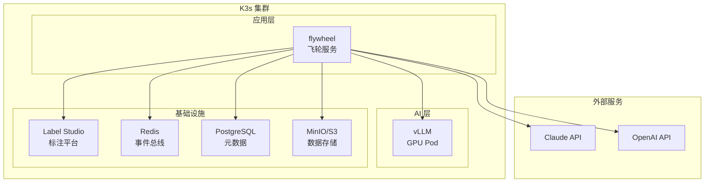

# 维度五·演进飞轮·启动期·技术方案与代码架构

> [!NOTE] **[TRACEBACK] 实践锚点**
> - **本阶段策略**: [01_实践目标与策略](./01_实践目标与策略.md)
> - **L2 演进规划**: [维度五·演进飞轮](../../../../02_战略维度/05_维度五_演进飞轮/README.md)
> - **L3 接口契约**: [维度五_演进飞轮/03_接口契约_设计](../../03_接口契约_设计.md)

---

## 一、技术选型总览

### 1.1 技术栈矩阵

| 层面 | 技术选型 | 版本 | 说明 |
|---|---|---|---|
| **Teacher LLM** | Claude-3.5-Sonnet | latest | 高质量蒸馏 |
| **备用 Teacher** | GPT-4 / Qwen-Max | latest | 降级备选 |
| **标注平台** | Label Studio | 1.10+ | 人工标注 + 审核 |
| **微调框架** | LLaMA-Factory | 0.8+ | LoRA/QLoRA 支持 |
| **基座模型** | Qwen2.5-7B-Instruct | latest | 中文能力强，32K 上下文 |
| **推理引擎** | vLLM | 0.4+ | 多 LoRA 热加载 |
| **数据版本** | DVC | 3.0+ | 数据版本管理 |
| **事件总线** | Redis Streams | 7.0+ | 轻量级消息队列 |
| **存储** | S3 / MinIO | latest | 训练数据存储 |
| **数据库** | PostgreSQL | 15+ | Label Studio 后端 |

### 1.2 硬件要求

| 组件 | 最低配置 | 推荐配置 |
|---|---|---|
| GPU | RTX 4090 24GB × 1 | RTX 4090 24GB × 2 |
| CPU | 8 核 | 16 核 |
| 内存 | 64GB | 128GB |
| 存储 | 500GB SSD | 1TB NVMe |

---

## 二、代码仓库结构

```
diting-src/
├── flywheel/                        # 演进飞轮模块
│   ├── __init__.py
│   ├── config.py                    # 配置管理
│   ├── teacher/                     # Teacher LLM 蒸馏
│   │   ├── __init__.py
│   │   ├── distiller.py             # 蒸馏器主逻辑
│   │   ├── prompts/                 # Prompt 模板
│   │   │   ├── base_prompt.py
│   │   │   ├── financial_fraud.py
│   │   │   ├── shareholder.py
│   │   │   └── related_party.py
│   │   ├── rate_limiter.py          # 速率控制
│   │   ├── clients/                 # API 客户端
│   │   │   ├── anthropic_client.py
│   │   │   ├── openai_client.py
│   │   │   └── qwen_client.py
│   │   └── schemas.py               # Pydantic 模型
│   ├── labeling/                    # 标注相关
│   │   ├── __init__.py
│   │   ├── label_studio_client.py   # Label Studio API
│   │   ├── task_templates/          # 任务模板
│   │   │   ├── financial_fraud.xml
│   │   │   ├── shareholder.xml
│   │   │   └── related_party.xml
│   │   ├── kappa_calculator.py      # Kappa 系数计算
│   │   ├── blind_assignment.py      # 双盲分配
│   │   └── export.py                # 数据导出
│   ├── training/                    # 训练相关
│   │   ├── __init__.py
│   │   ├── data_prep.py             # 数据预处理
│   │   ├── trainer.py               # 训练器封装
│   │   ├── evaluator.py             # 评测器
│   │   └── configs/                 # LLaMA-Factory 配置
│   │       ├── base_lora.yaml
│   │       ├── financial_fraud_lora.yaml
│   │       ├── shareholder_lora.yaml
│   │       └── related_party_lora.yaml
│   ├── deployment/                  # 部署相关
│   │   ├── __init__.py
│   │   ├── lora_manager.py          # LoRA 管理
│   │   ├── gray_release.py          # 灰度发布
│   │   └── event_publisher.py       # 事件发布
│   ├── versioning/                  # 数据版本化
│   │   ├── __init__.py
│   │   ├── dvc_manager.py           # DVC 管理
│   │   └── lineage.py               # 数据血缘
│   ├── quadrant/                    # 8 象限路由
│   │   ├── __init__.py
│   │   ├── router.py                # 象限路由器
│   │   └── schemas.py               # 象限定义
│   ├── events/                      # 事件定义
│   │   ├── __init__.py
│   │   ├── lora_updated.py          # lora_updated 事件
│   │   └── training_complete.py     # 训练完成事件
│   ├── api/                         # API 层
│   │   ├── __init__.py
│   │   ├── main.py                  # FastAPI 入口
│   │   └── routes/
│   │       ├── distill.py           # /api/distill/*
│   │       ├── labeling.py          # /api/labeling/*
│   │       ├── training.py          # /api/training/*
│   │       └── deployment.py        # /api/deployment/*
│   └── db/                          # 数据库
│       ├── __init__.py
│       ├── models.py                # SQLAlchemy 模型
│       └── migrations/              # Alembic 迁移
├── training/                        # 训练数据目录
│   ├── data/
│   │   ├── raw/                     # 原始数据
│   │   ├── distilled/               # 蒸馏数据
│   │   ├── verified/                # Verified 数据
│   │   └── holdout/                 # Holdout（只读）
│   ├── configs/                     # 训练配置
│   └── scripts/
│       ├── distill.py               # 蒸馏脚本
│       ├── train.sh                 # 训练脚本
│       └── evaluate.py              # 评测脚本
├── deploy/                          # 部署配置
│   ├── docker-compose/
│   │   ├── label-studio.yml
│   │   └── redis.yml
│   ├── k3s/
│   │   ├── flywheel-deployment.yaml
│   │   └── vllm-deployment.yaml
│   └── docker/
│       └── Dockerfile.flywheel
├── tests/                           # 测试
│   └── flywheel/
│       ├── test_distiller.py
│       ├── test_kappa.py
│       └── test_trainer.py
├── pyproject.toml                   # 依赖管理
└── Makefile                         # 常用命令
```

---

## 三、核心模块设计

### 3.1 Teacher LLM 蒸馏器

```python
# flywheel/teacher/distiller.py

from abc import ABC, abstractmethod
from dataclasses import dataclass
from typing import Optional
from pydantic import BaseModel
import json

class DistillInput(BaseModel):
    task_type: str           # financial_fraud / shareholder / related_party
    raw_data: dict           # 原始数据（财报/公告等）
    context: Optional[dict]  # 额外上下文

class DistillOutput(BaseModel):
    instruction: str         # 指令
    input: str               # 输入
    output: str              # 输出（JSON 格式）
    metadata: dict           # 元信息

class TeacherDistiller:
    """Teacher LLM 蒸馏器"""
    
    def __init__(self, client, prompt_registry, rate_limiter):
        self.client = client  # Anthropic / OpenAI 客户端
        self.prompts = prompt_registry
        self.limiter = rate_limiter
    
    async def distill(self, input: DistillInput) -> DistillOutput:
        """执行蒸馏"""
        # 速率控制
        await self.limiter.acquire()
        
        # 获取 Prompt 模板
        prompt = self.prompts.get(input.task_type)
        
        # 构造请求
        messages = prompt.format(input.raw_data, input.context)
        
        # 调用 Teacher LLM
        response = await self.client.chat(messages)
        
        # 解析响应
        output_json = self._parse_response(response)
        
        return DistillOutput(
            instruction=prompt.instruction,
            input=prompt.format_input(input.raw_data),
            output=json.dumps(output_json, ensure_ascii=False),
            metadata={
                "task_type": input.task_type,
                "teacher_model": self.client.model_name,
                "timestamp": datetime.now().isoformat(),
            }
        )
    
    def _parse_response(self, response: str) -> dict:
        """解析 LLM 响应为 JSON"""
        try:
            # 尝试直接解析
            return json.loads(response)
        except json.JSONDecodeError:
            # 尝试提取 JSON 块
            import re
            match = re.search(r'\{[\s\S]*\}', response)
            if match:
                return json.loads(match.group())
            raise ValueError(f"无法解析响应: {response[:100]}")
```

### 3.2 双盲 Kappa 校准器

```python
# flywheel/labeling/kappa_calculator.py

from dataclasses import dataclass
from typing import List, Dict, Tuple
import numpy as np
from sklearn.metrics import cohen_kappa_score

@dataclass
class AnnotationPair:
    sample_id: str
    annotator_a: str
    annotator_b: str
    label_a: str           # 标注员 A 的标签
    label_b: str           # 标注员 B 的标签
    is_agreement: bool     # 是否一致

class KappaCalculator:
    """双盲 Kappa 系数计算器"""
    
    KAPPA_THRESHOLD = 0.70  # 启动期阈值
    
    def calculate(self, pairs: List[AnnotationPair]) -> Dict:
        """计算 Cohen's Kappa 系数"""
        labels_a = [p.label_a for p in pairs]
        labels_b = [p.label_b for p in pairs]
        
        kappa = cohen_kappa_score(labels_a, labels_b)
        
        agreement_rate = sum(1 for p in pairs if p.is_agreement) / len(pairs)
        
        # 找出争议样本
        disputes = [p for p in pairs if not p.is_agreement]
        
        return {
            "kappa": kappa,
            "agreement_rate": agreement_rate,
            "passed": kappa >= self.KAPPA_THRESHOLD,
            "num_samples": len(pairs),
            "num_disputes": len(disputes),
            "disputes": [
                {
                    "sample_id": d.sample_id,
                    "annotator_a": d.annotator_a,
                    "label_a": d.label_a,
                    "annotator_b": d.annotator_b,
                    "label_b": d.label_b,
                }
                for d in disputes
            ],
        }
    
    def resolve_disputes(self, disputes: List[AnnotationPair], arbitrator: str) -> List[dict]:
        """仲裁争议样本"""
        # 发送给架构师仲裁
        resolved = []
        for d in disputes:
            resolved.append({
                "sample_id": d.sample_id,
                "final_label": None,  # 待仲裁填写
                "arbitrator": arbitrator,
                "arbitrated_at": None,
            })
        return resolved

class BlindAssigner:
    """双盲分配器"""
    
    def assign(self, samples: List[str], annotators: List[str]) -> List[Tuple[str, str, str]]:
        """
        双盲分配：每个样本分配给 2 个不同的标注员
        返回 [(sample_id, annotator_a, annotator_b), ...]
        """
        import random
        assignments = []
        
        for sample in samples:
            # 随机选择 2 个不同的标注员
            selected = random.sample(annotators, 2)
            assignments.append((sample, selected[0], selected[1]))
        
        return assignments
```

### 3.3 事件发布器

```python
# flywheel/events/lora_updated.py

from dataclasses import dataclass
from datetime import datetime
from typing import Dict, Any
import json
import redis

@dataclass
class LoraUpdatedEvent:
    """LoRA 更新事件"""
    event_id: str
    lora_name: str           # e.g., "financial_fraud_lora_v2"
    lora_version: str        # e.g., "v2"
    base_model: str          # e.g., "Qwen2.5-7B-Instruct"
    training_data_version: str  # DVC commit hash
    metrics: Dict[str, float]   # 评测指标
    timestamp: datetime
    
    def to_dict(self) -> Dict[str, Any]:
        return {
            "event_type": "lora_updated",
            "event_id": self.event_id,
            "payload": {
                "lora_name": self.lora_name,
                "lora_version": self.lora_version,
                "base_model": self.base_model,
                "training_data_version": self.training_data_version,
                "metrics": self.metrics,
            },
            "timestamp": self.timestamp.isoformat(),
        }

class EventPublisher:
    """事件发布器"""
    
    STREAM_NAME = "flywheel:events"
    
    def __init__(self, redis_url: str):
        self.redis = redis.from_url(redis_url)
    
    def publish_lora_updated(self, event: LoraUpdatedEvent) -> str:
        """发布 lora_updated 事件"""
        message = event.to_dict()
        
        # 写入 Redis Stream
        message_id = self.redis.xadd(
            self.STREAM_NAME,
            {"data": json.dumps(message, ensure_ascii=False)},
        )
        
        return message_id
    
    def subscribe_lora_updated(self, consumer_group: str, consumer_name: str):
        """订阅 lora_updated 事件"""
        # 创建消费者组
        try:
            self.redis.xgroup_create(
                self.STREAM_NAME, consumer_group, id="0", mkstream=True
            )
        except redis.ResponseError:
            pass  # 组已存在
        
        while True:
            # 读取消息
            messages = self.redis.xreadgroup(
                consumer_group, consumer_name,
                {self.STREAM_NAME: ">"},
                count=10, block=5000
            )
            
            for stream, entries in messages:
                for entry_id, data in entries:
                    event = json.loads(data[b"data"])
                    yield event
                    
                    # 确认消息
                    self.redis.xack(self.STREAM_NAME, consumer_group, entry_id)
```

### 3.4 灰度发布控制器

```python
# flywheel/deployment/gray_release.py

from dataclasses import dataclass
from enum import Enum
from typing import Dict
import random

class ReleaseStage(Enum):
    CANARY_10 = 0.10      # 10% 灰度
    CANARY_50 = 0.50      # 50% 灰度
    FULL = 1.00           # 全量发布

@dataclass
class GrayReleaseConfig:
    lora_name: str
    current_stage: ReleaseStage
    stable_version: str    # 稳定版本
    canary_version: str    # 灰度版本

class GrayReleaseController:
    """灰度发布控制器"""
    
    def __init__(self, config: GrayReleaseConfig):
        self.config = config
    
    def select_version(self, request_id: str) -> str:
        """根据请求 ID 选择版本"""
        # 使用请求 ID 哈希决定路由，保证同一请求总是路由到同一版本
        hash_value = hash(request_id) % 100 / 100
        
        if hash_value < self.config.current_stage.value:
            return self.config.canary_version
        else:
            return self.config.stable_version
    
    def advance_stage(self) -> ReleaseStage:
        """推进灰度阶段"""
        stages = list(ReleaseStage)
        current_idx = stages.index(self.config.current_stage)
        
        if current_idx < len(stages) - 1:
            self.config.current_stage = stages[current_idx + 1]
        
        return self.config.current_stage
    
    def rollback(self):
        """回滚到稳定版本"""
        self.config.current_stage = ReleaseStage.CANARY_10
        self.config.canary_version = self.config.stable_version
    
    def promote_canary(self):
        """将灰度版本提升为稳定版本"""
        self.config.stable_version = self.config.canary_version
        self.config.current_stage = ReleaseStage.FULL
```

---

## 四、API 设计

### 4.1 蒸馏 API

```yaml
POST /api/distill/batch
  Request:
    task_type: str           # financial_fraud / shareholder / related_party
    raw_data_list: list[dict]
    options:
      max_concurrent: int    # 最大并发数
      rate_limit: int        # 每分钟请求数
  Response:
    job_id: str
    status: "pending" | "running" | "completed" | "failed"

GET /api/distill/jobs/{job_id}
  Response:
    job_id: str
    status: str
    progress: float
    results: list[DistillOutput]
    errors: list[str]
```

### 4.2 标注 API

```yaml
POST /api/labeling/tasks
  Request:
    samples: list[dict]
    task_type: str
    blind_assignment: bool   # 是否双盲分配
  Response:
    task_ids: list[str]

GET /api/labeling/kappa
  Request:
    task_type: str
    date_range: [start, end]
  Response:
    kappa: float
    agreement_rate: float
    passed: bool
    disputes: list[dict]
```

### 4.3 训练 API

```yaml
POST /api/training/start
  Request:
    lora_name: str
    config_path: str
    data_version: str        # DVC commit hash
  Response:
    job_id: str
    status: "pending"

GET /api/training/jobs/{job_id}
  Response:
    job_id: str
    status: str
    progress: float
    metrics: dict
    lora_path: str
```

### 4.4 部署 API

```yaml
POST /api/deployment/gray-release
  Request:
    lora_name: str
    canary_version: str
    target_stage: "CANARY_10" | "CANARY_50" | "FULL"
  Response:
    status: "success"
    current_stage: str

POST /api/deployment/rollback
  Request:
    lora_name: str
  Response:
    status: "success"
    rolled_back_to: str
```

---

## 五、部署架构

### 5.1 组件部署图



### 5.2 Docker Compose（Label Studio）

```yaml
# deploy/docker-compose/label-studio.yml

version: '3.8'

services:
  label-studio:
    image: heartexlabs/label-studio:latest
    container_name: label-studio
    ports:
      - "8081:8080"
    environment:
      - DJANGO_DB=default
      - POSTGRE_HOST=postgres
      - POSTGRE_PORT=5432
      - POSTGRE_NAME=labelstudio
      - POSTGRE_USER=labelstudio
      - POSTGRE_PASSWORD=${LS_POSTGRES_PASSWORD}
    volumes:
      - label-studio-data:/label-studio/data
    depends_on:
      - postgres
    restart: unless-stopped

  postgres:
    image: postgres:15
    container_name: label-studio-postgres
    environment:
      - POSTGRES_DB=labelstudio
      - POSTGRES_USER=labelstudio
      - POSTGRES_PASSWORD=${LS_POSTGRES_PASSWORD}
    volumes:
      - postgres-data:/var/lib/postgresql/data
    restart: unless-stopped

volumes:
  label-studio-data:
  postgres-data:
```

### 5.3 K8s 部署配置

```yaml
# deploy/k3s/flywheel-deployment.yaml

apiVersion: apps/v1
kind: Deployment
metadata:
  name: flywheel
spec:
  replicas: 1
  selector:
    matchLabels:
      app: flywheel
  template:
    metadata:
      labels:
        app: flywheel
    spec:
      containers:
      - name: flywheel
        image: diting/flywheel:v0.1
        resources:
          requests:
            cpu: "2"
            memory: "4Gi"
          limits:
            cpu: "4"
            memory: "8Gi"
        env:
        - name: ANTHROPIC_API_KEY
          valueFrom:
            secretKeyRef:
              name: api-keys
              key: anthropic
        - name: REDIS_URL
          value: "redis://redis:6379"
        - name: LABEL_STUDIO_URL
          value: "http://label-studio:8080"
        - name: VLLM_URL
          value: "http://vllm:8000"
        ports:
        - containerPort: 8000
---
apiVersion: v1
kind: Service
metadata:
  name: flywheel
spec:
  selector:
    app: flywheel
  ports:
  - port: 8000
    targetPort: 8000
```

---

## 六、开发规范

### 6.1 代码规范

- Python 3.11+
- 类型注解（mypy strict）
- 格式化（ruff format）
- 测试覆盖率 ≥ 80%

### 6.2 Git 分支策略

```
main          # 生产分支
  └── dev     # 开发分支
      ├── feature/teacher-distill
      ├── feature/label-studio-integration
      └── feature/lora-training
```

### 6.3 Makefile 常用命令

```makefile
# Makefile
.PHONY: dev test lint distill train deploy

dev:
	uvicorn flywheel.api.main:app --reload

test:
	pytest tests/ -v --cov=flywheel

lint:
	ruff check flywheel/
	mypy flywheel/

distill:
	python training/scripts/distill.py

train:
	bash training/scripts/train.sh

label-studio:
	docker-compose -f deploy/docker-compose/label-studio.yml up -d

deploy:
	kubectl apply -f deploy/k3s/
```

---

## 修订记录

| 日期 | 内容 |
|---|---|
| 2026-05-16 | 初版，覆盖技术选型、代码结构、核心模块、API、部署 |
