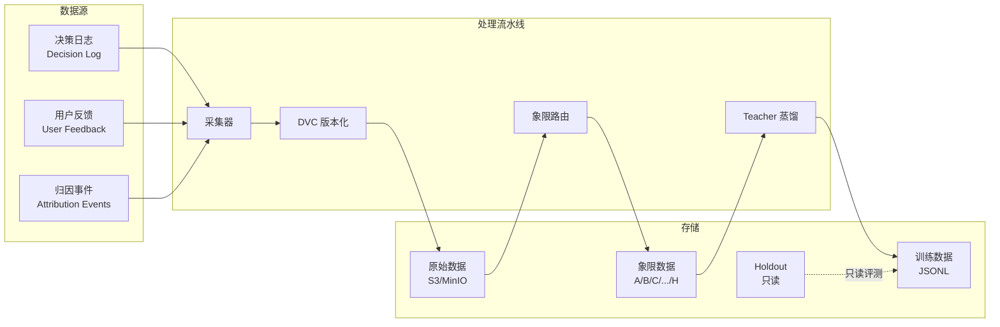

# 维度五·演进飞轮·启动期·数据采集与预处理

> [!NOTE] **[TRACEBACK] 实践锚点**
> - **本阶段策略**: [01_实践目标与策略](./01_实践目标与策略.md)
> - **L2 数据规划**: [维度五·演进飞轮](../../../../02_战略维度/05_维度五_演进飞轮/README.md)
> - **L3 数据契约**: [维度五_演进飞轮/04_数据契约_设计](../../04_数据契约_设计.md)

---

## 一、数据总览

### 1.1 本阶段数据需求汇总

| 数据类型 | 用途 | 来源 | 规模 | 优先级 |
|---|---|---|---|---|
| **决策日志** | 飞轮输入 + 归因分析 | 各维度引擎输出 | 持续采集 | P0 |
| **用户反馈** | 偏好信号 + DPO 候选 | 前端交互日志 | 持续采集 | P0 |
| **Holdout 案例** | 评测基准 | 历史暴雷案例 | 50 案例 | P0 |
| **Teacher 蒸馏** | LoRA 训练数据 | Claude-3.5 API | 3000+ 条 | P0 |
| **归因事件** | F/B 象限分类 | 各维度归因 | 持续采集 | P1 |

### 1.2 数据流图



---

## 二、决策日志

### 2.1 决策日志 Schema

决策日志是飞轮的核心输入，记录每次 AI 决策的完整上下文。

```python
# flywheel/versioning/schemas.py

from dataclasses import dataclass
from datetime import datetime
from typing import Dict, Any, Optional, List

@dataclass
class DecisionLog:
    """决策日志"""
    
    # 标识
    log_id: str                     # 唯一 ID
    symbol: str                     # 股票代码
    company_name: str               # 公司名称
    timestamp: datetime             # 决策时间
    
    # 决策结果
    decision: str                   # pass / degrade / reject
    confidence: float               # 置信度 0-1
    
    # 来源维度
    source_dimension: str           # cryo_guard / deep_strike / state_watch / super_evo
    source_engine: str              # 具体引擎名
    
    # 输入上下文
    input_context: Dict[str, Any]   # 输入数据快照
    
    # 输出详情
    output_details: Dict[str, Any]  # 详细输出（含 evidence）
    
    # 模型信息
    model_name: str                 # 使用的模型
    lora_version: Optional[str]     # LoRA 版本（如有）
    
    # 元信息
    request_id: str                 # 请求 ID
    latency_ms: int                 # 响应时间
    
@dataclass
class DecisionLogBatch:
    """决策日志批次"""
    batch_id: str
    logs: List[DecisionLog]
    dvc_version: str                # DVC commit hash
    created_at: datetime
```

### 2.2 决策日志采集

```python
# flywheel/versioning/collector.py

import json
from datetime import datetime
from pathlib import Path
from typing import List

class DecisionLogCollector:
    """决策日志采集器"""
    
    def __init__(self, storage_path: str, dvc_manager):
        self.storage_path = Path(storage_path)
        self.dvc = dvc_manager
    
    def collect(self, log: DecisionLog) -> str:
        """采集单条决策日志"""
        # 按日期分区存储
        date_str = log.timestamp.strftime("%Y%m%d")
        partition_path = self.storage_path / date_str
        partition_path.mkdir(parents=True, exist_ok=True)
        
        # 写入 JSONL
        log_file = partition_path / f"{log.source_dimension}.jsonl"
        with open(log_file, "a") as f:
            f.write(json.dumps(log.__dict__, default=str, ensure_ascii=False) + "\n")
        
        return str(log_file)
    
    def batch_collect(self, logs: List[DecisionLog]) -> str:
        """批量采集并版本化"""
        for log in logs:
            self.collect(log)
        
        # DVC 版本化
        dvc_version = self.dvc.add_and_commit(
            paths=[str(self.storage_path)],
            message=f"Add {len(logs)} decision logs"
        )
        
        return dvc_version
```

---

## 三、用户反馈

### 3.1 用户反馈 Schema

```python
@dataclass
class UserFeedback:
    """用户反馈"""
    
    feedback_id: str                # 唯一 ID
    user_id: str                    # 用户 ID
    timestamp: datetime             # 反馈时间
    
    # 关联决策
    decision_log_id: str            # 关联的决策日志 ID
    symbol: str                     # 股票代码
    
    # 反馈内容
    feedback_type: str              # thumbs_up / thumbs_down / correction / comment
    feedback_value: Any             # 反馈值
    
    # 上下文
    page_context: Dict[str, Any]    # 页面上下文
    
@dataclass
class ThumbsFeedback(UserFeedback):
    """点赞/踩反馈"""
    is_positive: bool               # True = 👍, False = 👎
    
@dataclass
class CorrectionFeedback(UserFeedback):
    """纠正反馈"""
    original_decision: str          # 原决策
    corrected_decision: str         # 纠正后决策
    correction_reason: str          # 纠正原因
```

### 3.2 用户反馈采集

```python
# flywheel/versioning/feedback_collector.py

class UserFeedbackCollector:
    """用户反馈采集器"""
    
    def __init__(self, storage_path: str, db_session):
        self.storage_path = Path(storage_path)
        self.db = db_session
    
    def collect(self, feedback: UserFeedback) -> str:
        """采集用户反馈"""
        # 写入数据库
        self.db.add(FeedbackModel.from_dataclass(feedback))
        self.db.commit()
        
        # 同步写入 JSONL
        date_str = feedback.timestamp.strftime("%Y%m%d")
        feedback_file = self.storage_path / f"{date_str}_feedback.jsonl"
        
        with open(feedback_file, "a") as f:
            f.write(json.dumps(feedback.__dict__, default=str, ensure_ascii=False) + "\n")
        
        return feedback.feedback_id
    
    def get_for_decision(self, decision_log_id: str) -> List[UserFeedback]:
        """获取某决策的所有反馈"""
        return self.db.query(FeedbackModel).filter(
            FeedbackModel.decision_log_id == decision_log_id
        ).all()
```

---

## 四、归因事件

### 4.1 归因事件 Schema

归因事件用于将决策结果分类到 8 象限。

```python
@dataclass
class AttributionEvent:
    """归因事件"""
    
    event_id: str                   # 唯一 ID
    event_type: str                 # reject_attribution / thesis_attribution / sell_attribution
    timestamp: datetime             # 归因时间
    
    # 关联决策
    decision_log_id: str            # 关联的决策日志 ID
    symbol: str                     # 股票代码
    
    # 归因结果
    quadrant: str                   # A/B/C/D/E/F/G/H 象限
    attribution_reason: str         # 归因原因
    
    # 时间线
    decision_time: datetime         # 原决策时间
    outcome_time: datetime          # 结果确认时间（如暴雷/业绩）
    lag_days: int                   # 滞后天数
    
    # 证据
    evidence: List[str]             # 归因证据
```

### 4.2 8 象限定义

```python
# flywheel/quadrant/schemas.py

from enum import Enum

class Quadrant(Enum):
    """8 象限定义"""
    
    # 决策正确
    A = "true_positive_reject"      # 正确拒绝（reject 且后来暴雷）
    B = "false_positive_reject"     # 错误拒绝（reject 但实际没问题）—— 需改进
    C = "true_positive_degrade"     # 正确降级
    D = "false_positive_degrade"    # 错误降级
    
    # 决策错误
    E = "true_negative_pass"        # 正确放行
    F = "false_negative_pass"       # 错误放行（pass 但后来暴雷）—— 最危险
    G = "thesis_confirmed"          # 论点验证通过
    H = "thesis_refuted"            # 论点被证伪

QUADRANT_USAGE = {
    Quadrant.A: "训练正例",           # 可用于训练
    Quadrant.B: "永久隔离",           # 不可用于训练
    Quadrant.C: "训练正例",
    Quadrant.D: "DPO 偏好负例",       # 用于 DPO
    Quadrant.E: "训练负例",
    Quadrant.F: "高优先训练",         # 加权训练
    Quadrant.G: "训练正例",
    Quadrant.H: "DPO 偏好负例",
}
```

### 4.3 象限路由器

```python
# flywheel/quadrant/router.py

from typing import List
from .schemas import Quadrant, QUADRANT_USAGE

class QuadrantRouter:
    """8 象限路由器"""
    
    # 禁止进入训练数据的象限
    FORBIDDEN_QUADRANTS = {Quadrant.B}
    
    def route(self, event: AttributionEvent) -> dict:
        """根据归因事件路由到对应象限"""
        quadrant = Quadrant(event.quadrant)
        
        return {
            "quadrant": quadrant.value,
            "usage": QUADRANT_USAGE[quadrant],
            "can_train": quadrant not in self.FORBIDDEN_QUADRANTS,
            "storage_path": f"training/data/quadrants/{quadrant.name}/",
        }
    
    def batch_route(self, events: List[AttributionEvent]) -> dict:
        """批量路由"""
        results = {"trainable": [], "forbidden": [], "dpo": []}
        
        for event in events:
            routed = self.route(event)
            if routed["usage"] == "永久隔离":
                results["forbidden"].append(event)
            elif "DPO" in routed["usage"]:
                results["dpo"].append(event)
            else:
                results["trainable"].append(event)
        
        return results
    
    def validate_no_forbidden(self, data_paths: List[str]) -> bool:
        """验证训练数据不含禁止象限"""
        for path in data_paths:
            if "/B/" in path or "/quadrants/B" in path:
                raise ValueError(f"训练数据包含禁止象限 B: {path}")
        return True
```

---

## 五、Holdout 案例

### 5.1 Holdout 案例 Schema

```python
@dataclass
class HoldoutCase:
    """Holdout 评测案例"""
    
    case_id: str                    # H001, H002, ...
    symbol: str                     # 股票代码
    company_name: str               # 公司名称
    
    # 案例类型
    case_type: str                  # fraud / integrity / related_party
    fraud_type: str                 # 具体类型
    
    # 时间线
    event_date: datetime            # 暴雷/验证日期
    
    # 标注
    ground_truth_decision: str      # pass / degrade / reject
    ground_truth_score: float       # 0-1 风险分
    evidence: List[str]             # 关键证据
    
    # 原始数据
    input_context: Dict[str, Any]   # 决策输入上下文
    
    # 元信息
    annotator: str                  # 标注人
    annotation_date: datetime       # 标注日期
    notes: str                      # 备注
```

### 5.2 Holdout 管理

```python
# flywheel/versioning/holdout_manager.py

class HoldoutManager:
    """Holdout 管理器"""
    
    HOLDOUT_DIR = "training/data/holdout/"
    
    def __init__(self, storage_path: str):
        self.storage_path = Path(storage_path) / self.HOLDOUT_DIR
        self._locked = True  # 永久锁定
    
    def load_all(self) -> List[HoldoutCase]:
        """加载所有 Holdout 案例（只读）"""
        cases = []
        for f in self.storage_path.glob("*.json"):
            case = HoldoutCase(**json.loads(f.read_text()))
            cases.append(case)
        return cases
    
    def validate_not_in_training(self, training_data_path: str) -> bool:
        """验证训练数据不含 Holdout"""
        holdout_symbols = {c.symbol for c in self.load_all()}
        
        with open(training_data_path) as f:
            for line in f:
                item = json.loads(line)
                if item.get("symbol") in holdout_symbols:
                    raise ValueError(
                        f"训练数据包含 Holdout 案例: {item['symbol']}"
                    )
        return True
    
    def get_by_type(self, case_type: str) -> List[HoldoutCase]:
        """按类型获取 Holdout"""
        return [c for c in self.load_all() if c.case_type == case_type]
```

---

## 六、Teacher 蒸馏数据

### 6.1 蒸馏 Prompt 模板

```python
# flywheel/teacher/prompts/base_prompt.py

DISTILL_SYSTEM_PROMPT = """
你是一位资深的投资分析专家。请根据提供的数据进行分析，并以 JSON 格式输出结果。

## 输出格式要求
你的输出必须是有效的 JSON，包含以下字段：
- risk_score: 风险分数 (0-1)
- decision: 决策 ("pass" | "degrade" | "reject")
- evidence: 关键证据列表
- reasoning: 推理过程
- confidence: 置信度 (0-1)
"""

FINANCIAL_FRAUD_PROMPT = DISTILL_SYSTEM_PROMPT + """

## 分析任务：财务造假检测

请分析以下公司的财务数据，判断是否存在财务造假或粉饰迹象。

重点检查：
1. 存贷双高：货币资金与有息负债是否同时处于高位？
2. 现金流背离：经营现金流是否与净利润严重背离？
3. 应收异常：应收账款增速是否显著高于收入增速？
4. 存货积压：存货增速是否显著高于成本增速？
5. 研发资本化突变：研发资本化率是否突然大幅变化？
6. 毛利率异常：毛利率是否显著偏离行业均值？

## 公司信息
- 名称：{company_name}
- 代码：{symbol}
- 报告期：{report_date}

## 财务数据
{financial_data}

请输出 JSON 格式的分析结果。
"""
```

### 6.2 蒸馏数据格式

```json
{
  "instruction": "分析以下公司的财务报表，判断是否存在财务造假或粉饰迹象。",
  "input": "公司：康得新（002450）\n报告期：2018 年年报\n...",
  "output": "{\"risk_score\": 0.92, \"decision\": \"reject\", \"evidence\": [...], \"reasoning\": \"...\", \"confidence\": 0.88}",
  "metadata": {
    "symbol": "002450",
    "task_type": "financial_fraud",
    "teacher_model": "claude-3-5-sonnet",
    "distill_timestamp": "2026-05-16T10:00:00Z",
    "verified": false,
    "verifier": null,
    "dvc_version": "abc123"
  }
}
```

### 6.3 蒸馏数据规模

| 任务类型 | 蒸馏数量 | Verified 目标 |
|---|---|---|
| 财务测谎 | 1500 条 | ≥ 1000 条 |
| 大股东诚信 | 1000 条 | ≥ 800 条 |
| 关联交易 | 1000 条 | ≥ 800 条 |
| **合计** | **3500 条** | **≥ 2600 条** |

---

## 七、数据版本化

### 7.1 DVC 管理

```python
# flywheel/versioning/dvc_manager.py

import subprocess
from pathlib import Path
from typing import List, Optional

class DVCManager:
    """DVC 数据版本管理"""
    
    def __init__(self, repo_path: str):
        self.repo_path = Path(repo_path)
    
    def init(self):
        """初始化 DVC"""
        subprocess.run(["dvc", "init"], cwd=self.repo_path, check=True)
    
    def add(self, paths: List[str]) -> str:
        """添加文件到 DVC"""
        for path in paths:
            subprocess.run(["dvc", "add", path], cwd=self.repo_path, check=True)
        return self.get_current_version()
    
    def add_and_commit(self, paths: List[str], message: str) -> str:
        """添加并提交"""
        self.add(paths)
        
        # Git commit
        subprocess.run(
            ["git", "add", "."],
            cwd=self.repo_path, check=True
        )
        subprocess.run(
            ["git", "commit", "-m", f"[DVC] {message}"],
            cwd=self.repo_path, check=True
        )
        
        return self.get_current_version()
    
    def get_current_version(self) -> str:
        """获取当前版本 hash"""
        result = subprocess.run(
            ["git", "rev-parse", "HEAD"],
            cwd=self.repo_path, capture_output=True, text=True, check=True
        )
        return result.stdout.strip()[:8]
    
    def checkout(self, version: str):
        """切换到指定版本"""
        subprocess.run(
            ["git", "checkout", version],
            cwd=self.repo_path, check=True
        )
        subprocess.run(
            ["dvc", "checkout"],
            cwd=self.repo_path, check=True
        )
    
    def push(self, remote: str = "origin"):
        """推送到远程存储"""
        subprocess.run(
            ["dvc", "push", "-r", remote],
            cwd=self.repo_path, check=True
        )
```

### 7.2 数据血缘追踪

```python
# flywheel/versioning/lineage.py

@dataclass
class DataLineage:
    """数据血缘"""
    
    lineage_id: str
    data_path: str
    dvc_version: str
    
    # 来源
    source_type: str            # decision_log / user_feedback / teacher_distill
    source_ids: List[str]       # 原始数据 ID 列表
    
    # 处理
    processing_steps: List[dict]  # 处理步骤记录
    
    # 产出
    output_type: str            # training_data / holdout / dpo_pairs
    created_at: datetime

class LineageTracker:
    """血缘追踪器"""
    
    def track(self, lineage: DataLineage):
        """记录数据血缘"""
        # 写入元数据库
        ...
    
    def get_lineage(self, data_path: str) -> DataLineage:
        """获取数据血缘"""
        ...
    
    def get_training_data_lineage(self, lora_version: str) -> List[DataLineage]:
        """获取某 LoRA 版本使用的训练数据血缘"""
        ...
```

---

## 八、数据存储结构

### 8.1 目录结构

```
training/
├── data/
│   ├── raw/                         # 原始数据
│   │   ├── decision_logs/           # 决策日志
│   │   │   ├── 20260516/
│   │   │   │   ├── cryo_guard.jsonl
│   │   │   │   ├── deep_strike.jsonl
│   │   │   │   └── ...
│   │   │   └── ...
│   │   └── user_feedback/           # 用户反馈
│   │       └── 20260516_feedback.jsonl
│   ├── quadrants/                   # 8 象限数据
│   │   ├── A/                       # 正确拒绝
│   │   ├── B/                       # 错误拒绝（禁止训练）
│   │   ├── C/
│   │   ├── D/
│   │   ├── E/
│   │   ├── F/                       # 错误放行（高优先）
│   │   ├── G/
│   │   └── H/
│   ├── distilled/                   # 蒸馏数据
│   │   ├── financial_fraud.jsonl
│   │   ├── shareholder.jsonl
│   │   └── related_party.jsonl
│   ├── verified/                    # Verified 数据
│   │   ├── financial_fraud_verified.jsonl
│   │   ├── shareholder_verified.jsonl
│   │   └── related_party_verified.jsonl
│   ├── holdout/                     # Holdout（只读）
│   │   ├── H001_kangdexin.json
│   │   ├── H002_kangmei.json
│   │   └── ...
│   └── llama_factory/               # LLaMA-Factory 格式
│       ├── financial_fraud_train.json
│       ├── financial_fraud_val.json
│       └── ...
├── .dvc/                            # DVC 配置
└── .dvcignore
```

---

## 九、数据采集任务清单

| # | 任务 | 负责 | step 锚（粗对齐） | 产出 |
|---|---|---|---|---|
| 1 | 决策日志 Schema 定义 | 架构师 | step_01 | schemas.py |
| 2 | DVC 版本化基础设施 | AI | step_01～02 | DVC 初始化 + S3 后端 |
| 3 | 决策日志采集器 | AI | step_01～02 | collector.py |
| 4 | 用户反馈采集器 | AI | step_02 | feedback_collector.py |
| 5 | 8 象限路由器 | AI | step_02～03 | router.py |
| 6 | 50 案例 Holdout 整理 | 架构师 | step_03～05 | 50 案例 JSON |
| 7 | Teacher 蒸馏 Prompt | 架构师 | step_02～03 | prompts/ |
| 8 | Teacher 蒸馏服务 | AI | step_02～03 | distiller.py |
| 9 | 蒸馏数据生成 | AI + API | step_03～04 | 3500 条 JSONL |
| 10 | Verified 标注 | 架构师 | step_03～06 | ≥ 2600 条 Verified |

---

## 修订记录

| 日期 | 内容 |
|---|---|
| 2026-05-16 | 初版，覆盖决策日志、用户反馈、归因事件、Holdout、蒸馏数据、DVC 版本化 |
