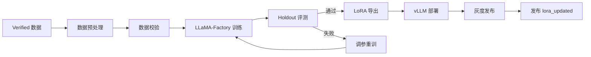
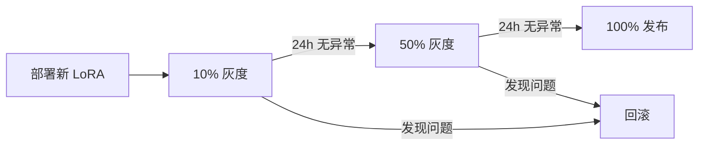

# 维度五·演进飞轮·启动期·模型训练与部署

> [!NOTE] **[TRACEBACK] 实践锚点**
> - **本阶段策略**: [01_实践目标与策略](./01_实践目标与策略.md)
> - **数据采集**: [03_数据采集与预处理](./03_数据采集与预处理.md)
> - **L2 训练规划**: [维度五·演进飞轮](../../../../02_战略维度/05_维度五_演进飞轮/README.md)

---

## 一、训练总览

### 1.1 本阶段训练目标

| 模型 | 基座 | 微调方式 | 训练数据 | 目标 |
|---|---|---|---|---|
| 财务测谎 LoRA v1 | Qwen2.5-7B-Instruct | LoRA rank=16 | 1000+ Verified | 首次上线 |
| 大股东诚信 LoRA v1 | Qwen2.5-7B-Instruct | LoRA rank=16 | 800+ Verified | 首次上线 |
| 关联交易 LoRA v1 | Qwen2.5-7B-Instruct | LoRA rank=16 | 800+ Verified | 首次上线 |

### 1.2 训练流程



---

## 二、训练环境

### 2.1 硬件配置

```yaml
GPU: NVIDIA RTX 4090 24GB × 1
CPU: AMD Ryzen 9 7950X (16 核)
内存: 128GB DDR5
存储: 2TB NVMe SSD
```

### 2.2 软件环境

```bash
# 基础环境
conda create -n diting-flywheel python=3.11
conda activate diting-flywheel

# PyTorch + CUDA
pip install torch==2.2.0 --index-url https://download.pytorch.org/whl/cu121

# LLaMA-Factory
pip install llmtuner

# 其他依赖
pip install transformers==4.38.0
pip install peft==0.9.0
pip install datasets==2.16.0
pip install wandb  # 训练监控
pip install scikit-learn  # 评测指标
```

### 2.3 模型下载

```bash
# 下载 Qwen2.5-7B-Instruct
huggingface-cli download Qwen/Qwen2.5-7B-Instruct \
  --local-dir models/Qwen2.5-7B-Instruct \
  --local-dir-use-symlinks False
```

---

## 三、数据预处理

### 3.1 数据格式转换

将 Verified JSONL 转换为 LLaMA-Factory 格式：

```python
# flywheel/training/data_prep.py

import json
from pathlib import Path
from typing import List
from sklearn.model_selection import train_test_split

def convert_to_llama_factory_format(
    input_file: str, 
    output_dir: str,
    task_type: str
):
    """转换为 LLaMA-Factory 格式"""
    data = []
    
    with open(input_file, 'r') as f:
        for line in f:
            item = json.loads(line)
            if not item.get("verified"):
                continue
            
            # LLaMA-Factory alpaca 格式
            data.append({
                "instruction": item["instruction"],
                "input": item["input"],
                "output": item["output"],
            })
    
    # 划分数据集：80% 训练 / 10% 验证 / 10% 测试
    train_val, test = train_test_split(data, test_size=0.1, random_state=42)
    train, val = train_test_split(train_val, test_size=0.11, random_state=42)
    
    output_path = Path(output_dir)
    output_path.mkdir(parents=True, exist_ok=True)
    
    save_json(train, output_path / f"{task_type}_train.json")
    save_json(val, output_path / f"{task_type}_val.json")
    save_json(test, output_path / f"{task_type}_test.json")
    
    return {
        "train": len(train),
        "val": len(val),
        "test": len(test),
    }

def save_json(data: List[dict], path: Path):
    with open(path, 'w') as f:
        json.dump(data, f, ensure_ascii=False, indent=2)
```

### 3.2 数据校验

```python
# flywheel/training/data_validator.py

from flywheel.versioning.holdout_manager import HoldoutManager
from flywheel.quadrant.router import QuadrantRouter

class TrainingDataValidator:
    """训练数据校验器"""
    
    def __init__(self, holdout_manager: HoldoutManager, router: QuadrantRouter):
        self.holdout = holdout_manager
        self.router = router
    
    def validate(self, training_data_path: str) -> dict:
        """完整校验"""
        results = {
            "passed": True,
            "checks": [],
        }
        
        # 检查 1：不含 Holdout
        try:
            self.holdout.validate_not_in_training(training_data_path)
            results["checks"].append({"name": "holdout_isolation", "passed": True})
        except ValueError as e:
            results["passed"] = False
            results["checks"].append({"name": "holdout_isolation", "passed": False, "error": str(e)})
        
        # 检查 2：不含 B 象限
        try:
            self.router.validate_no_forbidden([training_data_path])
            results["checks"].append({"name": "quadrant_b_isolation", "passed": True})
        except ValueError as e:
            results["passed"] = False
            results["checks"].append({"name": "quadrant_b_isolation", "passed": False, "error": str(e)})
        
        # 检查 3：数据格式正确
        format_check = self._validate_format(training_data_path)
        results["checks"].append(format_check)
        if not format_check["passed"]:
            results["passed"] = False
        
        return results
    
    def _validate_format(self, path: str) -> dict:
        """校验数据格式"""
        errors = []
        
        with open(path) as f:
            data = json.load(f)
        
        for i, item in enumerate(data):
            if "instruction" not in item:
                errors.append(f"Item {i}: missing 'instruction'")
            if "input" not in item:
                errors.append(f"Item {i}: missing 'input'")
            if "output" not in item:
                errors.append(f"Item {i}: missing 'output'")
            
            # 验证 output 是有效 JSON
            try:
                json.loads(item.get("output", ""))
            except json.JSONDecodeError:
                errors.append(f"Item {i}: 'output' is not valid JSON")
        
        return {
            "name": "format_validation",
            "passed": len(errors) == 0,
            "errors": errors[:10],  # 最多返回 10 个错误
        }
```

---

## 四、LoRA 训练

### 4.1 训练配置

```yaml
# flywheel/training/configs/financial_fraud_lora.yaml

### 模型配置
model_name_or_path: models/Qwen2.5-7B-Instruct
template: qwen

### LoRA 配置
finetuning_type: lora
lora_rank: 16
lora_alpha: 32
lora_dropout: 0.05
lora_target: all  # 所有线性层

### 数据配置
dataset: financial_fraud_train
val_dataset: financial_fraud_val
dataset_dir: training/data/llama_factory

### 训练配置
output_dir: output/financial_fraud_lora_v1
num_train_epochs: 3
per_device_train_batch_size: 4
gradient_accumulation_steps: 4
learning_rate: 2e-4
lr_scheduler_type: cosine
warmup_ratio: 0.1
fp16: true

### 评估配置
eval_strategy: steps
eval_steps: 100
save_strategy: steps
save_steps: 100
load_best_model_at_end: true

### 日志
logging_steps: 10
report_to: wandb
run_name: financial_fraud_lora_v1
```

### 4.2 训练命令

```bash
# 训练脚本
# training/scripts/train.sh

#!/bin/bash
set -e

TASK_TYPE=${1:-financial_fraud}
VERSION=${2:-v1}

echo "Starting training for ${TASK_TYPE} ${VERSION}..."

# 数据校验
python -c "
from flywheel.training.data_validator import TrainingDataValidator
validator = TrainingDataValidator(...)
result = validator.validate('training/data/llama_factory/${TASK_TYPE}_train.json')
if not result['passed']:
    raise ValueError(f'Data validation failed: {result}')
print('Data validation passed!')
"

# 启动训练
llamafactory-cli train flywheel/training/configs/${TASK_TYPE}_lora.yaml

echo "Training completed for ${TASK_TYPE} ${VERSION}"
```

### 4.3 训练监控

```python
# 使用 WandB 监控
# 登录
wandb login

# 查看训练曲线
# - 访问 https://wandb.ai 查看 loss、learning rate、eval loss
# - 关注 eval_loss 是否收敛
```

### 4.4 常见问题与调参

| 问题 | 症状 | 解决方案 |
|---|---|---|
| 显存不足 | CUDA OOM | 降低 batch_size / 使用 gradient_checkpointing |
| 过拟合 | train_loss ↓ 但 eval_loss ↑ | 增加 dropout / 减少 epochs / 增加数据 |
| 欠拟合 | loss 不收敛 | 增加 learning_rate / 增加 epochs |
| 输出格式错误 | 输出非 JSON | 增加格式相关训练数据 / 在 Prompt 中强调格式 |

---

## 五、Holdout 评测

### 5.1 评测流程

```python
# flywheel/training/evaluator.py

import json
from pathlib import Path
from sklearn.metrics import recall_score, precision_score, f1_score
from datetime import datetime

class HoldoutEvaluator:
    """Holdout 评测器"""
    
    THRESHOLDS = {
        "financial_fraud": {"recall": 0.90, "precision": 0.70},
        "shareholder": {"recall": 0.85, "precision": 0.70},
        "related_party": {"recall": 0.80, "precision": 0.70},
    }
    
    def __init__(self, model_client, holdout_manager):
        self.model = model_client
        self.holdout = holdout_manager
    
    def evaluate(self, lora_name: str, task_type: str) -> dict:
        """在 Holdout 上评测"""
        # 加载 Holdout 案例
        cases = self.holdout.get_by_type(task_type)
        
        # 推理
        predictions = []
        ground_truths = []
        
        for case in cases:
            pred = self.model.predict(case.input_context, lora=lora_name)
            predictions.append(pred["decision"])
            ground_truths.append(case.ground_truth_decision)
        
        # 计算指标（将 decision 转换为二分类）
        y_true = [1 if d in ["reject", "degrade"] else 0 for d in ground_truths]
        y_pred = [1 if d in ["reject", "degrade"] else 0 for d in predictions]
        
        recall = recall_score(y_true, y_pred)
        precision = precision_score(y_true, y_pred)
        f1 = f1_score(y_true, y_pred)
        
        thresholds = self.THRESHOLDS.get(task_type, {"recall": 0.80, "precision": 0.70})
        passed = recall >= thresholds["recall"] and precision >= thresholds["precision"]
        
        return {
            "task_type": task_type,
            "lora_name": lora_name,
            "recall": recall,
            "precision": precision,
            "f1": f1,
            "num_cases": len(cases),
            "passed": passed,
            "timestamp": datetime.now().isoformat(),
        }
    
    def generate_report(self, results: list[dict]) -> str:
        """生成评测报告"""
        report = "# Holdout 评测报告\n\n"
        report += f"评测时间: {datetime.now()}\n\n"
        
        report += "## 指标汇总\n\n"
        report += "| 任务类型 | Recall | Precision | F1 | 通过 |\n"
        report += "|---|---|---|---|---|\n"
        
        all_pass = True
        for r in results:
            if not r["passed"]:
                all_pass = False
            
            report += f"| {r['task_type']} | {r['recall']:.2%} | {r['precision']:.2%} | {r['f1']:.2%} | {'✅' if r['passed'] else '❌'} |\n"
        
        report += f"\n## 总体结论: {'✅ 全部通过' if all_pass else '❌ 存在不达标'}\n"
        
        return report
```

### 5.2 评测命令

```bash
# 运行 Holdout 评测
python training/scripts/evaluate.py \
  --lora-name financial_fraud_lora_v1 \
  --task-type financial_fraud \
  --output-dir output/eval_reports/
```

---

## 六、模型导出与部署

### 6.1 LoRA 导出

```bash
# 导出 LoRA 权重（可选：合并到基座）
llamafactory-cli export \
  --model_name_or_path models/Qwen2.5-7B-Instruct \
  --adapter_name_or_path output/financial_fraud_lora_v1 \
  --export_dir models/loras/financial_fraud_lora_v1 \
  --export_size 4
```

### 6.2 vLLM 部署

```python
# 启动脚本
# deploy/scripts/start_vllm.sh

#!/bin/bash

python -m vllm.entrypoints.openai.api_server \
  --model models/Qwen2.5-7B-Instruct \
  --enable-lora \
  --lora-modules \
    financial_fraud_lora=models/loras/financial_fraud_lora_v1 \
    shareholder_lora=models/loras/shareholder_lora_v1 \
    related_party_lora=models/loras/related_party_lora_v1 \
  --max-lora-rank 16 \
  --host 0.0.0.0 \
  --port 8000 \
  --gpu-memory-utilization 0.85
```

### 6.3 vLLM K8s 部署

```yaml
# deploy/k3s/vllm-deployment.yaml

apiVersion: apps/v1
kind: Deployment
metadata:
  name: vllm
spec:
  replicas: 1
  selector:
    matchLabels:
      app: vllm
  template:
    metadata:
      labels:
        app: vllm
    spec:
      containers:
      - name: vllm
        image: vllm/vllm-openai:latest
        command:
        - python
        - -m
        - vllm.entrypoints.openai.api_server
        - --model
        - /models/Qwen2.5-7B-Instruct
        - --enable-lora
        - --lora-modules
        - financial_fraud_lora=/loras/financial_fraud_lora_v1
        - shareholder_lora=/loras/shareholder_lora_v1
        - related_party_lora=/loras/related_party_lora_v1
        - --max-lora-rank
        - "16"
        - --gpu-memory-utilization
        - "0.85"
        resources:
          limits:
            nvidia.com/gpu: 1
        volumeMounts:
        - name: models
          mountPath: /models
        - name: loras
          mountPath: /loras
      volumes:
      - name: models
        hostPath:
          path: /data/models
      - name: loras
        hostPath:
          path: /data/loras
---
apiVersion: v1
kind: Service
metadata:
  name: vllm
spec:
  selector:
    app: vllm
  ports:
  - port: 8000
    targetPort: 8000
```

---

## 七、灰度发布

### 7.1 手动灰度流程

启动期采用手动灰度发布：



### 7.2 灰度控制脚本

```python
# flywheel/deployment/gray_release_cli.py

import click
from .gray_release import GrayReleaseController, GrayReleaseConfig, ReleaseStage

@click.group()
def cli():
    pass

@cli.command()
@click.argument("lora_name")
@click.argument("canary_version")
def start(lora_name: str, canary_version: str):
    """启动灰度发布（10%）"""
    config = GrayReleaseConfig(
        lora_name=lora_name,
        current_stage=ReleaseStage.CANARY_10,
        stable_version=get_current_stable(lora_name),
        canary_version=canary_version,
    )
    controller = GrayReleaseController(config)
    save_config(config)
    click.echo(f"Started gray release: {lora_name} at 10%")

@cli.command()
@click.argument("lora_name")
def advance(lora_name: str):
    """推进灰度阶段"""
    config = load_config(lora_name)
    controller = GrayReleaseController(config)
    new_stage = controller.advance_stage()
    save_config(config)
    click.echo(f"Advanced to: {new_stage.name}")

@cli.command()
@click.argument("lora_name")
def rollback(lora_name: str):
    """回滚到稳定版本"""
    config = load_config(lora_name)
    controller = GrayReleaseController(config)
    controller.rollback()
    save_config(config)
    click.echo(f"Rolled back: {lora_name}")

@cli.command()
@click.argument("lora_name")
def promote(lora_name: str):
    """将灰度版本提升为稳定版本"""
    config = load_config(lora_name)
    controller = GrayReleaseController(config)
    controller.promote_canary()
    save_config(config)
    click.echo(f"Promoted: {lora_name} canary to stable")

if __name__ == "__main__":
    cli()
```

### 7.3 灰度命令示例

```bash
# 启动 10% 灰度
python -m flywheel.deployment.gray_release_cli start financial_fraud_lora v2

# 24h 后无异常，推进到 50%
python -m flywheel.deployment.gray_release_cli advance financial_fraud_lora

# 继续推进到 100%
python -m flywheel.deployment.gray_release_cli advance financial_fraud_lora

# 发现问题，回滚
python -m flywheel.deployment.gray_release_cli rollback financial_fraud_lora

# 确认无问题，提升为稳定版本
python -m flywheel.deployment.gray_release_cli promote financial_fraud_lora
```

---

## 八、lora_updated 事件发布

### 8.1 事件发布流程

```python
# flywheel/deployment/publish_lora_updated.py

from flywheel.events.lora_updated import LoraUpdatedEvent, EventPublisher
from datetime import datetime
import uuid

def publish_lora_updated(
    lora_name: str,
    lora_version: str,
    base_model: str,
    training_data_version: str,
    metrics: dict,
    redis_url: str,
):
    """发布 lora_updated 事件"""
    event = LoraUpdatedEvent(
        event_id=str(uuid.uuid4()),
        lora_name=lora_name,
        lora_version=lora_version,
        base_model=base_model,
        training_data_version=training_data_version,
        metrics=metrics,
        timestamp=datetime.now(),
    )
    
    publisher = EventPublisher(redis_url)
    message_id = publisher.publish_lora_updated(event)
    
    print(f"Published lora_updated event: {event.event_id}")
    print(f"Message ID: {message_id}")
    
    return event
```

### 8.2 事件消费示例

```python
# 下游服务消费 lora_updated 事件
from flywheel.events.lora_updated import EventPublisher

publisher = EventPublisher("redis://localhost:6379")

for event in publisher.subscribe_lora_updated("cryo_guard", "consumer_1"):
    print(f"Received lora_updated: {event}")
    
    # 重新加载 LoRA
    lora_name = event["payload"]["lora_name"]
    lora_version = event["payload"]["lora_version"]
    
    reload_lora(lora_name, lora_version)
```

---

## 九、训练任务清单

| # | 任务 | step 锚（维内 · 粗对齐） | 产出 | 验收 |
|---|---|---|---|---|
| 1 | 训练环境搭建 | step_04① | conda 环境 + LLaMA-Factory | 可运行 |
| 2 | 数据预处理 | step_04② | 3 个 JSON 数据集 | 格式正确 |
| 3 | 数据校验 | step_04③ | 校验脚本通过 | 无 Holdout + 无 B 象限 |
| 4 | 财务测谎 LoRA 训练 | step_04～05 | LoRA v1 | loss 收敛 |
| 5 | 财务测谎 Holdout 评测 | step_05 | Recall ≥ 0.90 | 通过 |
| 6 | 大股东诚信 LoRA 训练 | step_05～06 | LoRA v1 | loss 收敛 |
| 7 | 大股东诚信 Holdout 评测 | step_06 | Recall ≥ 0.85 | 通过 |
| 8 | 关联交易 LoRA 训练 | step_06 | LoRA v1 | loss 收敛 |
| 9 | 关联交易 Holdout 评测 | step_06 | Recall ≥ 0.80 | 通过 |
| 10 | vLLM 部署 | step_07～08 | 3 LoRA 热加载 | API 可调用 |
| 11 | 灰度发布 10% | step_07 | 灰度配置 | 流量正确路由 |
| 12 | lora_updated 事件发布 | step_08 | 事件发布 | 下游可消费 |
| 13 | 灰度推进 50% → 100% | step_07～10 | 全量发布 | 无回归 |

---

## 修订记录

| 日期 | 内容 |
|---|---|
| 2026-05-16 | 初版，覆盖训练环境、LoRA 训练、Holdout 评测、vLLM 部署、灰度发布、事件发布 |
