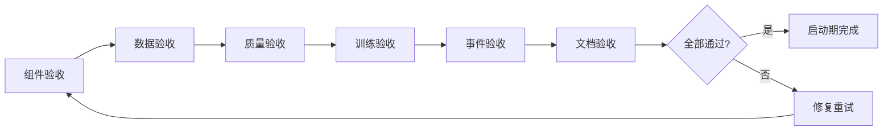

# 维度五·演进飞轮·启动期·验收标准与检查清单

> [!NOTE] **[TRACEBACK] 实践锚点**
> - **本阶段策略**: [01_实践目标与策略](./01_实践目标与策略.md)
> - **L2 验证规范**: [维度五·演进飞轮](../../../../02_战略维度/05_维度五_演进飞轮/README.md)
> - **L5 验收**: [05_成功标识与验证](../../../../05_成功标识与验证/)

---

## 一、验收总览

### 1.1 验收分类

| 类型 | 内容 | 验收方式 | 优先级 |
|---|---|---|---|
| **组件验收** | 4 P0 组件可运行 | 健康检查 + 功能测试 | P0 |
| **数据验收** | DVC 版本化 + 数据隔离 | 自动化校验脚本 | P0 |
| **训练验收** | 首次 LoRA 训练成功 | Holdout 评测 | P0 |
| **质量验收** | 双盲 Kappa ≥ 0.70 | Kappa 计算 | P0 |
| **事件验收** | lora_updated 事件可发布 | 事件消费测试 | P1 |
| **文档验收** | 5 份实践文档完整 | 人工审查 | P1 |

### 1.2 验收流程



---

## 二、组件验收标准

### 2.1 4 P0 组件清单

| # | 组件 | 健康检查 | 功能测试 |
|---|---|---|---|
| 1 | Teacher LLM 蒸馏服务 | API 可调用 | 输出 JSONL 格式正确 |
| 2 | Label Studio 标注平台 | Web UI 可访问 | 任务创建 + 标注 + 导出 |
| 3 | LLaMA-Factory 训练环境 | 训练可启动 | LoRA 可导出 |
| 4 | 双盲 Kappa 校准 | 脚本可运行 | κ 计算正确 |

### 2.2 组件健康检查命令

```bash
# 1. Teacher LLM 蒸馏服务
curl -X POST http://localhost:8000/api/distill/health

# 2. Label Studio
curl http://localhost:8081/health

# 3. LLaMA-Factory
llamafactory-cli version

# 4. 双盲 Kappa
python -c "from flywheel.labeling.kappa_calculator import KappaCalculator; print('OK')"
```

### 2.3 组件功能测试

```python
# tests/integration/test_components.py

import pytest
import requests

class TestTeacherDistill:
    """Teacher 蒸馏组件测试"""
    
    BASE_URL = "http://localhost:8000"
    
    def test_distill_single(self):
        """测试单条蒸馏"""
        resp = requests.post(
            f"{self.BASE_URL}/api/distill/single",
            json={
                "task_type": "financial_fraud",
                "raw_data": {
                    "symbol": "600519",
                    "company_name": "贵州茅台",
                    "financial_data": {...}
                }
            }
        )
        assert resp.status_code == 200
        result = resp.json()
        
        # 验证输出格式
        assert "instruction" in result
        assert "input" in result
        assert "output" in result
        
        # 验证 output 是有效 JSON
        import json
        output = json.loads(result["output"])
        assert "risk_score" in output
        assert "decision" in output

class TestLabelStudio:
    """Label Studio 组件测试"""
    
    BASE_URL = "http://localhost:8081"
    
    def test_web_accessible(self):
        """测试 Web UI 可访问"""
        resp = requests.get(f"{self.BASE_URL}/")
        assert resp.status_code == 200
    
    def test_create_task(self):
        """测试创建标注任务"""
        # 需要 API Token
        headers = {"Authorization": f"Token {API_TOKEN}"}
        
        resp = requests.post(
            f"{self.BASE_URL}/api/projects",
            headers=headers,
            json={
                "title": "Test Project",
                "label_config": LABEL_CONFIG_XML,
            }
        )
        assert resp.status_code == 201

class TestKappaCalculator:
    """Kappa 计算器测试"""
    
    def test_kappa_calculation(self):
        """测试 Kappa 计算"""
        from flywheel.labeling.kappa_calculator import KappaCalculator, AnnotationPair
        
        pairs = [
            AnnotationPair("s1", "a1", "a2", "reject", "reject", True),
            AnnotationPair("s2", "a1", "a2", "pass", "pass", True),
            AnnotationPair("s3", "a1", "a2", "reject", "pass", False),
        ]
        
        calc = KappaCalculator()
        result = calc.calculate(pairs)
        
        assert "kappa" in result
        assert "agreement_rate" in result
        assert "passed" in result
```

### 2.4 组件验收检查清单

- [ ] **Teacher LLM 蒸馏**
  - [ ] 服务启动正常
  - [ ] API 可调用
  - [ ] 输出 JSONL 格式正确
  - [ ] 速率控制正常
  - [ ] 备用模型切换可用
- [ ] **Label Studio**
  - [ ] Docker 容器运行正常
  - [ ] Web UI 可访问
  - [ ] 用户可登录
  - [ ] 任务可创建
  - [ ] 标注可提交
  - [ ] 数据可导出
- [ ] **LLaMA-Factory**
  - [ ] 环境安装完成
  - [ ] 模型下载完成
  - [ ] 训练配置正确
  - [ ] 训练可启动
  - [ ] LoRA 可导出
- [ ] **双盲 Kappa**
  - [ ] 脚本可运行
  - [ ] Kappa 计算正确
  - [ ] 争议样本可识别

---

## 三、数据验收标准

### 3.1 数据版本化

| 检查项 | 标准 | 验收方式 |
|---|---|---|
| DVC 初始化 | .dvc 目录存在 | `ls -la .dvc` |
| 远程存储配置 | S3/MinIO 可连接 | `dvc remote list` |
| 数据可追溯 | 任意版本可 checkout | `dvc checkout <version>` |
| 数据血缘 | 血缘记录完整 | 查询 lineage DB |

### 3.2 数据隔离

| 检查项 | 标准 | 验收方式 |
|---|---|---|
| Holdout 隔离 | 训练数据不含 Holdout | 校验脚本 |
| B 象限隔离 | 训练数据不含 B 象限 | 校验脚本 |
| 象限路由正确 | 归因事件正确路由 | 抽样检查 |

### 3.3 数据校验命令

```bash
# 运行完整数据校验
python -m flywheel.training.data_validator \
  --training-data training/data/llama_factory/ \
  --holdout-dir training/data/holdout/ \
  --output validation_report.json

# 期望输出
{
  "passed": true,
  "checks": [
    {"name": "holdout_isolation", "passed": true},
    {"name": "quadrant_b_isolation", "passed": true},
    {"name": "format_validation", "passed": true}
  ]
}
```

### 3.4 数据验收检查清单

- [ ] **DVC 版本化**
  - [ ] .dvc 目录存在
  - [ ] 远程存储已配置
  - [ ] 数据已 push 到远程
  - [ ] 任意版本可 checkout
- [ ] **数据隔离**
  - [ ] 训练数据不含 Holdout
  - [ ] 训练数据不含 B 象限
  - [ ] 校验脚本通过
- [ ] **数据格式**
  - [ ] JSONL 格式正确
  - [ ] 必填字段完整
  - [ ] output 字段是有效 JSON

---

## 四、质量验收标准

### 4.1 双盲 Kappa 标准

| 指标 | 阈值 | 说明 |
|---|---|---|
| Cohen's Kappa | κ ≥ 0.70 | 实质性一致 |
| 一致率 | ≥ 75% | 标注一致比例 |
| 争议率 | ≤ 25% | 需仲裁比例 |

### 4.2 Kappa 解释

| Kappa 范围 | 一致性程度 | 是否达标 |
|---|---|---|
| < 0.20 | 微弱 | ❌ |
| 0.20 - 0.40 | 一般 | ❌ |
| 0.41 - 0.60 | 中等 | ⚠️ |
| 0.61 - 0.80 | 实质性 | ✅ |
| 0.81 - 1.00 | 完美 | ✅ |

### 4.3 Kappa 计算命令

```bash
# 计算 Kappa
python -m flywheel.labeling.kappa_calculator \
  --annotations-file training/data/annotations.jsonl \
  --output kappa_report.json

# 期望输出
{
  "kappa": 0.75,
  "agreement_rate": 0.82,
  "passed": true,
  "num_samples": 200,
  "num_disputes": 36,
  "disputes": [...]
}
```

### 4.4 质量验收检查清单

- [ ] **双盲分配**
  - [ ] 每个样本分配给 2 个不同标注员
  - [ ] 标注员看不到对方标注
- [ ] **Kappa 达标**
  - [ ] κ ≥ 0.70
  - [ ] 一致率 ≥ 75%
- [ ] **争议处理**
  - [ ] 争议样本已识别
  - [ ] 争议样本已仲裁
  - [ ] 仲裁结果已记录

---

## 五、训练验收标准

### 5.1 训练指标

| 任务类型 | 训练数据 | Loss 收敛 | Holdout Recall |
|---|---|---|---|
| 财务测谎 | ≥ 1000 条 | eval_loss < 0.5 | ≥ 0.90 |
| 大股东诚信 | ≥ 800 条 | eval_loss < 0.5 | ≥ 0.85 |
| 关联交易 | ≥ 800 条 | eval_loss < 0.5 | ≥ 0.80 |

### 5.2 Holdout 评测命令

```bash
# 运行 Holdout 评测
python training/scripts/evaluate.py \
  --lora-name financial_fraud_lora_v1 \
  --task-type financial_fraud \
  --holdout-dir training/data/holdout/ \
  --output-dir output/eval_reports/

# 期望输出
{
  "task_type": "financial_fraud",
  "lora_name": "financial_fraud_lora_v1",
  "recall": 0.93,
  "precision": 0.75,
  "f1": 0.83,
  "num_cases": 30,
  "passed": true
}
```

### 5.3 训练验收检查清单

- [ ] **训练完成**
  - [ ] 财务测谎 LoRA v1 训练完成
  - [ ] 大股东诚信 LoRA v1 训练完成
  - [ ] 关联交易 LoRA v1 训练完成
- [ ] **Loss 收敛**
  - [ ] 财务测谎 eval_loss < 0.5
  - [ ] 大股东诚信 eval_loss < 0.5
  - [ ] 关联交易 eval_loss < 0.5
- [ ] **Holdout 达标**
  - [ ] 财务测谎 Recall ≥ 0.90
  - [ ] 大股东诚信 Recall ≥ 0.85
  - [ ] 关联交易 Recall ≥ 0.80
- [ ] **LoRA 导出**
  - [ ] 3 个 LoRA 权重文件已导出
  - [ ] vLLM 可加载

---

## 六、事件验收标准

### 6.1 lora_updated 事件

| 检查项 | 标准 | 验收方式 |
|---|---|---|
| 事件发布 | 训练完成后发布事件 | 检查 Redis Stream |
| 事件格式 | 符合 Schema | JSON Schema 校验 |
| 下游消费 | 下游可收到事件 | 消费者测试 |

### 6.2 事件验收命令

```bash
# 发布测试事件
python -m flywheel.deployment.publish_lora_updated \
  --lora-name financial_fraud_lora \
  --lora-version v1 \
  --base-model Qwen2.5-7B-Instruct \
  --training-data-version abc123 \
  --metrics '{"recall": 0.93, "precision": 0.75}'

# 检查 Redis Stream
redis-cli XLEN flywheel:events
redis-cli XRANGE flywheel:events - + COUNT 1

# 消费测试
python -m flywheel.events.test_consumer
```

### 6.3 事件验收检查清单

- [ ] **Redis 连接**
  - [ ] Redis 服务运行正常
  - [ ] flywheel 服务可连接 Redis
- [ ] **事件发布**
  - [ ] lora_updated 事件可发布
  - [ ] 事件写入 Redis Stream
- [ ] **事件消费**
  - [ ] 消费者组已创建
  - [ ] 下游可消费事件
  - [ ] 事件 ACK 正常

---

## 七、文档验收标准

### 7.1 文档清单

| 文档 | 必须包含 | 验收方式 |
|---|---|---|
| 01_实践目标与策略.md | 目标/策略/路径/风险/边界 | 人工审查 |
| 02_技术方案与代码架构.md | 技术选型/代码结构/API/部署 | 人工审查 |
| 03_数据采集与预处理.md | 数据清单/Schema/采集脚本/版本化 | 人工审查 |
| 04_模型训练与部署.md | 训练配置/评测/部署/灰度 | 人工审查 |
| 05_验收标准与检查清单.md | 验收标准/检查清单 | 人工审查 |

### 7.2 文档检查清单

- [ ] 所有文档含 TRACEBACK 追溯锚点
- [ ] 代码示例可复制执行
- [ ] 命令行示例可直接运行
- [ ] 链接无断链
- [ ] 表格格式正确
- [ ] Mermaid 图可渲染

---

## 八、综合验收检查清单

### 8.1 P0 必须项（阻断发布）

- [ ] **组件**：4 P0 组件全部可运行
  - [ ] Teacher LLM 蒸馏服务
  - [ ] Label Studio 标注平台
  - [ ] LLaMA-Factory 训练环境
  - [ ] 双盲 Kappa 校准
- [ ] **数据**：版本化 + 隔离
  - [ ] DVC 100% 版本化
  - [ ] Holdout 隔离
  - [ ] B 象限隔离
- [ ] **质量**：Kappa 达标
  - [ ] κ ≥ 0.70
- [ ] **训练**：首次 LoRA 成功
  - [ ] 3 个 LoRA 训练完成
  - [ ] Holdout 评测通过
  - [ ] vLLM 可部署
- [ ] **事件**：lora_updated 可发布
  - [ ] 事件可发布
  - [ ] 下游可消费

### 8.2 P1 应完成项（不阻断，需跟进）

- [ ] 灰度发布流程完整
- [ ] 文档 5 份完整
- [ ] 代码测试覆盖率 ≥ 80%

### 8.3 验收签署

| 角色 | 签字 | 日期 |
|---|---|---|
| 架构师 | __________ | __________ |
| 开发负责人 | __________ | __________ |
| 测试负责人 | __________ | __________ |

---

## 九、进阶条件

### 9.1 启动期 → 扩展期

满足以下条件可进入扩展期：

| 条件 | 指标 |
|---|---|
| 4 P0 组件上线 | 全部运行正常 |
| 首次 LoRA 成功 | 3 个 LoRA 已部署 |
| 数据版本化 | DVC 100% |
| Kappa 达标 | κ ≥ 0.70 |
| 事件可发布 | lora_updated 可消费 |
| 架构师验收 | ✅ |

### 9.2 扩展期预告

| 新增内容 | 说明 |
|---|---|
| 自动化 DPO | 偏好对齐训练 |
| 8 象限自动路由 | 自动分类归因数据 |
| 自动灰度 | CI/CD 集成灰度发布 |
| A/B 测试 | 多模型对比评测 |
| 评测套件 | 自动化 Holdout + 在线评测 |

---

## 修订记录

| 日期 | 内容 |
|---|---|
| 2026-05-16 | 初版，覆盖组件/数据/质量/训练/事件/文档验收 |
