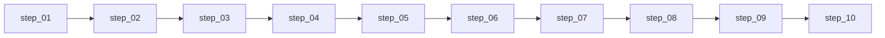

# 维度五·演进飞轮·启动期

> [!NOTE] **[TRACEBACK]**
> - **本维度 stages 总览**: [../README](../README.md)
> - **L2 启动期对齐**: [维度五·演进飞轮](../../../../02_战略维度/05_维度五_演进飞轮/README.md)
> - **L3 落地清单**: [06_L2 落地清单 §3.1 + §3.3](../../06_L2落地清单_设计.md)
> - **L1 哲学基石**: ⑥演进（永续学习）

> **[上架与环境（共通）]** **ECS + K3s · Helm · ACR · `diting-infra`→`deploy-engine`**。参见 [16](../../../_共享规约/16_阿里云ECS_K3s_ACR_Helm部署与deploy-engine链路.md)；**执行索引**：[steps/README](./steps/README.md)。

---

## 一、阶段概述

| 项 | 值 |
|---|---|
| 时段 | 0-3 月 |
| 关键交付 | 4 P0 组件（Teacher 蒸馏 + Label Studio + LLaMA-Factory + 双盲 Kappa）+ DVC 版本化 + 首次 LoRA 训练 + lora_updated 事件 |
| 成功标准 | 完整闭环跑通（决策日志 → Teacher 蒸馏 → Verified 标注 → LoRA 训练 → 灰度上线）；B 象限 0 进训练数据 |

---

## 二、实践设计文档索引（5 份）

| # | 文档 | 内容摘要 |
|---|---|---|
| 01 | [实践目标与策略](./01_实践目标与策略.md) | 4 P0 组件目标、闭环优先策略、实施路径、风险与边界 |
| 02 | [技术方案与代码架构](./02_技术方案与代码架构.md) | 技术选型（LLaMA-Factory + Label Studio + vLLM）、代码结构 `flywheel/`、核心模块、API、部署 |
| 03 | [数据采集与预处理](./03_数据采集与预处理.md) | 决策日志、用户反馈、归因事件、8 象限路由、Holdout、Teacher 蒸馏、DVC 版本化 |
| 04 | [模型训练与部署](./04_模型训练与部署.md) | LoRA 训练配置、Holdout 评测、vLLM 部署、灰度发布、lora_updated 事件发布 |
| 05 | [验收标准与检查清单](./05_验收标准与检查清单.md) | 组件/数据/质量/训练/事件/文档验收标准、综合检查清单、进阶条件 |

## 二·补 可执行步骤文档（执行层 · 10 份）⭐

> **2026-05-16 新增**：设计层拆解为 **10 份按 step 序号编排的可执行步骤**（日历与跨维映射见 [14](../../../_共享规约/14_六维度启动期统一节奏表.md) **§九**）。

**索引**：[steps/README.md](./steps/README.md)（10 个 step + 决策契约 + L4 回写预期）
**总量**：9,921 行可执行文档

---

## 三、核心组件（4 P0）

| # | 组件 | 职责 | 技术选型 |
|---|---|---|---|
| 1 | **Teacher LLM 蒸馏** | 高质量训练数据生成 | Claude-3.5-Sonnet API |
| 2 | **Label Studio** | 人工标注 + 审核 | Label Studio（Docker 部署）|
| 3 | **LLaMA-Factory** | LoRA 微调训练 | LLaMA-Factory + Qwen2.5-7B |
| 4 | **双盲 Kappa 校准** | 标注质量控制 | Cohen's Kappa (κ ≥ 0.70) |

---

## 四、关键交付物

| 交付物 | 描述 | 验收文档 |
|---|---|---|
| Teacher 蒸馏服务 | API 可调用 + JSONL 输出 | [02_技术方案](./02_技术方案与代码架构.md) |
| Label Studio 部署 | Web UI + 任务模板 + 导出 | [02_技术方案](./02_技术方案与代码架构.md) |
| DVC 数据版本化 | 100% 训练数据可追溯 | [03_数据采集](./03_数据采集与预处理.md) |
| 50 案例 Holdout | 永久锁库评测集 | [03_数据采集](./03_数据采集与预处理.md) |
| 3 LoRA v1 | 首次 LoRA 训练成功 | [04_模型训练](./04_模型训练与部署.md) |
| lora_updated 事件 | 训练完成事件发布 | [04_模型训练](./04_模型训练与部署.md) |

---

## 五、外部依赖

| 依赖维度 | 必须就绪的能力 | 用途 |
|---|---|---|
| 维度一 | RejectAttributionEvent（T+90 归因）| F/B 归因输入 |
| 维度二 | ThesisAttributionEvent | A/G/H 归因输入 |
| 维度四 | SellAttributionEvent | 卖出归因输入 |
| 维度零 | verified 标注数据 | DPO 偏好对（启动期可手动）|
| _共享规约 | DVC（07_）+ 协议（04_）| 数据版本化 + 通信 |

---

## 六、实施路径（step 序号权威）

详见 [steps/README.md](./steps/README.md)。若需日历甘特图，请单独维护并与 [14](../../../_共享规约/14_六维度启动期统一节奏表.md) 对齐；**本 README 不以固定日历日为权威**。

---

## 七、阶段失败兜底

| 失败场景 | 兜底策略 |
|---|---|
| Teacher LLM API 调用超额 | 切换备用模型（GPT-4 / Qwen）；蒸馏暂停 |
| Kappa < 0.70 | 增加标注指南培训 + 争议样本仲裁 |
| LoRA 训练崩溃 | 回滚到上次稳定版；告警架构师 |
| B 象限误入训练数据 | 立即剔除 + 入审计 + 重新训练 |

---

## 八、成功标准快览

### P0 必须项

- [ ] 4 P0 组件全部上线
- [ ] DVC 数据版本化 100%
- [ ] 双盲 Kappa κ ≥ 0.70
- [ ] 首次 LoRA 训练完成 + Holdout 通过
- [ ] lora_updated 事件可发布

### 进阶条件

满足以上 P0 条件 + 架构师验收 → 可进入 **扩展期**

---

## 修订记录

| 日期 | 内容 |
|---|---|
| 2026-05-16 | 初版，新增 5 份实践设计文档索引，覆盖目标/技术/数据/训练/验收 |
| 2026-05-17 | §六 改为 step 流水线图；移除日历甘特权威表述；指向 **14_ §九** |
