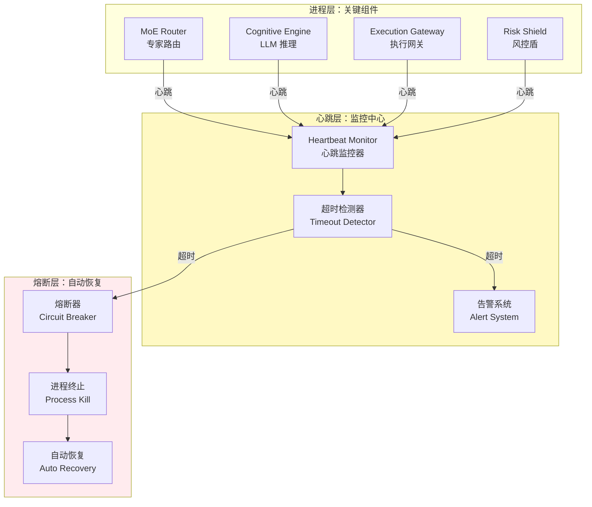

# L3 · 心跳协议与健康检查规约

> [!NOTE] **[TRACEBACK] 原子规约锚点**
> - **顶层概念**: [一句话定义与核心价值](../01_顶层概念/01_一句话定义与核心价值.md)
> - **战略维度**: [生产保障与可观测性维度](../02_战略维度/产品设计/04_生产保障与可观测性维度.md)
> - **原子规约**: [全链路通信协议矩阵](./04_全链路通信协议矩阵.md)
> - **对应 DNA**: `_System_DNA/dna_08_heartbeat_and_healthcheck.yaml`
> - **本文档**: L3 层级，定义心跳协议与健康检查规约，解决"僵尸进程风险"问题

## 问题：僵尸进程风险 (Zombie Risk)

### 痛点

**之前的方案**：如果 DeepSeek API 卡死，或者 Python 进程假死，执行层没有收到"停止"指令，可能会一直挂单。这是**致命的**。

**生产级需求**：**所有进程必须有心跳监控**，一旦检测到进程假死，立即触发熔断机制。

### 解决方案：心跳协议 (Heartbeat Protocol)

**核心原则**：**无心跳，不执行**。所有关键进程必须定期发送心跳，超时未收到心跳则触发熔断。

---

## 架构设计

### 心跳协议架构图



---

## A. 心跳协议定义

### Protocol Buffers Schema

```protobuf
syntax = "proto3";

package diting.heartbeat;

// 心跳消息
message Heartbeat {
  string process_id = 1;              // 进程 ID（UUID）
  string component_name = 2;           // 组件名称（MoE Router, Cognitive Engine, etc.）
  int64 timestamp = 3;                 // 心跳时间戳（Unix 时间，毫秒）
  
  // 进程状态
  enum ProcessStatus {
    STATUS_HEALTHY = 0;                // 健康
    STATUS_DEGRADED = 1;               // 降级（部分功能异常）
    STATUS_UNHEALTHY = 2;              // 不健康（需要重启）
  }
  ProcessStatus status = 4;
  
  // 健康指标
  HealthMetrics metrics = 5;
  
  // 最后处理的请求 ID（用于追踪）
  string last_request_id = 6;
}

// 健康指标
message HealthMetrics {
  double cpu_usage = 1;                // CPU 使用率（0.0-1.0）
  double memory_usage = 2;             // 内存使用率（0.0-1.0）
  int32 pending_requests = 3;           // 待处理请求数
  double avg_response_time_ms = 4;    // 平均响应时间（毫秒）
  
  // 组件特定指标
  map<string, double> custom_metrics = 5;
}

// 心跳响应
message HeartbeatAck {
  bool received = 1;                   // 是否收到
  int64 server_timestamp = 2;          // 服务器时间戳
  string message = 3;                  // 响应消息（可选）
}
```

### 心跳发送频率

| 组件类型 | 心跳频率 | 超时阈值 | 熔断动作 |
|---------|---------|---------|---------|
| **MoE Router** | 每 5 秒 | 15 秒未收到心跳 | 停止路由，拒绝新请求 |
| **Cognitive Engine** | 每 10 秒 | 30 秒未收到心跳 | 终止 LLM 请求，降级处理 |
| **Execution Gateway** | 每 3 秒 | 9 秒未收到心跳 | **立即撤销所有挂单** |
| **Risk Shield** | 每 2 秒 | 6 秒未收到心跳 | **触发全局熔断，禁止所有交易** |

---

## B. 心跳监控器实现

### 心跳监控器接口

```python
# diting-core/diting/heartbeat/monitor.py
from typing import Dict, Optional
from datetime import datetime, timedelta
import asyncio

class HeartbeatMonitor:
    """心跳监控器：监控所有关键进程的心跳"""
    
    def __init__(self):
        self.processes: Dict[str, ProcessState] = {}
        self.timeout_thresholds = {
            "MoE Router": timedelta(seconds=15),
            "Cognitive Engine": timedelta(seconds=30),
            "Execution Gateway": timedelta(seconds=9),
            "Risk Shield": timedelta(seconds=6),
        }
    
    async def receive_heartbeat(self, heartbeat: Heartbeat):
        """接收心跳消息"""
        process_id = heartbeat.process_id
        component_name = heartbeat.component_name
        
        # 更新进程状态
        self.processes[process_id] = ProcessState(
            component_name=component_name,
            last_heartbeat=datetime.fromtimestamp(heartbeat.timestamp / 1000),
            status=heartbeat.status,
            metrics=heartbeat.metrics,
            last_request_id=heartbeat.last_request_id
        )
        
        # 返回确认
        return HeartbeatAck(
            received=True,
            server_timestamp=int(datetime.now().timestamp() * 1000)
        )
    
    async def check_timeouts(self):
        """检查超时进程（定期调用）"""
        now = datetime.now()
        timeout_processes = []
        
        for process_id, state in self.processes.items():
            timeout_threshold = self.timeout_thresholds.get(state.component_name)
            if timeout_threshold:
                elapsed = now - state.last_heartbeat
                if elapsed > timeout_threshold:
                    timeout_processes.append((process_id, state))
        
        # 触发熔断
        for process_id, state in timeout_processes:
            await self._trigger_circuit_breaker(process_id, state)
    
    async def _trigger_circuit_breaker(self, process_id: str, state: ProcessState):
        """触发熔断器"""
        logger.error(f"进程 {process_id} ({state.component_name}) 心跳超时，触发熔断")
        
        # 根据组件类型执行不同的熔断动作
        if state.component_name == "Execution Gateway":
            # 执行网关超时：立即撤销所有挂单
            await self._cancel_all_pending_orders()
        elif state.component_name == "Risk Shield":
            # 风控盾超时：触发全局熔断
            await self._trigger_global_circuit_breaker()
        elif state.component_name == "Cognitive Engine":
            # LLM 引擎超时：终止所有 LLM 请求
            await self._terminate_all_llm_requests()
        
        # 发送告警
        await self._send_alert(process_id, state)
```

---

## C. 进程心跳发送实现

### 心跳发送器基类

```python
# diting-core/diting/heartbeat/sender.py
import asyncio
from abc import ABC, abstractmethod
from typing import Optional

class HeartbeatSender(ABC):
    """心跳发送器基类"""
    
    def __init__(self, component_name: str, process_id: str, interval_seconds: int):
        self.component_name = component_name
        self.process_id = process_id
        self.interval_seconds = interval_seconds
        self._running = False
        self._task: Optional[asyncio.Task] = None
    
    async def start(self):
        """启动心跳发送"""
        self._running = True
        self._task = asyncio.create_task(self._heartbeat_loop())
    
    async def stop(self):
        """停止心跳发送"""
        self._running = False
        if self._task:
            self._task.cancel()
            try:
                await self._task
            except asyncio.CancelledError:
                pass
    
    async def _heartbeat_loop(self):
        """心跳循环"""
        while self._running:
            try:
                # 发送心跳
                heartbeat = self._create_heartbeat()
                await self._send_heartbeat(heartbeat)
                
                # 等待间隔
                await asyncio.sleep(self.interval_seconds)
            except Exception as e:
                logger.error(f"心跳发送失败: {e}")
                await asyncio.sleep(self.interval_seconds)
    
    def _create_heartbeat(self) -> Heartbeat:
        """创建心跳消息"""
        return Heartbeat(
            process_id=self.process_id,
            component_name=self.component_name,
            timestamp=int(datetime.now().timestamp() * 1000),
            status=self._get_process_status(),
            metrics=self._get_health_metrics(),
            last_request_id=self._get_last_request_id()
        )
    
    @abstractmethod
    async def _send_heartbeat(self, heartbeat: Heartbeat):
        """发送心跳消息（子类实现）"""
        pass
    
    @abstractmethod
    def _get_process_status(self) -> ProcessStatus:
        """获取进程状态（子类实现）"""
        pass
    
    @abstractmethod
    def _get_health_metrics(self) -> HealthMetrics:
        """获取健康指标（子类实现）"""
        pass
    
    @abstractmethod
    def _get_last_request_id(self) -> str:
        """获取最后处理的请求 ID（子类实现）"""
        pass
```

### 执行网关心跳发送器实现

```python
# diting-core/diting/heartbeat/execution_sender.py
from diting.heartbeat.sender import HeartbeatSender

class ExecutionGatewayHeartbeatSender(HeartbeatSender):
    """执行网关心跳发送器（高频：每3秒）"""
    
    def __init__(self, process_id: str, broker_driver):
        super().__init__("Execution Gateway", process_id, interval_seconds=3)
        self.broker_driver = broker_driver
        self.last_request_id = None
    
    async def _send_heartbeat(self, heartbeat: Heartbeat):
        """发送心跳到监控中心"""
        # 通过 Redis Pub/Sub 或 gRPC 发送
        await redis_client.publish("heartbeat:execution", heartbeat.SerializeToString())
    
    def _get_process_status(self) -> ProcessStatus:
        """检查执行网关状态"""
        # 检查是否有挂单
        pending_orders = self.broker_driver.get_pending_orders()
        if len(pending_orders) > 100:
            return ProcessStatus.STATUS_DEGRADED
        return ProcessStatus.STATUS_HEALTHY
    
    def _get_health_metrics(self) -> HealthMetrics:
        """获取健康指标"""
        import psutil
        process = psutil.Process()
        return HealthMetrics(
            cpu_usage=process.cpu_percent() / 100,
            memory_usage=process.memory_percent() / 100,
            pending_requests=len(self.broker_driver.get_pending_orders()),
            avg_response_time_ms=self._calculate_avg_response_time()
        )
    
    def _get_last_request_id(self) -> str:
        return self.last_request_id or ""
```

---

## D. 熔断器实现

### 熔断器接口

```python
# diting-core/diting/heartbeat/circuit_breaker.py
from enum import Enum
from typing import Callable, Optional

class CircuitState(Enum):
    CLOSED = "closed"      # 正常状态
    OPEN = "open"          # 熔断状态（拒绝所有请求）
    HALF_OPEN = "half_open"  # 半开状态（尝试恢复）

class CircuitBreaker:
    """熔断器：检测到心跳超时后触发熔断"""
    
    def __init__(
        self,
        component_name: str,
        failure_threshold: int = 3,  # 连续失败次数阈值
        recovery_timeout: int = 60   # 恢复超时（秒）
    ):
        self.component_name = component_name
        self.state = CircuitState.CLOSED
        self.failure_count = 0
        self.failure_threshold = failure_threshold
        self.recovery_timeout = recovery_timeout
        self.last_failure_time: Optional[datetime] = None
    
    def call(self, func: Callable, *args, **kwargs):
        """执行函数调用（带熔断保护）"""
        if self.state == CircuitState.OPEN:
            # 检查是否超过恢复超时
            if self._should_attempt_recovery():
                self.state = CircuitState.HALF_OPEN
            else:
                raise CircuitBreakerOpenError(f"{self.component_name} 熔断器已打开")
        
        try:
            result = func(*args, **kwargs)
            # 成功：重置失败计数
            if self.state == CircuitState.HALF_OPEN:
                self.state = CircuitState.CLOSED
            self.failure_count = 0
            return result
        except Exception as e:
            # 失败：增加失败计数
            self.failure_count += 1
            self.last_failure_time = datetime.now()
            
            if self.failure_count >= self.failure_threshold:
                self.state = CircuitState.OPEN
                logger.error(f"{self.component_name} 熔断器已打开（失败次数: {self.failure_count}）")
            
            raise
    
    def _should_attempt_recovery(self) -> bool:
        """是否应该尝试恢复"""
        if self.last_failure_time is None:
            return False
        elapsed = (datetime.now() - self.last_failure_time).total_seconds()
        return elapsed >= self.recovery_timeout
```

### 执行网关熔断动作

```python
# diting-core/diting/heartbeat/execution_breaker.py
class ExecutionGatewayCircuitBreaker:
    """执行网关熔断器：心跳超时后立即撤销所有挂单"""
    
    async def trigger(self):
        """触发熔断：撤销所有挂单"""
        logger.critical("执行网关心跳超时，触发熔断：撤销所有挂单")
        
        # 1. 获取所有挂单
        broker = get_broker_driver()
        pending_orders = broker.get_pending_orders()
        
        # 2. 批量撤销
        for order_id in pending_orders:
            try:
                broker.cancel_order(order_id)
                logger.info(f"已撤销挂单: {order_id}")
            except Exception as e:
                logger.error(f"撤销挂单失败 {order_id}: {e}")
        
        # 3. 发送告警
        await alert_system.send_critical(
            title="执行网关心跳超时",
            message=f"已撤销 {len(pending_orders)} 个挂单",
            severity="critical"
        )
        
        # 4. 触发全局熔断（禁止新交易）
        global_circuit_breaker.open()
```

---

## E. 健康检查端点

### HTTP 健康检查端点

```python
# diting-core/diting/heartbeat/health_check.py
from fastapi import APIRouter, HTTPException

router = APIRouter()

@router.get("/health")
async def health_check():
    """健康检查端点"""
    heartbeat_monitor = get_heartbeat_monitor()
    
    # 检查所有关键进程的心跳状态
    unhealthy_processes = []
    for process_id, state in heartbeat_monitor.processes.items():
        if state.status == ProcessStatus.STATUS_UNHEALTHY:
            unhealthy_processes.append({
                "process_id": process_id,
                "component": state.component_name,
                "last_heartbeat": state.last_heartbeat.isoformat()
            })
    
    if unhealthy_processes:
        raise HTTPException(
            status_code=503,
            detail={
                "status": "unhealthy",
                "unhealthy_processes": unhealthy_processes
            }
        )
    
    return {
        "status": "healthy",
        "timestamp": datetime.now().isoformat()
    }

@router.get("/health/{component_name}")
async def component_health_check(component_name: str):
    """组件健康检查端点"""
    heartbeat_monitor = get_heartbeat_monitor()
    
    # 查找组件的最新心跳
    component_states = [
        state for state in heartbeat_monitor.processes.values()
        if state.component_name == component_name
    ]
    
    if not component_states:
        raise HTTPException(status_code=404, detail=f"组件 {component_name} 未找到")
    
    latest_state = max(component_states, key=lambda s: s.last_heartbeat)
    
    return {
        "component": component_name,
        "status": latest_state.status.name,
        "last_heartbeat": latest_state.last_heartbeat.isoformat(),
        "metrics": latest_state.metrics
    }
```

---

## F. 监控与告警

### Prometheus 指标

```python
# diting-core/diting/heartbeat/metrics.py
from prometheus_client import Counter, Gauge, Histogram

# 心跳指标
heartbeat_received_total = Counter(
    'diting_heartbeat_received_total',
    'Total number of heartbeats received',
    ['component_name']
)

heartbeat_timeout_total = Counter(
    'diting_heartbeat_timeout_total',
    'Total number of heartbeat timeouts',
    ['component_name']
)

# 进程状态指标
process_status = Gauge(
    'diting_process_status',
    'Process status (0=healthy, 1=degraded, 2=unhealthy)',
    ['component_name', 'process_id']
)

# 心跳延迟指标
heartbeat_latency = Histogram(
    'diting_heartbeat_latency_seconds',
    'Heartbeat latency in seconds',
    ['component_name']
)
```

### 告警规则

```yaml
# diting-infra/observability/prometheus/alerts.yml
groups:
  - name: heartbeat_alerts
    rules:
      - alert: ExecutionGatewayHeartbeatTimeout
        expr: diting_heartbeat_timeout_total{component_name="Execution Gateway"} > 0
        for: 10s
        annotations:
          summary: "执行网关心跳超时"
          description: "执行网关超过 9 秒未发送心跳，已触发熔断"
        labels:
          severity: critical
      
      - alert: RiskShieldHeartbeatTimeout
        expr: diting_heartbeat_timeout_total{component_name="Risk Shield"} > 0
        for: 5s
        annotations:
          summary: "风控盾心跳超时"
          description: "风控盾超过 6 秒未发送心跳，已触发全局熔断"
        labels:
          severity: critical
```

---

## 与战略维度的映射

| 战略维度 | 对应心跳协议 | 说明 |
|---------|------------|------|
| **生产保障** | 心跳监控、健康检查 | 可观测性的核心组件 |
| **安全治理** | 熔断器、进程终止 | 防止僵尸进程导致的安全风险 |

---

## 下一步

→ 参见：
- [04_阶段规划与实践/](../04_阶段规划与实践/) 目录下的阶段实践文档
