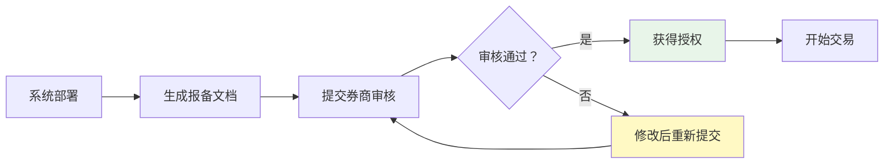
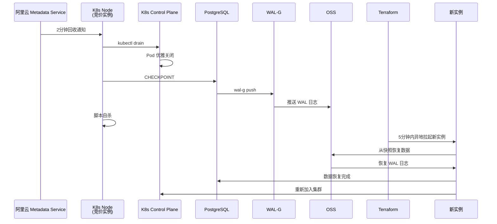
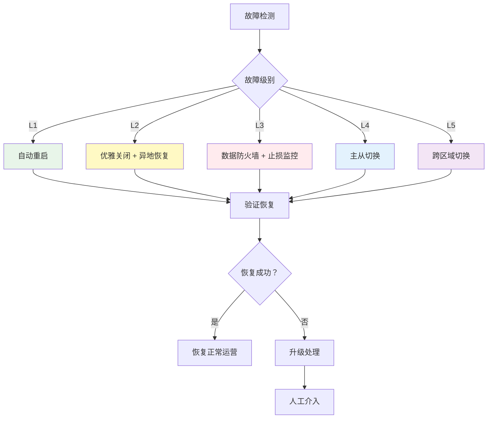

# L3 · 运营、治理与灾备规约

> [!NOTE] **[TRACEBACK] 原子规约锚点**
> - **顶层概念**: [一句话定义与核心价值](../01_顶层概念/01_一句话定义与核心价值.md)
> - **战略维度**: [安全与机密治理维度](../02_战略维度/产品设计/05_安全与机密治理维度.md)
> - **战略维度**: [生产保障与可观测性维度](../02_战略维度/产品设计/04_生产保障与可观测性维度.md)
> - **原子规约**: [核心模块架构规约](./09_核心模块架构规约.md)
> - **对应 DNA**: `_System_DNA/dna_10_governance_and_dr.yaml`
> - **本文档**: L3 层级，定义运营、治理与灾备规约

## 核心理念

**合规是生命线，灾备是生存底线**。金融交易系统必须同时满足监管合规要求和业务连续性要求。成本治理相关阈值与策略（Token 预算、Scale-to-Zero、冷归档）见 `_System_DNA/global_const.yaml` 下 `cost_governance`。

---

## A. 合规性策略 (Compliance Strategy)

### 1. 交易通道合规

#### 1.1 通道要求

**核心原则**：**仅通过券商官方终端交易**，严禁使用非官方接口。

| 通道类型 | 合规状态 | 使用场景 | 限制 |
|---------|---------|---------|------|
| **MiniQMT** | ✅ 合规 | 量化交易 | 需券商授权 |
| **PTrade** | ✅ 合规 | 程序化交易 | 需券商授权 |
| **模拟点击** | ❌ **严禁** | - | 违反监管规定 |
| **第三方接口** | ❌ **严禁** | - | 存在合规风险 |

#### 1.2 通道验证机制

```python
# diting-core/diting/compliance/channel_validator.py
class ChannelValidator:
    """交易通道验证器"""
    
    ALLOWED_CHANNELS = ["MiniQMT", "PTrade"]
    
    def validate_channel(self, channel: str) -> bool:
        """验证交易通道是否合规"""
        if channel not in self.ALLOWED_CHANNELS:
            raise ComplianceError(f"不合规的交易通道: {channel}")
        
        # 验证通道授权状态
        if not self._check_channel_authorization(channel):
            raise ComplianceError(f"通道 {channel} 未授权")
        
        return True
    
    def _check_channel_authorization(self, channel: str) -> bool:
        """检查通道授权状态"""
        # 从配置中心读取授权状态
        auth_status = config_center.get(f"channel.{channel}.authorized")
        return auth_status == "true"
```

### 2. 程序化交易报备

#### 2.1 报备要求

**核心原则**：**主动向券商提交《程序化交易报告》**，确保合规。

**报备内容**：
- 交易策略说明
- 交易频率和规模
- 风险控制措施
- 系统架构说明

#### 2.2 报备流程



#### 2.3 报备文档生成

```python
# diting-core/diting/compliance/report_generator.py
class ProgrammaticTradingReportGenerator:
    """程序化交易报告生成器"""
    
    def generate_report(self) -> dict:
        """生成程序化交易报告"""
        return {
            "strategy_description": self._get_strategy_description(),
            "trading_frequency": self._get_trading_frequency(),
            "trading_scale": self._get_trading_scale(),
            "risk_controls": self._get_risk_controls(),
            "system_architecture": self._get_system_architecture(),
            "compliance_measures": self._get_compliance_measures()
        }
    
    def _get_strategy_description(self) -> str:
        """获取策略描述"""
        return """
        本系统采用 Neuro-Symbolic MoE 架构，结合量化信号和 AI 专家意见进行交易决策。
        主要策略包括：趋势策略、反转策略、突破策略。
        """
    
    def _get_trading_frequency(self) -> dict:
        """获取交易频率"""
        return {
            "daily_orders": "< 100笔/日",
            "order_cancellation_rate": "< 5%",
            "max_orders_per_second": "< 5笔/秒"
        }
    
    def _get_risk_controls(self) -> list:
        """获取风险控制措施"""
        return [
            "单笔风险 < 2%",
            "最大回撤 < 12%",
            "硬止损机制",
            "盈亏比检查（> 1.5）",
            "组合相关性限制"
        ]
```

### 3. 交易行为红线

#### 3.1 严禁行为清单

| 行为 | 状态 | 监控方式 | 处罚措施 |
|------|------|---------|---------|
| **模拟点击** | ❌ **严禁** | 代码审计 + 运行时检测 | 立即停止交易 |
| **高频撤单**（每秒 > 5 笔） | ❌ **严禁** | 实时监控 | 触发熔断，暂停交易 |
| **未授权通道** | ❌ **严禁** | 通道验证器 | 拒绝交易请求 |
| **异常交易模式** | ⚠️ **警告** | 行为分析 | 人工审核 |

#### 3.2 高频撤单监控

```python
# diting-core/diting/compliance/cancellation_monitor.py
from collections import deque
from datetime import datetime, timedelta

class CancellationMonitor:
    """撤单频率监控器"""
    
    MAX_CANCELLATIONS_PER_SECOND = 5
    WINDOW_SECONDS = 1
    
    def __init__(self):
        self.cancellation_times = deque()
    
    def record_cancellation(self, order_id: str):
        """记录撤单操作"""
        now = datetime.now()
        self.cancellation_times.append(now)
        
        # 清理过期记录
        cutoff_time = now - timedelta(seconds=self.WINDOW_SECONDS)
        while self.cancellation_times and self.cancellation_times[0] < cutoff_time:
            self.cancellation_times.popleft()
        
        # 检查是否超过阈值
        if len(self.cancellation_times) > self.MAX_CANCELLATIONS_PER_SECOND:
            self._trigger_circuit_breaker()
    
    def _trigger_circuit_breaker(self):
        """触发熔断器"""
        logger.critical("高频撤单检测：触发熔断，暂停交易")
        
        # 1. 暂停所有新订单
        execution_gateway.pause()
        
        # 2. 发送告警
        alert_system.send_critical(
            title="高频撤单检测",
            message=f"检测到每秒撤单数 > {self.MAX_CANCELLATIONS_PER_SECOND}，已触发熔断"
        )
        
        # 3. 记录审计日志
        audit_logger.log_compliance_violation(
            violation_type="high_frequency_cancellation",
            details={
                "cancellations_per_second": len(self.cancellation_times),
                "threshold": self.MAX_CANCELLATIONS_PER_SECOND
            }
        )
```

### 4. 合规性审计

#### 4.1 审计日志

```python
# diting-core/diting/compliance/audit.py
class ComplianceAuditor:
    """合规性审计器"""
    
    def audit_trade(self, order: TradeOrder):
        """审计交易订单"""
        violations = []
        
        # 1. 检查交易通道
        if not channel_validator.validate_channel(order.channel):
            violations.append("invalid_channel")
        
        # 2. 检查撤单频率
        if order.type == OrderType.CANCEL:
            cancellation_monitor.record_cancellation(order.order_id)
        
        # 3. 检查交易频率
        if self._check_trading_frequency(order):
            violations.append("high_frequency_trading")
        
        # 4. 记录审计日志
        if violations:
            self._log_violations(order, violations)
            raise ComplianceViolationError(f"合规性违规: {violations}")
    
    def _log_violations(self, order: TradeOrder, violations: List[str]):
        """记录违规日志"""
        audit_log = {
            "timestamp": datetime.now().isoformat(),
            "order_id": order.order_id,
            "violations": violations,
            "order_details": order.to_dict()
        }
        
        # 写入不可修改的审计日志表
        db.execute("""
            INSERT INTO compliance_audit_logs (log_data)
            VALUES (%s)
        """, json.dumps(audit_log))
```

---

## B. 灾难恢复 (Disaster Recovery)

数据分层与 WAL/RPO 约定见 `global_const.data_architecture`。

### 1. 故障分级与响应策略

#### 1.1 故障分级矩阵

| 故障级别 | 故障类型 | 影响范围 | 恢复时间目标 (RTO) | 恢复点目标 (RPO) | 恢复策略 |
|---------|---------|---------|------------------|----------------|---------|
| **L1** | App 崩溃 | 单实例 | < 1 分钟 | 0（无数据丢失） | 自动重启 |
| **L2** | 竞价实例回收 | 单节点 | < 5 分钟 | < 1 分钟 | 异地拉起 + 数据恢复 |
| **L3** | 行情中断 | 全局 | < 30 分钟 | 0（停止交易） | 熔断 + 止损监控 |
| **L4** | 数据库故障 | 全局 | < 1 小时 | < 5 分钟 | 主从切换 |
| **L5** | 区域故障 | 全局 | < 4 小时 | < 1 小时 | 跨区域切换 |

### 2. L1 故障：App 崩溃恢复

#### 2.1 自动重启机制

```python
# diting-core/diting/dr/app_guardian.py
import subprocess
import time
from watchdog.observers import Observer
from watchdog.events import FileSystemEventHandler

class AppGuardian:
    """应用守护进程：监控 App 状态，自动重启"""
    
    def __init__(self, app_process: subprocess.Popen):
        self.app_process = app_process
        self.restart_count = 0
        self.max_restarts = 5
    
    def monitor(self):
        """监控应用状态"""
        while True:
            if self.app_process.poll() is not None:
                # 进程已退出
                logger.warning(f"App 进程退出，退出码: {self.app_process.returncode}")
                
                if self.restart_count < self.max_restarts:
                    self._restart_app()
                else:
                    logger.critical("达到最大重启次数，停止重启")
                    alert_system.send_critical("App 崩溃，无法自动恢复")
                    break
            
            time.sleep(5)  # 每5秒检查一次
    
    def _restart_app(self):
        """重启应用"""
        self.restart_count += 1
        logger.info(f"重启 App（第 {self.restart_count} 次）")
        
        # 重启 MiniQMT 进程
        self.app_process = subprocess.Popen(
            ["python", "-m", "diting.main"],
            stdout=subprocess.PIPE,
            stderr=subprocess.PIPE
        )
        
        # 等待进程启动
        time.sleep(10)
        
        if self.app_process.poll() is None:
            logger.info("App 重启成功")
        else:
            logger.error("App 重启失败")
```

#### 2.2 K8s 健康检查集成

```yaml
# diting-infra/k8s/deployments/diting-app.yaml
apiVersion: apps/v1
kind: Deployment
metadata:
  name: diting-app
spec:
  replicas: 1
  template:
    spec:
      containers:
      - name: diting-app
        image: diting/app:latest
        livenessProbe:
          exec:
            command:
            - /bin/sh
            - -c
            - "pgrep -f 'diting.main' || exit 1"
          initialDelaySeconds: 30
          periodSeconds: 10
          failureThreshold: 3
        restartPolicy: Always
```

### 3. L2 故障：竞价实例回收恢复

#### 3.1 关键保留项：Metadata Service 通知机制

**触发条件**：阿里云 Metadata Service 2分钟通知

**恢复流程**：



#### 3.2 Metadata Service 监听器

```python
# diting-core/diting/dr/metadata_listener.py
import requests
import json
from datetime import datetime, timedelta

class MetadataServiceListener:
    """Metadata Service 监听器：监听实例回收通知"""
    
    METADATA_URL = "http://100.100.100.200/latest/meta-data/spot/termination-time"
    CHECK_INTERVAL = 10  # 10秒检查一次
    
    def __init__(self):
        self.termination_time = None
        self.grace_period = timedelta(minutes=2)
    
    def start_listening(self):
        """开始监听"""
        while True:
            try:
                response = requests.get(self.METADATA_URL, timeout=5)
                if response.status_code == 200:
                    termination_time_str = response.text.strip()
                    termination_time = datetime.fromisoformat(termination_time_str)
                    
                    if termination_time != self.termination_time:
                        self.termination_time = termination_time
                        self._handle_termination_notice(termination_time)
                
            except requests.exceptions.RequestException:
                # Metadata Service 不可用，继续监听
                pass
            
            time.sleep(self.CHECK_INTERVAL)
    
    def _handle_termination_notice(self, termination_time: datetime):
        """处理回收通知"""
        now = datetime.now()
        time_until_termination = termination_time - now
        
        logger.warning(f"收到实例回收通知，将在 {time_until_termination} 后回收")
        
        if time_until_termination <= self.grace_period:
            # 立即执行优雅关闭流程
            self._graceful_shutdown()
        else:
            # 设置定时任务，在回收前执行优雅关闭
            schedule_time = termination_time - self.grace_period
            self._schedule_graceful_shutdown(schedule_time)
```

#### 3.3 优雅关闭流程

```python
# diting-core/diting/dr/graceful_shutdown.py
import subprocess
import os

class GracefulShutdown:
    """优雅关闭流程"""
    
    def execute(self):
        """执行优雅关闭"""
        logger.info("开始优雅关闭流程")
        
        # 1. kubectl drain（驱逐 Pod）
        self._drain_node()
        
        # 2. 数据库 CHECKPOINT
        self._checkpoint_database()
        
        # 3. WAL-G 推送
        self._push_wal_logs()
        
        # 4. 脚本自杀
        self._self_terminate()
    
    def _drain_node(self):
        """驱逐节点上的 Pod"""
        node_name = os.getenv("NODE_NAME")
        logger.info(f"驱逐节点 {node_name} 上的 Pod")
        
        subprocess.run([
            "kubectl", "drain", node_name,
            "--ignore-daemonsets",
            "--delete-emptydir-data",
            "--grace-period=60"
        ], check=True)
    
    def _checkpoint_database(self):
        """数据库 CHECKPOINT"""
        logger.info("执行数据库 CHECKPOINT")
        
        db.execute("CHECKPOINT")
        logger.info("数据库 CHECKPOINT 完成")
    
    def _push_wal_logs(self):
        """推送 WAL 日志到 OSS"""
        logger.info("推送 WAL 日志到 OSS")
        
        subprocess.run([
            "wal-g", "backup-push", "/var/lib/postgresql/data"
        ], check=True)
        
        logger.info("WAL 日志推送完成")
    
    def _self_terminate(self):
        """脚本自杀"""
        logger.info("脚本自杀，触发实例回收")
        
        # 发送最终告警
        alert_system.send_warning(
            title="实例优雅关闭完成",
            message="实例已执行优雅关闭，等待回收"
        )
        
        # 退出进程
        os._exit(0)
```

#### 3.4 异地恢复流程

```python
# diting-infra/terraform/modules/spot_recovery/main.tf
# Terraform 脚本：异地拉起新实例

resource "alicloud_ecs_instance" "recovery_instance" {
  # 从 OSS 快照恢复
  image_id = var.snapshot_id
  
  # 异地部署（不同可用区）
  availability_zone = var.recovery_zone
  
  # 竞价实例
  instance_charge_type = "PostPaid"
  spot_strategy = "SpotWithPriceLimit"
  spot_price_limit = var.spot_price_limit
}

# 数据恢复脚本
resource "null_resource" "data_recovery" {
  provisioner "local-exec" {
    command = <<-EOT
      # 从 OSS 恢复数据快照
      wal-g backup-fetch /var/lib/postgresql/data LATEST
      
      # 恢复 WAL 日志
      wal-g wal-fetch /var/lib/postgresql/data
      
      # 启动数据库
      systemctl start postgresql
    EOT
  }
}
```

### 4. L3 故障：行情中断恢复

#### 4.1 Data Firewall 熔断机制

```python
# diting-core/diting/dr/data_firewall.py
from datetime import datetime, timedelta

class DataFirewall:
    """数据防火墙：行情中断时触发熔断"""
    
    def __init__(self):
        self.last_data_time = None
        self.timeout_threshold = timedelta(minutes=5)
        self.circuit_open = False
    
    def check_data_health(self):
        """检查数据健康状态"""
        if self.last_data_time is None:
            return
        
        time_since_last_data = datetime.now() - self.last_data_time
        
        if time_since_last_data > self.timeout_threshold:
            if not self.circuit_open:
                self._open_circuit()
        else:
            if self.circuit_open:
                self._close_circuit()
    
    def _open_circuit(self):
        """打开熔断器"""
        self.circuit_open = True
        logger.critical("行情中断检测：打开数据防火墙，暂停所有开仓")
        
        # 1. 暂停所有开仓
        execution_gateway.pause_new_orders()
        
        # 2. 维持止损监控
        execution_gateway.keep_stop_loss_monitoring()
        
        # 3. 发送告警
        alert_system.send_critical(
            title="行情中断检测",
            message="检测到行情数据中断，已触发数据防火墙，暂停所有开仓"
        )
    
    def _close_circuit(self):
        """关闭熔断器"""
        self.circuit_open = False
        logger.info("行情数据恢复，关闭数据防火墙")
        
        # 恢复交易
        execution_gateway.resume_new_orders()
        
        alert_system.send_info(
            title="行情数据恢复",
            message="行情数据已恢复，交易功能已恢复"
        )
    
    def record_data_received(self):
        """记录数据接收时间"""
        self.last_data_time = datetime.now()
```

#### 4.2 止损监控维持机制

```python
# diting-core/diting/dr/stop_loss_monitor.py
class StopLossMonitor:
    """止损监控：行情中断时维持止损监控"""
    
    def __init__(self):
        self.monitoring_active = True
    
    def monitor_positions(self):
        """监控持仓止损"""
        while self.monitoring_active:
            positions = broker.get_positions()
            
            for position in positions:
                # 使用最后已知价格计算止损
                last_known_price = self._get_last_known_price(position.symbol)
                
                if self._check_stop_loss(position, last_known_price):
                    # 执行止损（市价单）
                    self._execute_stop_loss(position)
            
            time.sleep(1)  # 每秒检查一次
    
    def _get_last_known_price(self, symbol: str) -> float:
        """获取最后已知价格"""
        # 从缓存或数据库获取最后已知价格
        return cache.get(f"last_price:{symbol}") or db.query(
            "SELECT price FROM prices WHERE symbol = %s ORDER BY timestamp DESC LIMIT 1",
            symbol
        ).scalar()
```

### 5. 数据备份策略

#### 5.1 备份分级

| 备份类型 | 频率 | 保留期限 | 存储位置 | RPO |
|---------|------|---------|---------|-----|
| **WAL 日志** | 实时 | 7天 | OSS | < 1分钟 |
| **数据库快照** | 每小时 | 24小时 | OSS | < 1小时 |
| **决策快照** | 每次决策 | 永久 | OSS + DVC | 0 |
| **配置快照** | 每次变更 | 永久 | Git + OSS | 0 |

#### 5.2 WAL-G 备份配置

```yaml
# diting-infra/config/wal-g-config.yaml
WALG_S3_PREFIX: "s3://diting-backups/wal/"
WALG_S3_BUCKET: "diting-backups"
WALG_S3_ENDPOINT: "oss-cn-hangzhou.aliyuncs.com"

# 备份保留策略
WALG_BACKUP_RETENTION: "7d"  # 保留7天

# 压缩配置
WALG_COMPRESSION_METHOD: "lz4"
```

#### 5.3 备份验证

```python
# diting-core/diting/dr/backup_verifier.py
class BackupVerifier:
    """备份验证器：定期验证备份完整性"""
    
    def verify_backups(self):
        """验证备份"""
        # 1. 检查最新备份是否存在
        latest_backup = self._get_latest_backup()
        if not latest_backup:
            raise BackupError("未找到最新备份")
        
        # 2. 验证备份完整性
        if not self._verify_backup_integrity(latest_backup):
            raise BackupError("备份完整性验证失败")
        
        # 3. 测试恢复（可选，定期执行）
        if self._should_test_restore():
            self._test_restore(latest_backup)
    
    def _verify_backup_integrity(self, backup_id: str) -> bool:
        """验证备份完整性"""
        # 使用 checksum 验证
        checksum = self._calculate_backup_checksum(backup_id)
        expected_checksum = self._get_expected_checksum(backup_id)
        
        return checksum == expected_checksum
```

### 6. 业务连续性计划 (BCP)

#### 6.1 BCP 流程



#### 6.2 恢复验证清单

```python
# diting-core/diting/dr/recovery_checklist.py
class RecoveryChecklist:
    """恢复验证清单"""
    
    def verify_recovery(self) -> bool:
        """验证恢复是否成功"""
        checks = [
            self._check_database_connectivity(),
            self._check_redis_connectivity(),
            self._check_broker_api(),
            self._check_data_freshness(),
            self._check_trading_capability()
        ]
        
        return all(checks)
    
    def _check_database_connectivity(self) -> bool:
        """检查数据库连接"""
        try:
            db.execute("SELECT 1")
            return True
        except Exception as e:
            logger.error(f"数据库连接失败: {e}")
            return False
    
    def _check_data_freshness(self) -> bool:
        """检查数据新鲜度"""
        last_price_time = db.query(
            "SELECT MAX(timestamp) FROM prices"
        ).scalar()
        
        time_since_last_price = datetime.now() - last_price_time
        return time_since_last_price < timedelta(minutes=5)
```

### 7. 灾备演练

#### 7.1 演练计划

| 演练类型 | 频率 | 场景 | 目标 |
|---------|------|------|------|
| **L1 演练** | 每月 | App 崩溃恢复 | RTO < 1分钟 |
| **L2 演练** | 每季度 | 实例回收恢复 | RTO < 5分钟，RPO < 1分钟 |
| **L3 演练** | 每半年 | 行情中断恢复 | 熔断机制验证 |
| **L4 演练** | 每年 | 数据库故障恢复 | 主从切换验证 |
| **L5 演练** | 每年 | 区域故障恢复 | 跨区域切换验证 |

#### 7.2 演练脚本

```python
# diting-core/diting/dr/drill_scripts/l2_drill.py
class L2DisasterDrill:
    """L2 故障演练脚本"""
    
    def execute_drill(self):
        """执行 L2 故障演练"""
        logger.info("开始 L2 故障演练")
        
        # 1. 创建测试实例
        test_instance = self._create_test_instance()
        
        # 2. 模拟 Metadata Service 通知
        self._simulate_termination_notice(test_instance)
        
        # 3. 验证优雅关闭流程
        self._verify_graceful_shutdown(test_instance)
        
        # 4. 验证数据备份
        self._verify_backup(test_instance)
        
        # 5. 验证异地恢复
        recovery_instance = self._verify_recovery()
        
        # 6. 清理测试资源
        self._cleanup(test_instance, recovery_instance)
        
        logger.info("L2 故障演练完成")
```

---

## C. 运营监控与告警

### 1. 合规性监控

```python
# diting-core/diting/monitoring/compliance_monitor.py
class ComplianceMonitor:
    """合规性监控器"""
    
    def monitor_compliance(self):
        """监控合规性指标"""
        metrics = {
            "channel_compliance_rate": self._calculate_channel_compliance_rate(),
            "cancellation_rate": self._calculate_cancellation_rate(),
            "reporting_status": self._check_reporting_status()
        }
        
        # 发送到 Prometheus
        prometheus_client.gauge("diting_compliance_channel_rate").set(
            metrics["channel_compliance_rate"]
        )
        
        # 检查告警阈值
        if metrics["channel_compliance_rate"] < 1.0:
            alert_system.send_warning("合规性监控：检测到不合规交易通道")
        
        if metrics["cancellation_rate"] > 0.05:
            alert_system.send_warning("合规性监控：撤单率过高")
```

### 2. 灾备监控

```python
# diting-core/diting/monitoring/dr_monitor.py
class DRMonitor:
    """灾备监控器"""
    
    def monitor_dr_health(self):
        """监控灾备健康状态"""
        # 1. 检查备份状态
        backup_status = self._check_backup_status()
        
        # 2. 检查恢复能力
        recovery_capability = self._check_recovery_capability()
        
        # 3. 检查数据同步状态
        data_sync_status = self._check_data_sync_status()
        
        # 发送告警
        if not backup_status["healthy"]:
            alert_system.send_critical("灾备监控：备份状态异常")
        
        if not recovery_capability["ready"]:
            alert_system.send_warning("灾备监控：恢复能力不足")
```

---

## 下一步

→ 参见：
- [04_阶段规划与实践/](../04_阶段规划与实践/) 目录下的阶段实践文档
