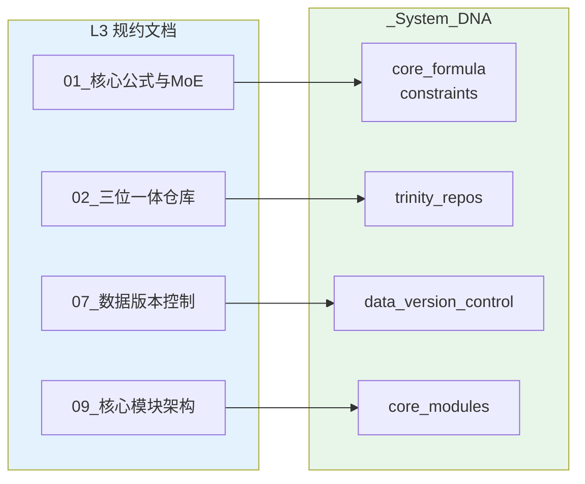

# L3 · 原子目标与规约

> [!NOTE] **[TRACEBACK] 原子规约锚点**
> - **顶层概念**: [一句话定义与核心价值](../01_顶层概念/01_一句话定义与核心价值.md)
> - **战略维度**: [战略维度目录](../02_战略维度/)
> - **本文档**: L3 层级，定义原子能力规约与技术规约

## 规约说明

L3 层级负责定义**原子能力规约、技术规约、架构共识**，为 L4 阶段实践提供明确的约束与标准。本目录下 **开发与交付/**、**产品设计/** 为按轴线划分的子目录，分别存放 01_开发生命周期与实践流程规约、01_需求与产品范围；其余规约位于本目录根下。

**L2 维度与 L3/DNA 对应关系**：见 [06_追溯与审计/00_L2_L3_DNA_映射](../06_追溯与审计/00_L2_L3_DNA_映射.md)，该表为 L2 战略维度 → 主责 L3 规约 → DNA 子树的唯一总表。

## L3 规约与 DNA 映射关系



## L3 文档 ↔ DNA 子树总对照表

> 所有与实现/测试/验收相关的参数与约束，应收敛到 `_System_DNA/global_const.yaml` 对应子树中，L4 阶段与后续代码/脚本一律以这些键值为准。

| L3 规约文档 | 对应 DNA 根节点（`_System_DNA/global_const.yaml`） | 说明 |
|-------------|----------------------------------------------------|------|
| `01_核心公式与MoE架构规约.md` | `core_formula`, `constraints` | 核心公式组件与不可能三角（胜率/复利/回撤）相关的全局约束 |
| `02_三位一体仓库规约.md` | `trinity_repos` | Repo-G/I/A 仓库结构、职责边界与基本原则（Schema First、No Secrets 等） |
| `03_架构设计共识与协作元规则.md` | `architecture_consensus` | ADR 强制令、金融级 GitFlow、SemVer for Money、5D 协作规则 |
| `04_全链路通信协议矩阵.md` | `protocols` | Expert/Verdict/Execution/Risk 协议的 Proto 文件路径与关键字段 |
| `05_接口抽象层规约.md` | `abstraction_layer` | BrokerDriver、CognitiveEngine、MarketDataFeed 抽象接口位置与实现清单 |
| `06_动态配置中心规约.md` | `dynamic_config` | 配置分层（L1/L2/L3）、热更新、版本控制与回滚策略 |
| `07_数据版本控制规约.md` | `data_version_control` | DVC 后端、版本粒度、保留策略、时间点查询与回放能力 |
| `08_心跳协议与健康检查规约.md` | `heartbeat_protocol` | 心跳频率/超时、熔断行为、健康检查端点与监控集成 |
| `09_核心模块架构规约.md` | `core_modules`, `production_requirements` | Module A–F 的输入/输出/规则，以及生产工业级要求（容错、性能、监控、安全、测试、部署、错误处理）。**键名约定**：文档与 L4 中可简写为 `module_a`、`module_b` 等，对应 DNA 键 `core_modules.module_a_semantic_classifier`、`core_modules.module_b_quant_engine` 等（见 global_const.yaml）。 |
| `10_运营治理与灾备规约.md` | `governance_and_dr` | 合规性策略、故障分级、备份/恢复策略、BCP 与 DR 演练、运营监控 |
| `01_开发生命周期与实践流程规约.md` | `_System_DNA/dna_dev_workflow.yaml`（`workflow_stages`, `module_to_stages`） | 从零到可提交的开发生命周期（骨架期、逻辑填充期、Mock 验证、Docker 期、K3s 测试开发期）、与三级流水线衔接、准入准出与过渡时机；L4 执行顺序以 workflow_stages 为准 |
| `01_需求与产品范围.md` | `product_scope` | Phase 划分与阶段目标、功能范围与优先级、与 L1 映射、各 Phase 验收价值 |

> 当新增 L3 文档或扩展现有规约时，必须同步：  
> 1）在 `_System_DNA/global_const.yaml` 中补充相应子树；  
> 2）在上表中登记「文档 ↔ DNA 根节点」映射；  
> 3）在 L4 阶段/步骤文档中引用这些 DNA 键，而非直接写死具体数值。  
> **L2 维度变更时**：先更新该维度的主责 L3 文档，再同步对应 DNA 子树，最后检查 L4 引用；详见 [00_系统规则 四、强制联动规则](../00_系统规则_通用项目协议.md#四强制联动规则) 与 [00_L2_L3_DNA_映射](../06_追溯与审计/00_L2_L3_DNA_映射.md)。

## 目录结构

```
03_原子目标与规约/
├── _System_DNA/                          # YAML 配置区（机器可读）
│   └── global_const.yaml                  # 全局常量
├── 01_核心公式与MoE架构规约.md            # 核心公式与 MoE 架构规约
├── 02_三位一体仓库规约.md                 # Trinity-Repo 物理结构与职责边界
├── 03_架构设计共识与协作元规则.md          # ADR、GitFlow、SemVer、5D 协作
├── 04_全链路通信协议矩阵.md               # Protocol Buffers 定义（Expert/Verdict/Order/Risk）
├── 05_接口抽象层规约.md                   # Broker/Brain/Feed 抽象接口
├── 06_动态配置中心规约.md                  # 动态配置中心，解决"配置僵化"问题
├── 07_数据版本控制规约.md                  # 数据版本控制 (DVC)，解决"数据不可回溯"问题
├── 08_心跳协议与健康检查规约.md            # 心跳协议，解决"僵尸进程风险"问题
├── 09_核心模块架构规约.md                  # 核心模块架构（Module A-F）
├── 10_运营治理与灾备规约.md                # 运营、治理与灾备（合规性、灾难恢复）
├── 开发与交付/
│   └── 01_开发生命周期与实践流程规约.md    # 开发生命周期（骨架→逻辑→Docker→K3s）、与三级流水线衔接
└── 产品设计/
    └── 01_需求与产品范围.md            # 需求与产品范围、Phase 目标与验收价值、与 L1 映射
```

## 规约文档索引

### 1. 核心公式与 MoE 架构规约
- **文件**: [01_核心公式与MoE架构规约.md](./01_核心公式与MoE架构规约.md)
- **内容**: 核心公式 `Alpha = (Quant_Signal ∩ Router(Experts)) × Kelly_Position` 的组件定义、MoE 架构层次、专家选择规则、一票否决机制

### 2. 三位一体仓库规约
- **文件**: [02_三位一体仓库规约.md](./02_三位一体仓库规约.md)
- **内容**: 设计产物与 ADR（方案 A 无独立 diting-design，见 02 规约）、Repo-I (diting-core)、Repo-A (diting-infra) 的物理结构、职责边界、架构共识（Schema First、Single Source of Truth、Interface Separation、No Secrets、Dockerfile/Makefile、deploy-engine 调用）

### 3. 架构设计共识与协作元规则
- **文件**: [03_架构设计共识与协作元规则.md](./03_架构设计共识与协作元规则.md)
- **内容**: ADR 强制令（无文档不编码）、金融级 GitFlow（三级流水线：Unit Test → Paper Trading → Live Trading）、版本控制铁律（SemVer for Money）、5D 协作闭环（Human-AI Protocol）

### 4. 全链路通信协议矩阵
- **文件**: [04_全链路通信协议矩阵.md](./04_全链路通信协议矩阵.md)
- **内容**: Expert Protocol（专家辩论协议）、Verdict Protocol（判官裁决协议）、Execution Protocol（执行指令协议）、Risk Protocol（风控遥测协议）

### 5. 接口抽象层规约
- **文件**: [05_接口抽象层规约.md](./05_接口抽象层规约.md)
- **内容**: BrokerDriver（交易执行抽象）、CognitiveEngine（大脑认知抽象）、MarketDataFeed（数据源抽象）的接口定义与实现示例

### 6. 动态配置中心规约
- **文件**: [06_动态配置中心规约.md](./06_动态配置中心规约.md)
- **内容**: 动态配置中心架构（etcd/Consul + Redis 缓存）、配置热更新机制、配置版本控制与回滚、配置变更审批流程，解决"配置僵化"问题

### 7. 数据版本控制规约
- **文件**: [07_数据版本控制规约.md](./07_数据版本控制规约.md)
- **内容**: 数据版本化策略（DVC 集成）、决策快照规约、时间点查询接口、数据版本元数据管理，解决"数据不可回溯"问题

### 8. 心跳协议与健康检查规约
- **文件**: [08_心跳协议与健康检查规约.md](./08_心跳协议与健康检查规约.md)
- **内容**: 心跳协议定义（Protocol Buffers）、心跳监控器实现、熔断器实现、健康检查端点、监控与告警，解决"僵尸进程风险"问题

### 9. 核心模块架构规约
- **文件**: [09_核心模块架构规约.md](./09_核心模块架构规约.md)
- **内容**: Module A（语义分类器）、Module B（量化扫描引擎）、Module C（MoE 议会）、Module D（判官）、Module E（风控盾）、Module F（执行网关）的详细架构规约

### 10. 运营治理与灾备规约
- **文件**: [10_运营治理与灾备规约.md](./10_运营治理与灾备规约.md)
- **内容**: 合规性策略（交易通道合规、程序化交易报备、交易行为红线）、灾难恢复（L1-L5 故障分级、优雅关闭流程、异地恢复、数据备份策略、业务连续性计划、灾备演练）

### 11. 开发生命周期与实践流程规约
- **文件**: [01_开发生命周期与实践流程规约.md](./开发与交付/01_开发生命周期与实践流程规约.md)
- **内容**: 从零到可提交的开发生命周期（骨架期、逻辑填充期、Docker 期、K3s 测试开发期）、与三级流水线衔接、准入准出与过渡时机

### 12. 需求与产品范围规约
- **文件**: [01_需求与产品范围.md](./产品设计/01_需求与产品范围.md)
- **内容**: Phase 划分与阶段目标、功能范围与优先级（与 09 核心模块对应）、与 L1 不可能三角的映射、各 Phase 验收价值标准；与 01 规约配合（产品定范围，交付定流程）

## 规约类型

### 1. 能力规约

定义每个原子能力（如：MoE 专家路由、动态凯利计算、风控拦截）的：
- 输入/输出接口（Protocol Buffers）
- 业务规则（YAML 配置）
- 异常处理（边界条件）
- 性能要求（超时、吞吐量）

### 2. 技术规约

定义技术选型与约束：
- 技术栈（Python 3.11+、DeepSeek-R1、Backtrader、K3s）
- 架构模式（Neuro-Symbolic MoE、依赖倒置、接口抽象）
- 数据模型（TimescaleDB、PostgreSQL、pgvector）
- 接口协议（Protocol Buffers、gRPC）

### 3. 架构共识

定义跨模块的共识：
- 仓库结构（三位一体：Repo-G/I/A）
- 协作流程（ADR、GitFlow、SemVer）
- 接口抽象（BrokerDriver、CognitiveEngine、MarketDataFeed）
- 协议矩阵（Expert/Verdict/Order/Risk Protocol）

## 下一步

→ 参见 [04_阶段规划与实践/](../04_阶段规划与实践/) 目录下的阶段实践文档
