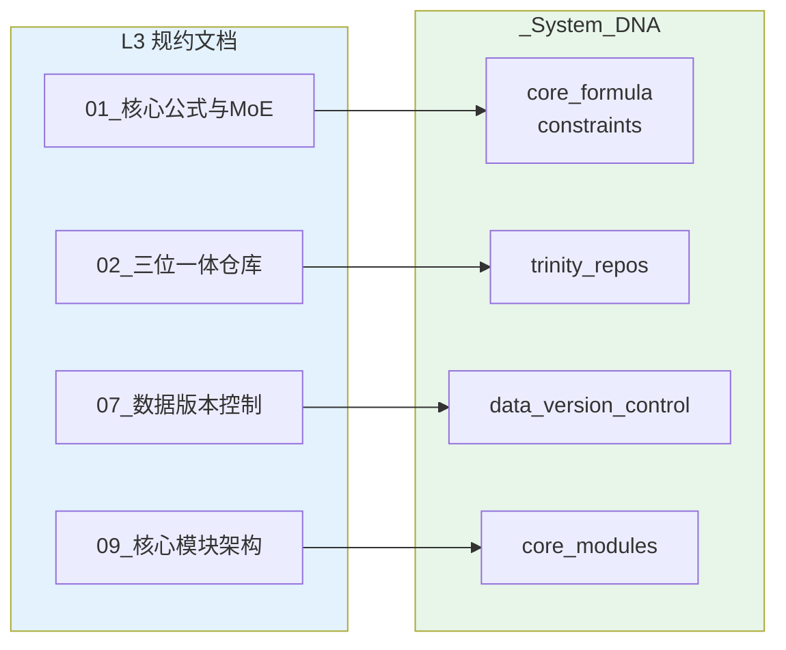

# L3 · 原子目标与规约

> [!NOTE] **[TRACEBACK] 原子规约锚点**
> - **顶层概念**: [一句话定义与核心价值](../01_顶层概念/01_一句话定义与核心价值.md)
> - **战略维度**: [战略维度目录](../02_战略维度/)
> - **本文档**: L3 层级，定义原子能力规约与技术规约

## 规约说明

L3 层级负责定义**原子能力规约、技术规约、架构共识**，为 L4 阶段实践提供明确的约束与标准。本目录下 **开发与交付/**、**产品设计/** 为按轴线划分的子目录，分别存放 01_开发生命周期与实践流程规约、01_需求与产品范围；其余规约位于本目录根下。

**L2 维度与 L3/DNA 对应关系**：见 [06_追溯与审计/00_L2_L3_DNA_映射](../06_追溯与审计/00_L2_L3_DNA_映射.md)，该表为 L2 战略维度 → 主责 L3 规约 → DNA 子树的唯一总表。

## L3 规约与 DNA 映射关系



## L3 文档 ↔ DNA 子树总对照表

> **步骤级执行与验收**以各 Stage 目录下 `dna_stageX_0Y.yaml` 为准（见「步骤级 DNA 与规约级配置约定」）；规约级配置收敛至 `global_const.yaml` 各子树，_共享规约 01_～11_ 对应 `global_const#xxx` 键。所有与实现/测试/验收相关的参数与约束，应收敛到 `_System_DNA/global_const.yaml` 对应子树或步骤级 DNA 中，L4 阶段与后续代码/脚本以步骤级 DNA 及这些键值为准。

下表每行设显式锚点 id（`l3-dna-01`～`l3-dna-13`），供 _共享规约 或其它文档链到本表行，如 `README.md#l3-dna-01`。

| id | L3 规约文档 | 对应 DNA 根节点（`_System_DNA/global_const.yaml`） | 说明 |
|----|-------------|----------------------------------------------------|------|
| <a id="l3-dna-01"></a>l3-dna-01 | `01_核心公式与MoE架构规约.md` | `core_formula`, `constraints` | 核心公式组件与不可能三角（胜率/复利/回撤）相关的全局约束 |
| <a id="l3-dna-02"></a>l3-dna-02 | `02_三位一体仓库规约.md` | `trinity_repos` | Repo-G/I/A 仓库结构、职责边界与基本原则（Schema First、No Secrets 等） |
| <a id="l3-dna-03"></a>l3-dna-03 | `03_架构设计共识与协作元规则.md` | `architecture_consensus` | ADR 强制令、金融级 GitFlow、SemVer for Money、5D 协作规则 |
| <a id="l3-dna-04"></a>l3-dna-04 | `04_全链路通信协议矩阵.md` | `protocols` | Expert/Verdict/Execution/Risk 协议的 Proto 文件路径与关键字段 |
| <a id="l3-dna-05"></a>l3-dna-05 | `05_接口抽象层规约.md` | `abstraction_layer` | BrokerDriver、CognitiveEngine、MarketDataFeed 抽象接口位置与实现清单 |
| <a id="l3-dna-06"></a>l3-dna-06 | `06_动态配置中心规约.md` | `dynamic_config` | 配置分层（L1/L2/L3）、热更新、版本控制与回滚策略 |
| <a id="l3-dna-07"></a>l3-dna-07 | `07_数据版本控制规约.md` | `data_version_control` | DVC 后端、版本粒度、保留策略、时间点查询与回放能力 |
| <a id="l3-dna-08"></a>l3-dna-08 | `11_数据采集与输入层规约.md` | `data_ingestion` | 数据源、采集任务、写入 L1/L2/L3 路径与契约；与 07_、09_ 输入层衔接 |
| <a id="l3-dna-09"></a>l3-dna-09 | `08_心跳协议与健康检查规约.md` | `heartbeat_protocol` | 心跳频率/超时、熔断行为、健康检查端点与监控集成 |
| <a id="l3-dna-10"></a>l3-dna-10 | `09_核心模块架构规约.md` | `core_modules`, `production_requirements` | Module A–F 的输入/输出/规则，以及生产工业级要求（容错、性能、监控、安全、测试、部署、错误处理）。**键名约定**：文档与 L4 中可简写为 `module_a`、`module_b` 等，对应 DNA 键 `core_modules.module_a_semantic_classifier`、`core_modules.module_b_quant_engine` 等（见 global_const.yaml）。 |
| <a id="l3-dna-11"></a>l3-dna-11 | `10_运营治理与灾备规约.md` | `governance_and_dr` | 合规性策略、故障分级、备份/恢复策略、BCP 与 DR 演练、运营监控 |
| <a id="l3-dna-12"></a>l3-dna-12 | `01_开发生命周期与实践流程规约.md` | `_System_DNA/dna_dev_workflow.yaml`（`workflow_stages`, `module_to_stages`） | 从零到可提交的开发生命周期（骨架期、逻辑填充期、Mock 验证、Docker 期、K3s 测试开发期）、与三级流水线衔接、准入准出与过渡时机；L4 执行顺序以 workflow_stages 为准 |
| <a id="l3-dna-13"></a>l3-dna-13 | `01_需求与产品范围.md` | `product_scope` | Phase 划分与阶段目标、功能范围与优先级、与 L1 映射、各 Phase 验收价值 |

> 当新增 L3 文档或扩展现有规约时，必须同步：  
> 1）在 `_System_DNA/global_const.yaml` 中补充相应子树；  
> 2）在上表中登记「文档 ↔ DNA 根节点」映射；  
> 3）在 L4 阶段/步骤文档中引用这些 DNA 键，而非直接写死具体数值。  
> **L2 维度变更时**：先更新该维度的主责 L3 文档，再同步对应 DNA 子树，最后检查 L4 引用；详见 [00_系统规则 四、强制联动规则](../00_系统规则_通用项目协议.md#四强制联动规则) 与 [00_L2_L3_DNA_映射](../06_追溯与审计/00_L2_L3_DNA_映射.md)。

## 步骤级 DNA 与规约级配置约定

- **步骤级 DNA**：`_System_DNA/StageX_*/dna_stageX_0Y.yaml`（如 Stage1_仓库与骨架/dna_stage1_01.yaml、Stage3_模块实践/dna_stage3_01.yaml）为**本步执行与验收**的真相源；每步的 delivery_scope、exit_criteria、work_dir、design_doc、l4_practice_doc、l5_stage_anchor 以该文件为准；dna_dev_workflow 中每步的 `design_doc`、`dna_file` 指向对应设计文档与步骤级 DNA。
- **规约级配置**：`global_const.yaml` 各子树为**跨步/跨阶段引用**，对应 _共享规约/01_～11_ 及 L2 维度；_共享规约 内「对应 DNA」为 `global_const.yaml#xxx` 键；步骤级 DNA 或设计文档可引用其键值，但不替代步骤级 DNA。不设独立 dna_01～dna_11 文件。
- **core_modules**：`_System_DNA/core_modules/dna_module_a.yaml`～`dna_module_f.yaml` 仅被 **Stage3 步骤**引用，承载 Module A～F 的语义（输入/输出/规则）；与步骤级 DNA 的对应关系见下表。

### core_modules 与 Stage3 步骤对应表

| 步骤级 DNA | core_modules 文件 | 说明 |
|------------|-------------------|------|
| dna_stage3_01.yaml | dna_module_a.yaml | Module A 语义分类器 |
| dna_stage3_02.yaml | dna_module_b.yaml | Module B 量化扫描引擎 |
| dna_stage3_03.yaml | dna_module_c.yaml | Module C MoE 议会 |
| dna_stage3_04.yaml | dna_module_d.yaml | Module D 判官 |
| dna_stage3_05.yaml | dna_module_e.yaml | Module E 风控盾 |
| dna_stage3_06.yaml | dna_module_f.yaml | Module F 执行网关 |
| dna_stage3_07.yaml | — | 全链路验证（无 core_modules 对应） |

## 设计–DNA–实践–L5 索引表

下表为 workflow_stages 的 1:1:1 段落级索引：每行 stage_id 对应设计文档（带 #design-*-exit）、DNA 文件、L4 步骤（带 #l4-*-exit，**L4 列为准出锚点**）、L5 锚点，便于从单一入口跳转到具体段落。链接均以本 README 所在目录为基准。

| stage_id | 设计文档 | DNA 文件 | L4 步骤 | L5 锚点 |
|----------|----------|----------|---------|---------|
| stage1_01 | [01_三位一体仓库_设计](Stage1_仓库与骨架/01_三位一体仓库_设计.md#design-stage1-01-exit) | [01_dna_三位一体仓库](_System_DNA/Stage1_仓库与骨架/01_dna_三位一体仓库.yaml) | [01_三位一体仓库_实践](../04_阶段规划与实践/Stage1_仓库与骨架/01_三位一体仓库_实践.md#l4-stage1-01-exit) | [l5-stage-stage1_01](../05_成功标识与验证/02_验收标准.md#l5-stage-stage1_01) |
| stage1_02 | [02_核心接口与Proto_设计](Stage1_仓库与骨架/02_核心接口与Proto_设计.md#design-stage1-02-exit) | [02_dna_核心接口与Proto](_System_DNA/Stage1_仓库与骨架/02_dna_核心接口与Proto.yaml) | [02_核心接口与Proto_实践](../04_阶段规划与实践/Stage1_仓库与骨架/02_核心接口与Proto_实践.md#l4-stage1-02-exit) | [l5-stage-stage1_02](../05_成功标识与验证/02_验收标准.md#l5-stage-stage1_02) |
| stage1_03 | [03_基础设施ECS与K3s_设计](Stage1_仓库与骨架/03_基础设施ECS与K3s_设计.md#design-stage1-03-exit) | [03_dna_基础设施ECS与K3s](_System_DNA/Stage1_仓库与骨架/03_dna_基础设施ECS与K3s.yaml) | [03_基础设施ECS与K3s_实践](../04_阶段规划与实践/Stage1_仓库与骨架/03_基础设施ECS与K3s_实践.md#l4-stage1-03-exit) | [l5-stage-stage1_03](../05_成功标识与验证/02_验收标准.md#l5-stage-stage1_03) |
| stage1_04 | [04_密钥与配置模板_设计](Stage1_仓库与骨架/04_密钥与配置模板_设计.md#design-stage1-04-exit) | [04_dna_密钥与配置模板](_System_DNA/Stage1_仓库与骨架/04_dna_密钥与配置模板.yaml) | [04_密钥与配置模板_实践](../04_阶段规划与实践/Stage1_仓库与骨架/04_密钥与配置模板_实践.md#l4-stage1-04-exit) | [l5-stage-stage1_04](../05_成功标识与验证/02_验收标准.md#l5-stage-stage1_04) |
| stage2_01 | [01_基础设施与依赖_设计](Stage2_数据采集与存储/01_基础设施与依赖_设计.md#design-stage2-01-exit) | [01_dna_基础设施与依赖](_System_DNA/Stage2_数据采集与存储/01_dna_基础设施与依赖.yaml) | [01_基础设施与依赖_实践](../04_阶段规划与实践/Stage2_数据采集与存储/01_基础设施与依赖_实践.md#l4-stage2-01-exit) | [l5-stage-stage2_01](../05_成功标识与验证/02_验收标准.md#l5-stage-stage2_01) |
| stage2_02 | [02_采集逻辑与Dockerfile_设计](Stage2_数据采集与存储/02_采集逻辑与Dockerfile_设计.md#design-stage2-02-exit) | [02_dna_采集逻辑与Dockerfile](_System_DNA/Stage2_数据采集与存储/02_dna_采集逻辑与Dockerfile.yaml) | [02_采集逻辑与Dockerfile_实践](../04_阶段规划与实践/Stage2_数据采集与存储/02_采集逻辑与Dockerfile_实践.md#l4-stage2-02-exit) | [l5-stage-stage2_02](../05_成功标识与验证/02_验收标准.md#l5-stage-stage2_02) |
| stage2_03 | [03_本地测试与K3s连调_设计](Stage2_数据采集与存储/03_本地测试与K3s连调_设计.md#design-stage2-03-exit) | [03_dna_本地测试与K3s连调](_System_DNA/Stage2_数据采集与存储/03_dna_本地测试与K3s连调.yaml) | [03_本地测试与K3s连调_实践](../04_阶段规划与实践/Stage2_数据采集与存储/03_本地测试与K3s连调_实践.md#l4-stage2-03-exit) | [l5-stage-stage2_03](../05_成功标识与验证/02_验收标准.md#l5-stage-stage2_03) |
| stage2_04 | [04_镜像打包与ACR推送_设计](Stage2_数据采集与存储/04_镜像打包与ACR推送_设计.md#design-stage2-04-exit) | [04_dna_镜像打包与ACR推送](_System_DNA/Stage2_数据采集与存储/04_dna_镜像打包与ACR推送.yaml) | [04_镜像打包与ACR推送_实践](../04_阶段规划与实践/Stage2_数据采集与存储/04_镜像打包与ACR推送_实践.md#l4-stage2-04-exit) | [l5-stage-stage2_04](../05_成功标识与验证/02_验收标准.md#l5-stage-stage2_04) |
| stage2_05 | [05_采集模块部署与验收_设计](Stage2_数据采集与存储/05_采集模块部署与验收_设计.md#design-stage2-05-exit) | [05_dna_采集模块部署与验收](_System_DNA/Stage2_数据采集与存储/05_dna_采集模块部署与验收.yaml) | [05_采集模块部署与验收_实践](../04_阶段规划与实践/Stage2_数据采集与存储/05_采集模块部署与验收_实践.md#l4-stage2-05-exit) | [l5-stage-stage2_05](../05_成功标识与验证/02_验收标准.md#l5-stage-stage2_05) |
| stage3_01 | [01_语义分类器_设计](Stage3_模块实践/01_语义分类器_设计.md#design-stage3-01-exit) | [01_dna_语义分类器](_System_DNA/Stage3_模块实践/01_dna_语义分类器.yaml) | [01_语义分类器_实践](../04_阶段规划与实践/Stage3_模块实践/01_语义分类器_实践.md#l4-stage3-01-exit) | [l5-stage-stage3_01](../05_成功标识与验证/02_验收标准.md#l5-stage-stage3_01) |
| stage3_02 | [02_量化扫描引擎_设计](Stage3_模块实践/02_量化扫描引擎_设计.md#design-stage3-02-exit) | [02_dna_量化扫描引擎](_System_DNA/Stage3_模块实践/02_dna_量化扫描引擎.yaml) | [02_量化扫描引擎_实践](../04_阶段规划与实践/Stage3_模块实践/02_量化扫描引擎_实践.md#l4-stage3-02-exit) | [l5-stage-stage3_02](../05_成功标识与验证/02_验收标准.md#l5-stage-stage3_02) |
| stage3_03 | [03_MoE议会_设计](Stage3_模块实践/03_MoE议会_设计.md#design-stage3-03-exit) | [03_dna_MoE议会](_System_DNA/Stage3_模块实践/03_dna_MoE议会.yaml) | [03_MoE议会_实践](../04_阶段规划与实践/Stage3_模块实践/03_MoE议会_实践.md#l4-stage3-03-exit) | [l5-stage-stage3_03](../05_成功标识与验证/02_验收标准.md#l5-stage-stage3_03) |
| stage3_04 | [04_热路径判官风控与执行_设计](Stage3_模块实践/04_热路径判官风控与执行_设计.md#design-stage3-04-exit) | [04_dna_热路径判官风控与执行](_System_DNA/Stage3_模块实践/04_dna_热路径判官风控与执行.yaml) | [04_热路径判官风控与执行_实践](../04_阶段规划与实践/Stage3_模块实践/04_热路径判官风控与执行_实践.md#l4-stage3-04-exit) | [l5-stage-stage3_04](../05_成功标识与验证/02_验收标准.md#l5-stage-stage3_04) |
| stage3_05 | [05_全链路验证_设计](Stage3_模块实践/05_全链路验证_设计.md#design-stage3-05-exit) | [05_dna_全链路验证](_System_DNA/Stage3_模块实践/05_dna_全链路验证.yaml) | [05_全链路验证_实践](../04_阶段规划与实践/Stage3_模块实践/05_全链路验证_实践.md#l4-stage3-05-exit) | [l5-stage-stage3_05](../05_成功标识与验证/02_验收标准.md#l5-stage-stage3_05) |
| stage4_01 | [01_ModuleC_MoE议会接入_设计](Stage4_MoE与执行网关/01_ModuleC_MoE议会接入_设计.md#design-stage4-01-exit) | [01_dna_ModuleC_MoE议会接入](_System_DNA/Stage4_MoE与执行网关/01_dna_ModuleC_MoE议会接入.yaml) | [01_ModuleC_MoE议会接入_实践](../04_阶段规划与实践/Stage4_MoE与执行网关/01_ModuleC_MoE议会接入_实践.md#l4-stage4-01-exit) | [l5-stage-stage4_01](../05_成功标识与验证/02_验收标准.md#l5-stage-stage4_01) |
| stage4_02 | [02_ModuleF执行网关接入_设计](Stage4_MoE与执行网关/02_ModuleF执行网关接入_设计.md#design-stage4-02-exit) | [02_dna_ModuleF执行网关接入](_System_DNA/Stage4_MoE与执行网关/02_dna_ModuleF执行网关接入.yaml) | [02_ModuleF执行网关接入_实践](../04_阶段规划与实践/Stage4_MoE与执行网关/02_ModuleF执行网关接入_实践.md#l4-stage4-02-exit) | [l5-stage-stage4_02](../05_成功标识与验证/02_验收标准.md#l5-stage-stage4_02) |
| stage4_03 | [03_回测或仿真验证_设计](Stage4_MoE与执行网关/03_回测或仿真验证_设计.md#design-stage4-03-exit) | [03_dna_回测或仿真验证](_System_DNA/Stage4_MoE与执行网关/03_dna_回测或仿真验证.yaml) | [03_回测或仿真验证_实践](../04_阶段规划与实践/Stage4_MoE与执行网关/03_回测或仿真验证_实践.md#l4-stage4-03-exit) | [l5-stage-stage4_03](../05_成功标识与验证/02_验收标准.md#l5-stage-stage4_03) |
| stage5_01 | [01_可观测性与日志指标_设计](Stage5_优化与扩展/01_可观测性与日志指标_设计.md#design-stage5-01-exit) | [01_dna_可观测性与日志指标](_System_DNA/Stage5_优化与扩展/01_dna_可观测性与日志指标.yaml) | [01_可观测性与日志指标_实践](../04_阶段规划与实践/Stage5_优化与扩展/01_可观测性与日志指标_实践.md#l4-stage5-01-exit) | [l5-stage-stage5_01](../05_成功标识与验证/02_验收标准.md#l5-stage-stage5_01) |
| stage5_02 | [02_成本治理与Token熔断_设计](Stage5_优化与扩展/02_成本治理与Token熔断_设计.md#design-stage5-02-exit) | [02_dna_成本治理与Token熔断](_System_DNA/Stage5_优化与扩展/02_dna_成本治理与Token熔断.yaml) | [02_成本治理与Token熔断_实践](../04_阶段规划与实践/Stage5_优化与扩展/02_成本治理与Token熔断_实践.md#l4-stage5-02-exit) | [l5-stage-stage5_02](../05_成功标识与验证/02_验收标准.md#l5-stage-stage5_02) |
| stage5_03 | [03_多策略池或配置扩展_设计](Stage5_优化与扩展/03_多策略池或配置扩展_设计.md#design-stage5-03-exit) | [03_dna_多策略池或配置扩展](_System_DNA/Stage5_优化与扩展/03_dna_多策略池或配置扩展.yaml) | [03_多策略池或配置扩展_实践](../04_阶段规划与实践/Stage5_优化与扩展/03_多策略池或配置扩展_实践.md#l4-stage5-03-exit) | [l5-stage-stage5_03](../05_成功标识与验证/02_验收标准.md#l5-stage-stage5_03) |
| stage5_04 | [04_Level1与L5验收对齐_设计](Stage5_优化与扩展/04_Level1与L5验收对齐_设计.md#design-stage5-04-exit) | [04_dna_Level1与L5验收对齐](_System_DNA/Stage5_优化与扩展/04_dna_Level1与L5验收对齐.yaml) | [04_Level1与L5验收对齐_实践](../04_阶段规划与实践/Stage5_优化与扩展/04_Level1与L5验收对齐_实践.md#l4-stage5-04-exit) | [l5-stage-stage5_04](../05_成功标识与验证/02_验收标准.md#l5-stage-stage5_04) |

## 目录结构

```
03_原子目标与规约/
├── _System_DNA/                          # YAML 配置区（机器可读）
│   ├── global_const.yaml                  # 全局常量
│   ├── dna_dev_workflow.yaml               # 工作流阶段与可部署单元（执行顺序、design_doc、dna_file）
│   ├── Stage1_仓库与骨架/                  # 步骤级 DNA（01_dna_三位一体仓库～04_dna_密钥与配置模板）
│   ├── Stage2_数据采集与存储/              # 步骤级 DNA（01_dna_基础设施与依赖～05_dna_采集模块部署与验收）
│   ├── Stage3_模块实践/                    # 步骤级 DNA（01_dna_语义分类器～05_dna_全链路验证）
│   ├── Stage4_MoE与执行网关/               # 步骤级 DNA（01_dna_ModuleC_MoE议会接入～03_dna_回测或仿真验证）
│   ├── Stage5_优化与扩展/                  # 步骤级 DNA（01_dna_可观测性与日志指标～04_dna_Level1与L5验收对齐）
│   └── core_modules/                       # Module A～F 语义（被 Stage3 步骤引用；dna_module_a～f）
├── _共享规约/                             # 跨轴线共享的规约文档（01～11 连续序号）
│   ├── 01_核心公式与MoE架构规约.md
│   ├── 02_三位一体仓库规约.md
│   ├── 03_架构设计共识与协作元规则.md
│   ├── 04_全链路通信协议矩阵.md
│   ├── 05_接口抽象层规约.md
│   ├── 06_动态配置中心规约.md
│   ├── 07_数据版本控制规约.md
│   ├── 08_心跳协议与健康检查规约.md
│   ├── 09_核心模块架构规约.md
│   ├── 10_运营治理与灾备规约.md
│   └── 11_数据采集与输入层规约.md
├── 开发与交付/
│   ├── 01_开发生命周期与实践流程规约.md
│   ├── 02_基础设施与部署规约.md
│   └── 03_项目全功能开发测试实践工作流详细规划.md
├── 产品设计/
│   └── 01_需求与产品范围.md
├── Stage1_仓库与骨架/ ～ Stage5_优化与扩展/
└── _Design_Artifacts/                    # Proto 等设计产物
```

## 规约文档索引

### 1. 核心公式与 MoE 架构规约
- **文件**: [_共享规约/01_核心公式与MoE架构规约.md](./_共享规约/01_核心公式与MoE架构规约.md)
- **内容**: 核心公式 `Alpha = (Quant_Signal ∩ Router(Experts)) × Kelly_Position` 的组件定义、MoE 架构层次、专家选择规则、一票否决机制

### 2. 三位一体仓库规约
- **文件**: [_共享规约/02_三位一体仓库规约.md](./_共享规约/02_三位一体仓库规约.md)
- **内容**: 设计产物与 ADR（方案 A 无独立 diting-design，见 02 规约）、Repo-I (diting-core)、Repo-A (diting-infra) 的物理结构、职责边界、架构共识（Schema First、Single Source of Truth、Interface Separation、No Secrets、Dockerfile/Makefile、deploy-engine 调用）

### 3. 架构设计共识与协作元规则
- **文件**: [_共享规约/03_架构设计共识与协作元规则.md](./_共享规约/03_架构设计共识与协作元规则.md)
- **内容**: ADR 强制令（无文档不编码）、金融级 GitFlow（三级流水线：Unit Test → Paper Trading → Live Trading）、版本控制铁律（SemVer for Money）、5D 协作闭环（Human-AI Protocol）

### 4. 全链路通信协议矩阵
- **文件**: [_共享规约/04_全链路通信协议矩阵.md](./_共享规约/04_全链路通信协议矩阵.md)
- **内容**: Expert Protocol（专家辩论协议）、Verdict Protocol（判官裁决协议）、Execution Protocol（执行指令协议）、Risk Protocol（风控遥测协议）

### 5. 接口抽象层规约
- **文件**: [_共享规约/05_接口抽象层规约.md](./_共享规约/05_接口抽象层规约.md)
- **内容**: BrokerDriver（交易执行抽象）、CognitiveEngine（大脑认知抽象）、MarketDataFeed（数据源抽象）的接口定义与实现示例

### 6. 动态配置中心规约
- **文件**: [_共享规约/06_动态配置中心规约.md](./_共享规约/06_动态配置中心规约.md)
- **内容**: 动态配置中心架构（etcd/Consul + Redis 缓存）、配置热更新机制、配置版本控制与回滚、配置变更审批流程，解决"配置僵化"问题

### 7. 数据版本控制规约
- **文件**: [_共享规约/07_数据版本控制规约.md](./_共享规约/07_数据版本控制规约.md)
- **内容**: 数据版本化策略（DVC 集成）、决策快照规约、时间点查询接口、数据版本元数据管理，解决"数据不可回溯"问题

### 8. 心跳协议与健康检查规约
- **文件**: [_共享规约/08_心跳协议与健康检查规约.md](./_共享规约/08_心跳协议与健康检查规约.md)
- **内容**: 心跳协议定义（Protocol Buffers）、心跳监控器实现、熔断器实现、健康检查端点、监控与告警，解决"僵尸进程风险"问题

### 9. 核心模块架构规约
- **文件**: [_共享规约/09_核心模块架构规约.md](./_共享规约/09_核心模块架构规约.md)
- **内容**: Module A（语义分类器）、Module B（量化扫描引擎）、Module C（MoE 议会）、Module D（判官）、Module E（风控盾）、Module F（执行网关）的详细架构规约

### 10. 运营治理与灾备规约
- **文件**: [_共享规约/10_运营治理与灾备规约.md](./_共享规约/10_运营治理与灾备规约.md)
- **内容**: 合规性策略（交易通道合规、程序化交易报备、交易行为红线）、灾难恢复（L1-L5 故障分级、优雅关闭流程、异地恢复、数据备份策略、业务连续性计划、灾备演练）

### 11. 数据采集与输入层规约
- **文件**: [_共享规约/11_数据采集与输入层规约.md](./_共享规约/11_数据采集与输入层规约.md)
- **内容**: 数据源（行情、新闻、行业、财报）、采集任务与调度、写入 L1/L2/L3 路径与契约；与 07_、09_ 输入层衔接；为 Module A-F 真实数据验证提供前提

### 12. 开发生命周期与实践流程规约
- **文件**: [01_开发生命周期与实践流程规约.md](./开发与交付/01_开发生命周期与实践流程规约.md)
- **内容**: 从零到可提交的开发生命周期（骨架期、逻辑填充期、Docker 期、K3s 测试开发期）、与三级流水线衔接、准入准出与过渡时机

### 13. 需求与产品范围规约
- **文件**: [01_需求与产品范围.md](./产品设计/01_需求与产品范围.md)
- **内容**: Phase 划分与阶段目标、功能范围与优先级（与 09 核心模块对应）、与 L1 不可能三角的映射、各 Phase 验收价值标准；与 01 规约配合（产品定范围，交付定流程）

## 规约类型

### 1. 能力规约

定义每个原子能力（如：MoE 专家路由、动态凯利计算、风控拦截）的：
- 输入/输出接口（Protocol Buffers）
- 业务规则（YAML 配置）
- 异常处理（边界条件）
- 性能要求（超时、吞吐量）

### 2. 技术规约

定义技术选型与约束：
- 技术栈（Python 3.11+、DeepSeek-R1、Backtrader、K3s）
- 架构模式（Neuro-Symbolic MoE、依赖倒置、接口抽象）
- 数据模型（TimescaleDB、PostgreSQL、pgvector）
- 接口协议（Protocol Buffers、gRPC）

### 3. 架构共识

定义跨模块的共识：
- 仓库结构（三位一体：Repo-G/I/A）
- 协作流程（ADR、GitFlow、SemVer）
- 接口抽象（BrokerDriver、CognitiveEngine、MarketDataFeed）
- 协议矩阵（Expert/Verdict/Order/Risk Protocol）

## 下一步

→ 参见 [04_阶段规划与实践/](../04_阶段规划与实践/) 目录下的阶段实践文档
