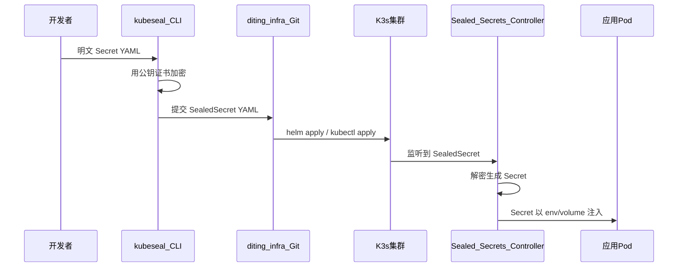

# L3 · Stage1-04 密钥与配置模板设计

> [!NOTE] **[TRACEBACK] 原子规约锚点**
> - **战略维度**: [安全与机密治理维度](../../02_战略维度/产品设计/05_安全与机密治理维度.md)、[开发与交付流程维度](../../02_战略维度/开发与交付/01_开发与交付流程维度.md)
> - **原子规约**: [_共享规约/02_三位一体仓库规约](../_共享规约/02_三位一体仓库规约.md)、[开发与交付/02_基础设施与部署规约](../开发与交付/02_基础设施与部署规约.md)
> - **DNA**: [_System_DNA/Stage1_仓库与骨架/dna_stage1_04.yaml](../_System_DNA/Stage1_仓库与骨架/dna_stage1_04.yaml)
> - **L4 实践**: [04_阶段规划与实践/Stage1_仓库与骨架/04_密钥与配置模板就绪](../../04_阶段规划与实践/Stage1_仓库与骨架/04_密钥与配置模板就绪.md#l4-stage1-04-exit)
> - **L5 锚点**: [02_验收标准#l5-stage-stage1_04](../../05_成功标识与验证/02_验收标准.md#l5-stage-stage1_04)

## 本步目标

密钥与配置模板就绪；引入 Sealed-Secrets；diting-infra secrets/ 含模板与说明；.env.template 双仓占位（不含真实 Key）；config 为单一 YAML 模板可用。

## 设计要点

- **Sealed-Secrets**：diting-infra 使用官方最新稳定版 Chart，**须下载到本地存放**于约定路径（如 `charts/dependencies/sealed-secrets`），**不引用远程 Helm 仓库**；secrets/ 使用 Sealed-Secrets 加密 YAML 或 Helm 引用；明文不进入 Git。**L1/L2/L3 验证均在 Stage1-04 内完成**（03 步已产出 K3s，04 步部署控制器并完成端到端验证）。
- **config**：符合 deploy-engine DeploymentConfig；**单一 YAML**（如 `config/environments/dev/deploy.yaml`）为真相源。
- **密钥来源**：见 02_三位一体、02_基础设施与部署规约；sealing key 由集群管理员管理。
- **.env.template**：diting-core 与 diting-infra 均放置；应用相关以 diting-core 为权威，diting-infra 可多出 infra 专用项。

### 版本固定

- **Sealed-Secrets Chart**：使用 Bitnami 或官方 Helm Chart，**须下载到本地**存放于 `charts/dependencies/sealed-secrets/`，**不引用远程库**（部署与 helm template 均使用本地路径）；版本在 `Chart.yaml` 或 `Chart.lock` 中显式固定（如 `version: 2.x.x`）；DNA 可引用该版本用于 L4/L5 校验。
- **kubeseal CLI**：本地加密验证使用的 kubeseal 版本须与 Chart 内控制器版本兼容；在 secrets/README 或 dna_stage1_04 中写明推荐版本（如 v0.24.x），确保「加密 → 部署 → 控制器解密」可复现。
- **真相源**：版本真相源为 diting-infra 的 Chart 定义或 requirements.lock；DNA 引用该来源，保持单一真相源。

### 公钥固定与存放（方案 A：进 Git）

- **公钥唯一来源**：加密使用的 Sealed-Secrets 公钥（证书）由**单一真相源**提供；存放位置为 diting-infra 的 `secrets/certs/sealed-secrets-public.pem`（或按环境：`sealed-secrets-public-dev.pem`、`sealed-secrets-public-prod.pem`）。
- **路径与目录约定**：diting-infra 下 `secrets/certs/` 为公钥专用目录；公钥文件命名：`sealed-secrets-public.pem`（单环境）或 `sealed-secrets-public-<env>.pem`（多环境，如 dev/prod）；该路径为设计规定的真相源。
- **仅公钥入仓**：仅公钥/证书可进入 Git；**私钥（sealing key）禁止进入任何 Git 仓库**。
- **轮换**：轮换时更新对应 `.pem` 文件并提交；在 secrets/README 或 DNA 中注明生效环境/集群及更新时间。
- **一集群一证书**：一集群一 sealing key → 一证书；多环境（dev/prod）使用不同证书时，文件名按环境区分。

### 加密流程与案例实践

**加密全流程**（明文 Secret → kubeseal → SealedSecret → Git → 集群解密 → Pod 挂载）：

**典型用例**：

| 用例 | 场景 | 步骤摘要 |
|------|------|----------|
| **用例 A：数据源 API Key** | 采集（Stage2）依赖 AkShare/OpenBB API Key | 1) 创建 Secret YAML；2) `kubeseal --cert=secrets/certs/xxx.pem` 生成 SealedSecret；3) 放入 secrets/ 并按约定命名；4) Chart/values 中引用；5) 部署后在 Pod 中检查 env |
| **用例 B：Module F Broker 凭证** | 实盘需 CTP/券商 API 密钥 | 同上流程，Secret 命名与挂载路径与 09_核心模块、04_全链路协议矩阵一致 |

**实践文档（1:1:1 落地）**：实践文档正文以文档仓 [04_阶段规划与实践/Stage1_仓库与骨架/附件_secrets_加密流程与案例.md](../../04_阶段规划与实践/Stage1_仓库与骨架/附件_secrets_加密流程与案例.md) 为模板；**实施时须将该附件内容同步至 diting-infra 的 `secrets/README.md` 或 `secrets/01_加密流程与案例.md`**。DNA 与 L4 须引用本设计及该附件路径。

### 部署验证要求

分级验证（与 L4 验证表、DNA verification_commands 对应）：

| 级别 | 环境 | 验证项 | 命令/步骤 | 预期结果 |
|------|------|--------|-----------|----------|
| **L1 本地** | 无集群 | Chart 模板生效 | `helm template <release> charts/.../sealed-secrets -f values.yaml` | 渲染结果含 replicaCount、namespace 等关键 values |
| **L1 本地** | 无集群 | deploy-engine 解析 | `deploy-engine -config=config/environments/dev/deploy.yaml -dry-run`（或等价） | 退出码 0 |
| **L2 集群内** | K3s 已就绪 | Sealed-Secrets 控制器 | `kubectl get pods -n kube-system -l app.kubernetes.io/name=sealed-secrets` | Pod Running |
| **L2 集群内** | K3s 已就绪 | 解密与 Secret 创建 | 部署示例 SealedSecret → `kubectl get secret <name>` | Secret 存在且 data 非空 |
| **L3 端到端** | 04 步内 | 应用读取密钥 | 04 步部署示例 SealedSecret + 测试 Pod 挂载该 Secret，Pod 内检查环境变量（如 `kubectl exec <pod> -- env`） | 可读取且不为占位符 |

**验证顺序**：**L1、L2、L3 均在 Stage1-04 内完成**。03 步已部署并验证 ECS/K3s，04 步在同一集群内：完成 L1 本地验证；部署 Sealed-Secrets 控制器并部署示例 SealedSecret（L2）；部署一测试 Pod 挂载该 Secret 并验证 Pod 内可读取（L3）。不拖到 Stage2。

**L1 可执行验证**：可从文档仓执行 [scripts/verify_stage1_04.sh](../../scripts/verify_stage1_04.sh)（`INFRA_DIR=/path/to/diting-infra ./scripts/verify_stage1_04.sh`）或按 L4 验证表逐项执行；L4 实践文档须引用本脚本并可在 04 步落地。

### 组件引用契约

**Secret 引用约定**（与 02_基础设施与部署规约、09_核心模块一致）：

| 组件 | 引用方式 | 约定 |
|------|----------|------|
| **采集镜像（Stage2）** | envFrom / env 引用 Secret | Secret 命名如 `diting-akshare-secrets`；Key 与 .env.template 占位符对应 |
| **Module B / Module F** | 同上 | 券商/Broker 凭证 Secret 命名与 core_modules 约定一致 |
| **deploy-engine** | 通过 values 传递 secretRef | values 中 secretRef.name、secretRef.keys 与 secrets/ 中 SealedSecret 对应 |

**Secret 引用契约表**（单一真相源，与 02_基础设施、09_核心模块一致）：

| Secret 名 | Key（示例） | namespace | 引用组件 | 用途 |
|-----------|-------------|-----------|----------|------|
| diting-akshare-secrets | API_KEY 等 | default 或约定 | 采集（Stage2） | AkShare/OpenBB API Key |
| diting-broker-secrets | 见 core_modules.module_f | default 或约定 | Module F | CTP/券商 API 密钥 |

**验收要点**：任一引用加密 Secret 的组件，其 L4 步骤须包含引用路径（Secret 名、Key、挂载方式）、可执行验证命令（如 `kubectl exec <pod> -- env` 检查）、预期行为（能读到非空、非占位符值）。**.env.template 与 Secret 映射**：.env.template 占位符与 K8s Secret 的 data key 须显式对应（如 `API_KEY` ↔ Secret.data.api_key）；在 .env.template 注释或本规约中维护映射表，避免各组件自行解释。

### 边界与负面验证

- **负面用例**：验证时须覆盖以下场景的预期行为（失败且报错明确）：证书与当前集群不匹配、跨 namespace 解密、SealedSecret 命名与现有 Secret 冲突。
- **Secret 大小与结构**：Sealed-Secrets 对加密后大小与字段数有限制；典型 AkShare/Broker 凭证保持少量 Key，避免超大 Secret；若需大对象，在 L3 或 DNA 中注明限制值。

### 灾备与轮换约定

- **Sealing key 备份/恢复**：由集群管理员在安全环境中备份 sealing key；恢复集群时需用备份 key 恢复 Sealed-Secrets 控制器。具体流程见 [02_基础设施与部署规约](../开发与交付/02_基础设施与部署规约.md) §六、[10_运营治理与灾备规约](../_共享规约/10_运营治理与灾备规约.md) 灾备演练。
- **密钥轮换**：轮换时采用多 key 支持流程（新 key → 重加密现有 SealedSecret → 验证 → 弃用旧 key）；Runbook 链接在 secrets/README 或运维手册中维护。
- **多集群 key 隔离**：dev/prod 不同集群使用不同 sealing key；公钥按环境分别存放（如 sealed-secrets-public-dev.pem / sealed-secrets-public-prod.pem）。

**合规与审计衔接**：与 [05_安全与机密治理维度](../../02_战略维度/产品设计/05_安全与机密治理维度.md)、[10_运营治理与灾备规约](../_共享规约/10_运营治理与灾备规约.md) 一致。「密钥零泄露」可验证项：明文 Secret 不入 Git（CI/人工检查）、日志与指标不含明文密钥；L5 验收可追溯。密钥轮换与备份/恢复 Runbook 与 10_ 灾备演练、移交运维检查项衔接。

## 准出

实践文档已同步至 diting-infra secrets/；secrets/ 含 Sealed-Secrets 模板或说明；.env.template 双仓占位；config 单一 YAML 模板可用；**L1/L2/L3 验证均在 04 步内完成**；Chart 模板参数、deploy-engine 符合性、Git 引用 deploy-engine 三项验证通过。

---

## 一致性检查表（§7.5）

- [ ] 01_～06_ 目录层级正确
- [ ] 关键文档含 [TRACEBACK] 追溯锚点
- [ ] 战略追溯矩阵已更新且无断链
- [ ] 架构图使用 Mermaid，可追溯至规约
- [ ] 层级边界清晰，无错层堆放
- [ ] 架构图已按 §7.4 选定一种可视化风格且全文一致
- [ ] 英文简写与技术名词已按 §十三查表、首次附中文或释义
- [ ] 04_密钥与配置模板设计 与 02_基础设施与部署规约 §六、05_安全与机密治理维度、10_运营治理与灾备规约 一致
- [ ] 公钥方案 A（进 Git）、路径 secrets/certs/ 已在 L3、L4、DNA、02_ 中一致约定
- [ ] L4 验证表与 DNA verification_commands、部署验证要求分级表一致；L1/L2/L3 均在 04 步内完成；附件与验证脚本在 03_、DNA、04_ 中 1:1:1 引用且 L4 可落地
