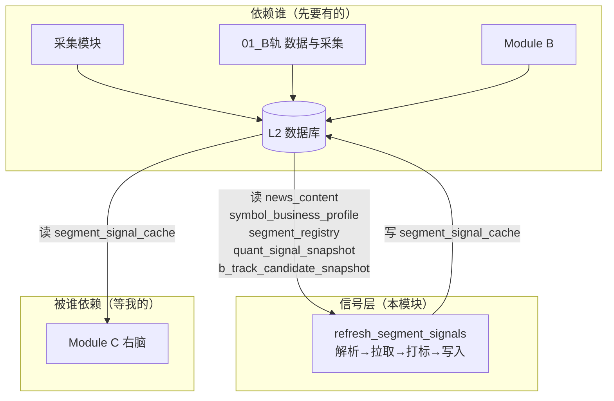
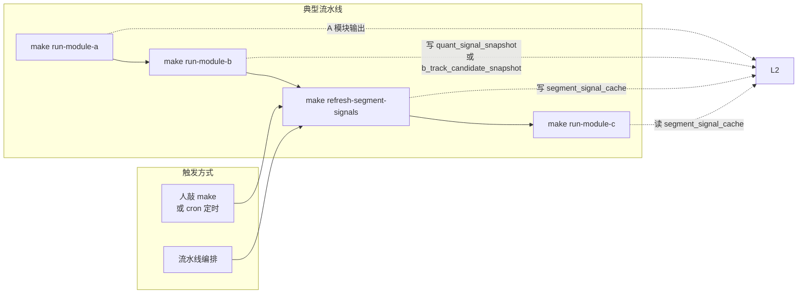
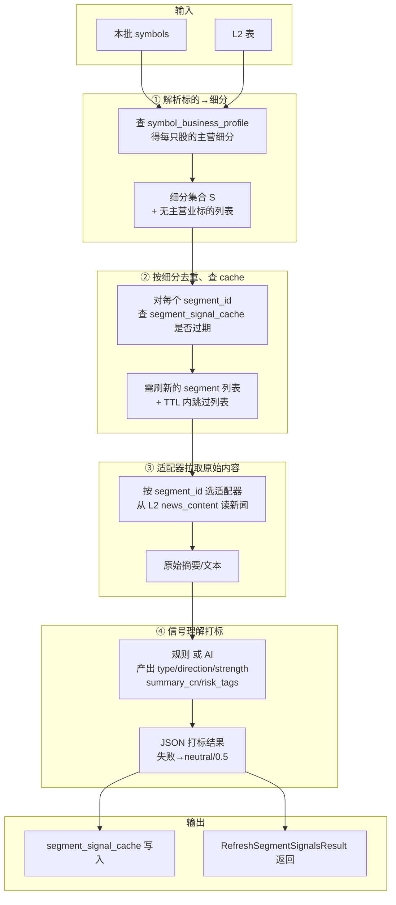
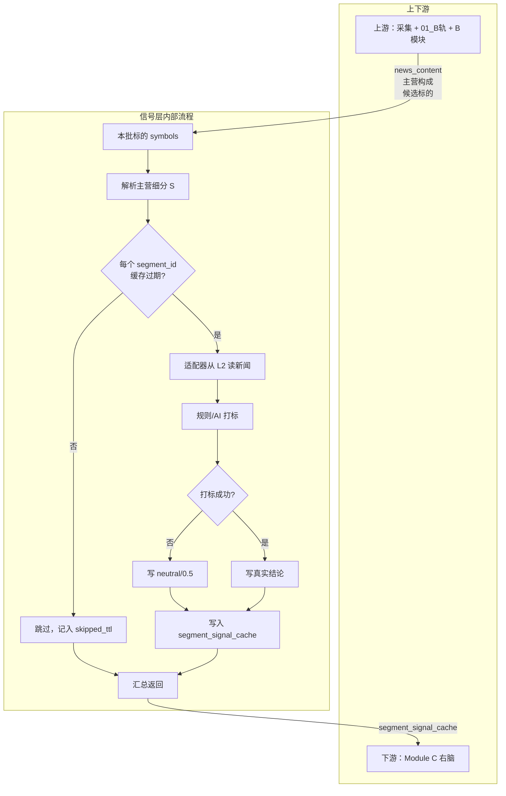

# Stage2-06_B轨 信号层 1:1:1 文档索引

> 设计 ↔ 实践 ↔ DNA 三件套一一对应；L5 验收锚点 `l5-stage-stage2_06_b`  
> 通俗版：信号层负责「把股票所属的行业/板块新闻，打成利好/利空标签，供右脑专家推理用」。

---

## 一、依赖与被依赖、触发与被触发（一句话版）

| 关系 | 通俗说法 | 具体对象 |
|------|----------|----------|
| **依赖谁** | 我要先有这些数据才能干活 | 采集（L2 news_content）、01_B轨（主营构成表、细分注册表）、B 模块（候选标的表） |
| **被谁依赖** | 谁在等我干完活才能继续 | Module C 右脑（推理时要读细分信号） |
| **被谁触发** | 谁叫我开始干活 | 见下「被谁触发：逻辑层 vs 部署层」 |
| **触发谁** | 我干完后谁接着干 | Module C（`make run-module-c` 读我写好的 segment_signal_cache） |

### 被谁触发：逻辑层 vs 部署层（必读）

#### 逻辑层：工作流与代码设计上如何被调用

**结论**：信号层**不被任何模块或脚本自动调用**；它是**独立可执行步骤**，设计上由编排在 B→C 之间**显式插入**。

| 层级 | 说明 |
|------|------|
| **调用形式** | 核心接口 `refresh_segment_signals_for_symbols(symbols, dsn, options)` 在 `diting.signal_layer` 中定义，可被 import 调用；但**当前 diting-core 内没有任何模块 import 并调用它**。 |
| **唯一调用方** | `scripts/run_refresh_segment_signals.py` —— 独立进程入口，由 `make refresh-segment-signals` 启动；该脚本内部 import `refresh_segment_signals_for_symbols` 并执行。 |
| **Module A/B/C 是否调用** | **否**。`run_module_a_local.py`、`run_module_b_local.py`、`run_module_c_local.py` 均**不**调用信号层；C 只**读** segment_signal_cache，不触发刷新。 |
| **run_daily_scan 是否包含** | **否**。`run_daily_scan.py` 编排 A→B→（可选）C，**不包含** refresh 步骤。 |
| **run_full_pipeline 是否包含** | **是**。`run_full_pipeline.py` 编排 A→B→**refresh**→C，**推荐**用于完整链路；由 `make run-full-pipeline` 启动。 |
| **设计约定** | 信号层在**工作流顺序**上处于 B 写表之后、C 读 cache 之前；由**编排层**（run_full_pipeline、人、cron、流水线定义）显式插入。 |

**通俗说**：逻辑上信号层是「流水线里的独立一步」，没有模块会主动喊它干活；需要人、定时任务或流水线配置**显式执行**这一步。

#### 部署层：实际如何被触发

| 触发方式 | 说明 | 现状 |
|----------|------|------|
| **make run-full-pipeline** | **推荐**。一次命令执行 A→B→refresh→C，C 可拿到预期数据 | 已实现 |
| **人敲 make（单步）** | `make refresh-segment-signals`，本地/SSH 执行 | 已实现 |
| **cron 定时** | 系统 crontab 或 K8s CronJob 定时执行 `make run-full-pipeline` 或单步 make | 需部署方自行配置；diting-infra 无现成 CronJob |
| **流水线 Job 步骤** | 编排工具中插入 `make run-full-pipeline` 或 B→refresh→C 三步 | 可基于 diting-core 镜像；需部署方自配 |

**通俗说**：部署层上，目前只有「人执行 make」是开箱即用的；生产环境要自动化，需自行加 cron、Job 或流水线步骤。

### 最佳工作流设计（推荐）

为避免每次手动执行 refresh，提供**全系统全链路**命令：B 完成 → 信号层 refresh → C 工作，一次命令完成运行/测试。

| 入口 | 说明 |
|------|------|
| **make run-full-pipeline** | **推荐**。全系统全链路：顺序执行 A → B → 信号层 refresh → C；一次命令完成运行/测试。 |
| 环境变量 | `RUN_MODULE_A=1`、`RUN_REFRESH_AFTER_B=1`（默认）、`RUN_MODULE_C=1`；`DITING_TRACK=a|b` |
| 单步执行 | 仍可用 `make run-module-a` → `make run-module-b` → `make refresh-segment-signals` → `make run-module-c` |

**设计决策**：采用**流水线脚本串联**（方案 B），而非 B 模块直接 import 调用信号层，以保持 B/信号层/C 职责解耦、refresh 失败可单独重试、流水线步骤可配置开关。

---

## 二、依赖关系图（谁依赖谁）

**通俗解释**：
- 采集把新闻、行业数据写入 L2；
- 01_B轨 把「股票→主营细分」映射写入 L2；
- B 模块把「本批要关注的股票」写入 snapshot 表；
- 信号层从 L2 读出这些，打成利好/利空标签，再写回 segment_signal_cache；
- C 模块右脑从 cache 读细分信号，做专家推理。

---

## 三、触发与流程顺序（谁触发谁、典型流水线）

**推荐**：`make run-full-pipeline` 一次执行 A→B→refresh→C。下图是设计约定的顺序；单步执行时需显式插入步骤 3。

**通俗解释**：信号层在 B 和 C 之间——B 写出「本批关注股票」，信号层把这些股票涉及的行业新闻打成标签，C 再读这些标签做推理。**关键**：步骤 3 必须由编排显式执行，A/B/C 模块不会自动触发它。

---

## 四、输入 / 中间处理 / 输出（数据流）

### 4.1 输入什么

| 输入来源 | 通俗说明 | 表或接口 |
|----------|----------|----------|
| **本批标的列表** | 要处理哪些股票 | 从 quant_signal_snapshot（A 轨）或 b_track_candidate_snapshot（B 轨）读出，或人传入 |
| **标的→主营细分** | 每只股票属于哪些行业/板块 | symbol_business_profile |
| **细分注册信息** | 细分怎么拉数据、用哪个适配器 | segment_registry、signal_adapter_registry |
| **原始新闻** | 行业/股票相关新闻正文 | L2 news_content（采集已写入，**不调 AkShare**） |
| **环境与配置** | 连哪个库、用哪轨、全量还是本批 | PG_L2_DSN、DITING_TRACK、REFRESH_SEGMENT_SCOPE |

### 4.2 中间对谁做什么处理、输出什么（核心逻辑）

**通俗解释**：
1. 根据股票查「主营哪些行业」→ 得到要处理的细分列表；
2. 对每个细分看缓存是否过期 → 过期的才拉；
3. 适配器从 L2 读该细分相关的新闻；
4. 规则或 AI 把新闻打成「利好/利空/中性 + 强度」；
5. 写入 cache，并返回一份「谁缺数据、谁跳过、谁写入」的清单。

### 4.3 输出什么

| 输出 | 通俗说明 | 去向 |
|------|----------|------|
| **segment_signal_cache** | 每个细分的「利好/利空 + 强度 + 中文摘要」 | L2 表，供 Module C 读 |
| **RefreshSegmentSignalsResult** | 本次执行统计：无主营业的股票、无适配器的细分、跳过数、写入数、通过/未通过标的 | 终端打印、调用方可编程使用 |
| **segment_signal_audit**（可选） | 每次打标的原始片段 + 模型结论，便于复查 | L2 表，审计用 |

### 4.4 segment 层级、申万与终端报表（与 [12_ §2.2](../_共享规约/12_右脑数据支撑与Segment规约.md) 一致）

| 概念 | 来源 | 说明 |
|------|------|------|
| **领域 domain** | `segment_registry.domain` | 三分类（农业/科技/宏观），粗路由 |
| **赛道 sub_domain** | `segment_registry.sub_domain` | 与 domain 正交；主营 ingest 时写入申万行业名（可后续接归一化词典） |
| **层级 segment_tier** | `segment_registry.segment_tier` | `1`=领域层 `2`=板块层 `3`=业务层；披露哈希 `seg_bp_*` 行默认 **3** |
| **申万** | `industry_revenue_summary.industry_name` | 与报表并列，便于对照「行业 vs 三分类领域」 |
| **signal 层 tier 键** | `diting.ingestion.segment_tier.tier_int_to_signal_key` | 读库 tier + `segment_id` → `model_override_by_tier` 的 `domain`/`sector`/`business` |

终端工作表（`diting.signal_layer.pipeline_report.print_segment_refresh_work_table`）首行展示申万、领域、层级（L1·领域 / L2·板块 / L3·业务）、营收与新闻；A 轨观测表同步增加申万列。库表迁移：`make init-l2-business-profile-tables`（幂等 ALTER + `seg_bp_*` 补 tier=3）。

### 4.5 A 轨双路信号（`a_track_signal_cache`，与 B 轨 `segment_signal_cache` 并列）

| 项 | 说明 |
|----|------|
| **触发** | `DITING_TRACK=a` 时 `refresh-segment-signals` / `run-full-pipeline` 信号层步骤 |
| **写入** | `diting.signal_layer.a_track_refresh.refresh_a_track_signals_for_symbols` → **L2 `a_track_signal_cache`**（键 `sym:标的`、`ind:申万行业名`） |
| **原文** | 标的：`news_content` `scope=symbol`；行业：`scope=industry` 且 `scope_id` 与 `industry_revenue_summary` 同源（见 [07_](07_行业新闻与标的新闻分离存储_设计.md)） |
| **Module C** | `diting.moe.a_track_signal_reader` 合并入 `segment_signals`，主营无 B 轨缓存时用标的级 A 轨填充 |
| **B 轨差异** | B 仍写 `segment_signal_cache`（细分垂直）；政策/官方等扩展源按 B 规约增量 |

---

## 五、核心逻辑思维图（一图看懂）

---

## 六、1:1:1 对应关系

| 类型 | 文档路径 | 说明 |
|------|----------|------|
| **L3 设计** | [06_B轨_信号层生产级数据采集_设计](06_B轨_信号层生产级数据采集_设计.md) | 信号层范围、三层职责、接口与表、信号理解规则与 AI、配置与触发 |
| **L4 实践** | [06_B轨_信号层生产级数据采集_实践](../../04_阶段规划与实践/Stage2_数据采集与存储/06_B轨_信号层生产级数据采集_实践.md) | 实施步骤、配置/触发/输出/写入、验收与准出 |
| **DNA** | [06_dna_B轨_信号层生产级数据采集](../_System_DNA/Stage2_数据采集与存储/06_dna_B轨_信号层生产级数据采集.yaml) | stage_id、交付范围、验证命令、L4 锚点 |

---

## 七、实践步骤速览

1. **建表**：segment_signal_cache、signal_adapter_registry、segment_signal_audit（可选）
2. **配置**：config/signal_layer.yaml、segment_registry、signal_adapter_registry
3. **层级抽象**：SegmentTier 枚举、segment_id→tier、按层级选适配器
4. **适配器**：至少一个按 segment_id 拉取原始摘要的适配器（当前：SegBpNewsAdapter，仅读 L2 news_content）
5. **信号理解**：规则 + AI 双路径、schema 校验、失败 fallback
6. **编排接口**：refresh_segment_signals_for_symbols → RefreshSegmentSignalsResult
7. **触发**：make refresh-segment-signals（REFRESH_SEGMENT_SCOPE、DITING_TRACK）
8. **单测与集成测**：解析细分、缺数据返回、TTL 跳过、信号理解、写 cache

---

## 八、验证命令

- **make run-full-pipeline**：**推荐**。A→B→refresh→C 全链路，C 可拿到预期 segment_signal_cache
- `make refresh-segment-signals`：单步生产刷新（默认 snapshot 档）
- `make refresh-segment-signals-test`：集成验收（若实现）
- `REFRESH_SEGMENT_SCOPE=full`：全量 universe
- `DITING_TRACK=b`：B 轨从 b_track_candidate_snapshot 取 symbols

---

## 九、L5 验收

- **锚点**：[02_验收标准#l5-stage-stage2_06_b](../../05_成功标识与验证/02_验收标准.md#l5-stage-stage2_06_b)
- **验收清单**：见 [实践#验收](../../04_阶段规划与实践/Stage2_数据采集与存储/06_B轨_信号层生产级数据采集_实践.md#l4-stage2-b06-verify)

---

## 十、数据源约束（实现必读）

- **信号层不调用 AkShare**：适配器仅从 L2 读取采集写入的数据（news_content 等）
- **行业新闻与标的新闻**：见 [07_行业新闻与标的新闻分离存储_设计](07_行业新闻与标的新闻分离存储_设计.md)，适配器可按 scope 选 industry/symbol

---

## 十一、本设计未来扩展

| 方向 | 说明 |
|------|------|
| **事件驱动** | 若引入消息队列（Redis pub/sub、Kafka 等），B 写表后可发布「本批完成」事件，信号层监听后执行 refresh，再通知 C；解耦更强，适合分布式部署。 |
| **K8s 原生** | 在 diting-infra charts 中增加 `run-full-pipeline` CronJob 或 Argo Workflow，生产环境一键部署日批流水线。 |
| **run_daily_scan 整合** | 若 run_daily_scan 需与 L2 流程一致，可改为调用 run_full_pipeline 或在其内插入 refresh 步骤；当前 run_daily_scan 为内存 A+B 不写 snapshot，与 L2 流程分离。 |
| **refresh 失败策略** | run_full_pipeline 中 refresh 失败时当前继续执行 C（便于排查）；可选：增加 `REFRESH_STRICT=1` 时 refresh 失败则中断不跑 C。 |
