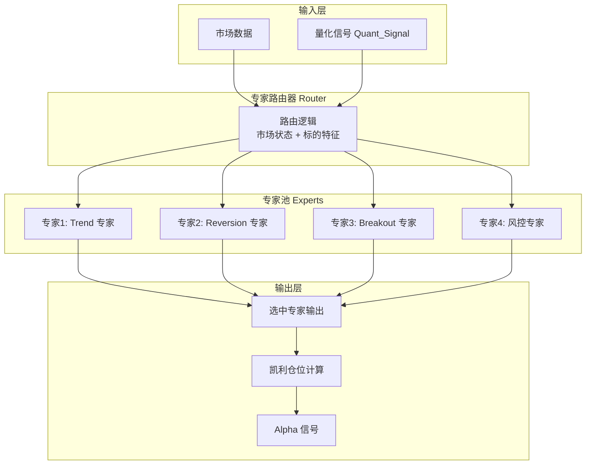
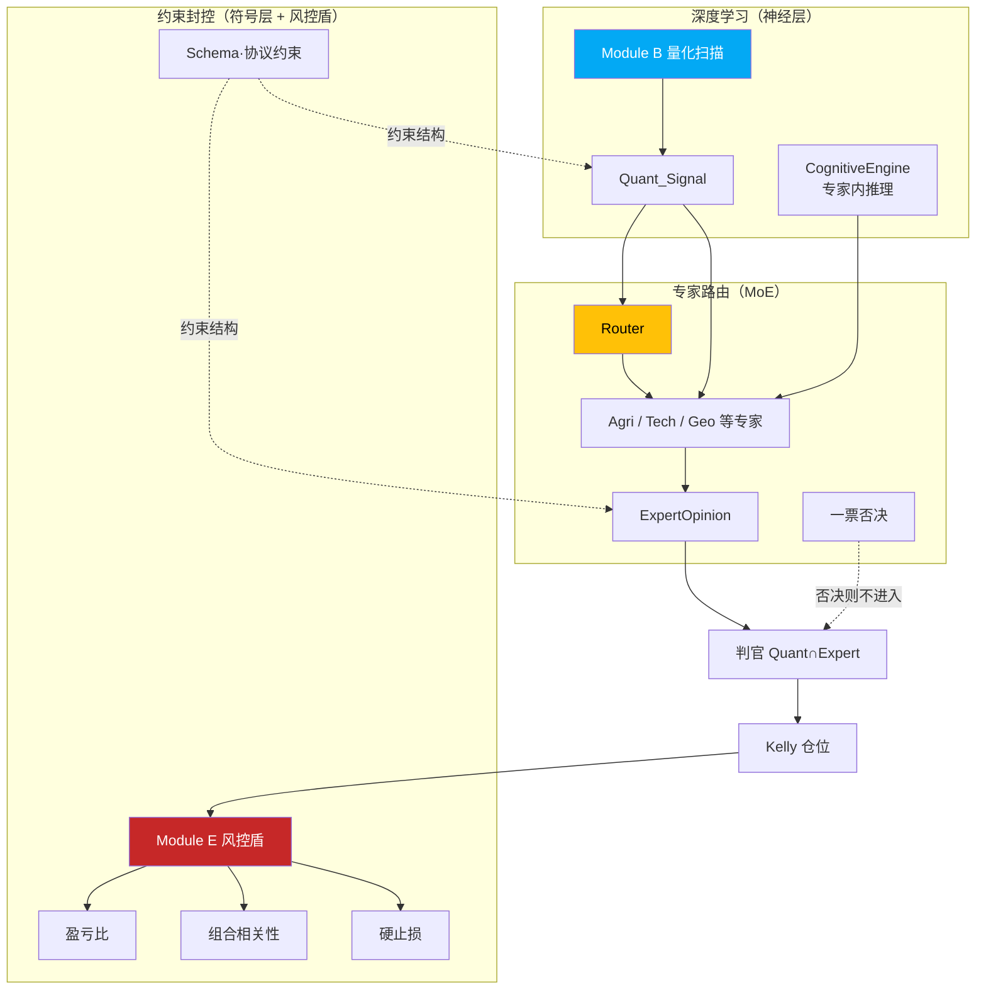

# L3 · 核心公式与 MoE 架构规约

> [!NOTE] **[TRACEBACK] 原子规约锚点**
> - **顶层概念**: [一句话定义与核心价值](../../01_顶层概念/01_一句话定义与核心价值.md)
> - **顶层概念**: [战略目标与ROI](../../01_顶层概念/02_战略目标与ROI.md)
> - **战略维度**: [02_技术栈与架构维度](../../02_战略维度/产品设计/02_技术栈与架构维度.md)
> - **对应 DNA**: `global_const.yaml#core_formula`、`#constraints`
> - **本文档**: L3 层级，定义核心公式与 MoE 架构的技术规约

## 核心公式

$$
Alpha = (Quant_{Signal} \cap Router(Experts)) \times Kelly_{Position}
$$

### 公式组件说明

#### 1. Quant_{Signal}（量化信号）

**定义**：通过量化分析（技术指标、因子模型）生成的交易信号。

**输出格式**：
- `symbol`：标的代码
- `strategy_source`：策略来源（Trend / Reversion / Breakout）
- `technical_score`：量化得分（0-100）
- `win_rate_prediction`：预测胜率（0.0-1.0）

**约束**：
- 必须来自三大策略池之一（Trend / Reversion / Breakout）
- technical_score 范围：0-100，可复现
- 全市场扫描耗时 < 30 分钟

#### 2. Router(Experts)（专家路由器）

**定义**：Neuro-Symbolic Mo**定义**：Neuro-Symbolic MoE（混合专家）架构的核心组件，根据市场状态与标的特征动态选择最优专家。
号）
- 市场状态（波动率、趋势、流动性等）
- 标的特征（市值、行业、历史表现等）

**输出**：
- `selected_expert`：选中的专家标识
- `expert_confidence`：专家置信度（0.0-1.0）
- `fundamental_score`：AI 逻辑得分（0-100）
- `reasoning_summary`：AI 白盒逻辑摘要

**路由逻辑**：
- 根据市场状态选择最适合的专家模型
- 支持一票否决机制：若专家判定为假突破或高风险，直接否决信号
- 确保每个通过信号都有可解释的逻辑（reasoning_summary）

#### 3. Kelly_{Position}（动态凯利仓位）

**定义**：基于预测胜率与盈亏比计算的动态仓位比例。

**输入**：
- `win_rate_prediction`：预测胜率（来自 Quant_{Signal} 或 Router(Experts)）
- `payoff_ratio`：盈亏比（平均盈利 / 平均亏损）

**输出**：
- `kelly_fraction`：建议仓位（0.0-1.0）

**计算公式**：
```
kelly_fraction = (win_rate_prediction × payoff_ratio - (1 - win_rate_prediction)) / payoff_ratio
```

**约束**：
- kelly_fraction 范围：0.0-1.0（不得 > 1.0）
- 结合 Cash Drag Monitor：空仓 > 5- 结合 Cash Drag Monitor：空仓 > 5 天时，动态放宽左脑筛选阈值
= （量化信号 ∩ 专家路由） × 仓位管理

**约束**：
- 必须同时满足不可能三角的三个维度（认知边界、复利增长、生存底线）

## MoE 架构规约

### 架构层次



### 专家选择规则

| 市场状态 | 标的特征 | 推荐专家 | 说明 |
|---------|---------|---------|------|
| 趋势市场 | 大盘股 | Trend 专家 | 趋势策略适合大盘趋势 |
| 震荡市场 | 中小盘 | Reversion 专家 | 反转策略适合震荡 |
| 突破形态 | 高流动性 | Breakout 专家 | 突破策略需要流动性 |
| 高风险信号 | 任意 | 风控专家 | 一票否决 |

### 一票否决机制

**触发条件**：
- 风控专家判定为假突破
- 专家置信度 < 阈值
- 无法生成 reasoning_summary

**处理方式**：
- 信号不进入下游（不传递给 Kelly 计算）
- 记录否决原因到审计日志
- 不占用仓位资源

## 深度学习、专家路由与约束封控的协作链路

三者分别对应：**神经层**（深度学习 / LLM 产信号与推理）、**专家路由**（Router 选专家并汇总意见）、**约束封控**（Schema/协议 + 一票否决 + 风控盾）。协作顺序为：深度学习产出 Quant\_Signal（及专家内推理）→ 专家路由消费信号与 Tag、选专家并可一票否决 → 判官做 Quant∩Expert 与 Kelly → 约束封控在开仓前/持仓后再次检查并执行止损或拒绝。**双轨分流**：ExpertOpinion 可携带 `TimeHorizon`（见 expert.proto）；判官（Module D）据此分支，LONG_TERM 时豁免 2% 硬止损与现金拖累，仅施加逻辑证伪与大周期反转，详见 [09_ 核心模块架构规约](./09_核心模块架构规约.md) Module D。

| 角色 | 对应规约/模块 | 职责简述 |
|------|----------------|----------|
| **深度学习** | Module B + 专家内 CognitiveEngine | 技术指标/因子生成 Quant\_Signal；专家内可选 LLM 生成 reasoning\_summary |
| **专家路由** | Module C Router + 专家池 | 按 Domain Tag、市场状态、标的特征选专家；风控专家可一票否决，未通过信号不进入判官 |
| **约束封控** | Schema/协议 + Module E | 符号层约束数据结构；专家内一票否决；Module E 开仓前（盈亏比、组合相关性）、持仓后（硬止损） |



## 技术实现约束

### 接口规约

所有组件必须遵循 `TradeSignal` 协议（见 `03_原子目标与规约/_Design_Artifacts/protocols/trade_signal.proto`）：

```protobuf
message TradeSignal {
  string symbol = 1;
  string strategy_source = 2;
  double technical_score = 3;
  double fundamental_score = 4;
  double win_rate_prediction = 5;
  double kelly_fraction = 6;
  string reasoning_summary = 10;
}
```

### 性能约束

- Quant_{Signal} 生成：全市场扫描 < 30 分钟
- Router(Experts) 推理：单信号推理 < 超时阈值（与全市场扫描协调）
- Kelly_{Position} 计算：实时计算，延迟 < 100ms

### 可追溯性约束

- 每个 Alpha 信号必须能追溯到：
  - 对应的 Quant_{Signal}（来源策略池、technical_score）
  - 选中的专家（expert_id、expert_confidence）
  - 凯利计算输入（win_rate_prediction、payoff_ratio）
  - 风控决策（通过/否决、原因）

## 下一步

→ 参见其他 [原子规约文档](./README.md)
