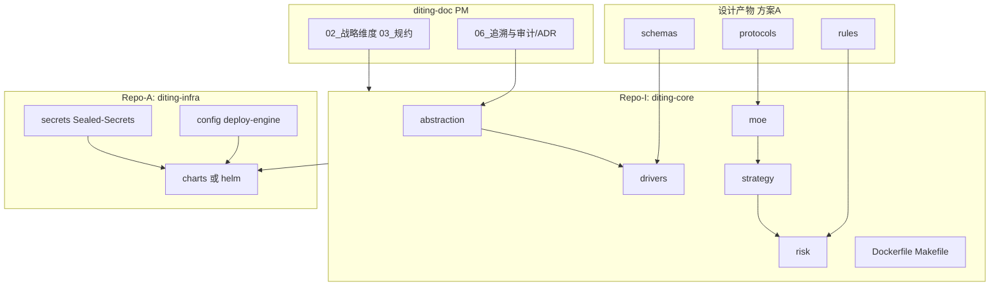
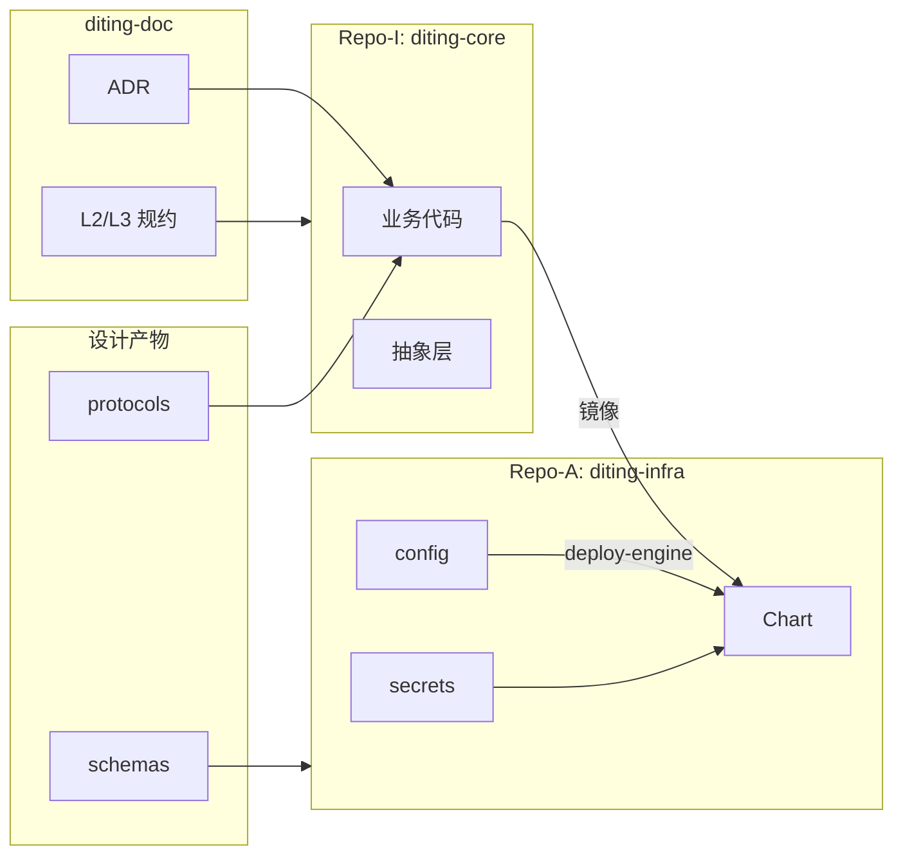

# L3 · 三位一体仓库规约（Trinity-Repo）

> [!NOTE] **[TRACEBACK] 原子规约锚点**
> - **顶层概念**: [一句话定义与核心价值](../../01_顶层概念/01_一句话定义与核心价值.md)
> - **战略维度**: [技术栈与架构维度](../../02_战略维度/产品设计/02_技术栈与架构维度.md)
> - **战略维度**: [安全与机密治理维度](../../02_战略维度/产品设计/05_安全与机密治理维度.md)
> - **战略维度**: [研产同构维度](../../02_战略维度/产品设计/06_研产同构维度.md)
> - **对应 DNA**: `_System_DNA/dna_02_trinity_repo.yaml`
> - **本文档**: L3 层级，定义三位一体仓库的物理结构与职责边界

## 核心理念

**代码库不是垃圾桶**。必须通过物理结构的强制隔离，来保障：
- **MoE 的独立性**：专家路由逻辑不依赖具体券商接口
- **Broker 的中立性**：策略代码不绑定特定券商
- **密钥的安全性**：密钥不进入代码仓库

## 项目主仓库（PM）与仓库划分

- **diting-doc** 为**项目主仓库（PM）**：所有与项目决策、阶段规划、L2/L3 规约、ADR、追溯与审计相关的文档归属此处。本规约文档即位于 diting-doc。
- **设计产物归属（方案 A，推荐）**：不再单独设立 diting-design 仓库。ADR 归属 **diting-doc**（如 `06_追溯与审计/ADR/`）。schemas、protocols、rules、knowledge_graph 等机器可读设计产物归属 **diting-core/design/** 或 **diting-doc** 下约定目录（如 `03_原子目标与规约/_Design_Artifacts/`），由项目在 README 或 L3 中选定其一并统一引用路径；Schema First / 单一真相源 的路径以选定位置为准。
- **方案 B（可选）**：若保留独立 diting-design 仓库，则仅存放被 diting-core 或工具链引用的机器可读设计产物；diting-doc 仍为项目入口与 PM，两者分工在 README 中写清。

## 三位一体仓库架构图



## A. 设计产物与 ADR（方案 A：无独立 diting-design）

- **ADR**：存放于 **diting-doc/06_追溯与审计/ADR/**。架构决策记录在此维护，全仓引用时使用该路径。
- **schemas / protocols / rules / knowledge_graph**：存放于 **diting-core/design/** 或 **diting-doc** 下项目约定目录（如 `03_原子目标与规约/_Design_Artifacts/`）。项目须在 README 或本规约中明确选定，并统一引用路径。

### Schema First（Schema 优先）

**规则**：任何字段变更，必须先在选定的 **protocols** 路径修改 `.proto` 文件并合并，才能去改代码。

**流程**：
1. 在选定路径（如 `diting-core/design/protocols/` 或 diting-doc 下对应目录）修改 `.proto` 文件
2. 合并后，生成 Python/Go 代码
3. 在 diting-core 中使用生成的代码

**禁止**：严禁在代码中直接定义数据结构，必须从 `.proto` 生成。

### Single Source of Truth（单一真相源）

**规则**：数据库建表由选定的 **schemas/sql** 决定，严禁在代码里写 `CREATE TABLE IF NOT EXISTS`。

**流程**：
1. 在选定路径的 `schemas/sql/` 定义建表 SQL
2. 通过迁移工具或 deploy-engine 侧 IaC 执行
3. 代码只负责读写，不负责建表

**禁止**：严禁在应用代码中执行 DDL 语句。

---

## B. Repo-I (diting-core)：系统的"血肉"与"大脑"

### 目录结构标准

```
diting-core/
├── diting/                 # [Python Package] 可安装的核心包
│   ├── __init__.py
│   ├── abstraction/        # [接口抽象层]
│   ├── drivers/            # [驱动实现]
│   ├── moe/                # [MoE 混合专家]
│   ├── risk/               # [风控盾]
│   └── strategy/           # [策略池]
├── design/                 # [可选] 方案 A 时设计产物可放此处 (schemas/protocols/rules)
├── tests/
│   ├── unit/
│   └── paper_trading/
├── tools/
│   └── emergency_stop.py
├── Dockerfile              # 统一基础依赖、构建镜像、Docker 快速测试（根目录或 docker/）
├── Makefile                # 必须提供：test（本地单测）、build（构建镜像）、test-docker（镜像内测试）
├── pyproject.toml
└── .env.template           # [安全] 严禁包含真实 Key，仅占位符
```

### Dockerfile 与 Makefile 约定

- **Dockerfile**：位于仓库根目录或 `docker/` 子目录。用途：统一基础系统与依赖、构建可部署镜像、支持 Docker 内快速验证（与「逻辑逐渐完善」配合：先本地单测，再镜像内集成/冒烟）。
- **Makefile**：必须提供以下 target，与 L4 准出条件对齐：
  - `make test`（或 `make test-local`）：本地单元测试
  - `make build`：使用 Dockerfile 构建镜像（如 `docker build -t diting-core:dev .`）
  - `make test-docker`：在容器内运行测试（如 `docker run ... diting-core:dev make test` 或等价）
  - 可选：`make lint`、`make format`、`make generate`（如 protoc/sql 生成）。上述 target 名称为稳定契约，日后接入 CI 时只调用这些 target。

### 架构共识

#### Interface Separation（接口分离）

**规则**：`diting/moe/` 下的代码**严禁** `import xtquant`。必须通过 `abstraction/broker.py` 调用。

**示例**：
```python
# ✅ 正确做法
from diting.abstraction.broker import BrokerDriver

class MoERouter:
    def __init__(self, broker: BrokerDriver):
        self.broker = broker  # 依赖抽象，不依赖具体实现

# ❌ 错误做法
import xtquant  # 严禁在 moe/ 模块中直接导入券商接口
```

#### No Secrets（禁止密钥）

**规则**：代码中出现 `sk-` 或 `access_key` 字样直接 CI 报错。

**检测机制**：
- SonarQube SAST 扫描
- Git Hooks 预提交检查
- CI 流水线正则表达式检测

凡涉及「CI 必须」「CI 报错」等条款，**当前实施方式**见 [03_架构设计共识与协作元规则](03_架构设计共识与协作元规则.md) 中的「当前实施状态」。

**密钥来源**：
- 当前阶段：关键参数通过 **Sealed-Secrets** 加密，diting-infra 中维护加密后的 YAML 或 Helm 引用；明文不进入 Git。
- 后期可迁移至 Vault 或 ESO+KMS，由 ADR 约定迁移时机。

### 职责边界

| 内容类型 | 存放位置 | 禁止内容 |
|---------|---------|---------|
| **业务逻辑** | `diting/` | 不存架构决策、不存密钥 |
| **驱动实现** | `drivers/` | 不存业务逻辑，只做适配 |
| **测试代码** | `tests/` | 不存生产配置 |
| **运维脚本** | `tools/` | 不存业务逻辑 |

---

## C. Repo-A (diting-infra)：Chart 与配置，部署由 deploy-engine 执行

diting-infra **仅提供**：diting 项目的 Helm Chart（应用 + 依赖中间件）、基础设施与环境配置。**不在此仓实现** Terraform/Helm 执行逻辑；**部署方式**为在本地（或日后 CI）**调用 deploy-engine**，由 deploy-engine 完成资源创建与应用部署。

### 目录结构标准

```
diting-infra/
├── charts/                 # 或 helm/：diting 项目 Chart（应用 + 依赖中间件）
│   └── diting/
├── config/                 # 符合 deploy-engine 的 DeploymentConfig 结构
│   └── environments/
│       ├── dev/
│       │   └── deploy.yaml # dev 环境部署配置（单一 YAML，含 default/env/user_override）
│       └── prod/
│           └── deploy.yaml # prod 环境部署配置
├── observability/          # [可选] 监控配置（Prometheus/Grafana/Loki 等）
├── secrets/                # 当前阶段：Sealed-Secrets 加密 YAML 或 Helm 引用
└── .env.template           # 环境变量占位（无真实 Key）；可与 diting-core 一致或多出 infra 专用项
```

配置须遵循 deploy-engine 的 `DeploymentConfig`（default / env / user_override 三层合并；`chart_path`、`values_files`、BaseResourceSpec、BaseEnvSpec 等）。参见 deploy-engine 的 `pkg/config/spec.go` 与文档。**配置真相源**：单一 YAML 文件（如 `config/environments/dev/deploy.yaml`），格式见 [02_基础设施与部署规约](../开发与交付/02_基础设施与部署规约.md)。

**.env.template 双仓**：diting-core 与 diting-infra 均包含 `.env.template`；应用相关变量以 **diting-core** 为权威，diting-infra 可与之一致或多出 infra 专用项（如 ACR、TF_VAR_*）；两仓均不得包含真实密钥。

### 部署方式

- **当前阶段**：在 diting-infra 目录下通过 **deploy-engine**（CLI 或 Makefile 封装，如 `make deploy-dev`）完成 dev/prod 的 Up/Down。不依赖云端 CI。
- deploy-engine 依赖方式由项目约定：如 deploy-engine 以 git submodule 形式置于 diting-infra，或约定 PATH 中可用、版本见 README/DNA。

### 职责边界

| 内容类型 | 存放位置 | 禁止内容 |
|---------|---------|---------|
| **Chart 定义** | `charts/` 或 `helm/` | 不存业务代码、不存真实密钥 |
| **部署配置** | `config/` | 须符合 deploy-engine 契约；不存业务代码 |
| **监控配置** | `observability/` | 不存业务逻辑 |
| **机密** | `secrets/` | 当前为 Sealed-Secrets 加密结果；不存明文密钥 |

---

## 仓库间依赖关系



**依赖规则**：
- **diting-doc → diting-core**：ADR 与 L2/L3 规约约束实现；设计产物（若在 doc）生成代码或定义建表。
- **设计产物 → diting-core**：Protocols 生成代码，Schemas 定义数据模型。
- **diting-core → diting-infra**：业务代码打包成镜像，Chart 引用该镜像；config 供 deploy-engine 读取。
- **diting-infra**：通过 deploy-engine 执行部署；Sealed-Secrets 等注入密钥到 K8s workload。

---

## 与战略维度的映射

| 战略维度 | 对应仓库 | 对应目录/文件 |
|---------|---------|-------------|
| **技术栈与架构** | diting-core | `diting/moe/`, `diting/strategy/`, Dockerfile, Makefile |
| **数据架构** | 设计产物（core/design 或 doc） | `schemas/sql/` |
| **生产保障** | diting-infra | `observability/` |
| **安全治理** | diting-infra | `secrets/`（Sealed-Secrets） |
| **研产同构** | diting-core | `diting/abstraction/`, `tests/paper_trading/` |
| **成本治理** | diting-infra | `config/` 中资源规格等 |
| **经纪商解耦** | diting-core | `diting/abstraction/broker.py`, `diting/drivers/` |

---

## 下一步

→ 参见：
- [03_架构设计共识与协作元规则.md](./03_架构设计共识与协作元规则.md)
- [04_全链路通信协议矩阵.md](./04_全链路通信协议矩阵.md)
- [05_接口抽象层规约.md](./05_接口抽象层规约.md)
