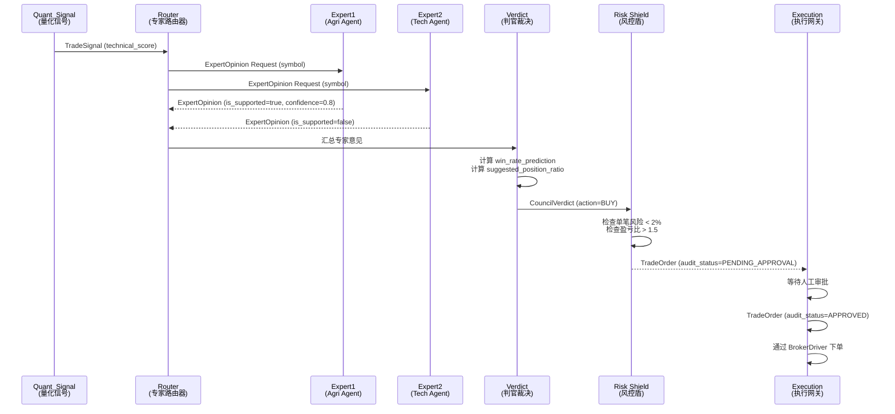

# L3 · 全链路通信协议矩阵

> [!NOTE] **[TRACEBACK] 原子规约锚点**
> - **顶层概念**: [一句话定义与核心价值](../../01_顶层概念/01_一句话定义与核心价值.md)
> - **战略维度**: [技术栈与架构维度](../../02_战略维度/产品设计/02_技术栈与架构维度.md)
> - **原子规约**: [核心公式与MoE架构规约](./01_核心公式与MoE架构规约.md)
> - **对应 DNA**: `_System_DNA/dna_04_protocol_matrix.yaml`
> - **本文档**: L3 层级，定义全链路通信协议矩阵

## 原则：Schema First

**位置**：`diting-core/design/protocols/` 或 `diting-doc/03_原子目标与规约/_Design_Artifacts/protocols/`（方案 A 由项目选定，见 02_三位一体仓库规约）

**规则**：任何模块间的对话，必须先在这里定义 `.proto` 文件。

**流程**：
1. 在选定路径（如 `diting-core/design/protocols/`）定义 `.proto` 文件
2. 生成 Python/Go 代码
3. 在 `diting-core` 中使用生成的代码

**禁止**：严禁在代码中直接定义数据结构，必须从 `.proto` 生成。

### Module A/B 接口 Proto

| 模块 | Proto 文件 | 说明 |
|------|------------|------|
| **Module A** | `classifier/classifier_output.proto` | 语义分类器输出：Domain Tag、置信度；见 [09_核心模块架构规约](./09_核心模块架构规约.md) 输入/输出表 |
| **Module B** | `quant/quant_signal.proto` | 量化扫描引擎输出：technical_score、strategy_source、sector_strength |
| **全链路** | `trade_signal.proto` | 判官裁决后至执行层统一格式；见 [01_核心公式与MoE架构规约](./01_核心公式与MoE架构规约.md) |

**定义位置**：`diting-doc/03_原子目标与规约/_Design_Artifacts/protocols/`（与本文档同属 03_）；代码仓对应 `diting-core/design/protocols/`。

### 跨服务字段（多服务部署必选）

实盘多服务部署时，全链路须携带以下字段，用于**分布式追踪**与**幂等**：

| 字段 | 用途 | 传递规则 | Proto 约定 |
|------|------|----------|------------|
| **correlation_id / request_id** | 一次请求全链路唯一标识；串联 A→F 日志与追踪 | 从入口（Module A 或调度）生成，经 B/C/D/E/F 透传，不得改写 | 关键消息（如 TradeSignal、订单）必须包含；与 trace_id 可统一或映射 |
| **幂等键** | 防止重试/重复消费导致重复执行 | D/E/F 对同一 signal_id/order_id 仅处理一次；重复请求返回已处理结果 | TradeSignal 含 signal_id；执行层订单含 order_id 作为幂等键 |

**约定**：
- 所有跨服务或跨模块边界的 Proto 消息，须包含 `correlation_id`（或 `request_id`）；下游模块透传并在日志/追踪中输出。
- 判官至执行层：`TradeSignal` 携带 `signal_id`（幂等键）；执行网关对订单使用 `order_id` 做幂等，重试时带同一 order_id。
- 详见各 Proto 定义与 [09_ 核心模块架构规约](./09_核心模块架构规约.md) 错误处理表。

---

## A. 专家辩论协议 (The Expert Protocol)

### 文件位置

`diting-core/design/protocols/brain/expert.proto`（或 03_/_Design_Artifacts/protocols/ 下对应路径）

### 作用

规范 Module C (MoE Council) 的内部辩论。解决"大家各说各话"的问题，强制专家输出标准化的观点。

### Protocol 定义

```protobuf
syntax = "proto3";

package diting.brain;

// 定义专家领域枚举，便于 Router 分发
enum ExpertDomain {
  DOMAIN_UNSPECIFIED = 0;
  DOMAIN_AGRI = 1;      // 农业 (猪周期, 气候)
  DOMAIN_TECH = 2;      // 硬科技 (半导体, AI)
  DOMAIN_MACRO = 3;     // 宏观 (汇率, 大宗)
  DOMAIN_QUANT = 4;     // 纯量化 (技术面)
}

// 双轨制：判官据此分流（权威定义见 diting-core/design/protocols/brain/expert.proto）
enum TimeHorizon {
  TIME_HORIZON_UNSPECIFIED = 0;
  SHORT_TERM = 1;  // A 轨：受不可能三角与 2% 止损约束
  LONG_TERM = 2;   // B 轨：判官豁免 2% 硬止损与现金拖累
}

// 专家意见 (MoE 的核心单元)
message ExpertOpinion {
  string symbol = 1;              // 标的代码 (e.g., "000998.SZ")
  ExpertDomain domain = 2;        // 我是哪个领域的专家
  
  // [关键字段] 认知边界检查
  // 如果专家觉得"这只股我不懂"或"不在我的逻辑范畴"，必须设为 false
  // 这是保证 80% 胜率的第一道防线：不知则弃
  bool is_supported = 3;

  // 信号方向
  enum SignalType {
    SIGNAL_NEUTRAL = 0;
    SIGNAL_BULLISH = 1;
    SIGNAL_BEARISH = 2;
  }
  SignalType direction = 4;

  // 确信度 (0.0 - 1.0)
  // 用于动态凯利公式计算仓位
  double confidence = 5;

  // [白盒化] 逻辑陈述
  // 必须是一句简短的自然语言，用于 Human-in-the-Loop 审核
  // e.g., "拉尼娜现象导致大豆减产预期强烈，且期货升水"
  string reasoning_summary = 6;
  
  // 专属风险因子
  // e.g., ["一号文件落地兑现风险", "存栏量回升"]
  repeated string risk_factors = 7;
  
  // 生成时间戳 (防止处理过期数据)
  int64 timestamp = 8;

  // 双轨分流：LONG_TERM 时判官豁免 2% 硬止损与现金拖累，仅施加逻辑证伪与大周期反转（见 L1 03_双轨制与VC-Agent、09_ Module D）
  TimeHorizon horizon = 9;
}
```
**说明**：`horizon` 与 `TimeHorizon` 枚举定义见 `diting-core/design/protocols/brain/expert.proto`。

### 关键字段说明

| 字段 | 作用 | 约束 |
|------|------|------|
| `is_supported` | **认知边界检查**：专家是否理解该标的 | 如果为 `false`，信号直接否决 |
| `confidence` | 确信度，用于凯利公式计算 | 范围：0.0-1.0 |
| `reasoning_summary` | **白盒逻辑**：人类可读的推理摘要 | 必须非空，用于审计 |
| `risk_factors` | 专属风险因子列表 | 用于风控模块评估 |
| `horizon` | **双轨分流**：LONG_TERM 时判官走 B 轨（豁免 2% 与现金拖累） | 见 expert.proto、09_ Module D |

---

## B. 判官裁决协议 (The Verdict Protocol)

### 文件位置

`diting-core/design/protocols/brain/verdict.proto`

### 作用

Module D (判官) 听取所有专家意见后，生成的最终裁决书。这是发给执行层的"圣旨"。

### Protocol 定义

```protobuf
syntax = "proto3";

package diting.brain;

import "brain/expert.proto";

message CouncilVerdict {
  string decision_id = 1;         // UUID，用于全链路追踪
  string symbol = 2;
  
  // 最终动作
  enum Action {
    ACTION_PASS = 0;      // 放弃 (看不懂/胜率不够)
    ACTION_BUY = 1;       // 开仓
    ACTION_SELL = 2;      // 清仓/止盈
    ACTION_CUT = 3;       // 止损 (最高优先级)
  }
  Action action = 3;

  // [核心] 综合胜率预估 (加权平均)
  double win_rate_prediction = 4;
  
  // [核心] 建议仓位比例 (基于动态凯利)
  // e.g., 0.15 表示建议 15% 总仓位
  double suggested_position_ratio = 5;

  // 附带的专家证词 (只存最强的那个理由)
  // 用于推送到用户手机
  string primary_reasoning = 6;
  
  // 防御性复利模式标记
  // 如果为 true，说明当前处于"保利润"状态，仓位已做减半处理
  bool is_defensive_mode = 7;
}
```

### 关键字段说明

| 字段 | 作用 | 约束 |
|------|------|------|
| `action` | 最终动作：放弃/买入/卖出/止损 | 止损优先级最高 |
| `win_rate_prediction` | 综合胜率预估（加权平均所有专家） | 范围：0.0-1.0，用于凯利公式 |
| `suggested_position_ratio` | 建议仓位比例（动态凯利计算） | 范围：0.0-1.0 |
| `is_defensive_mode` | 防御性复利模式标记 | 用于现金拖累监控 |

---

## C. 执行指令协议 (The Execution Protocol)

### 文件位置

`diting-core/design/protocols/execution/order.proto`

### 作用

Module F (执行网关) 与 MiniQMT 之间的交互标准。这里不包含任何"思考"，只有"动作"。

### Protocol 定义

```protobuf
syntax = "proto3";

package diting.execution;

message TradeOrder {
  string order_id = 1;        // 对应 Verdict 的 decision_id
  string symbol = 2;
  
  enum OrderType {
    MARKET = 0;               // 市价单 (止损用)
    LIMIT = 1;                // 限价单 (买入用)
  }
  OrderType type = 3;
  
  double price = 4;           // 限价单价格 (-1 for MARKET)
  int32 quantity = 5;         // 股数 (必须是 100 的倍数)
  
  // [合规核心] 人工审核状态
  // 只有 APPROVED 状态的指令才能被 BrokerDriver 发送
  enum AuditStatus {
    PENDING_APPROVAL = 0;     // 等待用户点手机
    APPROVED = 1;             // 用户已确认
    REJECTED = 2;             // 用户否决
    AUTO_EXECUTED = 3;        // 机器自动执行 (仅限止损)
  }
  AuditStatus audit_status = 6;
  
  // 策略来源标记 (用于事后归因分析：是哪个 Agent 赚的钱？)
  string strategy_source = 7; 
}
```

### 关键字段说明

| 字段 | 作用 | 约束 |
|------|------|------|
| `audit_status` | **合规核心**：人工审核状态 | 只有 `APPROVED` 或 `AUTO_EXECUTED` 才能下单 |
| `AUTO_EXECUTED` | 机器自动执行 | **仅限止损**，买入/卖出必须人工审批 |
| `quantity` | 股数 | 必须是 100 的倍数（A股规则） |

---

## D. 风控遥测协议 (The Risk Protocol)

### 文件位置

`diting-core/design/protocols/risk/telemetry.proto`

### 作用

Module E (风控盾) 实时监控的数据流。一旦触网，立即触发熔断。

### Protocol 定义

```protobuf
syntax = "proto3";

package diting.risk;

message PortfolioState {
  // 当前净值
  double total_equity = 1;
  
  // 现金储备
  double cash_balance = 2;
  
  // [防御性复利核心] 
  // 年度最高净值 (High Watermark)
  double year_high_equity = 3;
  
  // 当前回撤幅度
  // formula: (year_high - current) / year_high
  double current_drawdown = 4;
  
  // 利润锁定线状态
  // 如果为 true，禁止任何 BUY Action
  bool is_profit_locked = 5;
  
  // 风险暴露度 (总持仓 / 总资产)
  double exposure_ratio = 6;
}
```

### 关键字段说明

| 字段 | 作用 | 约束 |
|------|------|------|
| `year_high_equity` | 年度最高净值（High Watermark） | 用于计算回撤 |
| `current_drawdown` | 当前回撤幅度 | 如果 ≥ 12%，触发熔断 |
| `is_profit_locked` | 利润锁定线状态 | 如果为 `true`，禁止任何买入 |

---

## 全链路协议流转图



---

## 协议版本管理

### 版本规则

- **Major 版本变更**：字段删除、类型变更 → 必须清仓，全量部署
- **Minor 版本变更**：新增可选字段 → 平滑升级
- **Patch 版本变更**：字段注释变更 → 热更新

### 向后兼容性

- 所有新增字段必须是 `optional` 或带默认值
- 字段删除必须标记为 `deprecated`，保留至少 2 个版本周期

---

## 与核心公式的对应

| 协议 | 对应公式组件 | 说明 |
|------|------------|------|
| **ExpertOpinion** | Router(Experts) | 专家路由器的输出 |
| **CouncilVerdict** | Alpha 信号 | 判官裁决 = (Quant_Signal ∩ Router(Experts)) × Kelly |
| **TradeOrder** | 执行层 | 最终下单指令 |
| **PortfolioState** | 风控监控 | 实时监控回撤与风险 |

---

## 下一步

→ 参见：
- [05_接口抽象层规约.md](./05_接口抽象层规约.md)
